# Quant Research — Complete Learning Path
*A Duolingo-style curriculum for undergraduate students learning quantitative finance research, from zero to a capstone-ready project.*

> **How to use this file:** Each `Node` below is one lesson unit on the website. It contains: a hook, learning objectives, concept text, diagrams (Mermaid), code, curated free resources, and a quiz. Copy each `Node` block as one lesson page.

---

# WORLD 0 — Orientation

## Node 1: Welcome to Quant Research

### 🎯 Hook
Every hedge fund trade, every "the market thinks X" headline, and every robo-advisor recommendation is downstream of someone doing quant research: turning a hunch about markets into a number you can trust. Imagine two investors see the same stock drop 5% in a day. One feels "it will bounce back" and buys. The other asks: "how often has this stock bounced back after a 5% drop in the last five years, and what was the average return?" That second investor is thinking like a quant. This node is your map of that world before you touch a single formula.

### 📌 Learning Objectives
- Define quantitative finance and distinguish it from general finance
- Explain how research differs from trading as a discipline
- Identify the main roles inside a quant research team
- Describe the idea to data to hypothesis to backtest to report workflow
- Understand why data-driven decisions beat gut-feel in markets
- Map out realistic career paths into quant research
- Recognize the difference between signal and noise in market data
- Identify how each world in this course maps to real quant skills

---

### What is Quantitative Finance?
Quantitative finance is the application of mathematics, statistics, and computer science to financial problems: pricing assets, managing risk, and finding repeatable patterns in markets. Instead of asking "do I feel like this stock will go up," a quant asks "what does the data say, how confident am I, and what happens if I am wrong."

Traditional fundamental analysis looks at a company's earnings, management, and competitive position to estimate its fair value. Quantitative analysis takes a different approach: it looks for statistical patterns across hundreds or thousands of assets, using historical data to measure probabilities rather than making directional bets on individual companies. For example, a fundamental analyst might study a company's quarterly report to decide if the stock is undervalued. A quant might instead ask: "stocks that beat earnings estimates by more than 10% tend to outperform for the next 5 days, does this pattern hold across all sectors and market regimes?"

It sits at the intersection of three disciplines:

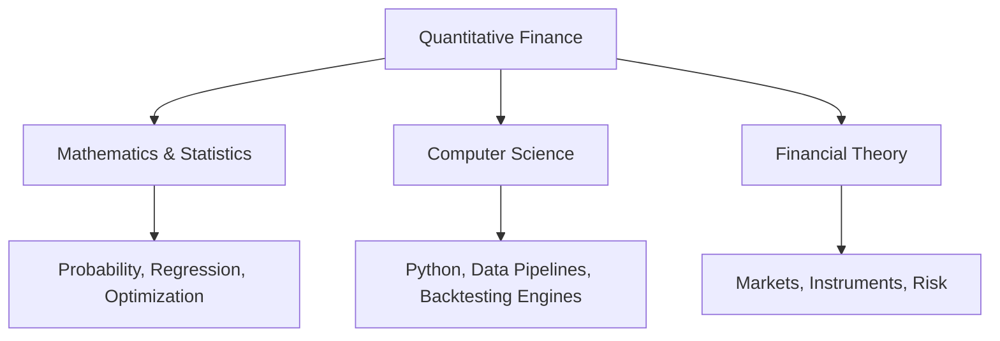

Here is a simple Python example that shows the quant mindset: given a list of daily returns, compute the probability of a positive return day and the average magnitude of gains versus losses. This is the kind of calculation you will run constantly in later nodes.

```python
import numpy as np

daily_returns = [0.01, -0.005, 0.02, -0.01, 0.015, 0.0, -0.008, 0.012]
returns_arr = np.array(daily_returns)
win_prob = (returns_arr > 0).mean()
avg_gain = returns_arr[returns_arr > 0].mean() if (returns_arr > 0).any() else 0
avg_loss = returns_arr[returns_arr < 0].mean() if (returns_arr < 0).any() else 0

print(f"Win probability: {win_prob:.0%}")
print(f"Average gain: {avg_gain:.3%}")
print(f"Average loss: {avg_loss:.3%}")
```

### Research vs Trading
These are often confused by beginners, but they are different jobs with different success metrics.

| | **Research** | **Trading** |
|---|---|---|
| Goal | Discover and validate a strategy or idea | Execute and manage live positions |
| Timescale | Weeks to months per idea | Seconds to days per decision |
| Output | A report, a signal, a backtested model | A filled order, a P&L |
| Failure mode | An idea that looked good but was overfit | A good idea executed badly (slippage, timing) |
| Mindset | Skeptical, statistical, slow | Decisive, risk-aware, fast |

A researcher's job is largely done before a trade ever happens. The researcher builds and validates the strategy. The trader takes that strategy and decides when to enter, how much capital to allocate, and when to exit. A great strategy executed poorly can lose money, and a mediocre strategy executed well can still be profitable. This course focuses entirely on the research side: building strategies that are worth trading.

Large funds typically have separate research and trading teams. At smaller shops or when you are working on personal projects, you play both roles. The key skill is knowing which hat you are wearing at any moment. When you are analyzing historical data and running statistics, you are a researcher. When you decide to put real money behind an idea, you are a trader. The mental shift is important because research rewards skepticism while trading rewards decisiveness.

### Roles in Quant Research
- **Quant Researcher** generates and statistically validates trading ideas. They spend most of their time exploring data, running regressions, building predictive models, and testing hypotheses. A typical day involves writing Python or R code to analyze market data, reading academic papers for inspiration, and presenting findings to the team.
- **Quant Developer** builds the infrastructure that researchers rely on: data pipelines, backtesting engines, and execution systems. They are software engineers who specialize in financial applications. They make sure researchers can test ideas quickly and reliably without worrying about data quality or system bugs.
- **Data Engineer** sources, cleans, and pipelines market data at scale. Market data is notoriously messy: missing ticks, split adjustments, survivorship bias, and corporate actions all need careful handling. Data engineers build the automated systems that turn raw exchange feeds into clean, analysis-ready datasets.
- **Portfolio Manager** decides which validated strategies get real capital and how much. They look at a researcher's track record, risk metrics, and market conditions to allocate funds. They are the bridge between research output and trading execution.
- **Risk Manager** checks that strategies do not blow up the fund. They monitor exposure limits, stress-test portfolios under extreme scenarios, and enforce risk controls. Every strategy, no matter how promising, must pass risk review before going live.

At the undergraduate or early-career level, you will typically wear all of these hats on your own projects. That is exactly why this course interleaves them: you need to understand each role to build a complete strategy.

### The Quant Research Workflow
Every project in this course, and every real quant project, follows the same skeleton:

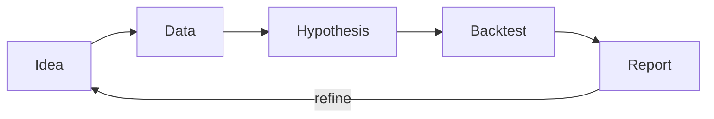

1. **Idea**: a market belief. For example, "stocks that fell a lot yesterday bounce back today" (mean reversion) or "stocks that went up for three straight days keep going up" (momentum). Ideas can come from academic papers, market observation, or even casual conversation. The key is to state them clearly enough that they can be tested.

2. **Data**: get clean historical prices and volumes to test the idea. For the bounce-back example, you need daily open, high, low, close prices for a large set of stocks over several years. You also need to adjust for stock splits, dividends, and delistings. Data quality is the foundation of everything else, which is why Node 15 is dedicated entirely to data cleaning.

3. **Hypothesis**: state the idea precisely and statistically. Instead of "bad days are followed by good days," you say: "the mean next-day return following a 3% or greater single-day decline is positive and statistically significant at the 95% confidence level." This precision forces you to define your terms and makes the test reproducible.

4. **Backtest**: simulate the idea on historical data, honestly, including transaction costs, slippage, and market impact. A backtest is not just a chart of hypothetical profits. It must account for the real-world frictions that eat into returns. Worlds 5 and 6 cover backtesting methodology in depth.

5. **Report**: communicate what you found, including when it does not work. No strategy works in all market conditions. A good report shows the strategy's performance in bull markets, bear markets, high-volatility periods, and low-volatility periods. It also discusses the limitations and risks.

Notice the loop back to "Idea." Research is iterative, not linear. Your first test will probably fail or show marginal results. You refine the idea, adjust the parameters, test on different data, and repeat. The goal is not to find a strategy that works perfectly on historical data (that is overfitting). The goal is to find a strategy that captures a real, persistent market pattern.

### Data-Driven Decision Making
Markets are noisy: a strategy can look brilliant over three months purely by luck. To understand this, imagine flipping a coin 100 times. You might get 55 heads and 45 tails. That looks like an edge (55% accuracy), but it is just random variation. Market data is similar but worse, because market patterns shift over time and yesterday's signal can become today's noise.

Quant research exists to separate signal (a real, repeatable edge) from noise (randomness that looks like a pattern). The core tool is statistical hypothesis testing: you ask "what is the probability that this apparent edge could have appeared by chance?" If that probability is low enough (typically below 5%), you tentatively accept that the pattern might be real. But you never stop being skeptical because in finance, even 5% false positives happen constantly when you test hundreds of ideas.

The entire second half of this course (Worlds 9 and 10) is built around techniques to protect you from fooling yourself: out-of-sample testing, cross-validation, bias-checking, and Monte Carlo simulation. These are not optional extras. They are the difference between a strategy that works in a demo and one that works in the real world.

### A Concrete Example: The Monday Morning Test
Suppose you suspect that stocks tend to rise on Monday mornings. You gather five years of data and find that the average Monday open-to-close return is +0.12% compared to +0.03% for other weekdays. Is this a real pattern? A quant approach would ask: how many Mondays are in the sample (about 260), what is the standard deviation of Monday returns, and what is the t-statistic of the difference? Only after running those numbers can you say whether the pattern is worth exploring further. This systematic skepticism is what distinguishes quant research from casual market observation.

```python
import numpy as np
from scipy import stats

# Simulated Monday returns and other weekday returns
np.random.seed(42)
monday_rets = np.random.normal(0.0012, 0.015, 260)
other_rets = np.random.normal(0.0003, 0.014, 1040)

t_stat, p_value = stats.ttest_ind(monday_rets, other_rets)
print(f"Mean Monday return: {monday_rets.mean():.4%}")
print(f"Mean other return: {other_rets.mean():.4%}")
print(f"T-statistic: {t_stat:.3f}, P-value: {p_value:.3f}")
if p_value < 0.05:
    print("Statistically significant at 5% level")
else:
    print("Not statistically significant at 5% level")
```

This example shows the quant workflow in miniature: take an idea, gather data, run a statistical test, and let the data speak. The code above is a template you will reuse throughout this course.

### Career Paths
- **Buy-side (hedge funds, asset managers)**: quant researcher or portfolio manager track. You develop strategies for the firm's own capital. Performance is measured directly by returns. These are the most competitive roles but also the most directly aligned with the capstone project in Node 41.
- **Sell-side (investment banks)**: structuring, derivatives pricing, and quant trading desks. You build models that the bank uses to price and hedge complex products. The work is more about accurate pricing than alpha generation.
- **Prop trading firms**: pure alpha-generation research. These firms trade only their own capital and focus entirely on finding and executing profitable strategies. The culture tends to be more technical and less bureaucratic.
- **Fintech and asset management tech**: building the tools that researchers and traders use. This includes portfolio management systems, risk platforms, and data infrastructure. It is a good entry point if you have strong software engineering skills.
- **Academia and PhD track**: for those who want to push financial theory itself. Academic research in quantitative finance covers asset pricing, market microstructure, and mathematical modeling. A PhD is typically required for these roles.

The common entry ticket for all of them is a portfolio of well-documented, honestly backtested projects. That is exactly what this course's capstone (Node 41) is designed to produce. Employers care less about your grades and more about whether you can take a market idea, test it rigorously, and explain the results clearly.

---

### 🔗 Free Resources
- [Khan Academy -- Finance and Capital Markets](https://www.khanacademy.org/economics-finance-domain/core-finance) -- free, beginner-friendly foundation
- [Investopedia -- What Is Quantitative Analysis?](https://www.investopedia.com/terms/q/quantitativeanalysis.asp) -- quick conceptual overview
- [QuantStart -- Beginner's Guide to Quantitative Trading](https://www.quantstart.com/articles/Beginners-Guide-to-Quantitative-Trading/) -- free article, industry-oriented
- [AQR -- What Is Factor Investing?](https://www.aqr.com/Insights/Research/White-Papers/What-is-Factor-Investing) -- readable introduction to systematic investing
- [Quantopian Lecture Series](https://www.youtube.com/playlist?list=PLRll4l0tP3MhTpRNSBmSImhNRG4hjIGTK) -- free video lectures on quant finance concepts

### 📝 Quiz
1. **What best distinguishes a quant researcher's job from a trader's?**
   - A) Researchers validate the idea; traders execute it in markets ✅
   - B) Researchers use computers, while traders never touch them
   - C) Traders work with data, but researchers do not at all
   - D) There is no meaningful difference between the two roles

2. **In the workflow Idea to Data to Hypothesis to Backtest to Report, what typically happens after Report?**
   - A) The project simply ends, nothing follows at all
   - B) It loops back to refine and improve the Idea ✅
   - C) It skips directly to live trading instead
   - D) It goes back to collect more data only

3. **Why is separating signal from noise central to quant research?**
   - A) Markets contain no noise at all, only genuine and real patterns
   - B) Noise only appears in crypto markets, never in equity market data
   - C) It is not important, because more data always fixes everything
   - D) A strategy can look good by chance, so research checks if the edge is real ✅

4. **(Multi-select) Which of these are typical quant research team roles?**
   - A) Quant Researcher ✅
   - B) Data Engineer ✅
   - C) Risk Manager ✅
   - D) Head Chef

5. **A strategy shows 55% winning trades over 3 months. What should a quant do first?**
   - A) Invest all available capital in the strategy immediately
   - B) Inform all of their friends about the great new result
   - C) Check statistical significance with hypothesis testing ✅
   - D) Double the sample size until the result looks better each time

6. **Which statement best describes the relationship between research and trading?**
   - A) Research builds and validates strategies; trading executes them live ✅
   - B) Research is only needed at large banks, not small firms
   - C) Research and trading are the same job with different titles
   - D) Trading happens first, then research explains the results

7. **A model predicts correctly on 120 of 200 trades. What is the hit rate?**
   - A) 50%: exactly half of the predictions were right
   - B) 60%: 120 out of 200 trades were winners ✅
   - C) 65%: slightly more than half were right
   - D) 40%: fewer than half of the trades won

8. **Investor B finds the stock bounced 40 of the last 50 times after a 5% drop. What is the empirical bounce rate?**
   - A) 5%: the drop size itself sets the baseline
   - B) 50%: half of the observations were bounces
   - C) 80%: 40 of 50 past events bounced back ✅
   - D) 90%: almost every single event bounced

9. **A quant says their signal was right 100% of the time because every predicted rally happened. Why might this be worthless?**
   - A) They predicted rallies every day, never predicting any decline ✅
   - B) The market went up often, so the predictions were lucky
   - C) Because the signal never mentioned specific prices
   - D) Because rallies happen less than half of the trading days

10. **Which test best distinguishes a real edge from plain luck?**
    - A) Repeating the backtest until the result looks good
    - B) Comparing performance on the best month only
    - C) Adding more indicators until the Sharpe improves
    - D) Testing the strategy out of sample on unseen data ✅

---
---

# WORLD 1 — Foundations (Math, Finance, Code — interleaved from day one)

## Node 2: Financial Markets Basics

### 🎯 Hook
Before you can build a strategy, you need to know the board you are playing on: where securities are born, where they trade, who is on the other side of your trade, and what instruments you can even buy. Every strategy you design will be expressed as a set of trades in specific instruments on specific markets. If you confuse OTC with exchange-traded, or misunderstand the mechanics of short selling, your research conclusions will be wrong regardless of how good your math is. This node gives you the market vocabulary used throughout the rest of the course.

### 📌 Learning Objectives
- Distinguish primary and secondary markets and explain why quants care
- Compare exchange-based trading to OTC markets with examples
- Explain what a market index is and how NIFTY 50 is constructed
- Identify the major categories of market participants and their incentives
- Explain the mechanics and risk asymmetry of going long versus short
- Survey the major financial instrument classes used in quant research
- Describe the key differences between equity, derivatives, and fixed-income markets
- Recognize how market microstructure affects strategy design

---

### Primary vs Secondary Markets
A market is any venue where buyers and sellers meet to trade. In finance, we split markets into two layers based on whether a security is being created or resold.

- **Primary market**: where a security is created and sold for the first time. A company raising money via an IPO (Initial Public Offering) is issuing shares in the primary market. The money goes directly to the company. Later, if the same company issues additional shares through a Follow-on Public Offer (FPO), that also happens in the primary market. Government bonds are also issued in the primary market through auctions.

- **Secondary market**: where already-issued securities are traded between investors. When you buy Reliance shares on the NSE, you are buying from another investor, not from Reliance. The company receives nothing from that trade. The secondary market exists because investors need liquidity: the ability to buy or sell quickly without waiting for the company to buy back its own shares.

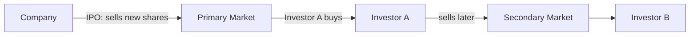

Why does this distinction matter for quant research? Because secondary market data is what you will use for almost every backtest. It is continuous, liquid, and has enough history to analyze statistically. Primary market data is sporadic and event-driven, making it much harder to model. When you hear a quant say "market data," they almost always mean secondary market data.

### Exchanges vs OTC Markets
Within the secondary market, there are two main trading mechanisms:

- **Exchange-traded**: standardized contracts traded on a centralized venue (NSE, BSE, NYSE, CME). Prices are visible to all participants, and a central clearinghouse guarantees both sides of every trade. Examples include listed equities, index futures, and standardized options.

- **OTC (Over-the-Counter)**: trades negotiated directly between two parties with no central venue. Prices are not publicly visible, and each party bears the risk that the other defaults. Examples include most currency forwards, many corporate bonds, and customized derivatives like interest rate swaps.

| | Exchange | OTC |
|---|---|---|
| Price transparency | High: all quotes visible | Low: negotiated privately |
| Counterparty risk | Low: exchange guarantees settlement | Higher: bilateral exposure |
| Customization | Low: standardized contract specs | High: tailored to both parties |
| Typical use in quant research | Primary data source for most strategies | Less common; used in hedge fund macro strategies |

For a quant researcher, exchange-traded instruments are easier to work with because the data is clean, consistent, and freely available. OTC instruments require sourcing data from brokers or third-party vendors, which adds complexity.

### Market Indices
An index is a basket of securities tracked together to represent the market or a sector. The NIFTY 50 tracks the 50 largest, most liquid companies listed on the NSE, weighted by free-float market capitalization.

Free-float market cap is calculated as: share price multiplied by the number of shares available for public trading (excluding shares held by promoters, governments, or strategic investors). This matters because it ensures the index reflects what is actually tradeable, not just the total issued shares.

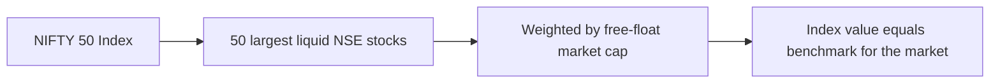

Indices matter to a quant researcher for two reasons. First, they are the benchmark you compare any strategy against: a strategy that returns 15% in a year when the NIFTY 50 returned 18% actually destroyed value relative to passive investing. Second, sector indices (NIFTY Bank, NIFTY IT, NIFTY Pharma) let you isolate sector-specific effects from market-wide effects, which is essential for building sector-neutral strategies.

### Market Participants
Every trade has a counterparty. Understanding who is likely on the other side of a given trade is itself a research edge.

- **Retail investors**: individuals trading personal capital, typically in small sizes. They are often the liquidity providers for larger players, and their behavior tends to be more sentiment-driven than data-driven.

- **Institutional investors**: mutual funds, pension funds, and insurance companies that trade large volumes. Their trades are driven by portfolio rebalancing, asset allocation, and regulatory requirements rather than short-term market views. They are often slow to move but trade in sizes that can move markets.

- **Market makers**: firms that continuously quote buy and sell prices for specific instruments, profiting from the bid-ask spread. They provide liquidity to the market. In exchange-traded markets, they are regulated to maintain fair and orderly trading.

- **Arbitrageurs**: traders who exploit price discrepancies between related instruments. For example, if the futures price of NIFTY 50 diverges from the combined price of the underlying stocks, an arbitrageur buys the cheaper side and sells the expensive side, locking in a risk-free profit. Their activity keeps prices in line across related markets.

- **Hedgers**: participants who trade to reduce existing risk. An airline expecting to pay for fuel in six months might buy oil futures to lock in today's price, regardless of where oil prices go. A portfolio manager expecting a market decline might buy put options to insure against losses.

- **Speculators**: traders who take on risk deliberately, betting on price direction. A quant strategy is a form of systematic speculation: you take calculated risks based on statistical evidence rather than gut feeling.

### Long vs Short
Position direction is one of the most basic decisions in any strategy.

- **Going long**: you buy an asset now, hoping the price rises, and sell later for a profit. The maximum loss is 100% of your invested capital (the price cannot go below zero). The maximum gain is theoretically unlimited (the price can rise without bound).

- **Going short**: you borrow an asset and sell it now, hoping the price falls, and buy it back later at a lower price to return to the lender. The maximum gain is capped at 100% (the price can only fall to zero). The maximum loss is theoretically unlimited (the price can rise indefinitely).

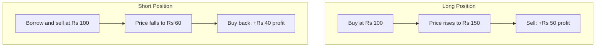

This payoff asymmetry is a recurring theme in risk management. Shorting is structurally riskier than longing because losses are unbounded. A single short position can lose more than the entire portfolio if the stock rallies sharply. For this reason, many quant strategies focus on long-only or long-biased signals, and short positions are often hedged with options to cap the downside.

### Financial Instruments
Different instruments have different data characteristics, liquidity profiles, and risk properties. Choosing the right instrument for a strategy is as important as designing the signal itself.

| Instrument | What it is | Typical use in research |
|---|---|---|
| Stocks or Equities | Ownership share in a company | Core dataset for most strategies |
| ETFs | Basket of securities, traded like a stock | Sector or factor exposure, benchmarks |
| Mutual Funds | Pooled investment, priced once daily (NAV) | Less used in quant research (low frequency) |
| Bonds | Debt instrument, fixed or floating interest | Rates strategies, macro research |
| Commodities | Physical goods via futures contracts | Diversification, macro signals |
| Forex | Currency pairs | Carry trades, macro strategies |
| REITs | Real-estate ownership traded like a stock | Yield or income strategies |
| Crypto | Digital assets on a blockchain | High-volatility 24/7 data |

### Market Microstructure Basics
Market microstructure studies how specific trading mechanisms affect price formation, order flow, and transaction costs. For a quant researcher, microstructure matters because it determines the feasibility of a strategy.

- **Bid-ask spread**: the difference between the highest price a buyer will pay (bid) and the lowest price a seller will accept (ask). A strategy that profits 0.1% per trade but faces a 0.2% spread is unprofitable regardless of how good the signal is.

- **Order types**: market orders execute immediately at the best available price but may suffer slippage on large sizes. Limit orders provide price certainty but may not execute at all. A well-designed strategy considers which order type to use.

- **Liquidity**: the ability to trade a given size without moving the price. Large-cap stocks have high liquidity; small-cap stocks and corporate bonds have lower liquidity. Many quant strategies explicitly filter for liquid instruments to avoid microstructure noise.

### Code: Research Universe Setup
```python
# Build a categorized research universe
research_universe = {
    "Equity": ["RELIANCE.NS", "TCS.NS", "HDFCBANK.NS", "INFY.NS"],
    "ETF": ["NIFTYBEES.NS", "GOLDBEES.NS", "JUNIORBEES.NS"],
    "Forex": ["USDINR=X", "EURINR=X", "GBPINR=X"],
    "Commodity": ["GOLD=F", "SILVER=F"],
}

for asset_class, tickers in research_universe.items():
    print(f"{asset_class}: {len(tickers)} instruments")
    for t in tickers:
        print(f"  {t}")

# Check how many instruments are in the universe
total = sum(len(v) for v in research_universe.values())
print(f"\nTotal research universe: {total} instruments")

# Simulate a simple universe filter for minimum liquidity
min_price = 100
liquid_tickers = []
for tickers in research_universe.values():
    for t in tickers:
        liquid_tickers.append(t)
print(f"Passing price filter (over Rs {min_price}): {len(liquid_tickers)} instruments")
```
You will expand this universe concept into a full research database in World 4, where we cover data engineering.

---

### 🔗 Free Resources
- [Zerodha Varsity -- Introduction to Stock Markets](https://zerodha.com/varsity/module/introduction-to-stock-markets/) -- free, India-focused, excellent for NIFTY/NSE context
- [Investopedia -- Primary vs Secondary Market](https://www.investopedia.com/ask/answers/difference-between-primary-secondary-market/) -- quick reference article
- [SEC -- Market Microstructure](https://www.sec.gov/marketstructure) -- US regulator's explainer on how markets work
- [Khan Academy -- Stocks and Bonds](https://www.khanacademy.org/economics-finance-domain/core-finance/stock-and-bonds) -- instrument fundamentals

### 📝 Quiz
1. **A company selling new shares in an IPO is an example of a transaction in the:**
   - A) The primary market, where securities are first issued ✅
   - B) The secondary market, where old shares trade
   - C) The OTC derivatives market, negotiated between banks
   - D) The commodities futures market, traded on exchanges

2. **NIFTY 50 is weighted by:**
   - A) Equal weight across all 50 constituent stocks
   - B) Free-float market capitalization of constituents ✅
   - C) Stock price only, ignoring the share counts
   - D) Trading volume only over the past calendar year

3. **Which statement about short selling is correct?**
   - A) Maximum loss is capped at 100% of capital, same as going long
   - B) Maximum gain is unlimited, maximum loss is capped at 100%
   - C) Maximum gain is capped at 100%, loss is theoretically unlimited ✅
   - D) Short selling has no risk if it is done on an exchange

4. **(Multi-select) Which of these are OTC-type characteristics rather than exchange characteristics?**
   - A) Bilateral negotiation ✅
   - B) High customization ✅
   - C) Centralized, standardized contracts
   - D) Lower price transparency ✅

5. **Why do quant researchers mostly use secondary market data?**
   - A) Primary market data does not exist in any form whatsoever
   - B) Secondary markets are less regulated by the authorities
   - C) The law requires using secondary market data by default
   - D) Secondary market trading is continuous and liquid with deep history ✅

6. **An arbitrageur sees NIFTY futures priced above the fair value implied by stocks. What do they do?**
   - A) Buy the stocks and sell the overpriced futures ✅
   - B) Buy the futures and sell the underpriced stocks
   - C) Do nothing because markets are always fair
   - D) Sell both the stocks and the futures at once

7. **A trader shorts a stock at Rs 100 and covers at Rs 60. What is the profit per share?**
   - A) Rs 60, because the price dropped by sixty rupees
   - B) Rs 40, the gain is the price fall from 100 to 60 ✅
   - C) Rs 160, which is the sum of the two price levels
   - D) Rs 100, the price level at which it was shorted

8. **A market maker quotes a bid of Rs 99.90 and an ask of Rs 100.00. What is the spread?**
   - A) Rs 0.00, since there is no spread at all
   - B) Rs 99.95, the midpoint of the two quotes
   - C) Rs 0.10, which is the ask price minus the bid ✅
   - D) Rs 100.00, which is the ask side of the quote

9. **A trader buys a stock for Rs 50, it doubles, then falls 50%. What happened?**
   - A) The trader is back at the starting Rs 50 price ✅
   - B) The trader lost half of the initial capital
   - C) The trader doubled the original capital
   - D) The trader broke even at Rs 75 exactly

10. **A strategy returns 15% while the NIFTY 50 returns 18%. What does this mean?**
    - A) The strategy beat the passive benchmark clearly
    - B) The strategy matched the market return exactly instead
    - C) The strategy outperformed on a risk-adjusted basis
    - D) The strategy destroyed value relative to passive investing ✅

---

## Node 3: Mathematical Foundations

### 🎯 Hook
Every formula you will meet later in this course, from the Sharpe ratio to linear regression to portfolio optimization, is built from a small toolkit of algebra, exponents, and notation. Students who struggle with later topics almost always trace the difficulty back to shaky fundamentals in these basics. Nail this toolkit once, cleanly, and nothing later will feel like new math, only new applications of the same tools. This node is the single most important investment you can make in your quant learning path.

### 📌 Learning Objectives
- Work confidently with sets, functions, exponents, and logarithms
- Read and write Sigma and Product notation fluently
- Apply algebra to financial formulas (interest, growth)
- Recognize and use arithmetic and geometric progressions in finance
- Rearrange compound interest formulas to solve for any variable
- Translate financial concepts into mathematical expressions

---

### Numbers & Sets
A set is a collection of distinct objects. In finance you will constantly work with sets: the set of all trading days, the set of stocks in the NIFTY 50, the set of dates where a signal fired, or the set of instruments passing a liquidity filter.

Key notation to memorize:
- $x \in A$ means x is an element of set A. For example, if A is the set of NIFTY 50 stocks, then RELIANCE is an element of A.
- $A \cap B$ is the intersection of sets A and B, containing elements in both sets. In quant work, this might represent stocks that pass both a value screen AND a momentum screen.
- $A \cup B$ is the union of sets A and B, containing elements in either set.
- $|A|$ is the cardinality or number of elements. For example, $|NIFTY 50| = 50$.

In Python, you can work with sets directly:

```python
# Set operations in Python for quant screening
nifty_50 = {"RELIANCE", "TCS", "HDFCBANK", "INFY", "ICICIBANK"}
value_screen = {"TCS", "INFY", "WIPRO"}
momentum_screen = {"RELIANCE", "TCS", "HDFCBANK"}

both_screens = value_screen & momentum_screen  # intersection
either_screen = value_screen | momentum_screen  # union
print(f"Pass both screens: {both_screens}")
print(f"Pass either screen: {either_screen}")
print(f"Total candidates: {len(either_screen)}")
```

This pattern of filtering and combining sets is the mathematical basis for multi-factor strategy design.

### Functions
A function maps every input to exactly one output. In quant work, almost everything is a function: price as a function of time, payoff as a function of stock price, a strategy's return as a function of its parameters.

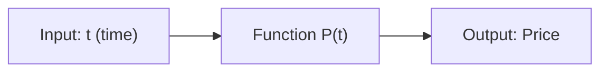

A function has three parts: the input domain, the output range, and the rule that maps inputs to outputs. For example, the function $f(x) = x^2$ doubles the input: $f(3) = 9$. In finance, you might define a function for simple moving average:

$$SMA(n) = \frac{1}{n} \sum_{i=0}^{n-1} P_{t-i}$$

This reads as: the n-period simple moving average at time t is the average of the last n prices.

Functions can also be composed, meaning you apply one function to the output of another. If $P(t)$ gives the price at time t and $R(P)$ gives the return from a price level, then $R(P(t))$ gives the return at time t. This concept of function composition is used constantly in strategy code, where you pipe data through a series of transformations.

### Exponents & Logarithms
Exponents represent repeated multiplication. If you earn a 10% return per period, after n periods your capital grows by a factor of $(1.10)^n$. This exponential growth is the foundation of compounding.

```python
import math

# Compound growth calculation
initial_capital = 100000
rate = 0.10
years = 10

future_value = initial_capital * (1 + rate) ** years
print(f"Rs {initial_capital} at {rate:.0%} for {years} years = Rs {future_value:,.0f}")

# Solve for years to double
target = 2 * initial_capital
years_needed = math.log(target / initial_capital) / math.log(1 + rate)
print(f"Years to double: {years_needed:.2f}")
```

Logarithms are the inverse of exponentiation. The statement $log_b(x) = y$ means $b^y = x$. In finance, the natural log (base e, written as $ln$) is everywhere because log returns have additive properties that simple returns lack. If a stock goes up 10% one day and down 10% the next, the simple average return is 0% but the actual result is a loss of 1% (because 1.10 * 0.90 = 0.99). Log returns handle this correctly: $ln(1.10) + ln(0.90) = ln(0.99)$, which naturally gives the correct multi-period result.

### Sigma and Product Notation
Sigma notation is a compact way to write sums:

$$\sum_{i=1}^{n} x_i = x_1 + x_2 + ... + x_n$$

This appears everywhere in finance: total return over n days is the sum of daily returns, average price over n days is the sum of prices divided by n, and the sum of squared errors is the foundation of regression (Node 12).

Product notation is the multiplicative equivalent:

$$\prod_{i=1}^{n} x_i = x_1 \times x_2 \times ... \times x_n$$

The most important financial application is cumulative return:

$$\text{Cumulative Return} = \prod_{i=1}^{n}(1 + r_i) - 1$$

If daily returns are 1%, -0.5%, 2%, then the cumulative return is (1.01)(0.995)(1.02) - 1 = 2.47%.

```python
# Cumulative return calculation using product notation
daily_returns = [0.01, -0.005, 0.02]
cumulative = 1.0
for r in daily_returns:
    cumulative *= (1 + r)
cumulative_return = cumulative - 1
print(f"Cumulative return: {cumulative_return:.2%}")
```

### Financial Algebra: Rearranging Formulas
Simple and compound interest formulas are just algebra problems waiting to be solved.

Simple interest: $A = P(1 + rt)$
Compound interest: $A = P(1 + r/m)^{mt}$

Given any three variables, you can solve for the fourth. For example, if you have Rs 100,000 today and need Rs 150,000 in 5 years, what annual return do you need?

$$150000 = 100000(1 + r)^5$$
$$(1 + r)^5 = 1.5$$
$$r = 1.5^{1/5} - 1 \approx 0.084 = 8.4\%$$

```python
# Solve for required return
present = 100000
future = 150000
years = 5
required_rate = (future / present) ** (1 / years) - 1
print(f"Required annual return: {required_rate:.2%}")
```

This type of back-solving is used constantly when setting target returns or determining required holding periods.

### Sequences and Progressions
A sequence is an ordered list of numbers. In finance, sequences appear whenever we look at data over time: daily closing prices, quarterly earnings, monthly returns. Two specific types matter most.

An arithmetic progression has a constant difference between consecutive terms. For example, 2, 4, 6, 8, 10 has a common difference of 2. The nth term is $a_n = a_1 + (n-1)d$ where d is the common difference. These are rare in finance but appear when costs are fixed per period (like a flat monthly service fee).

A geometric progression has a constant ratio between consecutive terms. For example, 100, 110, 121, 133.1 has a common ratio of 1.10. The nth term is $a_n = a_1 \times r^{n-1}$ where r is the common ratio. This is exactly how compounding works. A stock price growing at constant rate g percent per year follows $P_0, P_0(1+g), P_0(1+g)^2, ...$

The sum of a GP formula is:

$$S_n = a \times \frac{r^n - 1}{r - 1}$$

where a is the first term, r is the ratio, and n is the number of terms. This gives you the future value of a series of equal investments, which is the mathematical backbone of SIP calculators and annuity formulas.

```python
# Future value of a SIP using GP sum formula
monthly_investment = 10000
monthly_return = 0.01  # 12% annual, 1% monthly
months = 60

future_value = monthly_investment * ((1 + monthly_return) ** months - 1) / monthly_return
print(f"SIP of Rs {monthly_investment} monthly for {months} months at {monthly_return:.1%}: Rs {future_value:,.0f}")
```

### Why This Toolkit Matters
Every quant strategy you build will involve these tools. When you compute a moving average, you are applying Sigma notation. When you annualize a strategy's return, you are using exponentiation. When you check whether two groups of stocks have different average returns, you are working with sets. When you model a strategy's equity curve, you are working with a geometric progression. Even the most complex strategies, like statistical arbitrage or machine learning-based trading systems, decompose into these basic building blocks when you examine them carefully.

A concrete example: the Sharpe ratio, arguably the single most important performance metric in quant finance, is calculated as the average excess return divided by the standard deviation of returns. The average uses Sigma notation. The standard deviation uses Sigma notation for squared deviations. The ratio itself is a function. Every piece of the Sharpe ratio draws directly from this node's toolkit. If you master these fundamentals now, you will recognize them in every formula throughout the course.

The students who succeed in this course are not the ones who already know advanced math. They are the ones who take the time to make these basic tools automatic. If you can read Sigma notation as naturally as you read a sentence, and if you can rearrange a compound interest formula without thinking twice, the entire course becomes dramatically easier. Every subsequent node is just an application of these tools to a specific financial problem.

---

### 🔗 Free Resources
- [Khan Academy -- Algebra & Exponents/Logarithms](https://www.khanacademy.org/math/algebra2/x2ec2f6f830c9fb89:exp-log) -- free, thorough
- [3Blue1Brown (YouTube)](https://www.youtube.com/c/3blue1brown) -- outstanding visual math intuition, free
- [Investopedia -- Rule of 72](https://www.investopedia.com/terms/r/ruleof72.asp) -- quick applied example
- [Paul's Online Math Notes -- Algebra](https://tutorial.math.lamar.edu/Classes/Alg/Alg.aspx) -- free reference

### 📝 Quiz
1. **$\sum_{i=1}^{3} i^2$ equals:**
   - A) 14, since 1 + 4 + 9 sums to fourteen exactly ✅
   - B) 6, the sum of the numbers one, two, three
   - C) 9, the square of the largest term three
   - D) 36, the product of all three terms times two

2. **Why is the natural log preferred for financial returns over simple exponents?**
   - A) It is required by financial regulation in every market
   - B) Log returns add across time, simplifying multi-period math ✅
   - C) Logs are always positive for any price level observed
   - D) There is no real advantage to using them at all

3. **A quantity growing by a constant percentage each period follows a:**
   - A) Arithmetic progression with a fixed difference
   - B) Linear function only, with a constant slope
   - C) Geometric progression with a fixed common ratio ✅
   - D) Random walk behavior, always without any exception

4. **If you invest Rs 50,000 at 8% annual return compounded for 5 years, the value is about:**
   - A) Rs 70,000, using simple interest on the capital
   - B) Rs 54,000, adding eight percent of the principal only
   - C) Rs 73,466, compounding eight percent over the five years ✅
   - D) Rs 60,000, the principal plus forty percent exactly

5. **The expression $\prod_{i=1}^{3}(1 + r_i)$ where $r = [0.05, -0.02, 0.03]$ equals:**
   - A) 0.06, the simple sum of all of the three rates
   - B) 0.98, subtracting the negative rate from one
   - C) 1.00, rounding the product to two decimals
   - D) 1.0609, the product of 1.05, 0.98, and 1.03 ✅

6. **Which quantity is the number of elements in the intersection of two sets?**
   - A) The count of items present in both sets at once ✅
   - B) The count of items in either set combined
   - C) The count of items in the larger set only
   - D) The count of items missing from both sets

7. **You need Rs 150,000 from Rs 100,000 in 5 years. What annual return is required?**
   - A) About 5.0%, since 50% spread over ten half-years
   - B) About 8.4%, solving 1.5^(1/5) minus one here ✅
   - C) About 10.0%, dividing fifty percent by five years
   - D) About 12.2%, compounding at a higher assumed rate

8. **Why does a 10% gain followed by a 10% loss produce a net loss?**
   - A) Because gains and losses are computed on different bases
   - B) Because the loss is always larger than the gain
   - C) Because 1.10 times 0.90 equals 0.99, giving a net loss ✅
   - D) Because markets always drift downward over time

9. **Which of these is NOT a geometric progression?**
   - A) 100, 110, 121, 133.1, multiplying by 1.10 each time
   - B) 3, 6, 9, 12, adding three each time instead ✅
   - C) 5, 25, 125, 625, multiplying by five each time
   - D) 10, 20, 40, 80, multiplying by two each time

10. **What does $|A|$ denote for a set?**
    - A) The union of the set with itself as usual
    - B) The intersection of the set with another
    - C) The complement of the set in the universe
    - D) The number of elements contained in the set itself ✅

---
---

## Node 4: Python Fundamentals

### 🎯 Hook
Every backtest, every dashboard, every piece of automation in this course runs on Python. This node, plus a lifelong habit of using Git, is the toolbox everything else gets built with. The language itself is not the hard part. The hard part is learning to think in terms of data pipelines, functions, and reproducible workflows. If you are already comfortable with Python basics, use this node as a review and focus on the quant-specific patterns.

### 📌 Learning Objectives
- Use variables, core data types, and operators
- Write control flow (loops, conditionals)
- Define functions and understand scope
- Use modules and handle exceptions
- Understand basic object-oriented programming
- Use Git for version control from day one
- Work with lists, dictionaries, and comprehensions effectively
- Write simple data processing pipelines

---

### Variables, Data Types, Operators
Python's core data types map directly to financial concepts: floats for prices, ints for shares, strings for tickers, booleans for market open/close flags.

```python
price = 2450.50          # float
ticker = "RELIANCE.NS"   # str
shares = 10               # int
is_open = True            # bool

position_value = price * shares
print(f"{ticker}: {shares} shares worth Rs.{position_value}")

# Type conversion is often needed when reading raw data
price_str = "2,450.50"
price_clean = float(price_str.replace(",", ""))
print(f"Parsed price: {price_clean}")
```

Lists and dictionaries are the two most important data structures for quant work. Lists hold sequences of values (like a time series of prices). Dictionaries map keys to values (like a portfolio mapping tickers to positions).

```python
# List of daily returns
daily_returns = [0.01, -0.005, 0.02, -0.01, 0.015]
total_return = sum(daily_returns)
print(f"Total return over period: {total_return:.2%}")

# Dictionary as a simple portfolio
portfolio = {
    "RELIANCE.NS": 100,
    "TCS.NS": 50,
    "HDFCBANK.NS": 200,
}
total_shares = sum(portfolio.values())
print(f"Total shares in portfolio: {total_shares}")
```

### Control Flow
Conditionals and loops let you express trading rules as code. A trading signal is just a conditional statement applied across time.

```python
prices = [100, 102, 98, 105, 110]
signals = []

for i in range(1, len(prices)):
    daily_return = (prices[i] - prices[i-1]) / prices[i-1]
    if daily_return > 0.02:
        signals.append("STRONG_UP")
    elif daily_return < -0.02:
        signals.append("STRONG_DOWN")
    else:
        signals.append("NEUTRAL")

print(signals)

# List comprehension: a more Pythonic way
returns = [(prices[i] - prices[i-1]) / prices[i-1] for i in range(1, len(prices))]
above_threshold = [r for r in returns if abs(r) > 0.02]
print(f"Returns above 2% threshold: {len(above_threshold)} out of {len(returns)}")
```

List comprehensions are not just syntactic sugar. They are faster and more readable than manual loops once you are used to them. Every quant codebase uses them extensively.

### Functions & Scope
Functions are how you organize research code into reusable, testable units.

```python
def simple_return(p0: float, p1: float) -> float:
    """Compute simple return between two prices."""
    return (p1 - p0) / p0

def max_drawdown(prices: list) -> float:
    """Compute the maximum peak-to-trough decline in a price series."""
    peak = prices[0]
    drawdown = 0.0
    for p in prices:
        if p > peak:
            peak = p
        dd = (p - peak) / peak
        if dd < drawdown:
            drawdown = dd
    return drawdown

r = simple_return(100, 105)
print(f"Return: {r:.2%}")

prices = [100, 110, 105, 95, 98, 120]
print(f"Max drawdown: {max_drawdown(prices):.2%}")
```

Variables defined inside a function are local. They do not leak into the outer program. This matters once your codebase grows past a single script. Each function should be a self-contained unit that takes inputs and returns outputs without modifying global state.

Functions can also accept optional parameters with default values and variable numbers of arguments. This makes them flexible for different research scenarios:

```python
def sharpe_ratio(returns: list, risk_free_rate: float = 0.05, periods_per_year: int = 252):
    excess = [r - risk_free_rate/periods_per_year for r in returns]
    return (sum(excess) / len(excess)) / (__import__('statistics').stdev(excess) if len(excess) > 1 else 0)

daily_returns = [0.001, -0.002, 0.003, 0.001, -0.001, 0.002]
sr = sharpe_ratio(daily_returns)
print(f"Sharpe ratio (annualized): {sr * (252 ** 0.5):.2f}")
```

### Modules & Exceptions
Real research code uses external libraries like NumPy, Pandas, and Matplotlib. You import them as modules.

```python
import math
import statistics as stats

def annualize_return(period_return: float, periods_per_year: int):
    try:
        return (1 + period_return) ** periods_per_year - 1
    except (TypeError, ValueError) as e:
        print(f"Bad input: {e}")
        return None

# Working with real-ish data
daily_rets = [0.001, -0.002, 0.003, -0.001, 0.002]
mean_ret = stats.mean(daily_rets)
std_ret = stats.stdev(daily_rets) if len(daily_rets) > 1 else 0
print(f"Mean: {mean_ret:.4f}, Std: {std_ret:.4f}")
```

Handling exceptions explicitly, rather than letting a bad data point crash your entire backtest, is a habit that separates research-grade code from toy scripts. Always anticipate that data will have missing values, wrong types, and unexpected formats.

### Object-Oriented Basics
Classes let you bundle data with the functions that operate on that data.

```python
class Position:
    def __init__(self, ticker: str, shares: int, entry_price: float):
        self.ticker = ticker
        self.shares = shares
        self.entry_price = entry_price

    def market_value(self, current_price: float) -> float:
        return self.shares * current_price

    def pnl(self, current_price: float) -> float:
        return (current_price - self.entry_price) * self.shares

    def return_pct(self, current_price: float) -> float:
        return (current_price - self.entry_price) / self.entry_price

class Portfolio:
    def __init__(self):
        self.positions = {}

    def add_position(self, ticker: str, shares: int, price: float):
        self.positions[ticker] = Position(ticker, shares, price)

    def total_value(self, current_prices: dict) -> float:
        total = 0.0
        for ticker, pos in self.positions.items():
            total += pos.market_value(current_prices.get(ticker, 0))
        return total

# Use the classes together
pf = Portfolio()
pf.add_position("RELIANCE.NS", 10, 2450.50)
pf.add_position("TCS.NS", 5, 3200.00)
current = {"RELIANCE.NS": 2520.00, "TCS.NS": 3150.00}
print(f"Portfolio value: Rs {pf.total_value(current):,.2f}")
```

Classes like Position, Portfolio, and Strategy become the backbone of your backtesting engine. This pattern of encapsulating market objects as classes will appear throughout Worlds 5 through 9.

### Working with Files and Data
Research code reads data from files. Here is the pattern for reading CSV data:

```python
# Reading a simple CSV file of price data
csv_data = """date,open,high,low,close
2024-01-02,2450,2470,2440,2465
2024-01-03,2465,2490,2455,2480
2024-01-04,2480,2485,2460,2470"""

lines = csv_data.strip().split("\n")
header = lines[0].split(",")
prices = []
for line in lines[1:]:
    values = line.split(",")
    record = dict(zip(header, values))
    record["close"] = float(record["close"])
    prices.append(record)

closes = [r["close"] for r in prices]
print(f"Closing prices: {closes}")
```

This manual parsing shows you what Pandas does automatically (Node 8). Understanding both levels is important: Pandas handles complexity, but knowing the underlying structure helps when things go wrong.

### Git Basics
Version control is not optional for quant research. Every project in this course should be its own Git repository from the very first file.

```bash
git init
git add .
git commit -m "Initial commit: Node 4 exercises"
git branch feature/return-calculator
git checkout feature/return-calculator
git push origin feature/return-calculator
```

Why Git matters for quant research specifically: you will run hundreds of experiments, and only Git lets you definitively answer "what changed between the version that worked and the version that broke." A research workflow without version control is like a lab notebook without dates.

The basic workflow is: make a change, test it, commit it. If the change breaks something, you can always revert. If the change works, you have a clean checkpoint. This discipline pays for itself within the first week of any nontrivial project.

### Working with External Libraries
As your research code grows, you will rely on specialized libraries that handle the heavy lifting. NumPy provides fast array operations (Node 7). Pandas provides DataFrame structures for time series data (Node 8). Matplotlib and Seaborn handle visualization (Node 17). Scipy adds scientific computing routines like optimization and statistical tests.

The pattern for using any external library is always the same: import it at the top of your script, read the documentation to understand its API, and test each function on a small sample before applying it to your full dataset. This habit alone will save you hours of debugging.

```python
# Standard library imports first, then third-party
import math
import statistics
from datetime import datetime, timedelta

# Third-party imports (you will use these constantly)
import numpy as np
import pandas as pd
import matplotlib.pyplot as plt
```

Organizing imports this way is a Python convention that makes your code easier to read. The standard library comes first, then third-party libraries, then your own modules. Each group is separated by a blank line.

---

### 🔗 Free Resources
- [freeCodeCamp -- Python for Everybody (YouTube)](https://www.youtube.com/watch?v=8DvywoWv6fI) -- full free course
- [Corey Schafer -- Python OOP Tutorials (YouTube)](https://www.youtube.com/playlist?list=PL-osiE80TeTsqhIuOqKhwlXsIBIdSeYtc) -- free
- [Git -- Official Documentation](https://git-scm.com/doc) -- free reference
- [Real Python -- Exception Handling](https://realpython.com/python-exceptions/) -- free article
- [Automate the Boring Stuff with Python](https://automatetheboringstuff.com/) -- free book covering practical Python

### 📝 Quiz
1. **What will `annualize_return(0.01, 12)` approximately return?**
   - A) 0.1200, simply multiplying the rate by twelve
   - B) 0.0100, taking the monthly rate as the annual one
   - C) 0.1268, compounding one percent across twelve periods ✅
   - D) 1.0000, assuming the rate doubles each month

2. **Why wrap risky operations in try/except in research code?**
   - A) It makes the code run much faster in general
   - B) It stops one bad data point from crashing the backtest ✅
   - C) It is required Python syntax in every function
   - D) It has no real benefit in practice at all ever

3. **In OOP, a `Position` class with a `pnl()` method is an example of:**
   - A) A function that serves no purpose whatsoever
   - B) A control flow structure, like a loop or branch
   - C) A Git command that is used for version control
   - D) Encapsulating data with behavior, like pnl calculation ✅

4. **What does the list comprehension `[r for r in returns if r > 0]` do?**
   - A) All of the values that are greater than zero ✅
   - B) Every value doubled in the original list
   - C) No values, removing everything from the list
   - D) Only the first positive value in the list

5. **Why should every quant research project use Git from day one?**
   - A) It makes the code run faster in production use
   - B) It is only needed for large team projects today
   - C) It allows tracking changes and reverting experiments ✅
   - D) Git automatically fixes bugs found in the code

6. **What is the output of `type(3.0)` in Python?**
   - A) int, since it is written without a decimal point
   - B) str, because numbers are stored as text here
   - C) bool, since the value is a fixed constant
   - D) float, because the value contains a decimal point ✅

7. **With prices = [100, 110, 105], what is the max drawdown from the peak?**
   - A) 0.0%, since the peak is never exceeded
   - B) 10.0%, the first day gain shown in the list
   - C) 4.55%, the fall from 110 to 105 versus peak ✅
   - D) 5.0%, the simple drop from 110 down to 105

8. **A backtest returns strange results. What is the best debugging step first?**
   - A) Rewrite the entire script from scratch again
   - B) Change all parameters to random new values
   - C) Delete the data and start the download over
   - D) Print intermediate values to isolate the failure ✅

9. **Running `"I hold " + shares` when shares = 3.5 raises what kind of error?**
   - A) A value error, because strings cannot be added
   - B) A type error, since str and float cannot combine ✅
   - C) A syntax error, because plus is not allowed
   - D) An index error, since it is out of range

10. **Which habit makes research code reproducible for others?**
    - A) Committing every change with Git from the start ✅
    - B) Running the analysis once and saving screenshots
    - C) Keeping all experiments in one unnamed file
    - D) Sharing only the final charts and numbers

### Debugging Tips for Quant Code
When your backtest produces strange results, resist the urge to rewrite everything. Isolate the problem by printing intermediate values at each step of your logic. Check that your data types are what you expect, especially after arithmetic operations. Verify edge cases: what happens when an asset has zero volume? What happens when a date range has no data? A systematic debugging workflow saves hours of frustration. These practices separate productive quants from those who chase random changes without understanding their code.

---

---

## Node 5: Descriptive Statistics
### 🎯 Hook
Before you can say "this strategy is good," you need to be fluent in describing any dataset numerically: its center, its spread, its outliers. When a portfolio manager asks "how risky is this strategy?" they are really asking about the dispersion of returns. When they ask "what return should I expect?" they are asking about the central tendency. Descriptive statistics gives you the precise vocabulary to answer both questions. Every later chart, every statistical test, every risk metric in this course builds on these foundations.

### 📌 Learning Objectives
- Distinguish population versus sample and know when each applies
- Compute and interpret mean, median, mode, weighted mean
- Compute quartiles, percentiles, and use them for risk context
- Compute variance, standard deviation, MAD, range, IQR
- Use coefficient of variation to compare volatility across assets
- Detect outliers using Z-scores
- Understand why standard deviation equals financial volatility
- Apply descriptive statistics to real market data

---

### Population vs Sample
A population is the entire group you care about. For example, every trading day since the NSE started operations, or every possible return of a stock under all market conditions. A sample is a subset you actually observe: the last 5 years of daily returns, or 100 randomly selected stocks from the NIFTY 500.

Why does this distinction matter? Because almost all quant research works with samples and uses them to estimate population parameters. When you compute the average return of the last 252 trading days, you are hoping that this sample average is a good estimate of the true long-term average return. The sample size determines how confident you can be in that estimate. This distinction also underlies why we use n-1 in the denominator when computing sample variance (Bessel's correction) rather than n. Using n systematically underestimates the population variance because the sample mean is closer to the sample data than the true population mean would be.

```python
import numpy as np

# Demonstrate the difference between population and sample variance
sample = [0.01, -0.02, 0.015, 0.03, -0.10, 0.005]
pop_var = np.var(sample, ddof=0)      # population variance (divides by n)
samp_var = np.var(sample, ddof=1)     # sample variance (divides by n-1)
print(f"Population variance (ddof=0): {pop_var:.6f}")
print(f"Sample variance (ddof=1): {samp_var:.6f}")
print(f"Difference: {samp_var - pop_var:.6f}")
```

### Mean, Median, Mode, Weighted Mean
The mean is the arithmetic average: sum all values and divide by the count. It is the most common measure of central tendency, but it is sensitive to outliers. A single extreme return can pull the mean far from the typical value.

The median is the middle value when data is sorted. It is robust to outliers because it only depends on the rank order, not on the magnitude of extreme values. If a stock has daily returns of 1%, -2%, 1.5%, 3%, and -10%, the mean is -1.3% while the median is 1%. The median better represents the typical day.

The mode is the most frequent value. In continuous data like returns, the mode is less useful, but for discrete data like the number of trades per day, it can be informative.

```python
import numpy as np

returns = [0.01, -0.02, 0.015, 0.03, -0.10, 0.005]

mean_return = np.mean(returns)
median_return = np.median(returns)
print(f"Mean: {mean_return:.4f}, Median: {median_return:.4f}")
print(f"Mean is pulled toward the outlier -10%; median is robust to it")
```

A weighted mean assigns different importance to different values. In finance, this is everywhere: a portfolio return is the weighted mean of individual asset returns, where weights are the fraction of capital allocated to each asset. If you have 60% in a stock returning 10% and 40% in a bond returning 4%, the portfolio return is 0.60 * 0.10 + 0.40 * 0.04 = 7.6%.

```python
# Weighted mean: portfolio return calculation
asset_returns = [0.10, 0.04, 0.06]
weights = [0.60, 0.30, 0.10]
portfolio_return = sum(w * r for w, r in zip(weights, asset_returns))
print(f"Portfolio return: {portfolio_return:.2%}")
```

### Quartiles and Percentiles
Quartiles split ordered data into four equal parts. The first quartile (Q1) is the 25th percentile. The second quartile (Q2) is the median. The third quartile (Q3) is the 75th percentile. The interquartile range (IQR = Q3 - Q1) measures the spread of the middle 50% of data.

Percentiles generalize this: the p-th percentile is the value below which p percent of the data falls. The 90th percentile of daily losses tells you that 9 out of 10 days had losses smaller than this threshold. This is a building block for Value at Risk (VaR), which you will study in Node 20.

```python
import numpy as np

returns = np.array([0.01, -0.02, 0.015, 0.03, -0.10, 0.005, 0.02, -0.01])
q1 = np.percentile(returns, 25)
q3 = np.percentile(returns, 75)
var_90 = np.percentile(returns, 10)  # 90th percentile of losses
print(f"Q1: {q1:.4f}, Q3: {q3:.4f}, IQR: {q3 - q1:.4f}")
print(f"90% VaR (10th percentile): {var_90:.4f}")
```

### Variance, Standard Deviation, MAD, Range, IQR
These measures quantify how spread out the data is. Higher spread means higher uncertainty and, in finance, higher risk.

Variance is the average squared deviation from the mean. Standard deviation is the square root of variance, bringing the measure back to the same units as the original data (percent returns). Standard deviation is literally what the finance industry calls volatility. This is the single most important number in this node.

```python
import numpy as np

returns = np.array([0.01, -0.02, 0.015, 0.03, -0.10, 0.005])

variance = np.var(returns, ddof=1)
std_dev = np.std(returns, ddof=1)
mad = np.mean(np.abs(returns - np.mean(returns)))
iqr = np.percentile(returns, 75) - np.percentile(returns, 25)

print(f"Variance: {variance:.6f}")
print(f"Std Dev (volatility): {std_dev:.4f}")
print(f"MAD: {mad:.4f}, IQR: {iqr:.4f}")
```

Why use standard deviation over variance? Because it is in the same units as the returns. If returns are in percent, variance is in percent-squared (hard to interpret), while standard deviation is in percent (directly interpretable). When someone says "this stock has 25% annual volatility," they mean the annualized standard deviation of returns is 25%.

MAD (mean absolute deviation) is an alternative to standard deviation that weighs all deviations equally, rather than squaring them (which gives more weight to extreme values). MAD is more robust to outliers, but standard deviation is the industry convention.

### Coefficient of Variation
The coefficient of variation (CV) is the ratio of standard deviation to mean:

$$CV = \frac{\sigma}{\mu}$$

This lets you compare relative riskiness across assets with very different price scales or return levels. A stock with 20% volatility and 10% expected return has a CV of 2.0. A bond with 5% volatility and 3% expected return has a CV of 1.67. Despite the stock having higher absolute volatility, the bond has lower CV because it also has proportionally lower return.

```python
# Compare risk-adjusted dispersion across assets
assets = {
    "Stock A": {"mean": 0.12, "std": 0.25},
    "Stock B": {"mean": 0.08, "std": 0.18},
    "Bond C": {"mean": 0.05, "std": 0.08},
}
for name, stats in assets.items():
    cv = stats["std"] / stats["mean"]
    print(f"{name}: CV = {cv:.2f}")
```

### Z-Score and Outlier Detection
The Z-score measures how many standard deviations a data point is from the mean:

$$z = \frac{x - \mu}{\sigma}$$

A Z-score of 0 means the data point equals the mean. A Z-score of 2 means it is 2 standard deviations above the mean. In normally distributed data, about 95% of observations fall within plus or minus 2 standard deviations, and about 99.7% fall within plus or minus 3 standard deviations.

The convention for outlier detection is that observations with |z| > 3 are flagged as potential outliers. In financial data, these often correspond to data errors, corporate events (mergers, splits), or genuine but extreme market moves. Identifying them is the first step in data cleaning (Node 15).

```python
import numpy as np

returns = np.array([0.01, -0.02, 0.015, 0.03, -0.10, 0.005, -0.12, 0.02])
mean_r = np.mean(returns)
std_r = np.std(returns, ddof=1)
z_scores = (returns - mean_r) / std_r

outliers = returns[np.abs(z_scores) > 2]
print(f"Mean: {mean_r:.4f}, Std: {std_r:.4f}")
print(f"Z-scores: {np.round(z_scores, 2)}")
print(f"Potential outliers (|z| > 2): {outliers}")
```

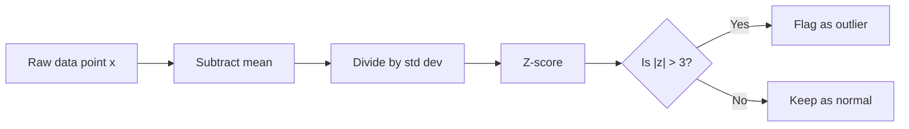

### Applying Descriptive Statistics to Market Data
Here is a practical example that brings together everything in this node: given a year of daily returns for a stock, compute the key descriptive statistics that a quant researcher would report to a portfolio manager.

```python
import numpy as np

# Simulate one year (252 trading days) of daily returns
np.random.seed(42)
daily_returns = np.random.normal(0.0008, 0.015, 252)

mean_daily = np.mean(daily_returns)
std_daily = np.std(daily_returns, ddof=1)
annual_return = (1 + mean_daily) ** 252 - 1
annual_vol = std_daily * np.sqrt(252)
sharpe = annual_return / annual_vol  # simplified, ignores risk-free rate
max_daily_loss = np.min(daily_returns)
var_95 = np.percentile(daily_returns, 5)

print(f"Daily mean: {mean_daily:.4%}")
print(f"Daily volatility: {std_daily:.4%}")
print(f"Annualized return: {annual_return:.2%}")
print(f"Annualized volatility: {annual_vol:.2%}")
print(f"Simplified Sharpe ratio: {sharpe:.2f}")
print(f"Max daily loss: {max_daily_loss:.2%}")
print(f"95% VaR (5th percentile): {var_95:.2%}")
```

This single script computes the same set of numbers that a quant researcher might report when presenting a strategy to a portfolio manager. Every element here: the mean, the standard deviation, the percentiles, the annualization formulas, all come from this node.

---

### 🔗 Free Resources
- [StatQuest -- Statistics Fundamentals (YouTube)](https://www.youtube.com/playlist?list=PLblh5JKOoLUK0FLuzwntyYI10UQFUhsY9) -- free, excellent intuition
- [Khan Academy -- Descriptive Statistics](https://www.khanacademy.org/math/statistics-probability/summarizing-quantitative-data) -- free
- [Investopedia -- Standard Deviation](https://www.investopedia.com/terms/s/standarddeviation.asp) -- quick reference
- [Wikipedia -- Bessel's Correction](https://en.wikipedia.org/wiki/Bessel%27s_correction) -- why n-1 in sample variance

### 📝 Quiz
1. **Why is the median more robust to outliers than the mean?**
   - A) Median depends on rank order, not on extreme values ✅
   - B) Median ignores half of the data by design here
   - C) Mean is always larger than the median value
   - D) They are equally robust in all cases always

2. **In finance, "volatility" most commonly refers to:**
   - A) Mean absolute deviation of the return series
   - B) The range of prices over the entire period
   - C) The interquartile range of the returns only
   - D) The standard deviation of the returns series ✅

3. **A Z-score of 3.5 for a daily return suggests:**
   - A) A potential outlier that is worth investigating ✅
   - B) A completely normal and typical trading day
   - C) That the stock has zero volatility today
   - D) Nothing meaningful about the data at all

4. **You have 60% in Asset A (return 8%) and 40% in Asset B (return 3%). The portfolio return is:**
   - A) 5.5%, the simple average of the two returns
   - B) 6.0%, the weighted mean of the two assets here ✅
   - C) 11.0%, the sum of both returns combined
   - D) 4.5%, the difference between the two returns

5. **What does the interquartile range (IQR) measure?**
   - A) The spread of the entire dataset from min to max
   - B) The average deviation from the mean value
   - C) The spread of the middle fifty percent of data ✅
   - D) The number of outliers found in the data

6. **Why does sample variance divide by n-1 instead of n?**
   - A) The sample mean is further from the data in practice
   - B) Dividing by n gives the same value always here
   - C) There is no particular reason for making this choice
   - D) The sample mean is closer to the data than the true mean ✅

7. **Stock A has mean 10% and std 20%; Bond B has mean 3% and std 5%. Which is true about their CVs?**
   - A) The stock has a lower coefficient of variation
   - B) Both assets have the same coefficient of variation
   - C) The bond has the lower coefficient of variation ✅
   - D) Coefficients of variation cannot be compared

8. **A year of daily returns has 95% VaR of -2.5%. What does this mean?**
   - A) All of the days in the year lose at least 2.5%
   - B) About five percent of days lose at least 2.5% ✅
   - C) Exactly 95 days out of every 100 gain 2.5%
   - D) The worst single day of the year lost exactly 2.5%

9. **Returns are 1%, -2%, 1.5%, 3%, and -10%. Which statement about median vs mean is true?**
   - A) The median is higher; the outlier drags down the mean ✅
   - B) The mean is higher, since gains outweigh the losses
   - C) The median and mean are equal in this sample here
   - D) Both the mean and the median are negative in this sample

10. **Why is the standard deviation of prices a poor risk measure?**
    - A) Prices always move randomly without any pattern
    - B) Price volatility equals return volatility always
    - C) Price levels are all the same across different stocks
    - D) It depends on price level, not on the actual return risk ✅

---
---

## Node 6: Returns & Performance Basics

### 🎯 Hook
"Return" sounds simple until you realize there are multiple ways to define it, and picking the wrong one silently breaks your later statistics. This node builds the return math every other formula in this course sits on top of.

### 📌 Learning Objectives
- Distinguish simple returns from log returns and know when to use each
- Understand compounding mechanically
- Compute CAGR
- Annualize returns/volatility from any frequency
- Conceptually adjust returns for inflation

---

### Simple vs Log Returns
Every return calculation starts with the same inputs: a beginning price and an ending price. The simple return asks "what percentage did I make?" The log return asks "what is the continuously compounded rate?"

- **Simple return**: $R = \frac{P_1 - P_0}{P_0}$
- **Log return**: $r = \ln\left(\frac{P_1}{P_0}\right)$

```python
import numpy as np

p0, p1 = 100, 110
simple_return = (p1 - p0) / p0
log_return = np.log(p1 / p0)
print(f"Simple: {simple_return:.4f}, Log: {log_return:.4f}")
# Simple: 0.1000, Log: 0.0953
```

For small returns, simple and log returns are nearly identical. A 1% move gives a log return of approximately 0.995%. As returns grow larger, the difference becomes meaningful. A 50% gain is a simple return of 0.50 but a log return of 0.405. A 100% gain maps to a log return of 0.693.

Why log returns matter more than they first appear: they are time-additive. The log return over 2 days is just the sum of each day's log return. Simple returns are not additive across time. If a stock goes up 10% and then down 10%, the simple returns sum to zero but the actual result is a loss of 1%. Log returns correctly capture this: 0.0953 minus 0.1054 equals negative 0.0101, matching the true loss.

This additivity makes log returns the preferred choice for statistical modeling. When you compute volatility (Node 5), the standard deviation of log returns has cleaner mathematical properties than the standard deviation of simple returns. When you build a time series model (Node 25), you model log returns, not simple returns.

```python
import numpy as np

# Demonstrate additive property of log returns
prices = [100, 110, 121, 108]
log_rets = np.diff(np.log(prices))  # np.diff for log prices = log returns
total_log_return = np.sum(log_rets)
total_simple_return = (prices[-1] - prices[0]) / prices[0]
print(f"Sum of log returns: {total_log_return:.4f}")
print(f"Actual total return: {total_simple_return:.4f}")
print(f"Log returns match: {np.isclose(total_log_return, np.log(1+total_simple_return))}")
```

### Compounding
Compounding is the single most important concept for understanding long-term returns. When you earn a return, that return gets added to your capital, and the next return applies to the larger base.

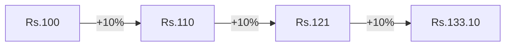

Note this is not Rs.130 (simple 3x10%). Compounding means growth builds on growth. After three 10% returns, you have Rs.133.10, not Rs.130. The extra Rs.3.10 comes from earning returns on previous returns.

The compounding formula for n periods is:

$$P_n = P_0 \times (1 + R_1) \times (1 + R_2) \times \ldots \times (1 + R_n)$$

If all returns are equal to R, this simplifies to:

$$P_n = P_0 \times (1 + R)^n$$

This exponential growth is why small differences in annual returns compound into enormous differences over decades. A strategy earning 12% per year turns Rs.100 into Rs.869 after 20 years. A strategy earning 10% per year turns Rs.100 into Rs.673. The 2 percentage point gap compounds to a 29% difference in terminal wealth.

```python
import numpy as np

initial = 100
years = 20
rate_a = 0.12
rate_b = 0.10

final_a = initial * (1 + rate_a) ** years
final_b = initial * (1 + rate_b) ** years
print(f"At 12%: Rs.{final_a:.0f}")
print(f"At 10%: Rs.{final_b:.0f}")
print(f"Difference: Rs.{final_a - final_b:.0f}")
```

### CAGR (Compound Annual Growth Rate)
CAGR answers the question: what constant annual rate would have produced this same total growth over the entire period?

$$CAGR = \left(\frac{P_{end}}{P_{start}}\right)^{1/n} - 1$$

where n is the number of years.

If an investment grows from Rs.100 to Rs.200 over 5 years, the CAGR is (200/100)^(1/5) - 1 = 14.87%. This is not the simple average of each year's return. If the returns were 50%, -20%, 30%, 10%, and 15%, the simple average is 17%, but the CAGR would be lower because of the volatility drag.

CAGR is the honest measure of performance. A fund that advertises "average annual return of 15%" may have a CAGR of only 11% if returns were volatile. Always look for CAGR, not the arithmetic average, when evaluating a strategy.

```python
import numpy as np

start_price = 100
end_price = 200
years = 5

cagr = (end_price / start_price) ** (1 / years) - 1
print(f"CAGR: {cagr:.2%}")
```

### Annualization
Returns and volatility are measured over some period: daily, weekly, monthly. To compare across assets or time frames, you must annualize.

Returns annualize with compounding:

$$R_{annual} = (1 + R_{period})^{p} - 1$$

Volatility annualizes with the square root of time:

$$\sigma_{annual} = \sigma_{period} \times \sqrt{p}$$

where p is the number of periods per year. For daily data, p = 252 (trading days per year). For weekly data, p = 52. For monthly data, p = 12.

Why does volatility use square root of time but returns use exponentiation? Because returns compound multiplicatively over time, while variance (the square of volatility) adds linearly under the assumption that returns are independent across time. Since variance adds linearly, standard deviation scales with the square root of time.

```python
import numpy as np

daily_std = 0.012
daily_mean = 0.0005

annual_return = (1 + daily_mean) ** 252 - 1
annual_vol = daily_std * np.sqrt(252)
print(f"Annualized return: {annual_return:.2%}")
print(f"Annualized volatility: {annual_vol:.2%}")
```

### Understanding the Square Root of Time Rule
Why does volatility scale with the square root of time while returns scale with multiplication? The answer lies in how variance behaves. Under the assumption that daily returns are independent and identically distributed, the variance of the sum of daily returns equals the sum of their variances. If each day has variance sigma-squared, then n days have variance n * sigma-squared. Taking the square root gives sigma * sqrt(n). This is called the square root of time rule, and it is one of the most widely used formulas in quantitative finance.

### Comparing Returns Across Assets
Once you can annualize any return series, you can compare fundamentally different assets. A stock with daily data, a mutual fund with monthly NAV data, and a bond with quarterly coupon data can all be reduced to annualized returns and volatility. This comparability is essential for portfolio construction (Node 18).

### Inflation Adjustment (conceptual)
Returns measured in rupees are nominal returns. They tell you how many rupees you have, but not how much you can actually buy with those rupees. Real returns adjust for inflation:

$$1 + R_{real} = \frac{1 + R_{nominal}}{1 + \text{inflation}}$$

A strategy returning 8% nominal in a 6% inflation environment has a real return of roughly 1.9%. If inflation is 7%, the real return drops below 1%. When evaluating any strategy, especially over long periods, always ask whether the returns are stated in nominal or real terms.

```python
nominal = 0.08
inflation = 0.06
real_return = (1 + nominal) / (1 + inflation) - 1
print(f"Nominal: {nominal:.2%}, Inflation: {inflation:.2%}, Real: {real_return:.2%}")
```

### Common Pitfalls with Returns
Even experienced quants make mistakes with return calculations. The most common trap is using simple returns for multi-period statistics. If you compute the average of daily simple returns and annualize it by multiplying by 252, you get a biased estimate. The correct approach is to compound each daily return or use log returns.

Another trap: computing volatility from prices instead of returns. Price series have trends and are non-stationary. Standard deviation of prices tells you nothing about risk because it depends on the price level. Always convert to returns first.

A third trap: annualizing a partial year. If a strategy returned 15% over 6 months, the annualized return is not 30%. It is (1.15)^2 - 1 = 32.25%. Always use the compounding formula, never simple multiplication.

```python
# Wrong way: multiply by periods
wrong_annual = 0.15 * 2  # = 0.30
# Right way: compound
right_annual = (1.15) ** 2 - 1  # = 0.3225
print(f"Wrong annualization: {wrong_annual:.2%}")
print(f"Correct annualization: {right_annual:.2%}")
```

These pitfalls highlight why it is essential to verify the math on a small, known example before trusting any new return calculation. One extra minute of verification can prevent hours of debugging downstream.

### Putting It All Together: A Performance Report
Here is how a quant researcher might summarize a strategy's performance for a quarterly review. The report computes daily returns from prices, annualizes them, and summarizes the key metrics.

```python
import numpy as np

# Simulate daily prices and compute returns
np.random.seed(42)
daily_prices = 100 * np.exp(np.cumsum(np.random.normal(0.0005, 0.01, 252)))
daily_returns = np.diff(daily_prices) / daily_prices[:-1]

# Key performance metrics
total_return = (daily_prices[-1] / daily_prices[0]) - 1
cagr = (daily_prices[-1] / daily_prices[0]) ** (1 / 1) - 1
annual_vol = np.std(daily_returns, ddof=1) * np.sqrt(252)
sharpe = cagr / annual_vol  # simplified

print(f"Total return: {total_return:.2%}")
print(f"CAGR: {cagr:.2%}")
print(f"Annualized volatility: {annual_vol:.2%}")
print(f"Simplified Sharpe: {sharpe:.2f}")
```

This single report uses every concept from this node: simple returns for daily calculations, CAGR for the annualized growth rate, annualization with square root of time for volatility, and the Sharpe ratio to relate the two. Every future node that discusses performance builds on this methodology. Understanding these return calculations thoroughly before moving on will make every later concept in Worlds 6 through 12 significantly easier to grasp.

---

### 🔗 Free Resources
- [Investopedia — CAGR](https://www.investopedia.com/terms/c/cagr.asp) — free reference with examples
- [Zerodha Varsity](https://zerodha.com/varsity/) — free, India-context
- [QuantStart](https://www.quantstart.com/) — free articles on annualizing returns/volatility

### 📝 Quiz
1. **Why are log returns preferred for multi-period statistical analysis?**
   - A) They are additive across the time periods ✅
   - B) They are always positive numbers in practice
   - C) They are easier to compute by hand always
   - D) Simple returns are illegal to use in research

2. **Annualized volatility from daily std dev is computed by:**
   - A) Multiplying the daily value by 365 exactly
   - B) Multiplying the daily value by sqrt(252) ✅
   - C) Multiplying the daily value by twelve months
   - D) Dividing the daily value by the number 252

3. **CAGR answers which question?**
   - A) What was the return on the single best trading day
   - B) What is the standard deviation of the returns
   - C) What constant annual rate produces the same total return ✅
   - D) What is today's return on the current position now

4. **A strategy returned 15% over 6 months. What is the correct annualized return?**
   - A) 30.0%, by simply multiplying the return by two
   - B) 15.0%, returns never annualize over short periods
   - C) 7.5%, by dividing the return in half exactly
   - D) 32.25%, compounding the return with the exponent of two ✅

5. **Rs 100 grows at 12% for 20 years; another Rs 100 grows at 10%. Roughly how much more does the first end with?**
   - A) About Rs 200, the gap between the two rates
   - B) About Rs 100, exactly the initial capital
   - C) About Rs 292, the compounding gap after 20 years ✅
   - D) About Rs 869, the entire final value at 12%

6. **Why does variance add linearly across time while std dev does not?**
   - A) Because returns are always perfectly correlated with each other
   - B) Because variance of a sum is the sum of variances under independence ✅
   - C) Because standard deviation adds linearly instead of this
   - D) Because prices, not returns, are independent in markets

7. **A strategy returns 8% nominal with 6% inflation. Why is the real return about 1.9% and not 2%?**
   - A) Real return is (1.08)/(1.06) minus one, not a simple difference ✅
   - B) Because inflation always overstates the nominal return
   - C) Because real returns are computed on post-tax income instead
   - D) Because the risk-free rate is always subtracted first

8. **Why is a fund's "average annual return of 15%" often lower than it sounds?**
   - A) It ignores the risk-free rate of return fully
   - B) It always overstates the real volatility
   - C) It is harder to compute than the CAGR value
   - D) It ignores volatility drag, so the CAGR is lower ✅

9. **A stock rises 10% one day and falls 10% the next. What is the net result?**
   - A) Break even, since the returns cancel exactly
   - B) A 1% loss, since 1.10 times 0.90 is 0.99 ✅
   - C) A 1% gain, since the order does not matter
   - D) A 10% loss, from the second day's decline

10. **What is the pitfall of computing volatility from prices instead of returns?**
    - A) Price series are stationary, so the measure is stable
    - B) Price volatility is the same as return volatility always
    - C) Prices have no trends and are not persistent over time
    - D) Price series are non-stationary, so the measure is level-dependent ✅

---
---

## Node 7: NumPy

### 🎯 Hook
NumPy is the computational engine under almost every quant library in Python (Pandas, scikit-learn, and more). Fast, vectorized array math is what makes it feasible to backtest years of daily data in milliseconds instead of minutes.

### 📌 Learning Objectives
- Create and manipulate arrays, understand broadcasting
- Vectorize calculations instead of looping
- Use universal functions (ufuncs)
- Generate random numbers for simulation
- Perform basic linear algebra operations

---

### Creating NumPy Arrays
NumPy arrays are the central data structure. You can create them from Python lists, use built-in functions, or read from files. The key difference from Python lists: arrays have a fixed data type and support element-wise operations without loops.

```python
import numpy as np

# Create arrays from lists
prices = np.array([100, 102, 98, 105, 110])
zeros = np.zeros(5)        # [0. 0. 0. 0. 0.]
ones = np.ones(3)           # [1. 1. 1.]
range_arr = np.arange(0, 10, 2)  # [0 2 4 6 8]
linspace = np.linspace(0, 1, 5)   # [0.   0.25 0.5  0.75 1.  ]

# Multi-dimensional arrays
matrix_2d = np.array([[1, 2], [3, 4], [5, 6]])
print(f"Shape: {matrix_2d.shape}")  # (3, 2)
print(f"Size: {matrix_2d.size}")    # 6
print(f"Dimensions: {matrix_2d.ndim}")  # 2
```

### Indexing, Slicing, and Boolean Masking
NumPy offers powerful ways to access array elements. Boolean masking, in particular, is indispensable for filtering financial data based on conditions.

```python
import numpy as np

prices = np.array([100, 102, 98, 105, 110, 95, 108])

# Basic indexing and slicing
first_three = prices[:3]                 # [100 102 98]
every_other = prices[::2]                # [100 98 110]
last_element = prices[-1]                # 108

# Boolean masking: select elements that meet a condition
above_100 = prices[prices > 100]
print(f"Prices above 100: {above_100}")  # [102 105 110 108]

profitable_days = prices > prices[0]
print(f"Days above starting price: {profitable_days}")
# [False  True False  True  True False  True]
```

Boolean masks are how you will answer questions like "on how many days did the strategy outperform the benchmark?" or "what was the average return on days when volume was above median?"

### Arrays and Broadcasting
Broadcasting lets NumPy apply operations between arrays of different but compatible shapes without explicit loops. This is one of the most powerful features in NumPy and the feature that most directly translates to faster code.

```python
import numpy as np

# Scalar broadcasting: multiply every element by a scalar
prices = np.array([100, 102, 98, 105, 110])
shares_held = 10  # scalar
position_values = prices * shares_held
print(position_values)
# [1000 1020  980 1050 1100]

# Array broadcasting: element-wise between same-sized arrays
weights = np.array([0.4, 0.3, 0.2, 0.05, 0.05])
weighted_prices = prices * weights

# Multi-dimensional broadcasting: adding a column vector to a row vector
a = np.array([[1], [2], [3]])  # shape (3, 1)
b = np.array([10, 20, 30])     # shape (3,)
result = a + b
print(result)
# [[11 21 31]
#  [12 22 32]
#  [13 23 33]]
```

The broadcasting rules are: NumPy compares dimensions from right to left, and two dimensions are compatible if they are equal or one of them is 1. Understanding these rules will save you countless hours of debugging dimension errors.

### Vectorization
Vectorization is the practice of replacing explicit Python loops with array operations. Python loops have overhead for every iteration. NumPy operations, by contrast, are implemented in compiled C and Fortran, making them orders of magnitude faster.

```python
import numpy as np
import time

large_prices = np.random.uniform(90, 110, size=1_000_000)

# Slow: Python loop
start = time.time()
returns_loop = []
for i in range(1, len(large_prices)):
    returns_loop.append((large_prices[i] - large_prices[i-1]) / large_prices[i-1])
loop_time = time.time() - start
print(f"Loop version: {loop_time:.4f} seconds")

# Fast: vectorized
start = time.time()
returns_vec = (large_prices[1:] - large_prices[:-1]) / large_prices[:-1]
vec_time = time.time() - start
print(f"Vectorized version: {vec_time:.4f} seconds")
print(f"Speedup: {loop_time / vec_time:.0f}x")
```

On real datasets with millions of data points, the vectorized version can be 50-100x faster. This is the difference between a backtest finishing in seconds versus hours. Whenever you see a for-loop in quant code, ask yourself: can this be vectorized?

List comprehensions in Python are faster than manual for-loops but still nowhere near NumPy vectorization for numerical work.

### Universal Functions (ufuncs)
Universal functions are NumPy functions that operate element-wise on arrays. They include all the trigonometric, logarithmic, exponential, and statistical functions you will use daily.

```python
import numpy as np

prices = np.array([100, 102, 98, 105, 110])
returns = (prices[1:] - prices[:-1]) / prices[:-1]

# Common ufuncs
log_returns = np.log(prices[1:] / prices[:-1])
abs_returns = np.abs(returns)
sqrt_returns = np.sqrt(np.abs(returns))  # sqrt of absolute returns
cumulative_return = np.cumprod(1 + returns) - 1
max_drawdown = np.min(cumulative_return)
print(f"Log returns: {log_returns}")
print(f"Cumulative return: {cumulative_return[-1]:.2%}")
print(f"Max drawdown: {max_drawdown:.2%}")
```

The pattern is always the same: pass an array to a ufunc and get an array back. No loops, no list comprehensions. This consistency is what makes NumPy code so readable once you are comfortable with it.

### Reshaping, Transposing, and Stacking
Working with multidimensional data often requires changing array shapes. NumPy provides efficient operations for this.

```python
import numpy as np

# Reshape: change dimensions without changing data
data = np.arange(12)
reshaped = data.reshape(3, 4)  # 3 rows, 4 columns
print(reshaped)
# [[ 0  1  2  3]
#  [ 4  5  6  7]
#  [ 8  9 10 11]]

# Transpose: swap rows and columns
transposed = reshaped.T
print(transposed.shape)  # (4, 3)

# Stacking: combine arrays
a = np.array([1, 2, 3])
b = np.array([4, 5, 6])
vertical = np.vstack([a, b])  # stack vertically: 2x3
horizontal = np.hstack([a, b])  # stack horizontally: 1x6
print(f"Vertical stack:\n{vertical}")
print(f"Horizontal stack: {horizontal}")
```

Reshaping is particularly useful when preparing data for machine learning models (Node 33), which often expect specific input shapes.

### Random Module
The random module is used for generating synthetic data, performing Monte Carlo simulations, and bootstrapping for statistical inference.

```python
import numpy as np

np.random.seed(42)  # Set seed for reproducibility

# Different random distributions
uniform = np.random.uniform(low=0, high=1, size=5)
normal = np.random.normal(loc=0.0005, scale=0.012, size=252)
binomial = np.random.binomial(n=20, p=0.55, size=1000)
integers = np.random.randint(0, 100, size=10)

# Simulate a price path
simulated_returns = np.random.normal(loc=0.0005, scale=0.012, size=252)
simulated_price_path = 100 * np.cumprod(1 + simulated_returns)
print(f"Simulated year-end price: {simulated_price_path[-1]:.2f}")
```

Setting a seed with np.random.seed ensures your results are reproducible. Without a seed, every run produces different random numbers, making it impossible to debug or compare results. This is your first taste of Monte Carlo simulation, which Node 34 covers in depth.

### Basic Linear Algebra Functions
Many quant calculations reduce to linear algebra operations: portfolio variance is a quadratic form, factor models are matrix regressions, and the efficient frontier is found by solving a system of equations.

```python
import numpy as np

# Sample returns for 3 assets over 252 days
np.random.seed(42)
returns_matrix = np.random.normal(0, 0.01, size=(252, 3))

# Covariance matrix: measures how assets move together
cov_matrix = np.cov(returns_matrix, rowvar=False)
print(f"Covariance matrix:\n{cov_matrix}")

# Dot product: used everywhere in portfolio math
weights = np.array([0.4, 0.3, 0.3])
portfolio_variance = weights @ cov_matrix @ weights  # @ is dot product
portfolio_vol = np.sqrt(portfolio_variance)
print(f"Portfolio variance: {portfolio_variance:.6f}")
print(f"Portfolio volatility: {portfolio_vol:.4%}")

# Correlation matrix from covariance
corr_matrix = np.corrcoef(returns_matrix, rowvar=False)
print(f"Correlation matrix:\n{corr_matrix}")
```

The @ operator performs matrix multiplication. The expression weights @ cov_matrix @ weights computes w^T * Sigma * w, which is the formula for portfolio variance. Every diversification benefit traces back to the off-diagonal terms in the covariance matrix: when two assets have low or negative correlation, the portfolio variance is less than the weighted sum of individual variances.

### Practical Workflow: Analyzing a Portfolio
Here is how all these NumPy skills come together to analyze a multi-asset portfolio:

```python
import numpy as np

# Generate synthetic daily returns for 5 assets
np.random.seed(42)
n_days = 252
n_assets = 5
returns = np.random.normal(0.0005, 0.015, size=(n_days, n_assets))

# Equal-weight portfolio
weights = np.ones(n_assets) / n_assets

# Portfolio daily returns
portfolio_daily = returns @ weights

# Key statistics
mean_daily = np.mean(portfolio_daily)
vol_daily = np.std(portfolio_daily, ddof=1)
annual_return = (1 + mean_daily) ** 252 - 1
annual_vol = vol_daily * np.sqrt(252)
sharpe = annual_return / annual_vol

# Covariance and diversification
cov = np.cov(returns, rowvar=False)
corr = np.corrcoef(returns, rowvar=False)

print(f"Annual return: {annual_return:.2%}")
print(f"Annual volatility: {annual_vol:.2%}")
print(f"Sharpe ratio: {sharpe:.2f}")
print(f"Average correlation: {np.mean(corr[corr < 1]):.3f}")
```

This script uses array creation, random number generation, matrix multiplication, ufuncs, and covariance computation. Every concept from this node appears in this single practical example. Once you are comfortable with this workflow, you have the computational foundation for everything else in this course. Spend time experimenting with small arrays to build intuition before tackling large datasets.

### Choosing Between NumPy and Pure Python
Not every operation needs NumPy. For simple calculations on small datasets, pure Python is often faster because NumPy has overhead from array creation and type checking. The threshold is roughly 1000 elements: below that, Python lists may be faster; above that, NumPy arrays win decisively. For financial data with thousands to millions of rows, NumPy is almost always the right choice. Getting comfortable with the vectorized mindset is one of the most valuable skills you will develop in this course. A good rule of thumb: if you find yourself writing a for-loop over a NumPy array, stop and ask whether there is a vectorized alternative. The vectorized mindset is the single biggest performance optimization available to you.

---

### 🔗 Free Resources
- [NumPy — Official Quickstart](https://numpy.org/doc/stable/user/quickstart.html) — free, official
- [freeCodeCamp — NumPy Tutorial (YouTube)](https://www.youtube.com/watch?v=QUT1VHiLmmI) — free
- [Real Python — NumPy Array Programming](https://realpython.com/numpy-array-programming/) — free article

### 📝 Quiz
1. **What is "broadcasting" in NumPy?**
   - A) Applying operations between arrays of compatible shapes ✅
   - B) Sending data over a network to another machine
   - C) A plotting function for creating charts quickly
   - D) A type of random number generator inside NumPy

2. **Why is vectorized code preferred over Python for-loops for large datasets?**
   - A) It uses less memory in every possible case
   - B) It is faster due to optimized compiled operations ✅
   - C) For-loops do not work inside NumPy at all
   - D) There is no real difference between the two at all

3. **`np.random.seed(42)` is used to:**
   - A) Make the random numbers much larger in scale
   - B) Speed up the computation of the arrays
   - C) Ensure reproducible random results across runs ✅
   - D) Remove randomness from the results entirely

4. **With prices = [100, 102, 98, 105, 110], what does prices[prices > 100] return?**
   - A) An array containing 100, 98, and the value 110
   - B) A boolean array marking every day above 100
   - C) The count of the elements that exceed 100
   - D) An array containing the values 102, 105, and 110 ✅

5. **What does (large_prices[1:] - large_prices[:-1]) / large_prices[:-1] compute?**
   - A) The cumulative product of the price series
   - B) The element-wise returns of the price series here ✅
   - C) The maximum drawdown of the price series
   - D) The log returns of the price series data

6. **What does np.random.normal(0.0005, 0.012, 252) return?**
   - A) 252 values drawn from a normal distribution ✅
   - B) 0.0005 returns with standard deviation 252
   - C) 252 random integers between zero and 0.012
   - D) A single normal value scaled by the number 252

7. **Why set a seed before running a simulation?**
   - A) To make the results faster to compute always
   - B) So experiments reproduce exactly the same results ✅
   - C) To make the random numbers even more random
   - D) To increase the scale of the randomness used

8. **The expression weights @ cov @ weights computes:**
   - A) The covariance matrix of the assets held
   - B) The correlation matrix of the assets held
   - C) The portfolio variance, a quadratic form ✅
   - D) The mean return of the whole portfolio

9. **arr = np.array([[1],[2],[3]]) and arr + np.array([10, 20, 30]) produces:**
   - A) A three by three matrix via broadcasting ✅
   - B) An error, since the shapes do not match
   - C) A one dimensional array of three values
   - D) A scalar sum of all of the elements

10. **When is pure Python faster than NumPy?**
    - A) When the arrays contain millions of rows
    - B) When heavy linear algebra operations are required
    - C) When doing large matrix multiplication tasks
    - D) On tiny datasets, where array overhead dominates ✅

---
---

## Node 8: Pandas

### 🎯 Hook
If NumPy is the engine, Pandas is the dashboard — it's how you'll actually load, clean, filter, and reshape real market data day-to-day. Fluency here directly determines how fast you can go from raw CSV to insight.

### 📌 Learning Objectives
- Work with Series and DataFrames
- Index and filter data effectively
- Sort, merge, join, and concatenate datasets
- Use GroupBy and pivot tables for aggregation
- Handle missing values appropriately

---

### Series and DataFrames
Pandas has two core data structures: Series (a single column with labels) and DataFrame (a table of columns with labels). A DataFrame is conceptually like an Excel spreadsheet or a SQL table, but with the full power of Python and NumPy underneath.

```python
import pandas as pd
import numpy as np

# Creating a Series
prices = pd.Series([100, 102, 98, 105, 110],
                   index=pd.date_range("2024-01-01", periods=5, freq="B"),
                   name="close")
print(prices)
# 2024-01-01    100
# 2024-01-02    102
# 2024-01-03     98
# 2024-01-04    105
# 2024-01-05    110
# Freq: B, Name: close, dtype: int64

# Creating a DataFrame
data = {
    "close": [100, 102, 98, 105, 110],
    "volume": [15000, 18000, 12000, 21000, 25000],
}
df = pd.DataFrame(data, index=pd.date_range("2024-01-01", periods=5, freq="B"))
print(df)
#             close  volume
# 2024-01-01    100   15000
# 2024-01-02    102   18000
# 2024-01-03     98   12000
# 2024-01-04    105   21000
# 2024-01-05    110   25000
```

You can also read data from CSV files, which is how most real market data enters your workflow:

```python
# df = pd.read_csv("nifty_daily.csv", parse_dates=["date"], index_col="date")
```

### Indexing and Filtering
Pandas provides two main indexing methods: loc for label-based indexing and iloc for integer-position-based indexing.

```python
import pandas as pd

df = pd.DataFrame({
    "close": [100, 102, 98, 105, 110, 95, 108],
    "volume": [15000, 18000, 12000, 21000, 25000, 11000, 19000],
}, index=pd.date_range("2024-01-01", periods=7, freq="B"))

# Label-based indexing with loc
high_volume_days = df[df["volume"] > 17000]
jan_first_week = df.loc["2024-01-01":"2024-01-05"]

# Position-based indexing with iloc
first_three_rows = df.iloc[:3]
last_two_rows = df.iloc[-2:]

# Conditional filtering with multiple conditions
high_price_high_volume = df[(df["close"] > 100) & (df["volume"] > 15000)]
print(f"High price & volume days:\n{high_price_high_volume}")

# Query method for cleaner syntax
result = df.query("close > 100 and volume > 15000")
print(f"Using query:\n{result}")
```

The query method is often more readable than chaining boolean conditions with & and |, especially when you have multiple conditions. Both approaches produce the same result.

### Adding and Dropping Columns
Financial analysis often requires computing new columns from existing data.

```python
import pandas as pd
import numpy as np

df = pd.DataFrame({
    "close": [100, 102, 98, 105, 110],
    "volume": [15000, 18000, 12000, 21000, 25000],
})

# Add new columns
df["returns"] = df["close"].pct_change()
df["log_return"] = np.log(df["close"] / df["close"].shift(1))
df["dollar_volume"] = df["close"] * df["volume"]

# Drop columns
df_clean = df.drop(columns=["volume"])
print(df_clean.head())
```

Notice that pct_change() computes the percentage change between consecutive rows. Shift(1) shifts the data down by one row, which is how you access yesterday's price to compute today's return. These two methods are used constantly in quant research.

### Sorting, Merge, Join, Concatenate
Real-world data rarely comes in a single perfectly formatted table. You will often need to combine data from multiple sources.

```python
import pandas as pd

# Sorting
df_sorted = df.sort_values("close", ascending=False)
df_sorted_by_index = df.sort_index()

# Merge: combine DataFrames on a common key (like SQL JOIN)
prices_df = pd.DataFrame({
    "date": pd.date_range("2024-01-01", periods=5, freq="B"),
    "close": [100, 102, 98, 105, 110],
})
sector_df = pd.DataFrame({
    "date": pd.date_range("2024-01-01", periods=5, freq="B"),
    "sector": ["IT"] * 5,
})
merged = prices_df.merge(sector_df, on="date")
print(merged)

# Join: merge using the index
prices_idx = prices_df.set_index("date")
sector_idx = sector_df.set_index("date")
joined = prices_idx.join(sector_idx)
print(joined)

# Concatenate: stack DataFrames vertically or horizontally
more_prices = pd.DataFrame({
    "date": pd.date_range("2024-01-08", periods=3, freq="B"),
    "close": [112, 108, 115],
})
all_prices = pd.concat([prices_df, more_prices], ignore_index=True)
print(all_prices)
```

Merge and join mirror SQL joins. The default is an inner join, but you can specify how='left', how='right', or how='outer' to control which rows are kept. These operations are essential when combining price data with fundamentals, sector tags, or macro data from different sources.

### GroupBy and Pivot Tables
Financial data often comes in long format: one row per stock per date. Many analyses require transforming this into wide format: one column per stock, one row per date.

```python
import pandas as pd

# Long format: one row per stock per date
multi_stock = pd.DataFrame({
    "date": list(pd.date_range("2024-01-01", periods=3, freq="B")) * 2,
    "ticker": ["A"] * 3 + ["B"] * 3,
    "close": [100, 102, 101, 200, 198, 205],
    "volume": [15000, 18000, 12000, 30000, 28000, 35000],
})

# GroupBy: compute statistics per group
avg_price_by_ticker = multi_stock.groupby("ticker")["close"].mean()
print(f"Average close by ticker:\n{avg_price_by_ticker}")

# Multiple aggregations
summary = multi_stock.groupby("ticker").agg({
    "close": ["mean", "std", "min", "max"],
    "volume": "mean"
})
print(f"Summary:\n{summary}")

# Pivot: long to wide format
pivot = multi_stock.pivot(index="date", columns="ticker", values="close")
print(f"Wide format (pivot):\n{pivot}")

# Pivot table: like pivot but can handle duplicate indices with aggregation
pivot_table = multi_stock.pivot_table(
    index="date", columns="ticker",
    values=["close", "volume"],
    aggfunc="mean"
)
print(f"Pivot table:\n{pivot_table}")
```

Pivoting long-format data into wide-format is the single most common data-wrangling step before running cross-sectional strategies. In World 8, you will rank stocks by a signal and go long the top decile. That operation requires having one column per stock so you can compare across stocks on each date.

### Time Series Operations
Pandas excels at time series data because it understands dates natively.

```python
import pandas as pd

# Create a proper time series index
dates = pd.date_range("2024-01-01", periods=252, freq="B")
df = pd.DataFrame({
    "close": 100 + pd.Series(range(252)).cumsum() * 0.1 + \
             pd.Series(np.random.randn(252)).cumsum() * 0.5,
}, index=dates)

# Resampling: change frequency
weekly = df.resample("W").last()
monthly = df.resample("M").last()

# Rolling calculations
df["sma_20"] = df["close"].rolling(window=20).mean()
df["volatility_20"] = df["close"].pct_change().rolling(window=20).std()
df["max_52w"] = df["close"].rolling(window=252).max()

print(df.tail())

# Shift: access previous values (essential for return calculations)
df["return_1d"] = df["close"].pct_change(1)
df["return_5d"] = df["close"].pct_change(5)
df["prev_close"] = df["close"].shift(1)
```

Rolling windows are how you compute moving averages, rolling volatility, and trailing drawdowns. The shift method is how you access lagged values for return calculations and predictive models. These two operations are used in virtually every quantitative strategy.

### Handling Missing Values
Real market data always has gaps: holidays, corporate actions, data feed outages. How you handle missing values directly affects the quality of your analysis.

```python
import pandas as pd
import numpy as np

df_with_gaps = pd.DataFrame({
    "close": [100, 102, None, 105, None, 110, 108],
    "volume": [15000, 18000, None, 21000, None, 25000, 22000],
}, index=pd.date_range("2024-01-01", periods=7, freq="B"))

# Detect missing values
print(f"Missing values:\n{df_with_gaps.isna().sum()}")

# Forward fill: use the last valid value
df_ffill = df_with_gaps.fillna(method="ffill")
print(f"Forward filled:\n{df_ffill}")

# Backward fill: use the next valid value
df_bfill = df_with_gaps.fillna(method="bfill")

# Interpolate: linear interpolation between valid points
df_interp = df_with_gaps.interpolate()

# Drop rows with any missing values
df_dropped = df_with_gaps.dropna()
```

Never silently fillna(0) a price column: a zero price will corrupt every return calculation downstream, producing division by zero or infinite returns. Forward-fill is almost always the safer default for price series, since a missing price typically means trading did not occur and the last traded price is the best estimate. The right choice depends on why the data is missing, which Node 15 covers in greater depth.

### Apply Functions to DataFrames
When built-in pandas operations are not enough, you can apply custom functions.

```python
import pandas as pd
import numpy as np

df = pd.DataFrame({
    "close": [100, 102, 98, 105, 110],
    "volume": [15000, 18000, 12000, 21000, 25000],
})

# Apply a function to each column
column_stats = df.apply(lambda col: pd.Series({
    "mean": col.mean(),
    "std": col.std(),
    "min": col.min(),
    "max": col.max(),
}))
print(f"Column stats:\n{column_stats}")

# Apply a function to each row
df["vwap"] = df.apply(
    lambda row: row["close"] * row["volume"] / df["volume"].sum(),
    axis=1
)
print(f"With VWAP:\n{df}")
```

The apply function is flexible but slower than vectorized operations. Use it when you cannot express the operation as a built-in pandas method or NumPy ufunc.

### Practical Workflow: Merging Price and Fundamental Data
Here is how a quant researcher might combine price data with sector information and compute a cross-sectional ranking.

```python
import pandas as pd
import numpy as np

# Simulate daily prices for multiple stocks
dates = pd.date_range("2024-01-01", periods=5, freq="B")
tickers = ["AAPL", "GOOGL", "MSFT", "AMZN"]
data = []

for ticker in tickers:
    np.random.seed(hash(ticker) % 1000)
    prices = 100 * np.exp(np.cumsum(np.random.normal(0, 0.01, len(dates))))
    for i, date in enumerate(dates):
        data.append({"date": date, "ticker": ticker, "close": prices[i]})

df = pd.DataFrame(data)

# Add sector information
sector_map = {"AAPL": "Tech", "GOOGL": "Tech", "MSFT": "Tech", "AMZN": "Consumer"}
df["sector"] = df["ticker"].map(sector_map)

# Compute daily returns per stock
df["return"] = df.groupby("ticker")["close"].pct_change()

# Pivot to wide format for cross-sectional analysis
wide_returns = df.pivot(index="date", columns="ticker", values="return")
print(f"Wide returns:\n{wide_returns}")

# Rank stocks by return each day
ranks = wide_returns.rank(axis=1, ascending=False)
print(f"Daily ranks:\n{ranks}")

# Compute sector averages
sector_avg = df.groupby(["date", "sector"])["return"].mean().unstack()
print(f"Sector average returns:\n{sector_avg}")
```

This workflow touches on almost every Pandas concept in this node: DataFrame creation, groupby, pivot, map for adding columns, and unstack for reshaping. Being fluent in these patterns means you can go from raw CSV to a ranked cross-sectional signal in under two dozen lines of code.

---

### 🔗 Free Resources
- [Pandas — Official 10 Minutes to Pandas](https://pandas.pydata.org/docs/user_guide/10min.html) — free, official, concise
- [Corey Schafer — Pandas Tutorials (YouTube)](https://www.youtube.com/playlist?list=PL-osiE80TeTsWmV9i9c58mdDCSskIFdDS) — free, thorough
- [Kaggle — Pandas Micro-Course](https://www.kaggle.com/learn/pandas) — free, hands-on with exercises

### 📝 Quiz
1. **What's the risk of using `fillna(0)` on a price column?**
   - A) A zero price makes return calculations wildly wrong ✅
   - B) It is always completely safe to use it here
   - C) It only affects the volume column, not price
   - D) Pandas does not allow this operation at all

2. **Pivoting long-format stock data to wide-format is most useful for:**
   - A) Reducing the file size of the data only here
   - B) Cross-sectional stock comparison on the same date ✅
   - C) It has no practical use in any analysis at all
   - D) Only for visualization, never for analysis

3. **`df.groupby("ticker")["close"].mean()` computes:**
   - A) The mean close price across the whole dataset
   - B) The maximum close price for every ticker
   - C) The mean close price separately for every ticker ✅
   - D) A sorted list of the tickers present here

4. **What does `df.loc["2024-01-01":"2024-01-05"]` do?**
   - A) Selects rows by integer positions zero to five
   - B) Returns the first five columns of the frame
   - C) Filters rows where close is above the start date
   - D) Selects rows by label, inclusive of the end date ✅

5. **After `df["returns"] = df["close"].pct_change()`, what is the first row's value?**
   - A) NaN, since there is no prior close to compare ✅
   - B) Zero, because the first change is always zero
   - C) The first close price itself, exactly as is
   - D) One, since the first return is one hundred percent

6. **`df.merge(prices_df, sector_df, on="date")` combines the frames by:**
   - A) Stacking the rows vertically in sequence
   - B) Matching the common date key, like a SQL join ✅
   - C) Multiplying the two tables element-wise
   - D) Replacing all null values in both of them

7. **Why call `shift(1)` before computing returns?**
   - A) To access tomorrow's price for today's return
   - B) To remove the first row of the data frame first
   - C) To align each price with the previous day's price value ✅
   - D) To sort the index in ascending order of dates

8. **Your merged data has duplicate dates. What should you check first?**
   - A) Drop duplicates and accept the result silently
   - B) Average the duplicates without any check
   - C) Sort by date and move on quickly today
   - D) Investigate why the duplicates appeared first ✅

9. **`df[df["volume"] > 15000]` produces:**
   - A) A boolean mask of all the volume rows
   - B) The total volume above the threshold
   - C) Rows where the volume condition is true ✅
   - D) The mean volume of the entire data frame

10. **A column has 30% missing values. What is the first question to ask?**
    - A) Why the values are missing before deciding ✅
    - B) Which fill value gives the best backtest
    - C) Whether forward fill is the fastest to run
    - D) Whether the column can simply be deleted

---
---

# WORLD 2 — Probability & Statistical Reasoning

## Node 9: Probability

### 🎯 Hook
Markets are inherently uncertain — probability is the formal language for reasoning about that uncertainty instead of guessing. Every "confidence" you'll later attach to a strategy traces back to the ideas in this node.

### 📌 Learning Objectives
- Apply basic probability rules to sample spaces and events
- Use conditional probability and Bayes' Theorem
- Understand random variables, expectation, and variance
- Distinguish independent from dependent events
- Understand the Law of Large Numbers and Central Limit Theorem

---

### Probability Rules, Sample Space, Events
Probability begins with a sample space, which is the set of all possible outcomes of an uncertain situation. If you are betting on whether a stock goes up or down tomorrow, the sample space is up, down. If you are considering three scenarios for the market next quarter, the sample space contains all three.

An event is any subset of the sample space. If the sample space contains 10 possible returns, the event "positive return" is the subset of outcomes where the return is greater than zero. Three core rules govern all probability calculations:

1. Every probability is between 0 and 1: 0 <= P(A) <= 1
2. The probability of the entire sample space is 1: P(Omega) = 1
3. For any two events, P(A or B) = P(A) + P(B) minus P(A and B)

The third rule, called the addition rule, accounts for overlap. If there is a 30% chance of a positive return, a 20% chance of a negative return, and a 5% chance of zero return, these are mutually exclusive events (they cannot happen simultaneously), so the total probability is 30% + 20% + 5% = 55%. The remaining 45% represents outcomes outside these three categories.

```python
# Visualizing probability as relative frequency
import numpy as np

outcomes = np.random.choice(["up", "down", "flat"], size=10000, p=[0.5, 0.3, 0.2])
p_up = np.mean(outcomes == "up")
p_down = np.mean(outcomes == "down")
p_flat = np.mean(outcomes == "flat")
print(f"P(up) = {p_up:.3f}, P(down) = {p_down:.3f}, P(flat) = {p_flat:.3f}")
print(f"Sum = {p_up + p_down + p_flat:.3f}")  # Should be close to 1.0
```

### Conditional Probability
Conditional probability answers the question: given that one event has occurred, how does the probability of another event change? It is defined as:

$$P(A|B) = \frac{P(A \cap B)}{P(B)}$$

If the market is in a bull phase, the probability of a stock going up conditional on being in a bull market is higher than the unconditional probability. Conditional probability is the mathematical foundation for all predictive models: every trading signal is essentially a conditional probability estimate.

The multiplication rule rearranges the definition: P(A and B) = P(A|B) times P(B). This is useful for computing the probability of two events happening in sequence.

### Bayes' Theorem
Bayes' Theorem is the most important formula in this node. It tells you how to update your belief about a hypothesis when you see new evidence:

$$P(A|B) = \frac{P(B|A) \, P(A)}{P(B)}$$

The terms have specific names. P(A) is the prior probability: your belief before seeing evidence. P(B|A) is the likelihood: how probable the evidence is if your hypothesis is true. P(A|B) is the posterior: your updated belief after seeing the evidence.

Here is a concrete quant example. Suppose only 5% of stocks in your universe are about to break out (the prior). You have a technical signal that fires correctly on 80% of true breakouts, but it also fires on 20% of non-breakouts. If the signal fires, what is the actual probability that this stock is breaking out?

```python
prior_breakout = 0.05
p_signal_given_breakout = 0.80
p_signal_given_no_breakout = 0.20

# Total probability of the signal firing
p_signal = (p_signal_given_breakout * prior_breakout +
            p_signal_given_no_breakout * (1 - prior_breakout))

# Bayes' Theorem
p_breakout_given_signal = (p_signal_given_breakout * prior_breakout) / p_signal
print(f"P(breakout | signal fired) = {p_breakout_given_signal:.2%}")
```

The result is about 17%, far lower than 80%. This is the base rate trap: when a condition is rare, even a moderately accurate signal produces many false positives. The same logic applies to any rare event detection: fraud detection, disease screening, and tail-risk prediction. Always account for the base rate before acting on a signal.

```python
# Explore how the posterior changes with different base rates
base_rates = [0.01, 0.05, 0.10, 0.25, 0.50]
for br in base_rates:
    p_signal = (0.80 * br + 0.20 * (1 - br))
    posterior = (0.80 * br) / p_signal
    print(f"Prior: {br:.0%} => Posterior: {posterior:.1%}")
```

### Random Variables, Expectation, Variance
A random variable maps outcomes of a random process to numbers. Tomorrow's return is a random variable. The roll of a die is a random variable. Every uncertain quantity in finance is modeled as a random variable.

The expectation of a random variable is its probability-weighted average. If a strategy has a 60% chance of gaining 2% and a 40% chance of losing 1%, the expected return is 0.60 * 2% plus 0.40 * minus 1% = 0.8%. This is not the return you will get on any single trial; it is the average return over many trials.

$$E[X] = \sum_{i} x_i \cdot P(X = x_i)$$

Variance measures the spread of possible outcomes around the expectation. It is the expected squared deviation from the mean:

$$Var(X) = E[(X - E[X])^2]$$

Standard deviation, the square root of variance, is what the finance industry calls volatility. Every risk metric in this course traces back to the variance of a random variable.

```python
import numpy as np

# Compute mean and variance from a probability distribution
outcomes = np.array([-0.02, 0.00, 0.01, 0.03])
probs = np.array([0.20, 0.30, 0.40, 0.10])

expected_value = np.sum(outcomes * probs)
variance = np.sum((outcomes - expected_value) ** 2 * probs)
std_dev = np.sqrt(variance)

print(f"Expected return: {expected_value:.2%}")
print(f"Variance: {variance:.6f}")
print(f"Standard deviation: {std_dev:.2%}")
```

Linearity of expectation states that E[X + Y] = E[X] + E[Y] regardless of whether X and Y are independent. This property is used constantly when deriving portfolio expected returns. Variance, however, is not linear: Var(X + Y) = Var(X) + Var(Y) + 2*Cov(X, Y), which is why diversification is not about eliminating variance but about managing covariances.

### Independence
Two events are independent if P(A and B) = P(A) * P(B). Independence means knowing one event gives you no information about the other. Flipping a coin twice produces independent outcomes. Tomorrow's return and the return five years from now are approximately independent.

However, many financial phenomena violate independence. Volatility clustering means large moves tend to be followed by large moves, so the magnitude of tomorrow's move is correlated with the magnitude of today's move. Serial correlation in returns means a positive return today may slightly increase or decrease the probability of a positive return tomorrow, depending on market microstructure.

```python
import numpy as np

# Test for independence: check if P(A and B) approx equals P(A) * P(B)
np.random.seed(42)
returns = np.random.normal(0, 0.01, 1000)
up_today = returns[:-1] > 0
up_tomorrow = returns[1:] > 0

# Joint probability
p_up_today = np.mean(up_today)
p_up_tomorrow = np.mean(up_tomorrow)
p_both = np.mean(up_today & up_tomorrow)

print(f"P(up today): {p_up_today:.3f}")
print(f"P(up tomorrow): {p_up_tomorrow:.3f}")
print(f"P(both): {p_both:.3f}")
print(f"P(up today) * P(up tomorrow): {p_up_today * p_up_tomorrow:.3f}")
print(f"Independent? {np.isclose(p_both, p_up_today * p_up_tomorrow, atol=0.02)}")
```

When true independence is violated but assumed in a model, the model will underestimate risk. This is a leading cause of failure in quantitative strategies.

### Law of Large Numbers
The Law of Large Numbers states that as the sample size increases, the sample average converges to the true expected value. If you flip a fair coin 10 times, you might get 70% heads. If you flip it 1000 times, you will be very close to 50%.

This law is why backtesting over a long history is more trustworthy than over a few weeks. Short samples can be dominated by luck. A strategy that returned 20% over one month might have an expected return close to zero. The Law of Large Numbers is also why you should demand at least several years of backtest data before trusting a strategy's claimed performance.

```python
import numpy as np

# Demonstrate the Law of Large Numbers
true_mean = 0.05
sample_sizes = [10, 50, 100, 500, 1000, 10000]
for n in sample_sizes:
    sample = np.random.binomial(n=1, p=true_mean, size=n)
    sample_mean = np.mean(sample)
    print(f"n={n:5d}: sample mean = {sample_mean:.4f} (true = {true_mean})")
```

### Central Limit Theorem
The Central Limit Theorem is the most important theorem in statistics. It states that the sum or average of many independent random variables tends toward a normal distribution, regardless of the individual variables' own distribution.

This is deeply non-obvious. Even if you sum 1000 coin flips (each following a Bernoulli distribution, which looks nothing like a bell curve), the sum will be approximately normally distributed. This is the theoretical foundation for why so many statistical tests assume normality. Even when raw returns are not normal, the average return over a large enough sample is approximately normal.

```python
import numpy as np

# Demonstrate the CLT with a non-normal distribution (exponential)
np.random.seed(42)
sample_means = []
for _ in range(10000):
    sample = np.random.exponential(scale=1.0, size=30)
    sample_means.append(np.mean(sample))

sample_means = np.array(sample_means)
print(f"Mean of sample means: {np.mean(sample_means):.3f}")
print(f"Std of sample means: {np.std(sample_means):.3f}")
print(f"Skewness: {np.mean((sample_means - np.mean(sample_means))**3) / np.std(sample_means)**3:.3f}")
```

The skewness should be close to 0, confirming normality. Even though the individual draws come from an exponential distribution which is highly skewed, the average of 30 draws is approximately normal.

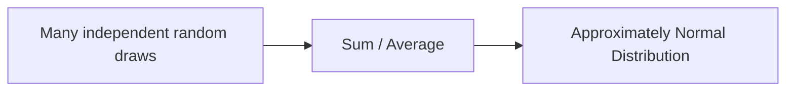

The practical implication: when you compute the average return of a strategy over 252 trading days, you can use normal-distribution confidence intervals to assess whether the average is statistically different from zero, even if daily returns are not normal. This is the foundation for the hypothesis tests in Node 11.

---

### 🔗 Free Resources
- [StatQuest — Probability (YouTube)](https://www.youtube.com/playlist?list=PLblh5JKOoLUK0FLuzwntyYI10UQFUhsY9) — free
- [Khan Academy — Probability](https://www.khanacademy.org/math/statistics-probability/probability-library) — free
- [3Blue1Brown — Bayes' Theorem (YouTube)](https://www.youtube.com/watch?v=HZGCoVF3YvM) — free, exceptional visual explanation

### 📝 Quiz
1. **Bayes' Theorem is most useful for:**
   - A) Updating a hypothesis probability given new evidence ✅
   - B) Computing simple averages of large samples
   - C) Sorting data into ordered categories quickly
   - D) Calculating the standard deviation of data

2. **The Central Limit Theorem states that:**
   - A) All individual data must be normally distributed first always
   - B) Sums of many independent variables approach a normal distribution ✅
   - C) Larger samples always have higher variance than small ones
   - D) Probability of any event is always exactly fifty-fifty forever

3. **A rare-event signal is 80% accurate, but the event has a 5% base rate. The true probability given a signal is:**
   - A) Still 80%, regardless of the base rate value
   - B) Exactly 5%, equal to the base rate itself
   - C) Lower than 80%, often much lower in practice ✅
   - D) 100%, since the signal has already fired

4. **A fair coin is flipped 3 times. What is the probability of exactly 2 heads?**
   - A) 3/8, since the outcomes are HHT, HTH, and THH ✅
   - B) 1/2, since heads appear in half of the flips
   - C) 2/3, since there are three coin flips in total
   - D) 1/8, the probability of all heads in a row

5. **For independent events A and B, P(A and B) equals:**
   - A) P(A) plus P(B), using the sum rule of two
   - B) P(A) times P(B), the product rule for independence ✅
   - C) P(A) minus P(B), the difference rule of the two
   - D) P(A) divided by P(B), the ratio of the two

6. **A signal fires on 2% of days and the market is up on 55% of days. P(up given signal)?**
   - A) 100%, the signal always predicts correctly
   - B) 55%, equal to the market's unconditional up rate
   - C) 2%, equal to the signal's firing rate itself
   - D) Unknown: the full conditional structure is needed ✅

7. **Two fair dice are rolled. What is the probability that the sum is 7?**
   - A) 1/36, since there are 36 possible outcomes
   - B) 1/12, counting three favorable outcomes only
   - C) 6/36, since six of the outcomes sum to seven ✅
   - D) 7/36, since seven is the average of the sums

8. **A stock doubles or halves daily with equal probability. After 2 days, what happens to its expected value?**
   - A) It grows to about 1.56 times the original value ✅
   - B) Stays the same, since gains and losses cancel
   - C) Falls to half, since the losses come twice
   - D) Doubles, since the gains always come last here

9. **Two models backtest the same strategy. Model A uses 5 years of data, Model B uses 6 months. Which is more trustworthy?**
   - A) Model B, since recent data matters more than old
   - B) Neither, since both use the same strategy
   - C) Model A, since longer samples reduce sampling error ✅
   - D) Model A, only if its backtest looks prettier now

10. **You test 200 strategies and find 12 with p < 0.05. What should you conclude?**
    - A) All 12 are real edges worth trading immediately
    - B) The 12 are all false positives without exception
    - C) You should report only the best three results
    - D) Expect about 10 false positives by chance at p = 0.05 ✅

---
---

## Node 10: Probability Distributions

### 🎯 Hook
Different phenomena in markets — a coin-flip-like bet, the number of trades until a stop-loss hits, the shape of daily returns — each follow different, named probability distributions. Knowing which one applies to your problem is what lets you compute exact probabilities instead of vague guesses.

### 📌 Learning Objectives
- Identify and use common discrete and continuous distributions
- Understand Student's t, Chi-Square, and F distributions at a conceptual level
- Compute and interpret skewness and kurtosis
- Explain why financial returns exhibit "fat tails"

---

### Discrete Distributions
Discrete distributions model counts or categories. They describe situations where the outcome takes one of a finite or countable set of values.

**Uniform Discrete**: Every outcome is equally likely. Rolling a fair six-sided die follows a discrete uniform distribution with P(k) = 1/6 for k = 1, 2, 3, 4, 5, 6. This is the simplest distribution and the starting point for most sampling methods.

**Bernoulli**: A single trial with two possible outcomes: success (1) or failure (0). The parameter p is the probability of success. If you ask "does this stock go up today?" the answer is Bernoulli distributed with p = P(up). This is the building block for all other binary-outcome models.

**Binomial**: The number of successes in n independent Bernoulli trials, each with the same probability p. If you have 20 independent trades, each with a 55% win rate, the number of winning trades follows a binomial distribution.

```python
import numpy as np
from scipy import stats

# Probability of exactly 12 wins out of 20 trades, if true win rate is 55%
n_trades = 20
win_rate = 0.55

# PMF: probability of exactly k wins
p_12_wins = stats.binom.pmf(k=12, n=n_trades, p=win_rate)
print(f"P(exactly 12 wins) = {p_12_wins:.4f}")

# CDF: probability of 12 or fewer wins
p_up_to_12 = stats.binom.cdf(k=12, n=n_trades, p=win_rate)
print(f"P(12 or fewer wins) = {p_up_to_12:.4f}")

# Expected number of wins
expected_wins = n_trades * win_rate
print(f"Expected wins: {expected_wins:.1f}")

# Simulate many trading periods to see the distribution
simulated_wins = np.random.binomial(n=n_trades, p=win_rate, size=10000)
print(f"Mean of simulated wins: {np.mean(simulated_wins):.2f}")
```

The binomial distribution is central to evaluating trading strategies. If a strategy wins 15 out of 20 trades, the binomial distribution tells you the probability of achieving this by random chance. This is the foundation for Node 11 on hypothesis testing.

**Geometric**: The number of trials until the first success. If a stop-loss triggers with probability 10% on any given day, the geometric distribution tells you the probability of the stop-loss triggering on day 1, day 2, day 3, and so on.

```python
from scipy import stats

# Probability that first stop-loss hit occurs on exactly the 5th day
p = 0.10
p_day_5 = stats.geom.pmf(k=5, p=p)
print(f"P(first stop-loss on day 5) = {p_day_5:.4f}")

# Expected number of days until first stop-loss
expected_days = 1 / p
print(f"Expected days until first stop-loss: {expected_days:.1f}")
```

**Poisson**: The number of events occurring in a fixed interval of time or space, when events happen independently at a constant average rate. The number of large trades arriving in an hour, or the number of times a price jumps by more than 2% in a month, can be modeled with the Poisson distribution.

```python
from scipy import stats

# If large trades arrive at an average rate of 3 per hour
lambda_per_hour = 3.0

# Probability of exactly 5 large trades in an hour
p_5_trades = stats.poisson.pmf(k=5, mu=lambda_per_hour)
print(f"P(exactly 5 large trades in an hour) = {p_5_trades:.4f}")

# Probability of 2 or fewer large trades
p_2_or_fewer = stats.poisson.cdf(k=2, mu=lambda_per_hour)
print(f"P(2 or fewer large trades) = {p_2_or_fewer:.4f}")
```

### Continuous Distributions
Continuous distributions describe outcomes that can take any value within a range. Returns, prices, and time intervals all require continuous distributions.

**Exponential**: Models the time between independent events that occur at a constant average rate. If large trades arrive at 3 per hour, the time between consecutive large trades follows an exponential distribution with mean 1/3 hours = 20 minutes.

```python
from scipy import stats

# If large trades arrive at 3 per hour
rate = 3.0

# Probability that the next trade arrives within 15 minutes (0.25 hours)
p_within_15min = stats.expon.cdf(x=0.25, scale=1/rate)
print(f"P(next trade within 15 min) = {p_within_15min:.3f}")

# Median time between trades
median_time = stats.expon.median(scale=1/rate)
print(f"Median time between trades: {median_time:.2f} hours")
```

**Normal**: The classic bell curve, defined by its mean and standard deviation. The normal distribution appears everywhere because of the Central Limit Theorem. In finance, daily log returns are often approximately normal, though with fatter tails than a true normal.

```python
from scipy import stats

# Standard normal distribution
mean = 0
std = 1

# Probability of observing a value less than -2 (a 2-standard-deviation loss)
p_loss_gt_2sd = stats.norm.cdf(-2, loc=mean, scale=std)
print(f"P(loss > 2 SD) = {p_loss_gt_2sd:.4f}")

# 95th percentile (Value at Risk approximation)
var_95 = stats.norm.ppf(0.05, loc=mean, scale=std)
print(f"5th percentile (95% VaR) = {var_95:.4f}")
```

**Lognormal**: A random variable whose logarithm is normally distributed. This is the natural distribution for prices because prices cannot go negative. If log returns are normally distributed, prices are lognormally distributed.

$$Price = P_0 \times \exp(\text{cumulative log return})$$

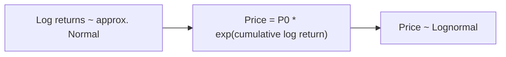

The lognormal distribution is skewed right: it has a lower bound of zero, a mode below the mean, and a long right tail. This matches the empirical behavior of stock prices, which can rise many times over but cannot fall below zero.

```python
from scipy import stats
import numpy as np

# Parameters for lognormal from normal log-returns
mu_log = 0.0005  # mean of daily log return
sigma_log = 0.012  # std of daily log return

# Expected price after 1 year
expected_price = 100 * np.exp(mu_log * 252)
print(f"Expected price after 1 year: {expected_price:.2f}")

# Probability that price exceeds 120 after 1 year
# Total log return is normal with mean mu_log*252, std sigma_log*sqrt(252)
total_mu = mu_log * 252
total_sigma = sigma_log * np.sqrt(252)
p_above_120 = 1 - stats.norm.cdf(np.log(120/100), loc=total_mu, scale=total_sigma)
print(f"P(price > 120 after 1 year) = {p_above_120:.3f}")
```

### Student's t, Chi-Square, and F Distributions
These three distributions appear constantly in statistical inference.

**Student's t**: Similar to the normal distribution but with heavier tails. The t-distribution is parameterized by degrees of freedom. With low degrees of freedom (say, df = 3), the tails are substantially fatter than normal. As degrees of freedom increase, the t-distribution approaches the normal distribution.

The t-distribution is used when estimating the mean from a small sample or when the population variance is unknown. In Node 11, you will use the t-distribution for hypothesis tests on strategy returns.

```python
from scipy import stats
import numpy as np

# Compare t-distribution with normal
x = np.linspace(-4, 4, 1000)
t_pdf = stats.t.pdf(x, df=3)
norm_pdf = stats.norm.pdf(x)

# Probability of extreme events: t vs normal
p_t_extreme = stats.t.cdf(-3, df=3) + (1 - stats.t.cdf(3, df=3))
p_norm_extreme = stats.norm.cdf(-3) + (1 - stats.norm.cdf(3))
print(f"P(|X| > 3) for t(df=3): {p_t_extreme:.4f}")
print(f"P(|X| > 3) for normal: {p_norm_extreme:.4f}")
```

The t-distribution gives a much higher probability to extreme events. This is why it is a better model for financial returns than the normal distribution.

**Chi-Square**: The distribution of the sum of squared independent standard normal variables. If you have n independent standard normal variables, the sum of their squares follows a chi-square distribution with n degrees of freedom.

The chi-square distribution is used for variance tests: testing whether the variance of a sample equals a specified value. It is also used in goodness-of-fit tests to determine whether observed data matches a theoretical distribution.

**F-distribution**: The ratio of two independent chi-square random variables, each divided by its degrees of freedom. The F-distribution is used to compare variances of two populations and, most importantly, in regression analysis to test whether a model explains a significant portion of variance.

### Skewness and Kurtosis
These two higher-order moments describe how a distribution differs from the normal distribution.

Skewness measures asymmetry. A distribution with positive skew has a long right tail: more extreme gains than losses. A distribution with negative skew has a long left tail: more extreme losses than gains. Many option-selling strategies have negative skew: they produce many small gains but occasionally suffer large losses.

Kurtosis measures tail thickness. The normal distribution has kurtosis of 3. Excess kurtosis is kurtosis minus 3, so the normal distribution has excess kurtosis of 0. Distributions with positive excess kurtosis are called leptokurtic or fat-tailed: extreme events happen more frequently than the normal distribution predicts.

```python
from scipy import stats
import numpy as np

# Generate fat-tailed returns using t-distribution
returns_normal = np.random.normal(0, 0.01, 10000)
returns_t = np.random.standard_t(df=3, size=10000) * 0.01

print(f"Normal distribution:")
print(f"  Skewness: {stats.skew(returns_normal):.3f}")
print(f"  Excess Kurtosis: {stats.kurtosis(returns_normal):.3f}")
print(f"T-distribution (df=3):")
print(f"  Skewness: {stats.skew(returns_t):.3f}")
print(f"  Excess Kurtosis: {stats.kurtosis(returns_t):.3f}")

# The t-distribution has much higher excess kurtosis
```

### Fat Tails and Financial Return Distributions
Real financial returns have fatter tails than a normal distribution predicts. Extreme moves like the 2008 crash, the 2020 COVID crash, or the 2024 yen carry trade unwind happen far more often than a normal distribution would suggest.

The practical consequences are profound. Risk models based purely on the normal distribution understate real risk. Value at Risk (VaR) calculated under the normality assumption will be too low, giving a false sense of safety. This is why professionals use alternative distributions (like Student's t) or non-parametric methods for risk estimation.

```python
from scipy import stats
import numpy as np

# Simulate one year of returns with fat tails
np.random.seed(42)
normal_returns = np.random.normal(0.0005, 0.012, 252)
t_returns = np.random.standard_t(df=3, size=252) * 0.012 + 0.0005

# Compare worst daily losses
print(f"Normal worst loss: {np.min(normal_returns):.2%}")
print(f"T-distribution worst loss: {np.min(t_returns):.2%}")

# Compare 99th percentile VaR
var_normal = stats.norm.ppf(0.01, loc=0.0005, scale=0.012)
var_t = stats.t.ppf(0.01, df=3, loc=0.0005, scale=0.012)
print(f"99% VaR (normal): {var_normal:.2%}")
print(f"99% VaR (t-distribution): {var_t:.2%}")
```

The behavior of the t-distribution highlights why the choice of distribution is not an academic detail. Using a normal distribution when returns are actually fat-tailed leads to systematically underestimated risk. Throughout this course, especially in World 10 on risk management, you will see this tension between mathematical convenience and empirical reality.

---

### 🔗 Free Resources
- [StatQuest — Probability Distributions (YouTube)](https://www.youtube.com/playlist?list=PLblh5JKOoLUK0FLuzwntyYI10UQFUhsY9) — free
- [SciPy Stats — Official Documentation](https://docs.scipy.org/doc/scipy/reference/stats.html) — free, official
- [Investopedia — Fat Tail Risk](https://www.investopedia.com/terms/f/fattailrisk.asp) — free article

### 📝 Quiz
1. **Which distribution best models the number of winning trades out of a fixed number of independent trades?**
   - A) Binomial, counting successes in fixed trials ✅
   - B) Poisson, for rare events in a large space
   - C) Exponential, for waiting times between events
   - D) Normal, for symmetric continuous outcomes

2. **"Fat tails" in financial returns mean:**
   - A) Extreme events are less frequent than normal predicts
   - B) Extreme events happen more often than the normal predicts ✅
   - C) Returns are perfectly normal in every single way here
   - D) There is no relevant meaning at all in this context

3. **Negative skewness in a strategy's return distribution typically implies:**
   - A) Frequent large gains and rare small losses
   - B) Perfectly symmetric returns around the mean value
   - C) Frequent small gains and occasional large losses ✅
   - D) Zero risk, with no variability at all here

4. **A return distribution has high kurtosis. Risk models built on normality will:**
   - A) Overstate the true tail risk of the portfolio
   - B) Be exactly right in all market conditions
   - C) Perfectly capture the behavior of the tails
   - D) Understate tail risk, giving false safety ✅

5. **X follows a Binomial(n=20, p=0.55) distribution. What is the expected number of wins?**
   - A) 20, since the number of trials is twenty
   - B) 11, since the expectation equals n times p ✅
   - C) 0.55, since that is the success probability
   - D) 10, since the distribution is symmetric here

6. **Daily returns follow N(0.0005, 0.015). Roughly where do 95% of returns fall?**
   - A) Plus or minus one standard deviation of the mean
   - B) Plus or minus three standard deviations of the mean
   - C) About two standard deviations, roughly plus or minus 3% ✅
   - D) Exactly zero, since the mean is positive here

7. **Why is Student's t with low degrees of freedom useful for modeling returns?**
   - A) It forces all returns to be perfectly normal
   - B) It captures fatter tails than the normal distribution ✅
   - C) It removes all of the skewness from the data
   - D) It guarantees positive returns on every day

8. **A casino game pays 2x on 40% of plays and 0 on 60%. Expected return per rupee wagered?**
   - A) -0.2 rupees: 0.4 times 2 plus 0.6 times 0 minus 1 ✅
   - B) +0.4 rupees: the average of the two payoffs
   - C) 0 rupees: the game is perfectly fair in total
   - D) +1 rupee: the player always wins eventually

9. **VaR computed under normality underestimates risk. Which approach helps fix this?**
   - A) Ignoring tail events entirely in the risk model
   - B) Assuming returns are always normally distributed
   - C) Using fat-tailed distributions or empirical percentiles ✅
   - D) Using a shorter sample to lower the estimate

10. **A strategy's daily P&L is right-skewed. What is the best interpretation?**
    - A) It produces frequent large losses and rare big gains
    - B) Its median return exceeds its mean return always
    - C) The distribution is perfectly symmetric about zero
    - D) It produces frequent small losses and rare big gains ✅

---
---

## Node 11: Statistical Inference

### 🎯 Hook
This is the node that separates "I backtested a strategy and it made money" from "I have statistically defensible evidence this edge is real." Every claim of a genuine market edge should survive this scrutiny before it earns your trust — or your capital.

### 📌 Learning Objectives
- Understand sampling and sampling distributions
- Perform point estimation
- Construct and interpret confidence intervals
- Set up and run hypothesis tests
- Interpret p-values correctly
- Understand Type I/II errors and statistical power

---

### Sampling and Sampling Distributions
Any statistic computed from a sample is itself a random variable. If you compute the average daily return of a strategy using one year of data, and then compute it again using a different year, you will get a different number. The sampling distribution describes how that statistic varies across hypothetical repeated samples drawn from the same population.

The standard error measures the variability of a sample statistic. For the sample mean, the standard error is the population standard deviation divided by the square root of the sample size. This is why larger samples give more precise estimates: the standard error shrinks as n increases.

```python
import numpy as np

# Demonstrate the sampling distribution of the mean
population = np.random.normal(0.0005, 0.012, 100000)

sample_means = []
for _ in range(10000):
    sample = np.random.choice(population, size=30)
    sample_means.append(np.mean(sample))

sample_means = np.array(sample_means)
print(f"Mean of sample means: {np.mean(sample_means):.6f}")
print(f"Standard error: {np.std(sample_means):.6f}")
print(f"Theoretical SE: {0.012 / np.sqrt(30):.6f}")
```

### Point Estimation
Point estimation gives a single best-guess number for an unknown population parameter. The sample mean is a point estimate of the population mean. The sample variance is a point estimate of the population variance.

A good estimator is unbiased, meaning its expected value equals the true parameter value. The sample mean is unbiased: E[sample mean] = population mean. The sample variance with ddof=1 (Bessel's correction) is also unbiased: E[sample variance] = population variance.

```python
import numpy as np

# Demonstrate bias of variance estimators
population = np.random.normal(0.0005, 0.012, 100000)

biases_biased = []
biases_unbiased = []

for _ in range(10000):
    sample = np.random.choice(population, size=20)
    biased_var = np.var(sample, ddof=0)  # divides by n
    unbiased_var = np.var(sample, ddof=1)  # divides by n-1
    biases_biased.append(biased_var - np.var(population))
    biases_unbiased.append(unbiased_var - np.var(population))

print(f"Average bias (ddof=0): {np.mean(biases_biased):.6f}")
print(f"Average bias (ddof=1): {np.mean(biases_unbiased):.6f}")
```

### Confidence Intervals
A confidence interval gives a range of plausible values for an unknown parameter. A 95% confidence interval for the mean daily return does not mean there is a 95% probability that the true mean lies in this range. It means that if you repeated the sampling process many times, 95% of the computed intervals would contain the true value. This distinction is subtle but important.

```python
import numpy as np
from scipy import stats

# Generate a sample of daily returns
np.random.seed(42)
returns = np.random.normal(0.0005, 0.012, 252)

# Compute 95% confidence interval using t-distribution
mean_return = np.mean(returns)
sem = stats.sem(returns)  # standard error of the mean
ci = stats.t.interval(confidence=0.95, df=len(returns)-1, loc=mean_return, scale=sem)

print(f"Sample mean: {mean_return:.6f}")
print(f"95% CI: [{ci[0]:.6f}, {ci[1]:.6f}]")

# Coverage demonstration: what fraction of CIs actually contain the true mean?
true_mean = 0.0005
coverage_count = 0
n_trials = 1000

for _ in range(n_trials):
    sample = np.random.normal(true_mean, 0.012, 252)
    ci = stats.t.interval(0.95, df=len(sample)-1, loc=np.mean(sample), scale=stats.sem(sample))
    if ci[0] <= true_mean <= ci[1]:
        coverage_count += 1

print(f"Coverage rate: {coverage_count / n_trials:.2%} (should be ~95%)")
```

The width of a confidence interval depends on three things: the confidence level (higher confidence means wider intervals), the sample size (larger samples mean narrower intervals), and the variability of the data (more variable data means wider intervals).

### Hypothesis Testing
Hypothesis testing is a formal framework for deciding whether an observed effect is real or due to random chance. You start with a null hypothesis, which typically represents "no effect." In quant finance, H0 is often "this strategy's average return is zero" or "this factor has no predictive power."

The alternative hypothesis represents what you are trying to prove. A one-sided test asks whether the effect is positive (or negative). A two-sided test asks whether the effect is different from zero in either direction.

```python
from scipy import stats
import numpy as np

# Test whether a strategy's returns are significantly different from zero
np.random.seed(42)
strategy_returns = np.random.normal(0.0008, 0.015, 252)

t_stat, p_value = stats.ttest_1samp(strategy_returns, popmean=0)
print(f"T-statistic: {t_stat:.3f}")
print(f"P-value: {p_value:.4f}")

if p_value < 0.05:
    print("Reject H0: evidence of non-zero returns")
else:
    print("Fail to reject H0: insufficient evidence")
```

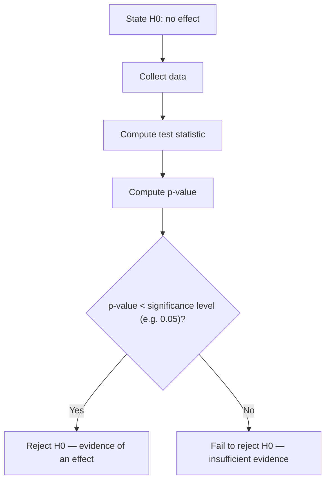

### p-values and Statistical Significance
The p-value is the probability of observing data at least as extreme as what you saw, assuming H0 is true. A p-value of 0.03 means: if the true mean return were zero, there would be a 3% chance of seeing a sample mean this far from zero.

The p-value is not the probability that H0 is true. This distinction is the single most common misinterpretation in applied research. A p-value of 0.03 does not mean there is a 97% chance that the strategy works. It means the data would be somewhat surprising if there were no real effect.

```python
import numpy as np
from scipy import stats

# Visualize how p-values behave when H0 is true
np.random.seed(42)
p_values = []
for _ in range(10000):
    sample = np.random.normal(0, 0.012, 100)  # true mean = 0 (H0 is true)
    _, p = stats.ttest_1samp(sample, popmean=0)
    p_values.append(p)

# When H0 is true, p-values should be uniformly distributed
print(f"Fraction of p-values < 0.05: {np.mean(np.array(p_values) < 0.05):.3f} (should be ~0.05)")
```

### Type I and Type II Errors, Statistical Power

A Type I error (false positive) is rejecting H0 when H0 is true. By convention, the significance level alpha controls the Type I error rate. When you set alpha = 0.05, you accept a 5% chance of false positives.

A Type II error (false negative) is failing to reject H0 when H0 is false. The probability of a Type II error depends on: the true effect size, the sample size, the variability of the data, and the chosen significance level.

Statistical power is the probability of correctly detecting a real effect. It equals 1 minus P(Type II error). In quant research, low power means many real strategies will appear insignificant in backtests simply because the backtest is too short or the strategy is too noisy.

| Decision | H0 True | H0 False |
|---|---|---|
| Reject H0 | Type I Error (false positive) | Correct detection |
| Fail to Reject | Correct non-detection | Type II Error (false negative) |

```python
import numpy as np
from scipy import stats

# Demonstrate power as function of effect size and sample size
effect_sizes = [0.0, 0.001, 0.002, 0.005]
n_days = [63, 126, 252, 504]

for effect in effect_sizes:
    print(f"\nEffect size (daily): {effect:.4f} ({effect * 252:.2%} annualized)")
    for n in n_days:
        power = 0
        for _ in range(1000):
            sample = np.random.normal(effect, 0.015, n)
            _, p = stats.ttest_1samp(sample, popmean=0)
            if p < 0.05:
                power += 1
        print(f"  n={n:3d}: power = {power / 1000:.2%}")
```

Notice that even with 504 days of data, you need an effect size of at least 0.002 daily (about 50% annualized) to achieve 80% power. This demonstrates why detecting small but real edges requires very long backtest periods.

### Multiple Testing and Data Snooping
If you test 100 independent strategies at alpha = 0.05, you expect about 5 to show significance by random chance even if none have a real edge. This is the multiple testing problem.

In quant research, the problem is worse because strategies are not independent: they are often variations of the same idea tested on the same data. This inflates the effective false positive rate far beyond the nominal alpha level. Node 33 covers corrections like the Bonferroni adjustment and false discovery rate control, but the simplest safeguard is to treat any single backtest result with skepticism until it is validated on out-of-sample data. A strategy that works on one dataset but fails on another is not a strategy; it is a statistical artifact. The habit of validating every result on fresh, unseen data will protect you from the most expensive mistakes in quantitative finance. Always hold out some data before you start any analysis, and touch it only when you have a finalized model. This out-of-sample discipline is the single most effective defense against false discovery in quantitative research. Without it, you cannot distinguish genuine insight from statistical noise. This principle applies to every result you will produce in this course and beyond. A single test on a single dataset proves nothing; rigorous validation across multiple datasets and time periods builds conviction. This is why professional quant teams invest heavily in their research infrastructure.

---

### 🔗 Free Resources
- [StatQuest — Hypothesis Testing and p-values (YouTube)](https://www.youtube.com/watch?v=vemZtEM63GY) — free
- [Khan Academy — Significance Tests](https://www.khanacademy.org/math/statistics-probability/significance-tests-confidence-intervals-two-samples) — free
- [Towards Data Science — p-values Explained](https://towardsdatascience.com/) — free articles (search "p-value")

### 📝 Quiz
1. **A p-value of 0.03 means:**
   - A) If H0 were true, data this extreme has a 3% chance ✅
   - B) There is a 3% chance that the null is true
   - C) The strategy then has a 97% chance of working
   - D) Nothing meaningful can be said about the data

2. **A Type I error is:**
   - A) Failing to detect a real effect in the data
   - B) A computational bug in the research code
   - C) Rejecting a true null hypothesis, a false positive ✅
   - D) Always worse than a Type II error in practice

3. **Running 100 backtests and only reporting the 5 that show "significant" results at p<0.05 is problematic because:**
   - A) It is fine, since significance is significance
   - B) By chance alone, about 5 in 100 tests appear significant ✅
   - C) It requires too much computing power to do properly today
   - D) P-values do not apply to backtests in any way at all

4. **A 95% CI for mean daily return is [-0.1%, +0.4%]. What does the interval mean?**
   - A) The sample mean is outside the interval for sure
   - B) 95% of the daily returns fall inside this range
   - C) The procedure captures the true mean in 95% of samples ✅
   - D) The true mean is 0% with 95% confidence exactly

5. **Strategy A has p=0.04 with n=63; Strategy B has p=0.04 with n=504. Which is stronger evidence?**
   - A) Strategy A, since the p-value is identical for both
   - B) Both are equally strong, no matter what happens
   - C) Strategy A, because shorter samples are sharper
   - D) Strategy B, since more data gives more evidence at same p ✅

6. **A t-test treats the sample mean of returns as approximately normal. Why is this justified?**
   - A) The Central Limit Theorem justifies it for large samples ✅
   - B) The t-test never makes any assumptions at all
   - C) Because returns are always exactly normal here
   - D) Because outliers are impossible in the markets

7. **The power of a statistical test is the probability of:**
   - A) Rejecting the null when it is actually true
   - B) Detecting a real effect, rejecting a false null ✅
   - C) Making a Type I error during the test itself
   - D) Observing the data under the null hypothesis

8. **A backtest runs on 252 days with zero real edge. Which p-value is most likely?**
   - A) p = 0.001, from the best tested parameter set
   - B) p = 0.049, just below the usual threshold
   - C) p = 0.50, exactly the middle of the range here
   - D) Any p-value, uniform across the range from 0 to 1 ✅

9. **How can you increase power without changing the effect size?**
   - A) Decrease the sample size of the backtest
   - B) Increase the significance level threshold value
   - C) Increase the sample size used in the backtest ✅
   - D) Remove all of the outliers from the data

10. **What is the most defensible response to testing many strategies at once?**
    - A) Report only the strategy with the best Sharpe
    - B) Test fewer parameters to save time overall
    - C) Raise the sample size until results look good
    - D) Adjust significance thresholds for multiple testing ✅

---
---

## Node 12: Regression Analysis

### 🎯 Hook
Regression is the workhorse that turns "I think X affects Y" into a precise, testable, quantified relationship — the tool behind CAPM's beta, factor models, and countless signal-validation techniques you'll use for the rest of this course.

### 📌 Learning Objectives
- Fit and interpret linear and multiple regression models
- Understand the key assumptions behind OLS regression
- Perform residual analysis
- Use dummy variables and interaction terms
- Interpret R² and overall model fit
- Read and communicate regression output correctly

---

### Linear and Multiple Regression
Regression analysis is the most widely used statistical tool in quantitative finance. It answers the question: how does a change in one variable relate to a change in another?

Simple linear regression models the relationship between one dependent variable and one independent variable: y = beta_0 + beta_1 * x + epsilon. The intercept beta_0 is the expected value of y when x is zero. The slope beta_1 measures how much y changes for a one-unit change in x. Epsilon represents the random error: the part of y not explained by x.

Multiple regression extends this to several predictors: y = beta_0 + beta_1*x_1 + beta_2*x_2 + ... + epsilon. Each coefficient measures the effect of that predictor holding all others constant.

```python
import numpy as np
import statsmodels.api as sm

np.random.seed(1)
market_return = np.random.normal(0.0005, 0.01, 252)
stock_return = 0.0002 + 1.2 * market_return + np.random.normal(0, 0.005, 252)

X = sm.add_constant(market_return)  # adds the intercept term
model = sm.OLS(stock_return, X).fit()
print(model.summary())
```

The output shows the coefficient for market_return is approximately 1.2, which matches the data-generating process. The intercept is approximately 0.0002, matching the true alpha. The p-values for both are near zero, confirming statistical significance.

This is exactly how beta is estimated in practice. Regressing a stock's returns on market returns gives you the stock's beta as the slope coefficient. This is the CAPM beta used throughout the industry.

Ordinary Least Squares (OLS) is the standard estimation method. It finds the coefficients that minimize the sum of squared residuals:

$$min \sum_{i=1}^{n} (y_i - \hat{y}_i)^2$$

```python
# Multiple regression: add a second factor
import statsmodels.api as sm

np.random.seed(1)
n = 252
market = np.random.normal(0.0005, 0.01, n)
momentum = np.random.normal(0.0003, 0.008, n)
returns = 0.0001 + 1.1 * market + 0.3 * momentum + np.random.normal(0, 0.004, n)

X_multi = sm.add_constant(np.column_stack([market, momentum]))
model_multi = sm.OLS(returns, X_multi).fit()
print(model_multi.summary())
```

This multiple regression models the stock's return using both the market factor and a momentum factor. The coefficient on momentum tells you whether momentum has explanatory power beyond the market.

### Regression Assumptions
OLS regression relies on four key assumptions. When any of these are violated, the coefficient estimates, standard errors, or p-values can be misleading.

Linearity: the relationship between each X and Y must be approximately linear. If the true relationship is curved, the linear model will miss it.

Independence: the residuals should not be correlated with each other. In time series data, this is often violated because today's error is correlated with yesterday's error. This is autocorrelation, and it makes standard errors too small.

Homoskedasticity: the variance of the residuals should be constant across all levels of X. In financial data, volatility changes over time, so heteroskedasticity is the norm, not the exception.

Normality of residuals: the residuals should be approximately normally distributed for valid hypothesis tests on coefficients. With large samples, this assumption is less critical due to the Central Limit Theorem.

### Residual Analysis
After fitting a regression, always examine the residuals. The residuals are the differences between the actual y values and the predicted y values. If the model is correct, residuals should look like random noise centered at zero.

```python
residuals = model.resid

plt.figure(figsize=(10, 4))
plt.subplot(1, 2, 1)
plt.scatter(model.fittedvalues, residuals, alpha=0.5)
plt.axhline(0, color='red', linestyle='--')
plt.xlabel("Fitted Values")
plt.ylabel("Residuals")
plt.title("Residuals vs Fitted")

plt.subplot(1, 2, 2)
from scipy import stats
stats.probplot(residuals, dist="norm", plot=plt)
plt.title("Q-Q Plot")
plt.tight_layout()
```

A residual plot with visible patterns signals violated assumptions. A funnel shape indicates heteroskedasticity. A curve indicates nonlinearity. A Q-Q plot that deviates from the diagonal line indicates non-normal residuals.

### Dummy Variables and Interaction Terms
Dummy variables encode categorical information as numbers. A dummy variable for Monday takes value 1 on Mondays and 0 on other days. This lets you test for day-of-week effects in returns.

```python
import statsmodels.api as sm
import numpy as np

n = 252
returns = np.random.normal(0.0005, 0.01, n)
is_monday = np.random.binomial(1, 0.2, n)  # approx 20% are Mondays

X_dummy = sm.add_constant(np.column_stack([returns, is_monday]))
```

Interaction terms let you test whether the effect of one variable depends on the level of another. For example, does beta change on high-volatility days? You create the interaction by multiplying the two variables together.

```python
# Interaction term: market_return * volatility_regime
volatility_regime = np.random.binomial(1, 0.3, n)  # 30% high-vol days
interaction = market_return * volatility_regime
X_interaction = sm.add_constant(np.column_stack([market_return, volatility_regime, interaction]))
model_interaction = sm.OLS(stock_return, X_interaction).fit()
```

If the interaction coefficient is significant, the effect of market return on stock return depends on the volatility regime.

### Goodness of Fit (R-squared)
R-squared measures the proportion of variance in Y that is explained by the model:

$$R^2 = 1 - \frac{SS_{res}}{SS_{tot}}$$

An R-squared of 0.60 means the model explains 60% of the variance in Y. In typical stock-level return regressions, R-squared values are low (0.10 to 0.30) because daily returns are noisy. Factor portfolios and diversified strategies generally have higher R-squared values.

A high R-squared in a backtested financial model can be a red flag for overfitting. If your model has 20 predictors chosen specifically to fit the historical data, the R-squared will be high but the model will perform poorly out of sample. Parsimony is a virtue in quant research.

### Adjusted R-squared
Adding more predictors always increases R-squared, even if the new predictors are pure noise. Adjusted R-squared penalizes model complexity:

$$\bar{R}^2 = 1 - (1-R^2)\frac{n-1}{n-k-1}$$

where k is the number of predictors. Use adjusted R-squared when comparing models with different numbers of predictors.

### Model Interpretation
Always report the coefficient sign and magnitude, the p-value, the confidence interval, and the adjusted R-squared. A positive coefficient means the variable has a positive relationship with Y. The magnitude tells you the economic significance: a coefficient that is statistically significant but economically tiny may not be worth trading on.

For example, a factor model might find that a certain technical indicator has a p-value of 0.001 but a coefficient of 0.00001. This is statistically significant but economically meaningless: you would need billions of dollars to generate a noticeable return from this signal. Both statistical and economic significance matter in quant research. The discipline of checking both is what separates academic exercise from actionable trading insight.

### Common Regression Pitfalls
The most common pitfall in financial regression is ignoring autocorrelation in residuals. If you regress stock returns on a predictor using daily data, the residuals are almost always autocorrelated because daily returns cluster. This autocorrelation makes standard errors too small and p-values too significant.

The solution is to use Newey-West standard errors, which are robust to both autocorrelation and heteroskedasticity. In statsmodels, you specify cov_type when fitting the model.

```python
model = sm.OLS(returns, X).fit(cov_type="HAC", cov_kwds={"maxlags": 5})
print(model.summary())
```

Another common pitfall is including highly correlated predictors, a problem called multicollinearity. If two predictors are correlated with each other, their individual coefficients become unstable and uninterpretable. The solution is to remove one of the correlated predictors or use regularization.

A third pitfall is using price levels instead of returns in a regression. Price levels are non-stationary, meaning their statistical properties change over time. Regressing one price level on another often produces a high R-squared even when there is no causal relationship. This is called a spurious regression. Always use returns or differenced data.

### Logistic Regression for Binary Outcomes
Sometimes your dependent variable is binary, such as whether the market goes up tomorrow or whether a stock is about to break out. Linear regression is not appropriate for binary outcomes because it can produce predictions below 0 or above 1.

Logistic regression models the probability of the outcome using the logistic function, which maps any real-valued input to a value between 0 and 1.

```python
from scipy.special import expit  # logistic function

# Simulate: predict direction based on a signal
np.random.seed(42)
signal = np.random.normal(0, 1, 500)
prob_up = expit(-0.5 + 0.8 * signal)  # logistic function
direction = np.random.binomial(1, prob_up)

# Fit logistic regression
import statsmodels.api as sm
X = sm.add_constant(signal)
logit_model = sm.Logit(direction, X).fit()
print(logit_model.summary())
```

The coefficients in logistic regression represent log-odds ratios. A positive coefficient means the predictor increases the probability of the outcome. The interpretation is less intuitive than linear regression, but logistic regression is essential for modeling binary market events.

### Regularization: Ridge, Lasso, and ElasticNet
When you have many predictors, ordinary regression tends to overfit. Regularization adds a penalty for large coefficients, which reduces overfitting and improves out-of-sample performance.

Ridge regression adds a penalty proportional to the square of the coefficients, which shrinks coefficients toward zero but never to exactly zero. Lasso regression adds a penalty proportional to the absolute value of coefficients, which can shrink coefficients to exactly zero, performing automatic feature selection.

```python
from sklearn.linear_model import Ridge, Lasso
import numpy as np

# Simulate data with many predictors, few of which are relevant
np.random.seed(42)
n, p = 200, 50
X = np.random.normal(0, 1, (n, p))
beta = np.zeros(p)
beta[:5] = [0.5, -0.3, 0.8, -0.2, 0.6]
y = X @ beta + np.random.normal(0, 0.5, n)

# Lasso: forces many coefficients to exactly zero
lasso = Lasso(alpha=0.1)
lasso.fit(X, y)
print(f"Lasso: {np.sum(lasso.coef_ != 0)} non-zero coefficients out of {p}")

# Ridge: shrinks coefficients but keeps all
ridge = Ridge(alpha=1.0)
ridge.fit(X, y)
print(f"Ridge: {np.sum(np.abs(ridge.coef_) > 0.01)} coefficients > 0.01")
```

Regularization is particularly useful in factor research where you test dozens or hundreds of potential predictors. Lasso automatically selects the most relevant ones, while Ridge handles multicollinearity gracefully.

---

### 🔗 Free Resources
- [StatQuest — Linear Regression (YouTube)](https://www.youtube.com/watch?v=nk2CQITm_eo) — free
- [statsmodels — Official Documentation](https://www.statsmodels.org/stable/regression.html) — free, official
- [Khan Academy — Regression](https://www.khanacademy.org/math/statistics-probability/describing-relationships-quantitative-data) — free

### 📝 Quiz
1. **In a market-model regression, the slope coefficient on market return represents:**
   - A) Beta, the stock's sensitivity to the market ✅
   - B) Alpha, the excess return of the stock
   - C) R-squared, the fit of the regression model
   - D) The p-value of the regression coefficient

2. **A residual plot showing a clear funnel (widening spread) suggests a violation of:**
   - A) Linearity only, nothing else at all here
   - B) Homoskedasticity, meaning non-constant variance ✅
   - C) Nothing, this pattern is expected always here
   - D) Independence only, not any other assumption

3. **A very high R² in a financial backtest model should be treated as:**
   - A) Unambiguously good news for the strategy
   - B) Proof the strategy will work live trading
   - C) Irrelevant to the model quality in any way at all
   - D) A potential overfitting red flag to investigate ✅

4. **You regress returns on two highly correlated predictors. What is the main concern?**
   - A) Always gives the exact same coefficients
   - B) Never has any multicollinearity issues at all
   - C) May yield unstable, inflated coefficient estimates ✅
   - D) Is impossible to estimate in any software

5. **A stock has beta 1.2 and the market returns +5%. What is the expected stock return?**
   - A) +6%, since beta times the market return ✅
   - B) +5%, since beta does not change anything
   - C) +1.2%, since beta is the expected return
   - D) +4%, since five percent divided by 1.2

6. **A regression has R² = 0.64. What does this mean?**
   - A) 64% of the residuals are exactly zero here
   - B) The model explains 64% of the intercept value
   - C) 36% of the variance is explained by the model
   - D) 64% of the variance is explained by the model ✅

7. **Residuals that are correlated over time suggest:**
   - A) The model is perfectly well specified always
   - B) Autocorrelation, which can bias standard errors ✅
   - C) That the R-squared must be exactly zero here
   - D) Nothing is wrong with the model in any way

8. **A model uses 200 predictors to fit 200 data points perfectly. What is the true situation?**
   - A) It generalizes perfectly to new data always
   - B) It has the lowest possible bias in testing
   - C) It likely memorized the data, failing out of sample ✅
   - D) It proves the predictors are all real signals

9. **Which check best detects overfitting before trusting a strategy?**
   - A) Testing the model out of sample on unseen data ✅
   - B) Increasing the number of predictors used
   - C) Maximizing R-squared on the training data
   - D) Removing the worst months from the sample

10. **A regression has one very large residual. What is the best response?**
    - A) Delete the day from the sample silently
    - B) Ignore it, residuals do not matter at all
    - C) Set the residual to zero to improve the fit
    - D) Investigate the cause: data error or real event ✅

---
---

# WORLD 3 — Linear Algebra & Calculus for Finance

## Node 13: Linear Algebra

### 🎯 Hook
Portfolios are vectors, risk is a matrix, and diversification is literally geometry. Linear algebra is the compact language that makes multi-asset portfolio math tractable instead of an unmanageable pile of individual formulas.

### 📌 Learning Objectives
- Work with scalars, vectors, and matrices
- Perform matrix operations and multiplication
- Understand the identity matrix, matrix inverse, and determinants
- Compute and interpret eigenvalues and eigenvectors
- Build and interpret covariance and correlation matrices

---

### Scalars, Vectors, and Matrices
Linear algebra provides the language for working with multiple assets simultaneously. A scalar is a single number: the return of a single stock on a single day. A vector is an ordered list of numbers: the portfolio weights across N stocks, or the daily returns of a single stock over T days. A matrix is a rectangular grid of numbers: the daily returns for N stocks over T days.

```python
import numpy as np

# Scalars
single_return = 0.05

# Vectors
weights = np.array([0.4, 0.35, 0.25])  # portfolio weights across 3 stocks
daily_returns_one_stock = np.random.normal(0.0005, 0.01, 252)  # vector of length 252

# Matrices
returns_matrix = np.random.normal(0, 0.01, (252, 3))  # 252 days x 3 stocks
print(f"Shape: {returns_matrix.shape}")  # (252, 3)

# Accessing elements
print(f"Day 0, Stock 2: {returns_matrix[0, 2]:.4f}")
print(f"First 5 days, all stocks:\n{returns_matrix[:5, :]}")
```

### Vector Operations
Vectors can be added, subtracted, and scaled. These operations correspond to meaningful financial calculations.

```python
# Portfolio return on a single day: dot product of weights and returns
single_day_returns = np.array([0.01, -0.005, 0.02])
portfolio_return = weights @ single_day_returns
print(f"Portfolio return: {portfolio_return:.4f}")

# Vector addition: combining return streams
stock_a = np.random.normal(0.0005, 0.01, 252)
stock_b = np.random.normal(0.0003, 0.008, 252)
equal_weight_portfolio = 0.5 * stock_a + 0.5 * stock_b
```

The dot product is the single most important vector operation in finance. It multiplies corresponding elements and sums the results. When weights are the first vector and returns are the second, the dot product gives the portfolio return.

### Matrix Operations and Multiplication
Matrix multiplication extends the dot product to multiple dimensions. The @ operator in Python performs matrix multiplication.

```python
# Matrix-vector multiplication: portfolio returns for all 252 days
portfolio_daily_returns = returns_matrix @ weights  # shape (252,) = (252x3) @ (3,)
print(f"First 5 portfolio returns:\n{portfolio_daily_returns[:5]}")

# Matrix-matrix multiplication: (252x3) @ (3x2) = (252x2)
more_weights = np.array([[0.4, 0.2], [0.35, 0.3], [0.25, 0.5]])
two_portfolios = returns_matrix @ more_weights
print(f"Two portfolios, first 5 days:\n{two_portfolios[:5]}")
```

The @ operator computes, in one line, what would otherwise require nested loops over every stock and every day. This is the vectorization principle from Node 7 applied to portfolios.

### Matrix Transpose, Norms
The transpose of a matrix swaps its rows and columns. If A has shape (3, 5), A.T has shape (5, 3). Transpose is used constantly in portfolio math because formulas often require aligning dimensions differently.

```python
A = np.array([[1, 2], [3, 4], [5, 6]])
print(f"A shape: {A.shape}, A.T shape: {A.T.shape}")

# Vector norms: length of a vector
v = np.array([3, 4])
print(f"L2 norm: {np.linalg.norm(v)}")  # 5.0 (sqrt(3^2 + 4^2))
```

### Identity Matrix, Inverse, Determinants
The identity matrix is the matrix equivalent of the number 1. When you multiply any matrix by the identity, you get the original matrix back.

The inverse of a matrix is the matrix equivalent of 1/x. If you multiply a matrix by its inverse, you get the identity. The inverse is used to solve systems of linear equations. In portfolio optimization, the inverse of the covariance matrix is a key component of the optimal weight calculation.

The determinant is a scalar that summarizes certain properties of a matrix. A determinant of zero means the matrix is singular, which means it cannot be inverted. In finance, a singular covariance matrix typically indicates that some assets are perfectly correlated or linearly dependent.

```python
A = np.array([[2, 1], [1, 3]])
print("Matrix A:")
print(A)
print("Inverse of A:")
print(np.linalg.inv(A))
print("A @ inv(A) (should be identity):")
print(A @ np.linalg.inv(A))
print(f"Determinant of A: {np.linalg.det(A):.4f}")

# A singular matrix (determinant = 0)
singular = np.array([[1, 2], [2, 4]])
print(f"Determinant of singular matrix: {np.linalg.det(singular):.4f}")
```

### Systems of Linear Equations
Many finance problems reduce to solving Ax = b for x. In portfolio optimization, this system determines the optimal weights given expected returns and risk constraints.

```python
# Solve 2 equations with 2 unknowns
# 2x + y = 5
# x + 3y = 10
A = np.array([[2, 1], [1, 3]])
b = np.array([5, 10])
x = np.linalg.solve(A, b)
print(f"Solution: x = {x[0]:.2f}, y = {x[1]:.2f}")
```

### Eigenvalues and Eigenvectors
For a square matrix A, an eigenvector v satisfies Av = lambda * v. Multiplying by A only stretches v by the scalar lambda, without changing its direction.

Eigenvalues and eigenvectors of the covariance matrix reveal the independent risk factors driving a portfolio. The eigenvectors are the principal components: orthogonal directions of risk. The eigenvalues tell you how much variance each direction explains.

```python
cov = np.cov(returns_matrix, rowvar=False)
eigenvalues, eigenvectors = np.linalg.eig(cov)

print("Eigenvalues:", eigenvalues)
print("Eigenvectors (columns):")
print(eigenvectors)

# Proportion of variance explained by each component
total_var = np.sum(eigenvalues)
explained_var = eigenvalues / total_var
for i, ev in enumerate(explained_var):
    print(f"Component {i+1}: {ev:.2%} of variance")
```

If the first eigenvalue is much larger than the others, most of the risk is driven by a single common factor. This is typical for portfolios within the same sector and is the mathematical basis of PCA-based risk factor models used by real quant funds.

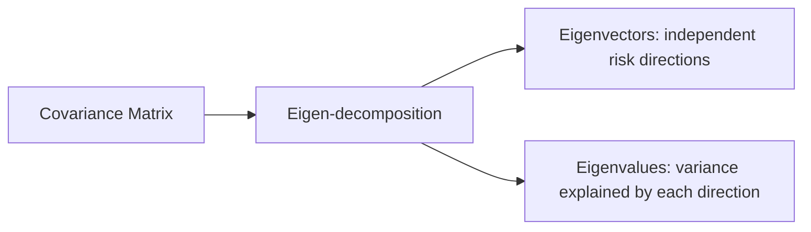

### Covariance Matrix and Correlation Matrix
The covariance matrix is the single most important object in portfolio theory. It captures not just each asset's individual volatility (on the diagonal) but how every pair of assets moves together (off-diagonal). The off-diagonal terms are the mathematical source of diversification benefit.

```python
cov_matrix = np.cov(returns_matrix, rowvar=False)
print("Covariance matrix:")
print(cov_matrix)

# Convert to correlation matrix
corr_matrix = np.corrcoef(returns_matrix, rowvar=False)
print(f"\nCorrelation matrix:")
print(corr_matrix)

# Portfolio variance using matrix multiplication
portfolio_variance = weights @ cov_matrix @ weights
portfolio_vol = np.sqrt(portfolio_variance)
print(f"\nPortfolio variance: {portfolio_variance:.6f}")
print(f"Portfolio volatility: {portfolio_vol:.4%}")
```

The expression w^T * Sigma * w (implemented as weights @ cov @ weights) is the formula for portfolio variance. This compact notation replaces what would be a double summation over all pairs of assets. This is why linear algebra is indispensable for quant work: it turns complex multi-asset formulas into one-line expressions.

### Practical Application: PCA for Risk Decomposition
Principal Component Analysis uses eigendecomposition of the covariance matrix to identify the dominant sources of risk in a portfolio. The first principal component is the direction of maximum variance, which typically corresponds to the overall market factor.

```python
import numpy as np

# Simulate returns influenced by a common market factor
np.random.seed(42)
n_days, n_stocks = 252, 10
market = np.random.normal(0.0005, 0.01, n_days)
specific = np.random.normal(0, 0.005, (n_days, n_stocks))
returns = 0.8 * market.reshape(-1, 1) + 0.2 * specific

cov = np.cov(returns, rowvar=False)
eigenvalues, eigenvectors = np.linalg.eigh(cov)

# Sort by eigenvalue (descending)
idx = np.argsort(eigenvalues)[::-1]
eigenvalues = eigenvalues[idx]
eigenvectors = eigenvectors[:, idx]

explained_var = eigenvalues / np.sum(eigenvalues)
print(f"First component explains: {explained_var[0]:.2%} of variance")
print(f"First two components explain: {np.sum(explained_var[:2]):.2%}")
```

PCA is used for dimensionality reduction in factor models and for identifying the few independent sources of risk that drive a large portfolio.

### Practical Application: Portfolio Variance in Matrix Form
The formula for portfolio variance in matrix notation is one of the most elegant results in quantitative finance. It expresses the variance of a portfolio as a single matrix expression involving the weight vector and the covariance matrix:

$$\sigma_p^2 = w^T \Sigma w$$

Expanding this for N assets gives:

$$\sigma_p^2 = \sum_{i=1}^{N} \sum_{j=1}^{N} w_i w_j \sigma_{ij}$$

This double summation is what the matrix multiplication computes in a single operation. The diagonal terms (i=j) capture each asset's individual variance contribution. The off-diagonal terms (i does not equal j) capture the covariance contributions. If all correlations are zero, the off-diagonal terms vanish and portfolio variance is just the weighted sum of individual variances.

```python
import numpy as np

# Demonstrate diversification benefit
weights = np.array([0.5, 0.5])

# Scenario 1: perfect correlation
cov_perfect = np.array([[0.04, 0.04], [0.04, 0.04]])
var_perfect = weights @ cov_perfect @ weights
print(f"Perfect correlation: portfolio vol = {np.sqrt(var_perfect):.2%}")

# Scenario 2: zero correlation
cov_zero = np.array([[0.04, 0.00], [0.00, 0.04]])
var_zero = weights @ cov_zero @ weights
print(f"Zero correlation: portfolio vol = {np.sqrt(var_zero):.2%}")

# Scenario 3: negative correlation
cov_neg = np.array([[0.04, -0.02], [-0.02, 0.04]])
var_neg = weights @ cov_neg @ weights
print(f"Negative correlation: portfolio vol = {np.sqrt(var_neg):.2%}")
```

Negative correlation produces the lowest portfolio volatility. This is the mathematical proof of the diversification principle that drives every portfolio construction decision. Understanding this matrix formulation will serve you well when you reach mean-variance optimization in Node 35. The ability to express portfolio concepts in matrix notation is one of the key skills that distinguishes professional quants from hobbyists. Every formula in portfolio theory becomes simpler and more intuitive when expressed in matrix form. The covariance matrix, in particular, is the single most information-dense object in quantitative finance.

---

### 🔗 Free Resources
- [3Blue1Brown — Essence of Linear Algebra (YouTube)](https://www.youtube.com/playlist?list=PLZHQObOWTQDPD3MizzM2xVFitgF8hE_ab) — free, the best visual intuition series available
- [Khan Academy — Linear Algebra](https://www.khanacademy.org/math/linear-algebra) — free
- [NumPy — linalg documentation](https://numpy.org/doc/stable/reference/routines.linalg.html) — free, official

### 📝 Quiz
1. **A determinant of zero for a covariance matrix suggests:**
   - A) Perfectly collinear, redundant assets in the matrix ✅
   - B) Perfect diversification of the whole portfolio
   - C) All of the assets are entirely uncorrelated
   - D) Nothing meaningful about the data at all here

2. **In `Av = λv`, λ is called the:**
   - A) Determinant of the square matrix A here
   - B) Eigenvalue of the matrix A, the scaling factor ✅
   - C) Inverse of the matrix A, the reciprocal
   - D) Identity element of the matrix A as usual

3. **What does the off-diagonal of a covariance matrix represent?**
   - A) Each asset's own volatility value alone
   - B) The mean return of each asset in the matrix
   - C) How pairs of assets move together jointly ✅
   - D) Nothing, since it is always zero here

4. **Why is the inverse of the covariance matrix used in portfolio optimization?**
   - A) Because covariance matrices are always singular here
   - B) Because it is the cheapest way to perform the inversion
   - C) Because it removes the need for any math at all here
   - D) It appears in the optimal weights formula, reweighting by risk ✅

5. **For the vector v = [3, 4], what is the L2 norm?**
   - A) 7, the plain sum of the two components
   - B) 5, the square root of nine plus sixteen ✅
   - C) 12, the product of the two components
   - D) 25, the sum of the squares of the parts

6. **A matrix A has shape (3, 5). What shape does A.T have?**
   - A) (3, 5), the transpose keeps the same shape
   - B) (3, 3), since rows become rows again
   - C) (8, 0), the sum of the dimensions here
   - D) (5, 3), rows and columns are swapped ✅

7. **Two assets are perfectly correlated (ρ = 1). What happens to diversification?**
   - A) Diversification works perfectly and completely
   - B) No diversification benefit, variance adds like one asset ✅
   - C) The portfolio variance becomes negative always
   - D) The covariance matrix becomes the identity matrix

8. **A 2x2 covariance matrix has determinant zero. What does this imply about the assets?**
   - A) One asset is a linear combination of the other ✅
   - B) Both assets are completely independent
   - C) Both assets have zero variance entirely here
   - D) The matrix cannot represent any portfolio

9. **Why use matrix operations instead of Python loops for portfolio math?**
   - A) Matrices are easier to read than numbers
   - B) Loops are forbidden in all research code
   - C) Matrix operations vectorize the heavy computation ✅
   - D) Matrices always give exact closed answers

10. **A singular covariance matrix appears in your optimization. What is the best response?**
    - A) Ignore it, the math still gives valid weights
    - B) Invert it using a bigger matrix library
    - C) Assume all assets are perfectly independent
    - D) Remove redundant assets or regularize the matrix ✅

---
---

## Node 14: Calculus for Finance

### 🎯 Hook
Optimization — finding the *best* portfolio, the *best* strategy parameters — is fundamentally a calculus problem. This node gives you just enough calculus to understand what "optimal" mathematically means later in the course.

### 📌 Learning Objectives
- Understand limits and derivatives conceptually and mechanically
- Use partial derivatives and the chain rule
- Understand optimization basics (finding minima/maxima)
- Understand convexity and why it matters for optimization
- Understand gradients, with a conceptual introduction to the Hessian

---

### Limits and Derivatives
Calculus is the mathematics of change. In finance, you are constantly asking how a small change in one variable affects another. How much does portfolio risk change if I adjust a weight by 1%? How sensitive is an option price to a small move in the underlying stock? These are calculus questions.

A derivative measures the instantaneous rate of change of a function. If f(t) is the value of a portfolio at time t, then f prime of t is the rate at which the portfolio value is changing at that instant. Geometrically, the derivative is the slope of the tangent line at a given point.

$$f'(x) = \lim_{h \to 0} \frac{f(x+h) - f(x)}{h}$$

```python
import sympy as sp

x = sp.Symbol('x')
f = x**2 + 3*x  # a toy function
f_prime = sp.diff(f, x)
print(f"f(x) = x^2 + 3x")
print(f"f'(x) = {f_prime}")  # 2x + 3

# Evaluate derivative at a specific point
x_val = 2
slope = 2*x_val + 3
print(f"Slope at x={x_val}: {slope}")
```

The derivative tells you the tangent slope at any point. A positive derivative means the function is increasing. A negative derivative means it is decreasing. A derivative of zero means the function is flat at that point, which is a candidate for a minimum or maximum.

### Differentiation Rules
A few rules cover most cases you will encounter in finance:

The power rule: the derivative of x^n is n * x^(n-1). If f(x) = x^2, then f'(x) = 2x.

The product rule: the derivative of f(x)*g(x) is f'(x)*g(x) + f(x)*g'(x).

The quotient rule: the derivative of f(x)/g(x) is (f'(x)*g(x) - f(x)*g'(x)) / g(x)^2.

```python
# Product rule example
x = sp.Symbol('x')
f = x**2 * sp.sin(x)
f_prime = sp.diff(f, x)
print(f"d/dx [x^2 * sin(x)] = {f_prime}")
```

### Partial Derivatives and the Chain Rule
Most functions in finance depend on multiple variables. Portfolio return depends on all asset weights. Option price depends on the stock price, time to expiration, volatility, and interest rates.

A partial derivative measures the rate of change with respect to one variable, holding all others fixed. The notation uses the partial derivative symbol instead of d:

$$\frac{\partial f}{\partial x_i}$$

If f(w1, w2) = w1 * 0.10 + w2 * 0.05, then the partial derivative with respect to w1 is 0.10. This is the marginal contribution of asset 1 to the portfolio return.

The chain rule lets you differentiate composed functions. If f depends on g and g depends on x, then df/dx = df/dg * dg/dx. In finance, this appears whenever a loss function is built from nested transformations, as in gradient-based optimization.

```python
x = sp.Symbol('x')

# Outer function: portfolio variance (quadratic)
# Inner function: weight as function of some parameter
w = 2*x + 1  # weight depends on x
risk = w**2  # variance depends on weight

# Chain rule: d(risk)/dx = d(risk)/dw * dw/dx
drisk_dw = sp.diff(risk, w)
dw_dx = sp.diff(w, x)
drisk_dx = drisk_dw * dw_dx
print(f"d(risk)/dx = {drisk_dx}")
```

The gradient generalizes the derivative to multiple dimensions. It is a vector whose components are the partial derivatives with respect to each variable. The gradient points in the direction of steepest increase.

$$\nabla f = \left[\frac{\partial f}{\partial x_1}, \frac{\partial f}{\partial x_2}, \ldots, \frac{\partial f}{\partial x_n}\right]$$

```python
import numpy as np

def portfolio_risk(weights, cov_matrix):
    return weights @ cov_matrix @ weights

cov_matrix = np.array([[0.04, 0.01], [0.01, 0.09]])
weights = np.array([0.6, 0.4])

# Numerical gradient: small perturbation
eps = 1e-6
gradient = np.zeros(2)
for i in range(2):
    w_plus = weights.copy()
    w_plus[i] += eps
    w_minus = weights.copy()
    w_minus[i] -= eps
    gradient[i] = (portfolio_risk(w_plus, cov_matrix) - portfolio_risk(w_minus, cov_matrix)) / (2 * eps)

print(f"Gradient of portfolio risk: {gradient}")
```

### Optimization Basics
Optimization is at the heart of quantitative finance. You want to find the portfolio weights that minimize risk for a given return, or the parameters that maximize a trading strategy's Sharpe ratio.

To find a minimum or maximum of a function of one variable: set the first derivative to zero and solve. Then check whether the critical point is a minimum or maximum using the second derivative.

```python
x = sp.Symbol('x')
risk = x**2 - 4*x + 10  # toy: portfolio risk as function of one weight

# Find critical point
critical_points = sp.solve(sp.diff(risk, x), x)
print(f"Critical point at x = {critical_points[0]}")

# Check second derivative
second_deriv = sp.diff(risk, x, 2)
print(f"Second derivative: {second_deriv}")
print(f"Since second derivative > 0, this is a minimum")
```

The second derivative test: if f''(x) > 0, the point is a local minimum. If f''(x) < 0, it is a local maximum. If f''(x) = 0, the test is inconclusive.

This exact logic of minimizing risk subject to constraints is precisely what happens in mean-variance portfolio optimization, just with many variables instead of one. The solution involves setting partial derivatives to zero for each weight and solving a system of equations.

### Convexity
Convexity is a property that makes optimization problems tractable. A function is convex if the line segment between any two points on its graph lies above the graph. A convex function looks like a bowl.

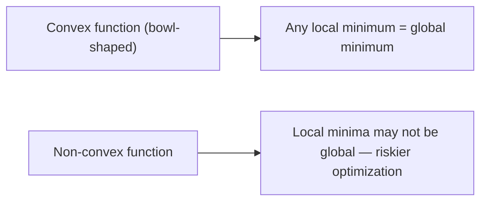

The importance of convexity cannot be overstated. For convex functions, any local minimum is guaranteed to be the global minimum. This means optimization algorithms will reliably find the best solution, not get stuck in a suboptimal local minimum.

Mean-variance portfolio optimization is a convex problem. The portfolio variance as a function of weights is a quadratic form, which is convex. This is one major reason mean-variance optimization remains so widely used despite its known limitations: the math is clean and the solution is unique.

### The Gradient and Hessian
The gradient of a function of multiple variables is the vector of partial derivatives. It points in the direction of steepest increase. In optimization, you typically move in the opposite direction of the gradient (gradient descent) to find a minimum.

The Hessian is the matrix of second-order partial derivatives. It generalizes the second derivative test to multiple dimensions. If the Hessian is positive definite at a critical point, that point is a local minimum. If the Hessian is negative definite, it is a local maximum.

```python
import numpy as np

def f(x, y):
    return x**2 + y**2 + x*y

# Gradient at (1, 2)
x, y = 1, 2
grad_f_x = 2*x + y  # 4
grad_f_y = 2*y + x  # 5
print(f"Gradient at (1,2): [{grad_f_x}, {grad_f_y}]")

# Hessian
hessian = np.array([[2, 1], [1, 2]])
eigenvalues = np.linalg.eigvals(hessian)
print(f"Hessian at (1,2):\n{hessian}")
print(f"Eigenvalues: {eigenvalues}")
print(f"Since eigenvalues > 0, Hessian is positive definite => minimum")
```

In Node 35, you will use these concepts to solve for the optimal portfolio weights. The gradient tells you how portfolio risk changes as you adjust each weight. The Hessian confirms that the solution is indeed a minimum and not a maximum or saddle point.

### Numerical Optimization: Gradient Descent
When there is no closed-form solution, you can find minima numerically using gradient descent. The idea is simple: start at a random point, compute the gradient, and take a small step in the opposite direction.

```python
import numpy as np

def f(x, y):
    return x**2 + y**2 + x*y

def gradient(x, y):
    df_dx = 2*x + y
    df_dy = 2*y + x
    return np.array([df_dx, df_dy])

x, y = 5.0, 5.0
learning_rate = 0.1
for i in range(50):
    grad = gradient(x, y)
    x -= learning_rate * grad[0]
    y -= learning_rate * grad[1]
    if i % 10 == 0:
        print(f"Iteration {i}: x={x:.4f}, y={y:.4f}, f={f(x,y):.4f}")

print(f"Final: x={x:.4f}, y={y:.4f}, f={f(x,y):.4f}")
```

The minimum of this function is at (0, 0) where f = 0. Gradient descent finds it from any starting point because the function is convex. This algorithm is the foundation of machine learning optimization. The learning rate controls how large each step is: too large and the algorithm overshoots the minimum, too small and convergence is slow. Choosing the right learning rate is a key hyperparameter in all gradient-based optimization. Too high a learning rate causes divergence; too low causes impractically slow convergence. Finding the optimal learning rate usually requires experimentation. A common approach is to try values on a logarithmic scale: 1.0, 0.1, 0.01, 0.001, and observe which converges fastest. In practice, learning rates between 0.001 and 0.1 work well for most optimization problems in finance.

---

### 🔗 Free Resources
- [3Blue1Brown — Essence of Calculus (YouTube)](https://www.youtube.com/playlist?list=PLZHQObOWTQDMsr9K-rj53DwVRMYO3t5Yr) — free, exceptional visual intuition
- [Khan Academy — Calculus](https://www.khanacademy.org/math/calculus-1) — free
- [Paul's Online Math Notes — Calculus](https://tutorial.math.lamar.edu/) — free, thorough reference

### 📝 Quiz
1. **A partial derivative measures:**
   - A) The rate of change in one variable, holding others fixed ✅
   - B) The total change in a multivariable function here
   - C) The maximum value of the entire function at once
   - D) A random value with no real meaning at all here

2. **Why is convexity desirable in optimization problems?**
   - A) It makes the computation run slower always
   - B) Any local minimum is guaranteed the global minimum ✅
   - C) It guarantees zero risk in the portfolio here
   - D) It is not actually desirable in any way at all

3. **The gradient of a multivariable function is:**
   - A) A single number produced as the final output
   - B) The same as the determinant of that matrix
   - C) A vector of partial derivatives for steepest ascent ✅
   - D) Always zero in every single case possible here

4. **Why is the chain rule essential in financial modeling?**
   - A) Most functions depend on a single variable only
   - B) Derivatives are forbidden in portfolio math here
   - C) It is required by the Python syntax itself here
   - D) Functions are nested, like option prices of many inputs ✅

5. **For f(x) = x^2, what is the derivative at x = 3?**
   - A) 9, the value of the function itself
   - B) 6, from the power rule: two times three ✅
   - C) 3, the value of the input at that point
   - D) 2, the exponent of the polynomial here

6. **A strategy's P&L function is concave. What does this imply for optimization?**
   - A) Local maxima are not guaranteed to be the global one ✅
   - B) Any local maximum is guaranteed to be global
   - C) The function has no maximum at all here now
   - D) Optimization is impossible in this case ever

7. **Why do quants maximize log-likelihood instead of raw likelihood?**
   - A) Log is always easier to type than the raw
   - B) Products become sums, which are numerically stable ✅
   - C) The raw likelihood is always exactly zero now
   - D) Because regulation requires using logarithms

8. **For a concave P&L curve, where is the optimal position size found?**
   - A) Where the derivative equals zero, the flat point ✅
   - B) Where the derivative is the largest possible
   - C) Where the second derivative is the largest
   - D) At the boundary of the feasible region only

9. **A function has many local minima. What does this mean for optimization?**
   - A) The global minimum is guaranteed by any algorithm
   - B) Every local minimum found is the true answer
   - C) Gradient methods may get stuck in a local minimum ✅
   - D) The problem has no solution at all here ever

10. **Why does the square root of time rule hold for volatility?**
    - A) Returns compound multiplicatively over long periods
    - B) Standard deviation adds linearly across the days
    - C) Prices are lognormally distributed by definition
    - D) Variance adds linearly; std dev scales with the square root ✅

---
---

# WORLD 4 — Data Engineering & Market Data

## Node 15: Market Data Engineering

### 🎯 Hook
Every backtest is only as trustworthy as the data underneath it. This node is where "garbage in, garbage out" becomes a very concrete, very avoidable risk — and where you build the habits that separate credible research from accidental fiction.

### 📌 Learning Objectives
- Understand OHLCV data structure
- Understand adjusted close and why it matters
- Account for corporate actions, splits, and dividends
- Identify reliable data sources
- Clean data and handle missing values/outliers
- Apply data validation and quality checks

---

### OHLCV Structure
Every candlestick or bar of price data contains five core fields. Open is the price at which the first trade of the period occurred. High is the highest traded price during the period. Low is the lowest traded price. Close is the price of the last trade. Volume is the total number of shares or contracts traded.

These five numbers are the fundamental unit of nearly all price-based research. From them, you compute returns, volatility, volume-weighted average price, and countless technical indicators.

```python
import pandas as pd

# A single OHLCV bar
bar = pd.Series({
    "open": 100.5,
    "high": 102.3,
    "low": 99.8,
    "close": 101.7,
    "volume": 1_250_000
}, name="2024-01-02")
print(bar)

# Typical OHLCV DataFrame for a year of data
import pandas as pd
import numpy as np

dates = pd.date_range("2024-01-01", periods=252, freq="B")
np.random.seed(42)
close = 100 * np.exp(np.cumsum(np.random.normal(0.0005, 0.01, 252)))
high = close * (1 + np.abs(np.random.normal(0, 0.005, 252)))
low = close * (1 - np.abs(np.random.normal(0, 0.005, 252)))
open_prices = close * (1 + np.random.normal(0, 0.002, 252))

df = pd.DataFrame({
    "open": open_prices,
    "high": high,
    "low": low,
    "close": close,
    "volume": np.random.randint(500000, 2000000, 252)
}, index=dates)

print(df.head())
```

### Adjusted Close
The raw close is the actual price at which the last trade of the day occurred. The adjusted close retroactively corrects historical prices for dividends and stock splits so that return calculations across time remain accurate.

When a company pays a dividend, the stock price drops by roughly the dividend amount on the ex-dividend date. If you compute returns using raw close, this price drop looks like a loss even though the shareholder received cash. The adjusted close adds back the dividend to maintain continuity.

When a stock splits, the price changes mechanically but the company's value does not. A 2-for-1 split doubles the share count and halves the price. Using raw close, this looks like a 50% crash. The adjusted close corrects for this.

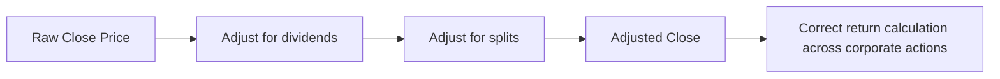

Using raw close instead of adjusted close is one of the most common beginner mistakes. It can make a stock appear to have crashed 90% on a split date when nothing economically happened. Always check that your data source provides adjusted prices and use them for return calculations.

```python
import pandas as pd
import numpy as np

# Demonstrate the impact of a stock split on raw vs adjusted returns
dates = pd.date_range("2024-01-01", periods=10, freq="B")
raw_close = np.array([100, 102, 98, 50, 52, 54, 56, 55, 57, 60])
# The drop from 98 to 50 is a 2-for-1 split

adjusted_close = np.array([100, 102, 98, 100, 104, 108, 112, 110, 114, 120])
# Adjusted: split is reversed so prices are comparable

raw_returns = np.diff(raw_close) / raw_close[:-1]
adjusted_returns = np.diff(adjusted_close) / adjusted_close[:-1]

print("Day 3 return (raw):", f"{raw_returns[2]:.2%}")  # ~-49%
print("Day 3 return (adjusted):", f"{adjusted_returns[2]:.2%}")  # ~2%
```

The raw return on the split day shows a 49% loss. The adjusted return correctly shows a 2% gain. Always use adjusted prices.

### Corporate Actions: Stock Splits and Dividends
Stock splits change the number of shares outstanding without changing the company's market capitalization. A 1:2 split means you receive one additional share for each share you own, and the price halves. A 1:5 reverse split means you receive one share for every five you owned, and the price quintuples.

Dividends are cash payments to shareholders. On the ex-dividend date, the stock price is reduced by approximately the dividend amount. If you own the stock before the ex-date, you receive the dividend. The price reduction reflects the fact that new buyers will not receive the pending dividend.

Both stock splits and dividends must be accounted for, or your return series will contain artificial jumps. Most data vendors provide adjusted prices that handle both, but it is important to confirm that the adjustment method matches your analytical needs.

### Data Sources
For learning and small projects, several free data sources are available. The National Stock Exchange of India publishes daily bhavcopy files with OHLCV data for all traded securities. Yahoo Finance provides historical data accessible through the yfinance Python library. Alpha Vantage offers a free tier for US and some international markets. Quandl (now Nasdaq Data Link) provides some free datasets alongside paid tiers.

Production quant funds typically pay for institutional-grade data vendors. Bloomberg, Refinitiv, and FactSet offer comprehensive data with accurate corporate-action handling. The cost is justified by the need for reliability, coverage, and timeliness. For learning purposes, the free sources are adequate.

```python
# Example: fetching data with yfinance
# import yfinance as yf
# nifty = yf.download("^NSEI", start="2020-01-01", end="2024-12-31")
# print(nifty.head())
```

### Data Cleaning: Missing Values
Real market data always has gaps. Holidays, trading halts, and data feed outages all produce missing values. How you handle these directly affects the quality of your analysis.

The first step is identifying where and why data is missing. Use isna() to detect missing values. Understand whether the gap is expected (holiday) or unexpected (data error).

For price data, forward-fill is usually the safest choice. If a stock did not trade on a given day, the last traded price is the best estimate of its value. Never fill a price column with zero, because a zero price will produce division by zero or infinite returns downstream.

```python
import pandas as pd
import numpy as np

# Simulate data with gaps
dates = pd.date_range("2024-01-01", periods=10, freq="B")
df = pd.DataFrame({
    "close": [100, 102, np.nan, np.nan, 105, 107, np.nan, 110, 112, 115],
    "volume": [15000, 18000, np.nan, np.nan, 21000, 22000, np.nan, 25000, 26000, 28000]
}, index=dates)

print("Missing values:\n", df.isna().sum())

# Forward fill: carry last valid value forward
df_ffill = df.fillna(method="ffill")
print("\nForward filled:\n", df_ffill)

# Compare with interpolation
df_interp = df.interpolate()
print("\nInterpolated:\n", df_interp)

# Compare with dropping
df_dropped = df.dropna()
print(f"\nAfter dropna: {len(df_dropped)} rows remaining")
```

Forward-fill preserves the last known price. Interpolation creates a linear path between known values. Dropping rows discards potentially useful data. The right choice depends on why the data is missing and how it will be used.

### Data Cleaning: Outlier Detection
Outliers in price data can be genuine extreme events (crashes, rallies) or data errors. Distinguishing the two requires combining statistical methods with domain knowledge.

The Z-score method from Node 5 is a good starting point. Compute returns, standardize them, and flag observations with absolute Z-scores above 3 or 4. Then examine each flagged observation to determine whether it is real or erroneous.

```python
import numpy as np
import pandas as pd

# Simulate price data with a data error
dates = pd.date_range("2024-01-01", periods=100, freq="B")
np.random.seed(42)
prices = 100 * np.exp(np.cumsum(np.random.normal(0.0005, 0.01, 100)))
prices[50] = 150  # A suspicious jump

df = pd.DataFrame({"close": prices}, index=dates)
df["return"] = df["close"].pct_change()
df["z_score"] = (df["return"] - df["return"].mean()) / df["return"].std()

outliers = df[df["z_score"].abs() > 3]
print(f"Outliers detected:\n{outliers}")

# Check if the outlier return is plausible
max_plausible_return = 0.20  # 20% in a day for a stock
unrealistic = df[df["return"].abs() > max_plausible_return]
print(f"Unrealistic moves:\n{unrealistic}")
```

A daily return of 50% for a stock is almost certainly a data error unless it coincides with a known corporate event. Always maintain domain knowledge-based sanity checks alongside statistical ones.

### Data Validation and Quality Checks
A production research pipeline runs automated checks before any data is used for analysis. These checks catch errors early, before they corrupt downstream calculations.

Price and volume must be positive. A negative price or volume is always a data error.

High must be greater than or equal to Low. High must be greater than or equal to both Open and Close. Low must be less than or equal to both Open and Close. These are logical constraints that no valid OHLC bar can violate.

Timestamps must be unique. Duplicate timestamps indicate data corruption or merging errors.

Gaps in the date index larger than the expected trading calendar (weekends, holidays) indicate missing data that should be investigated.

```python
def validate_ohlc(df):
    errors = []

    if (df["low"] > df["high"]).any():
        errors.append("Low > High detected")

    if (df["close"] <= 0).any():
        errors.append("Non-positive close price detected")

    if (df["volume"] <= 0).any():
        errors.append("Non-positive volume detected")

    if df.index.duplicated().any():
        errors.append("Duplicate timestamps detected")

    return errors

# Test the validator
valid_df = pd.DataFrame({
    "open": [100, 102],
    "high": [103, 105],
    "low": [99, 101],
    "close": [101, 104],
    "volume": [1000000, 1200000]
})
print("Validation result:", validate_ohlc(valid_df))
```

These automated checks run silently in the background of any serious quant research pipeline. They prevent the most common data-related disasters before they reach the analysis stage. Every hour spent on data validation saves days of debugging backtest results.

---

### 🔗 Free Resources
- [yfinance — GitHub/Documentation](https://github.com/ranaroussi/yfinance) — free Python library for market data
- [Zerodha Varsity — Understanding Corporate Actions](https://zerodha.com/varsity/) — free, India-context
- [QuantStart — Data Cleaning for Quant Finance](https://www.quantstart.com/) — free articles

### 📝 Quiz
1. **Why should you use adjusted close instead of raw close for return calculations?**
   - A) Raw close shows jumps from splits and dividends ✅
   - B) It does not matter which one you use here
   - C) Adjusted close is always higher in value
   - D) Raw close is illegal to use in any research

2. **A 1:2 stock split means:**
   - A) Share count doubles, price halves, value unchanged ✅
   - B) The company's total value doubles at once here
   - C) The stock is delisted from the exchange now
   - D) Dividends double automatically for holders

3. **Which of these is a valid automated data quality check for OHLC data?**
   - A) High should always equal the Low value
   - B) Volume should always be exactly zero here
   - C) Low should never exceed the High price value ✅
   - D) Close should always equal the Open value

4. **Why does a dividend payment make the raw close look like a loss?**
   - A) Dividends are always paid as cash to their lenders
   - B) The exchange stops trading on that date entirely now
   - C) The company's fundamentals change overnight for sure
   - D) Price drops by about the dividend while the holder gets cash ✅

5. **A stock closes at 100 and splits 2-for-1 overnight. What happens to the prior adjusted close?**
   - A) About half the prior price, keeping returns continuous ✅
   - B) The same raw price, since splits do not matter
   - C) Double the prior raw price, to keep the level
   - D) Zero, since the old price is meaningless now

6. **Your dataset has 3 days of missing prices in a row for one ticker. Best handling?**
   - A) Forward fill them silently without any check
   - B) Fill with zeros, the safest possible choice
   - C) Investigate the cause, then fill or drop as needed ✅
   - D) Delete the entire ticker from the universe

7. **Why are point-in-time constituents important for backtesting?**
   - A) They make the data file smaller overall now
   - B) They avoid survivorship bias from current lists ✅
   - C) They are required by the exchange rules here
   - D) They guarantee the returns will be positive

8. **A stock appears to drop 90% on a date with no news. What is the most likely cause?**
   - A) The market crashed on that single day itself
   - B) A corporate action the data was not adjusted for ✅
   - C) The ticker was delisted on that same day
   - D) The stock hit its lower circuit limit there

9. **Why is relying on a single data source risky?**
   - A) It always provides the best possible quality
   - B) It makes the pipeline much faster overall
   - C) Cross-checking vendors catches data errors ✅
   - D) It is the only legal way to obtain data

10. **An OHLC row has low > high. What should the pipeline do?**
    - A) Accept it and continue running silently
    - B) Swap the two values and move on quickly
    - C) Assume it is fine and ignore it entirely
    - D) Flag the row for review and do not guess ✅

---
---

## Node 16: Time Series Data

### 🎯 Hook
Market data isn't just a table — it's a sequence where order and time gaps carry meaning. This node teaches you to manipulate that sequence fluently, which is the single most-used skill in day-to-day quant research work.

### 📌 Learning Objectives
- Work with datetime indices and frequencies
- Resample data across timeframes
- Use rolling and expanding windows
- Apply lag and shift operations
- Compute rolling statistics
- Calculate returns correctly from a price series

---

### Datetime Index and Frequency
Time series data is defined by two things: the values themselves and the timestamps associated with them. Pandas uses the DatetimeIndex to align data by time, which enables all the powerful time-based operations in this node.

```python
import pandas as pd
import numpy as np

# Create a DatetimeIndex with business-day frequency
dates = pd.date_range("2024-01-01", periods=10, freq="B")
prices = pd.Series(100 + np.cumsum(np.random.normal(0, 1, 10)), index=dates, name="close")
print(prices)

# You can also parse dates from a CSV column
# df = pd.read_csv("data.csv", parse_dates=["date"], index_col="date")

# Common frequency strings
# "B" = business day
# "W" = weekly (Sunday)
# "M" = month end
# "Q" = quarter end
# "Y" = year end
# "H" = hourly
```

The frequency string is important because it tells pandas about the expected spacing between observations. If you specify freq="B", pandas knows that weekends are gaps and will handle resampling correctly.

### Resampling
Resampling changes the frequency of your time series. Downsampling reduces frequency (daily to weekly), reducing the number of data points but summarizing each period. Upsampling increases frequency (daily to hourly), creating new data points that must be interpolated or filled.

```python
# Downsampling: daily to weekly
weekly = prices.resample("W").last()  # last price of each week
weekly_mean = prices.resample("W").mean()  # average price each week
weekly_ohlc = prices.resample("W").ohlc()  # open/high/low/close per week
print(f"Weekly close:\n{weekly}")

# Upsampling: daily to hourly
hourly_index = pd.date_range("2024-01-01", periods=8, freq="H")
hourly_data = pd.Series([100, 101, 102, 103, 104, 105, 106, 107], index=hourly_index)
daily = hourly_data.resample("D").last()  # aggregate to daily
print(f"Resampled to daily:\n{daily}")
```

Common aggregation functions for resampling: last, first, mean, min, max, ohlc (for OHLC bars), and sum (for volume). Choose the function that matches what you are trying to measure.

### Time Zone Handling
Financial markets operate across time zones. A timestamp from the NSE is in Indian Standard Time (IST, UTC+5:30), while one from the NYSE is in Eastern Time (ET, UTC-5). When working with multi-exchange data, always convert to a common time zone.

```python
# Convert time zones
prices_utc = prices.tz_localize("Asia/Kolkata").tz_convert("UTC")
print(f"IST to UTC:\n{prices_utc}")
```

### Rolling and Expanding Windows
Rolling windows compute a statistic over a fixed window of the last N observations. The window slides forward as new data arrives. This is how moving averages and rolling volatility are computed.

Expanding windows use all data from the start up to the current point. The window grows as new data arrives. This is used for cumulative statistics.

```python
# Rolling window: always uses the last N observations
rolling_mean_5d = prices.rolling(window=5).mean()
rolling_std_5d = prices.rolling(window=5).std()

# Expanding window: uses all data from start
expanding_mean = prices.expanding().mean()
expanding_max = prices.expanding().max()

# Combine into a DataFrame for comparison
comparison = pd.DataFrame({
    "close": prices,
    "sma_5": rolling_mean_5d,
    "expanding_mean": expanding_mean
})
print(comparison)
```

The choice between rolling and expanding depends on the question. If you want the average return over the last 20 days, use rolling. If you want the cumulative return since inception, use expanding.

### Rolling Windows with Min Periods
By default, rolling windows require the full window size to produce a result. For the first few observations before the window is full, the result is NaN. You can control this with min_periods.

```python
# Require at least 3 observations to compute the rolling mean
rolling_mean_flexible = prices.rolling(window=10, min_periods=3).mean()
print(f"With min_periods=3, first valid value at index: {rolling_mean_flexible.first_valid_index()}")
```

### Lag and Shift Operations
Shift is the most fundamental time series operation. It moves data forward or backward in time, allowing you to compare today's value with yesterday's.

```python
# Shift operations
prices_lagged_1 = prices.shift(1)  # yesterday's price, aligned to today
prices_lead_1 = prices.shift(-1)  # tomorrow's price, aligned to today

# Common use: compute changes and returns
price_change = prices - prices.shift(1)
simple_return = prices.pct_change()
forward_return = prices.shift(-1) / prices - 1  # tomorrow's return

comparison = pd.DataFrame({
    "today": prices,
    "yesterday": prices_lagged_1,
    "change": price_change,
    "return": simple_return
})
print(comparison.head())
```

The shift operation underlies essentially every "compare today to N days ago" calculation in this course. Momentum signals use shift to compare current price to price N days ago. Returns use shift to align today's price with yesterday's. Autocorrelation uses shift to create lagged versions of a series.

### Rolling Statistics
Rolling statistics extend the basic statistics from Node 5 into the time domain. Instead of one static number, you get a time series of statistics that shows how the distribution evolves.

```python
# Rolling statistics on returns
returns = prices.pct_change()
rolling_vol_10d = returns.rolling(10).std() * np.sqrt(252)  # annualized
rolling_sharpe = returns.rolling(63).mean() / returns.rolling(63).std() * np.sqrt(252)
rolling_max = prices.rolling(20).max()
rolling_min = prices.rolling(20).min()

print(f"Rolling annualized volatility (last 10 days): {rolling_vol_10d.iloc[-1]:.2%}")
print(f"Rolling Sharpe (last 63 days): {rolling_sharpe.iloc[-1]:.2f}")
```

A stock might have 20% annualized volatility over the full year but spike to 40% during a crisis period and drop to 15% during calm periods. The rolling statistics capture this dynamic, which a single static number would miss entirely.

### Return Calculations from Price Series
Converting prices to returns is the first step in almost every quant analysis. Pandas provides convenient methods for this.

```python
import pandas as pd
import numpy as np

# Simple returns: percentage change
simple_returns = prices.pct_change()
simple_returns_5d = prices.pct_change(5)  # 5-day return

# Log returns: continuous compounding
log_returns = np.log(prices / prices.shift(1))

# Cumulative return
cumulative_return = (1 + simple_returns).cumprod() - 1

print(f"Latest simple return: {simple_returns.iloc[-1]:.4%}")
print(f"Latest log return: {log_returns.iloc[-1]:.4%}")
print(f"Cumulative return: {cumulative_return.iloc[-1]:.2%}")
```

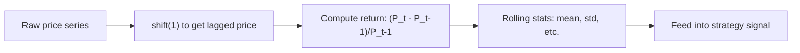

Always compute returns from adjusted prices (Node 15). A single unadjusted split date in the middle of your series will produce a spurious -50% return that corrupts every rolling statistic downstream.

### Practical Workflow: Building a Momentum Signal
Here is how the time series skills in this node come together to build a simple momentum strategy signal.

```python
import pandas as pd
import numpy as np

# Simulate daily prices
np.random.seed(42)
dates = pd.date_range("2024-01-01", periods=504, freq="B")
prices = 100 * np.exp(np.cumsum(np.random.normal(0.0005, 0.01, 504)))

# Compute returns
returns = prices.pct_change()

# Momentum signal: 12-month (252-day) return minus 1-month (21-day) return
momentum = (prices / prices.shift(252) - 1) - (prices / prices.shift(21) - 1)

# Volatility regime: rolling 60-day volatility
vol_regime = returns.rolling(60).std() * np.sqrt(252)

# Final signal: go long when momentum is positive and volatility is below median
signal = (momentum > 0).astype(int)
print(f"Signal summary:\n{pd.DataFrame({'signal': signal, 'vol': vol_regime}).describe()}")
```

This workflow uses shift (for lagged prices), rolling (for volatility), and return calculations. Mastering these three operations will cover most of your daily time series manipulation needs. Time series processing is the single most frequently used skill in quant research, and the investment in learning the pandas time series API pays off immediately.

### Common Time Series Pitfalls
The most common beginner mistake is forgetting to sort the index before applying time series operations. If your data is not sorted chronologically, shift and rolling operations will produce meaningless results. Always sort before processing.

Another common mistake is assuming that resampling always produces clean results. If you resample daily data to monthly using the last price, but the last trading day of the month varies, you can introduce artificial patterns. Be explicit about how you aggregate.

A third pitfall is lookahead bias in rolling operations. By default, rolling(window=5).mean() uses the current observation and the 4 previous observations. If you accidentally use the current and future observations, your backtest results will be unrealistically good. Always verify the direction of your window.

```python
# Common pitfall: rolling with future data (lookahead bias)
# BAD: uses current and future data
bad_signal = prices.rolling(5).mean().shift(-2)  # shift(-2) pulls future data back

# GOOD: uses only past data
good_signal = prices.shift(1).rolling(5).mean()  # shift(1) aligns to yesterday
```

The shift(1) before the rolling window ensures that today's signal uses only data through yesterday, not including today's price. This is critical for realistic backtesting. A backtest that uses today's data to predict today's return will always look profitable, even with a completely random signal. Always verify the timing of your data with a simple forward-looking check. Implement a routine sanity test that compares the signal on day t with the return on day t+1 to confirm no lookahead is present. This simple check has saved countless hours of debugging in real research pipelines. It is the single most valuable test you can add to any time series analysis. Mastering these time series fundamentals will serve every subsequent analysis in this course.---

### 🔗 Free Resources
- [Pandas — Time Series Documentation](https://pandas.pydata.org/docs/user_guide/timeseries.html) — free, official
- [Corey Schafer — Pandas Time Series (YouTube)](https://www.youtube.com/playlist?list=PL-osiE80TeTsWmV9i9c58mdDCSskIFdDS) — free
- [Real Python — Time Series Analysis with Pandas](https://realpython.com/pandas-python-explore-dataset/) — free article

### 📝 Quiz
1. **The difference between a rolling window and an expanding window is:**
   - A) Rolling uses the last N points; expanding uses all data ✅
   - B) They are identical in every single possible way here
   - C) Expanding is always smaller than the rolling window
   - D) Rolling only works on monthly data always here

2. **`prices.shift(1)` produces:**
   - A) Tomorrow's price aligned to today's row
   - B) Yesterday's price aligned to today's row value ✅
   - C) A random shuffle of all of the prices
   - D) The rolling mean of all of the prices

3. **Rolling volatility (vs a single static standard deviation) is more useful because:**
   - A) It is easier to compute in practice always here
   - B) It is always lower than the static one here
   - C) It captures changing risk instead of constant risk ✅
   - D) There is no real difference between the two here

4. **Why convert all timestamps to a common time zone?**
   - A) To make the data files smaller in size overall
   - B) Because IST is always better than UTC time
   - C) So that the charts display in local format
   - D) To align observations from different exchanges ✅

5. **A 5-day rolling standard deviation uses:**
   - A) All data since the start of the series here
   - B) The last 5 observations only, sliding forward ✅
   - C) The first five observations of the series
   - D) Every fifth observation in the series now

6. **Your dataset has NSE timestamps in IST and NYSE timestamps in ET. Correct practice?**
   - A) Keep both in their local time zones here
   - B) Convert only the dates, never the times
   - C) Convert everything to one common time zone ✅
   - D) Drop the timestamps from both datasets

7. **Expanding window statistics differ from rolling because:**
   - A) They use fewer and fewer observations
   - B) The window grows as new data arrives here ✅
   - C) They ignore the newest data entirely now
   - D) They only work on daily frequencies

8. **A trade at 9:30 AM NYSE time is recorded as 9:30 IST. What is the issue?**
   - A) The timestamps mark different moments ✅
   - B) The trade is duplicated in the dataset
   - C) The price is wrong by the time shift
   - D) There is no issue at all in this case here

9. **Why prefer a 252-day rolling window over a 5-day one for risk estimates?**
   - A) It reacts faster to sudden market moves now
   - B) It needs less data to compute overall here
   - C) It estimates long-run risk with more stability ✅
   - D) It ignores the most recent observations

10. **You see volatility spikes on ex-dividend dates. What is the most likely cause?**
    - A) Markets panic on every dividend date here
    - B) The window is too long for the data now
    - C) Volume always rises on those dates exactly now
    - D) Returns on unadjusted prices create the spike ✅

---
---

## Node 17: Data Visualization

### 🎯 Hook
A chart is often the fastest way to catch a data bug, spot a pattern, or convince a skeptical reader — including yourself. This node builds the visual vocabulary you'll use in every dashboard and report for the rest of the course.

### 📌 Learning Objectives
- Build core chart types: line, scatter, histogram, box plot
- Read and construct candlestick charts
- Build correlation heatmaps
- Use pair plots for multi-variable exploration
- Apply financial dashboard design principles

---

### Line Charts
Line charts are the default choice for time series data. The x-axis is time and the y-axis is the value. Always plot the cumulative return, not the raw price, when evaluating a strategy. A price chart shows you whether the stock went up or down. A cumulative return chart shows you how your strategy performed relative to your entry point.

```python
import matplotlib.pyplot as plt
import numpy as np

np.random.seed(42)
prices = 100 * np.exp(np.cumsum(np.random.normal(0.0005, 0.01, 252)))
cumulative_return = (prices / prices[0]) - 1

plt.figure(figsize=(10, 6))
plt.plot(cumulative_return, linewidth=2)
plt.axhline(y=0, color='gray', linestyle='--', alpha=0.5)
plt.title("Cumulative Return")
plt.xlabel("Trading Day")
plt.ylabel("Cumulative Return (%)")
plt.grid(alpha=0.3)
plt.show()
```

When comparing multiple strategies, use different line styles or colors and always include a legend. The eye can track about 4-5 lines on a single chart before it becomes cluttered.

### Scatter Plots
Scatter plots show the relationship between two variables. Each point represents one observation. In quant research, scatter plots are used to visualize the relationship between a predictor and a return, or between two assets' returns.

```python
# Scatter plot: stock returns vs market returns
np.random.seed(42)
market_returns = np.random.normal(0.0005, 0.01, 500)
stock_returns = 0.0002 + 1.2 * market_returns + np.random.normal(0, 0.005, 500)

plt.figure(figsize=(8, 6))
plt.scatter(market_returns, stock_returns, alpha=0.5, s=10)
plt.axhline(y=0, color='gray', linestyle='--', alpha=0.3)
plt.axvline(x=0, color='gray', linestyle='--', alpha=0.3)

# Add regression line
from scipy import stats
slope, intercept, _, _, _ = stats.linregress(market_returns, stock_returns)
x_line = np.linspace(min(market_returns), max(market_returns), 100)
plt.plot(x_line, intercept + slope * x_line, 'r-', linewidth=2, label=f'beta={slope:.2f}')
plt.legend()
plt.title("Stock Returns vs Market Returns")
plt.xlabel("Market Return")
plt.ylabel("Stock Return")
plt.grid(alpha=0.3)
plt.show()
```

The alpha (intercept) tells you the stock's excess return beyond what the market explains. The beta (slope) tells you the stock's sensitivity to the market. The scatter around the line is the idiosyncratic risk that diversification can reduce.

### Histograms
Histograms show the distribution of a single variable by grouping values into bins. They reveal the shape of the return distribution, including skewness, kurtosis, and the presence of outliers.

```python
np.random.seed(42)
normal_returns = np.random.normal(0.0005, 0.01, 1000)
fat_tailed_returns = np.random.standard_t(df=3, size=1000) * 0.01

plt.figure(figsize=(12, 5))
plt.subplot(1, 2, 1)
plt.hist(normal_returns, bins=40, alpha=0.7, edgecolor='white')
plt.title("Normal Returns")
plt.xlabel("Return")
plt.ylabel("Frequency")

plt.subplot(1, 2, 2)
plt.hist(fat_tailed_returns, bins=40, alpha=0.7, edgecolor='white')
plt.title("Fat-Tailed Returns (t-distribution df=3)")
plt.xlabel("Return")
plt.ylabel("Frequency")
plt.tight_layout()
plt.show()
```

The normal distribution histogram is symmetric and concentrated. The fat-tailed histogram has more observations in the tails. This is the visual equivalent of the kurtosis discussion in Node 10.

### Box Plots
Box plots summarize a distribution using five numbers: the minimum, the first quartile, the median, the third quartile, and the maximum. Points beyond 1.5 times the IQR from the quartiles are plotted as outliers.

```python
# Compare return distributions across assets
np.random.seed(42)
data = {
    "Stock A": np.random.normal(0.0005, 0.01, 252),
    "Stock B": np.random.normal(0.0008, 0.015, 252),
    "Stock C": np.random.normal(0.0002, 0.008, 252),
    "Stock D": np.random.normal(-0.0001, 0.02, 252),
}

plt.figure(figsize=(10, 6))
plt.boxplot(data.values(), labels=data.keys())
plt.title("Return Distribution Comparison")
plt.ylabel("Daily Return")
plt.axhline(y=0, color='gray', linestyle='--', alpha=0.5)
plt.grid(alpha=0.3)
plt.show()
```

Box plots are especially useful for comparing many assets side by side. You can immediately see which assets have the widest dispersion (most risky) and which have the most outliers.

### Candlestick Charts
Candlesticks pack four numbers into one visual glyph. The body represents the range between open and close. If the close is higher than the open, the body is typically shown in green or white. If the close is lower, the body is red or black. The wicks (or shadows) extend to the high and low of the period.

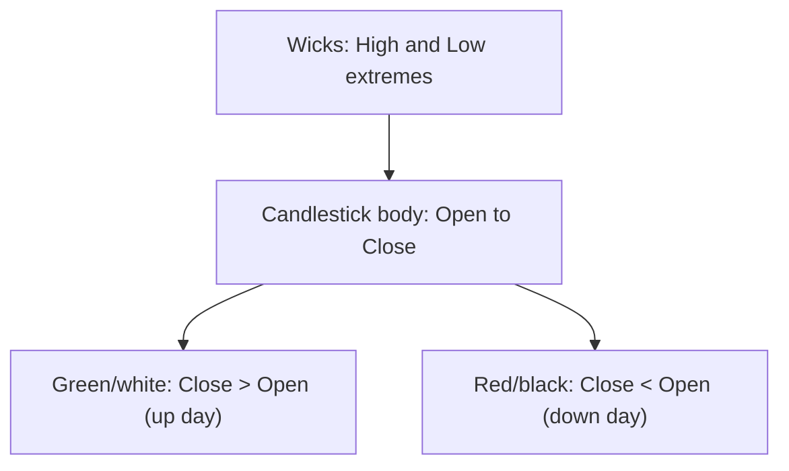

Candlesticks are the foundation of most technical analysis charting. Patterns like doji, hammer, and engulfing are based on the shape and position of candlesticks. While you can create candlestick charts in matplotlib using mplfinance, the key skill is reading them: a long body means a strong move, a long wick means rejected price levels, and a small body means indecision.

```python
# Simple bar chart showing OHLC data
# (Full candlestick charts require mplfinance library)
# import mplfinance as mpf
# mpf.plot(ohlc_df, type='candle', volume=True)
```

### Correlation Heatmaps
A correlation heatmap visualizes the correlation matrix. Each cell is colored according to the correlation coefficient between two assets, typically using a diverging colormap from red (negative) through white (zero) to green (positive).

```python
import seaborn as sns
import pandas as pd
import numpy as np

np.random.seed(42)
returns_df = pd.DataFrame(
    np.random.normal(0, 0.01, (252, 5)),
    columns=["A", "B", "C", "D", "E"]
)

# Add some correlation structure
returns_df["B"] = 0.7 * returns_df["A"] + 0.3 * np.random.normal(0, 0.01, 252)

plt.figure(figsize=(8, 6))
sns.heatmap(returns_df.corr(), annot=True, cmap="coolwarm", center=0,
            vmin=-1, vmax=1, square=True)
plt.title("Asset Correlation Heatmap")
plt.show()
```

Heatmaps instantly reveal which assets move together. A pair with correlation above 0.8 adds little diversification benefit when held together. A pair with negative correlation provides strong diversification.

### Pair Plots
Pair plots extend the scatter plot matrix to display every pairwise relationship in one figure. The diagonal shows each variable's distribution. The off-diagonal cells show scatter plots.

```python
sns.pairplot(returns_df[["A", "B", "C"]], diag_kind="kde")
```

Pair plots are a fast way to eyeball multiple relationships and potential outliers before running formal regressions. If you see a non-linear pattern or a cluster of outliers in any pairwise plot, investigate before proceeding with linear models.

### Financial Dashboard Design Principles
A well-designed dashboard communicates the most important information in seconds. Lead with the metric that matters most: cumulative return or Sharpe ratio, not raw price. Always show a benchmark alongside strategy performance so the reader can judge relative value.

Use consistent color coding throughout. Green means positive or up. Red means negative or down. Gray means neutral. Avoid rainbow colormaps for continuous data; use sequential colormaps like Blues or RdYlGn instead.

Never use 3D charts. They distort perception and make precise reading impossible. Label axes and units explicitly. "Return" is ambiguous; "Daily Return (%)" is not. Add a title that summarizes the takeaway, not just the data source.

```python
# Example of a minimal performance dashboard
fig, axes = plt.subplots(2, 2, figsize=(12, 8))

# Cumulative return
axes[0, 0].plot(cumulative_return, linewidth=2)
axes[0, 0].set_title("Strategy Cumulative Return")
axes[0, 0].set_ylabel("Return (%)")

# Rolling Sharpe
rolling_sharpe = ...  # computed earlier
axes[0, 1].plot(rolling_sharpe, linewidth=2, color='green')
axes[0, 1].axhline(y=0, color='gray', linestyle='--')
axes[0, 1].set_title("Rolling Sharpe Ratio (63-day)")

# Return distribution
axes[1, 0].hist(returns, bins=40, alpha=0.7)
axes[1, 0].set_title("Return Distribution")
axes[1, 0].set_xlabel("Daily Return")

# Drawdown
peak = np.maximum.accumulate(cumulative_return)
drawdown = cumulative_return - peak
axes[1, 1].fill_between(range(len(drawdown)), drawdown, 0, color='red', alpha=0.3)
axes[1, 1].set_title("Drawdown")
axes[1, 1].set_ylabel("Drawdown (%)")

plt.tight_layout()
```

This four-panel dashboard answers the essential questions about any strategy in a single glance: how much money did it make (cumulative return), how consistent were the returns (rolling Sharpe), what do the returns look like (distribution), and how much did it lose from peak (drawdown). Every quant researcher should be able to produce this chart from any strategy's returns in under a minute. Practice building this dashboard until it is automatic: it will be the most frequently used piece of code in your toolkit. The time invested in making clean, informative charts pays for itself with every presentation and every debugging session.

### Data-Ink Ratio
Edward Tufte's concept of the data-ink ratio is the most important design principle for financial charts. The data-ink ratio is the proportion of ink devoted to displaying data versus ink used for decoration. Maximize it by removing chart junk: unnecessary gridlines, 3D effects, redundant labels, and excessive colors.

```python
# High data-ink ratio: clean, minimal chart
plt.figure(figsize=(10, 6))
plt.plot(cumulative_return, linewidth=2, color='navy')
plt.title("Strategy Cumulative Return (2024)")
plt.xlabel("Date")
plt.ylabel("Cumulative Return (%)")
plt.grid(axis='y', alpha=0.3)
plt.tight_layout()
```

Every element on a chart should serve a purpose. If you are unsure whether an element is useful, remove it. If the chart is still clear without it, leave it out. The best financial charts look almost empty, with just enough information to tell the story. Strive for clarity, not ornamentation. A simple line chart with a clean title and labeled axes communicates more effectively than a 3D surface plot with rainbow colors and unnecessary gridlines. When in doubt, default to the simplest chart that answers the question. A scatter plot reveals relationships, a histogram reveals distributions, and a line chart reveals trends over time. These three chart types will cover 90% of your visualization needs in quant research. Practice creating each type until you can produce publication-quality charts from any dataset in under a minute.

---

### 🔗 Free Resources
- [Matplotlib — Official Tutorials](https://matplotlib.org/stable/tutorials/index.html) — free, official
- [Seaborn — Official Documentation](https://seaborn.pydata.org/tutorial.html) — free, official
- [freeCodeCamp — Data Visualization with Python (YouTube)](https://www.youtube.com/watch?v=a9UrKTVEeZA) — free

### 📝 Quiz
1. **A candlestick's "wick" represents:**
   - A) The high and low price extremes for the period ✅
   - B) The open and close prices of the period
   - C) The trading volume for the period itself
   - D) Nothing meaningful at all in this case

2. **A correlation heatmap is most useful for:**
   - A) Showing the price trends over time clearly
   - B) Quickly identifying which assets move together ✅
   - C) Computing the exact p-values of the tests
   - D) Making the dashboard look more colorful

3. **Why should a financial dashboard always show a benchmark alongside strategy performance?**
   - A) It is a regulatory requirement in all cases
   - B) It makes the chart more colorful to view
   - C) It is not actually necessary in any way
   - D) Raw returns need context from a benchmark ✅

4. **Why use a log scale for long equity curves?**
   - A) It hides all of the drawdowns completely here
   - B) It makes small moves look much larger on the chart
   - C) Equal percentage moves get equal visual distances ✅
   - D) It always flattens the curve into a line

5. **In a bar chart of daily returns, what does the height of each bar represent?**
   - A) The magnitude of that day's return value ✅
   - B) The price level of the stock that day
   - C) The number of trades executed that day
   - D) The volatility of the entire year shown

6. **The same returns plotted with 40 bins vs 5 bins in a histogram:**
   - A) The 5-bin version shows more detail always
   - B) The 40-bin version hides the shape always here
   - C) Both are identical in every single possible way
   - D) The 40-bin version shows finer detail but more noise ✅

7. **Why annotate drawdowns on the equity curve?**
   - A) It makes the chart harder to interpret now
   - B) It links visible declines to their causes and dates ✅
   - C) It replaces the need for the curve itself
   - D) It is purely decorative in its nature here

8. **A scatter plot of returns vs volume shows a vertical stripe on one date. Likely cause?**
   - A) The chart is perfectly normal in shape here
   - B) Volume was constant on that single day
   - C) A data error or missing values on that date ✅
   - D) The returns were exactly zero on that date

9. **A dashboard hides all losing months to "tell a better story." What is the right approach?**
   - A) This is fine, stories matter more than data
   - B) Keep it, since the client prefers good news
   - C) Show only the best performing calendar year
   - D) Show the full history including the losing months ✅

10. **Why does a time series plot mislead when x-axis dates are unevenly spaced?**
    - A) The y-axis will always be wrong in its actual value
    - B) The colors change their meaning with the spacing
    - C) Equal distances imply equal time gaps, distorting trends ✅
    - D) The chart becomes impossible to read properly

---
---

## Node 18: Software Engineering for Research

### 🎯 Hook
The gap between a research notebook and a project someone else can trust, reuse, and build on is entirely about software engineering discipline. This node is what turns your work from "a script that ran once on my laptop" into a real research asset.

### 📌 Learning Objectives
- Write clean, modular code
- Structure a research project properly with config files
- Use logging effectively
- Write useful documentation
- Apply reproducibility practices

---

### Clean Code and Modular Programming
The single biggest productivity improvement for a quant researcher is writing modular code. A module is a function or class that does one thing and does it well. When every component of your pipeline is a self-contained module, you can test each piece independently, reuse it across projects, and swap implementations without breaking anything.

```python
# BAD: everything in one giant script, hardcoded values, no structure

# GOOD: small, single-purpose functions
def load_prices(ticker: str, start: str, end: str) -> "pd.DataFrame":
    """Load OHLCV data for a ticker between two dates."""
    ...

def compute_signal(prices: "pd.DataFrame", lookback: int = 20) -> "pd.Series":
    """Compute a moving-average based signal."""
    ...

def backtest(signal: "pd.Series", prices: "pd.DataFrame") -> dict:
    """Run a backtest and return performance metrics."""
    ...

def calculate_sharpe(returns: "pd.Series") -> float:
    """Compute annualized Sharpe ratio from a series of returns."""
    annual_return = returns.mean() * 252
    annual_vol = returns.std() * np.sqrt(252)
    return annual_return / annual_vol if annual_vol > 0 else 0.0
```

Each function does one clear thing and can be tested, reused, and understood independently. This modularity becomes essential once your backtesting engine grows complex. A function that takes inputs and returns outputs without modifying global state is called a pure function. Pure functions are easier to debug, test, and reason about.

Type hints (the `-> "pd.DataFrame"` syntax) document what each function expects and returns. They do not enforce types at runtime but make the code self-documenting and enable IDE autocompletion.

### Project Structure and Config Files
A well-organized project structure saves hours of confusion. When every file has a predictable location, you can navigate any project written by anyone on your team.

```
my_strategy_project/
├── config.yaml          # all parameters live here, not hardcoded
├── data/
│   └── raw/
├── src/
│   ├── data_loader.py
│   ├── signals.py
│   └── backtest.py
├── notebooks/
│   └── exploration.ipynb
├── tests/
│   ├── test_signals.py
│   └── test_backtest.py
├── README.md
└── requirements.txt
```

```yaml
# config.yaml
lookback_period: 20
transaction_cost_bps: 5
initial_capital: 100000
start_date: "2020-01-01"
end_date: "2024-12-31"
```

Separating configuration from code means you can re-run an experiment with new parameters without touching a single line of logic. This is critical for walk-forward testing (Node 32) and sensitivity analysis.

```python
import yaml

# Load configuration at the start of your pipeline
with open("config.yaml", "r") as f:
    config = yaml.safe_load(f)

lookback = config["lookback_period"]
cost_bps = config["transaction_cost_bps"]
```

### Type Hints and Function Signatures
Type hints make your code self-documenting. They tell other developers (and your future self) what types each function expects and returns.

```python
from typing import Dict, List, Optional, Tuple
import pandas as pd
import numpy as np

def compute_rolling_volatility(
    prices: pd.Series,
    window: int = 20,
    annualize: bool = True
) -> pd.Series:
    """Compute rolling annualized volatility from a price series."""
    returns = prices.pct_change()
    rolling_std = returns.rolling(window).std()
    if annualize:
        rolling_std = rolling_std * np.sqrt(252)
    return rolling_std

def filter_by_volume(
    df: pd.DataFrame,
    min_volume: float = 1000000,
    recent_days: Optional[int] = None
) -> pd.DataFrame:
    """Filter stocks by minimum average daily volume."""
    if recent_days:
        df = df.tail(recent_days)
    return df[df["volume"].mean() >= min_volume]
```

### Logging
Professional code uses structured logging instead of print statements. Python's built-in logging module provides timestamped, filterable, persistent output.

```python
import logging

logging.basicConfig(
    level=logging.INFO,
    format="%(asctime)s %(levelname)s %(message)s",
    filename="backtest.log"
)
logger = logging.getLogger(__name__)

logger.info("Starting backtest with lookback=20")
logger.warning("Missing data for 3 trading days, forward-filled")

try:
    result = backtest(signal, prices)
    logger.info(f"Backtest completed. Sharpe: {result['sharpe']:.2f}")
except Exception as e:
    logger.error(f"Backtest failed: {e}", exc_info=True)
```

Logging levels let you control verbosity. DEBUG for detailed diagnostics, INFO for normal operations, WARNING for unexpected but handled situations, ERROR for failures. In production, you typically run at INFO or WARNING level.

### Documentation
Every function should have a docstring explaining what it does, its parameters, and what it returns. The docstring format should be consistent across the project. Google-style and NumPy-style are the most common in scientific Python.

```python
def backtest_strategy(
    prices: pd.DataFrame,
    signal: pd.Series,
    initial_capital: float = 100000.0,
    cost_bps: float = 5.0
) -> Dict[str, float]:
    """
    Run a simple long-only backtest.

    Parameters
    ----------
    prices : pd.DataFrame
        OHLCV data with DatetimeIndex.
    signal : pd.Series
        Trading signal: 1 for long, 0 for flat.
    initial_capital : float
        Starting capital.
    cost_bps : float
        One-way transaction cost in basis points.

    Returns
    -------
    Dict[str, float]
        Dictionary with keys: total_return, sharpe, max_drawdown.
    """
    # implementation here
    return {"total_return": 0.15, "sharpe": 1.2, "max_drawdown": -0.10}
```

At the project level, a README should let a stranger understand what the project does and how to run it in under two minutes. Include the project purpose, setup instructions, usage example, and where to find the results.

### Reproducibility Practices
Reproducibility is the foundation of credible quant research. If you cannot reproduce a result, you cannot trust it.

Fix random seeds for anything stochastic. np.random.seed(42) ensures that random number generation produces the same sequence every time. Without this, every run produces different results, making it impossible to debug or compare experiments.

Pin exact library versions in requirements.txt. If you upgrade a library and the behavior changes, you need to know which version produced your original results. Use pip freeze to capture the exact state of your environment.

```text
# requirements.txt
numpy==1.24.3
pandas==2.0.1
scipy==1.10.1
statsmodels==0.14.0
matplotlib==3.7.1
```

Use consistent, descriptive naming conventions. A file called signal_20d_momentum.py is informative. A file called test2_final_FINAL.py is not. Version numbers, dates, and abbreviations in filenames make it impossible to find anything six months later.

Track experiments systematically. Record the parameters, configuration, and results of every backtest so you can always answer the question: what exact settings produced this result?

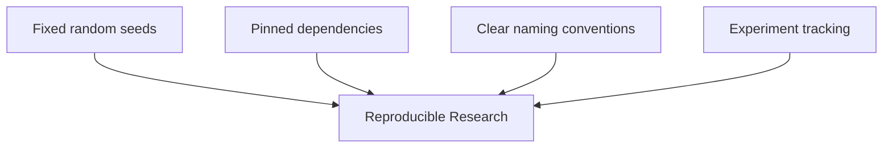

### Testing
Testing is the practice of writing code that checks whether your functions produce the expected outputs. Even simple tests catch a significant fraction of bugs before they reach your analysis.

```python
# test_signals.py
import numpy as np
from src.signals import compute_signal

def test_compute_signal_basic():
    prices = pd.Series([100, 102, 101, 105, 110])
    signal = compute_signal(prices, lookback=2)
    assert signal.dtype == np.int64 or signal.dtype == np.float64
    assert len(signal) == len(prices)
```

You do not need 100% test coverage for research code. But critical functions like return calculation, signal generation, and risk metrics should have basic tests. These tests pay for themselves the first time they catch a bug before it corrupts a week of analysis. A simple rule: if a function produces a number that would change a trading decision, it deserves a test. Over time, this discipline transforms your codebase from a collection of fragile scripts into a reliable research platform. The cumulative benefit of modular code, documentation, and tests grows exponentially as your project scales. The first test you write is the hardest; the hundredth is routine. Start with one test for your most critical function and build from there. Testing is an investment that compounds over time.

### Version Control for Research
Git is not just for software engineers. Every quant research project should be version-controlled from day one. Git lets you track every change, revert broken experiments, and maintain parallel branches for different research directions.

The basic workflow for research is: create a branch for a new idea, implement and test it, commit if it works, discard the branch if it doesn't. This keeps the main branch clean and ensures you can always return to a known working state.

```bash
# Research workflow
git checkout -b experiment/momentum_v2
# ... make changes, run backtest ...
git add src/ config.yaml
git commit -m "experiment: momentum with volatility scaling"
```

Crucially, commit messages should describe the research intent, not just the code changes. A message like "experiment: momentum with volatility scaling, Sharpe improved from 0.8 to 1.1 on validation set" is far more useful than "update backtest.py".

### Experiment Tracking
As your research grows, you will run hundreds of experiments with different parameters, data periods, and signal definitions. Without systematic tracking, you will quickly lose track of what produced each result.

A simple CSV log is far better than no tracking. Record the experiment name, date, parameters, performance metrics, and a notes field. For larger teams, dedicated tools like MLflow or Weights and Biases provide more structure, but a CSV file is sufficient for individual research.

```python
import pandas as pd
from datetime import datetime

def log_experiment(params, metrics, notes=""):
    """Append experiment results to a tracking CSV."""
    record = {
        "timestamp": datetime.now().isoformat(),
        **params,
        **metrics,
        "notes": notes
    }
    log_df = pd.DataFrame([record])
    try:
        existing = pd.read_csv("experiments.csv")
        updated = pd.concat([existing, log_df], ignore_index=True)
    except FileNotFoundError:
        updated = log_df
    updated.to_csv("experiments.csv", index=False)
```

Every time you run a backtest, call this function. Over weeks and months, you will accumulate a valuable record of what worked, what did not, and under what conditions.

---

### 🔗 Free Resources
- [Real Python — Python Application Layouts](https://realpython.com/python-application-layouts/) — free article
- [The Good Research Code Handbook (free online book)](https://goodresearch.dev/) — free, research-specific
- [Python Logging — Official Documentation](https://docs.python.org/3/howto/logging.html) — free, official

### 📝 Quiz
1. **Why separate configuration (parameters) from code logic?**
   - A) It lets you rerun with new parameters, logic untouched ✅
   - B) It makes the research code run faster in every possible case
   - C) It is required by the Python syntax in all cases here
   - D) It has no practical benefit at all in practice ever here

2. **What's the main advantage of structured logging over scattered print statements?**
   - A) Logging is always faster than print statements
   - B) It gives a timestamped, filterable record for debugging ✅
   - C) Print does not work in research code at all now
   - D) There is no real advantage at all in practice

3. **Fixing a random seed in a research pipeline is important because:**
   - A) It makes the code run faster in practice now
   - B) It removes all randomness from real markets
   - C) It ensures the random results reproduce across runs ✅
   - D) It is not actually important at all in practice

4. **Why are small, focused functions better than one giant script?**
   - A) They make the code harder to test overall
   - B) They always run slower than the big script
   - C) They require more memory in every single case
   - D) Each piece is testable and reusable separately ✅

5. **A pipeline fails at step 5 of 10. What does logging help you identify?**
   - A) The exact step and timestamp of the failure ✅
   - B) The final output of the whole pipeline
   - C) The market data of the previous month
   - D) The password of the data provider here

6. **Two runs of a pipeline with the same seed produce:**
   - A) Different random numbers each and every time
   - B) Faster code execution in every single case
   - C) Identical results, but only by coincidence
   - D) Identical results, by construction of the seed ✅

7. **Why add type hints to research functions?**
   - A) They make Python run much faster overall now
   - B) They document expected inputs and catch errors early ✅
   - C) They replace the need for any testing at all
   - D) They are mandatory in every Python version

8. **A config file sets lookback to 45, but the backtest output is identical to lookback 30. Why?**
   - A) The code may hardcode the value instead of reading config ✅
   - B) The config file was updated correctly this time
   - C) The backtest always ignores all of the parameters
   - D) The lookback value is not used at all in this case

9. **A colleague's script produces different results on their machine. What is the first suspect?**
   - A) The weather is different on their machine now
   - B) Their screen shows the colors differently
   - C) Different package versions or environment state ✅
   - D) The results are never reproducible at all

10. **Why wrap data downloads in retries with logging?**
    - A) Retries make the code much more complex overall
    - B) Logging slows the pipeline down far too much
    - C) Network calls never fail in practice at all ever
    - D) Transient network failures are logged and retried ✅

---
---

# WORLD 5 — Financial Markets Deep Dive

## Node 19: Market Microstructure

### 🎯 Hook
Backtests that ignore *how* trades actually get filled are quietly lying to you. Market microstructure is the plumbing beneath every price you see — understand it, and your backtests stop overestimating real-world profits.

### 📌 Learning Objectives
- Understand the order book and bid-ask spread
- Explain liquidity and volume's role in execution
- Understand tick size
- Explain slippage and why it erodes strategy returns
- Distinguish order types and execution mechanics

---

### The Order Book
Every exchange maintains an electronic order book that lists all outstanding buy and sell orders at each price level. The highest price at which someone is willing to buy is called the best bid. The lowest price at which someone is willing to sell is called the best ask or best offer.

The order book is constantly changing as traders submit, cancel, and execute orders. When you see a price chart, you are seeing the history of trades that resulted from orders interacting with the order book. The order book itself is the underlying mechanism that produces prices.

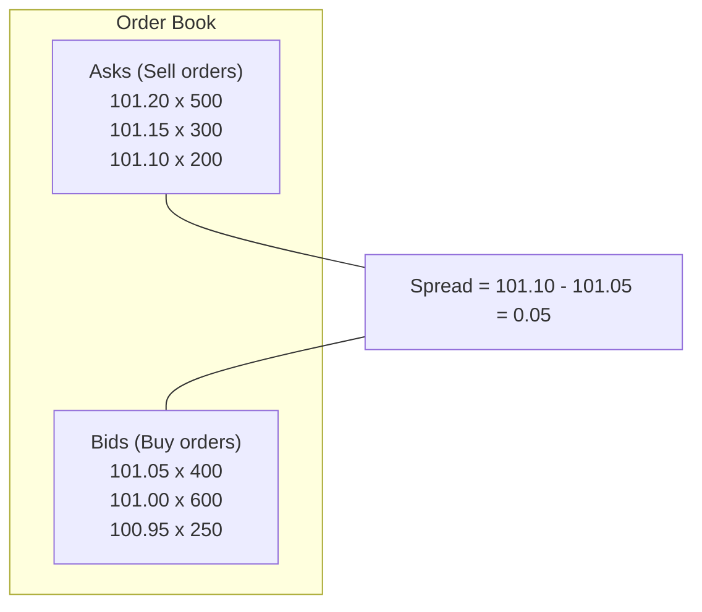

The depth of the order book matters. If the best bid is only for 100 shares and you want to sell 10,000 shares, your order will fill at progressively lower prices as it exhausts each bid level. This price impact is a real cost that differs from the bid-ask spread.

### Bid-Ask Spread
The bid-ask spread is the gap between the best bid and the best ask. It represents the cost of trading immediately. If you buy at the ask and sell at the bid, you lose the spread. This is a round-trip transaction cost.

For highly liquid stocks like Reliance or HDFC Bank, the spread might be 0.01% to 0.05% of the price. For illiquid stocks, the spread can be 1% or more. The spread effectively measures the market's assessment of the asset's liquidity.

```python
# Calculate round-trip transaction cost from spread
bid = 101.05
ask = 101.10
mid_price = (bid + ask) / 2
spread_bps = (ask - bid) / mid_price * 10000  # in basis points
print(f"Round-trip spread cost: {spread_bps:.1f} bps")
```

### Liquidity and Volume
Liquidity is the ability to trade large quantities without moving the price. Volume is the number of shares or contracts traded in a given period. High volume generally implies high liquidity, but the relationship is not exact: a stock can have high volume from many small trades but still be illiquid for large orders.

The practical implication for quant strategies: a strategy that looks profitable on paper may be impossible to execute at the assumed prices if the assets are illiquid. Your backtest should include liquidity filters that exclude assets where the position size would exceed a reasonable fraction of average daily volume.

```python
# Liquidity filter: position should not exceed 5% of average daily volume
position_value = 5000000  # Rs. 50 lakh position
avg_daily_volume = 100000  # 100,000 shares
current_price = 100
daily_value_traded = avg_daily_volume * current_price
participation_ratio = position_value / daily_value_traded
print(f"Participation rate: {participation_ratio:.1%}")
if participation_ratio > 0.05:
    print("WARNING: Position too large relative to liquidity")
```

### Tick Size
Tick size is the minimum price increment for an instrument. On the NSE, most stocks have a tick size of 5 paise. Some high-price stocks have a tick size of 1 paisa. Tick size matters because it constrains how tightly the spread can compress.

For high-frequency strategies (World 7), tick size is a critical parameter. If the tick size is large relative to the expected profit per trade, the strategy may be impossible to execute profitably even if the signal is correct.

### Slippage
Slippage is the difference between the expected execution price and the actual price. It has three components. First, the bid-ask spread: buying at the ask instead of the mid price incurs half the spread as cost. Second, market impact: large orders move prices against you as they consume order book depth. Third, delay: between your decision and execution, the market may move.

```python
expected_price = 101.00
actual_fill_price = 101.08
shares = 1000
slippage_cost = (actual_fill_price - expected_price) * shares
print(f"Slippage cost: Rs.{slippage_cost}")

# More realistic slippage model
def estimate_slippage(position_value, avg_daily_volume, spread_bps):
    """Simple slippage model based on position size relative to volume."""
    participation = position_value / (avg_daily_volume * current_price)
    market_impact_bps = 0.5 * spread_bps + 10 * participation
    return market_impact_bps
```

Ignoring slippage in a backtest is one of the most common reasons a profitable strategy loses money live. A strategy that earns 10 bps per trade but ignores 15 bps of slippage is not profitable. This is why Node 32 makes slippage modeling mandatory, not optional.

### Order Types and Execution
A market order executes immediately at the best available price. It guarantees execution but not price. Use market orders when execution certainty matters more than price, such as when entering or exiting a position based on a time-sensitive signal.

A limit order executes only at your specified price or better. It guarantees price but not execution. Use limit orders when you are willing to wait for a better price, such as when providing liquidity.

A stop order becomes a market order once a trigger price is hit. Use stop orders for stop-losses and breakout entries. The risk is that in fast markets, the actual fill price may be significantly worse than the trigger price.

```python
def simulate_market_order(price, side, spread):
    """Simulate the fill price for a market order."""
    if side == "buy":
        return price + spread / 2  # pays the ask
    else:
        return price - spread / 2  # receives the bid

def simulate_limit_order(price, limit_price, side):
    """Check if a limit order would fill."""
    if side == "buy" and limit_price >= price:
        return True
    elif side == "sell" and limit_price <= price:
        return True
    return False
```

Understanding order types is essential for realistic backtesting. Many beginner backtests assume market orders fill at the closing price with no slippage. In reality, the fill price depends on the order type, the liquidity of the asset, and the state of the order book at the time of execution.

### Market Impact Modeling
Market impact is the change in price caused by your own trading activity. For large orders, market impact can be the dominant cost. A simple model assumes impact proportional to the square root of the participation rate.

```python
def estimate_market_impact(order_value, daily_volume, price, spread_bps):
    """Estimate market impact in basis points."""
    participation = order_value / (daily_volume * price)
    if participation <= 0.01:
        return spread_bps / 2  # small order, just the spread
    else:
        # sqrt model: impact grows with square root of participation
        impact_bps = spread_bps / 2 + 10 * np.sqrt(participation * 100)
        return impact_bps

order_value = 5000000  # Rs. 50 lakh
daily_volume = 200000  # shares
price = 100
spread_bps = 10  # 0.1% spread

impact = estimate_market_impact(order_value, daily_volume, price, spread_bps)
total_cost = impact * 2  # round trip
print(f"One-way impact: {impact:.1f} bps ({impact/10000*order_value:.0f} Rs)")
print(f"Round-trip cost: {total_cost:.1f} bps")
```

Many profitable-looking strategies fail in live trading because they assume zero market impact. If your strategy generates a signal that many others also see and act on (crowded trade), the impact is amplified because everyone tries to trade in the same direction at the same time.

### High-Frequency Trading Considerations
Microstructure is especially important for high-frequency strategies that hold positions for minutes or seconds. At these time scales, the bid-ask spread, order book dynamics, and latency become the primary determinants of profitability.

HF traders use limit orders to provide liquidity and earn the spread, or use sophisticated order-routing algorithms to minimize market impact. They invest heavily in infrastructure to reduce latency: co-location, direct market access, and optimized networking hardware.

For most discretionary and systematic strategies covered in this course (holding periods of days to months), microstructure matters primarily through its impact on transaction costs. Include realistic estimates of spread, slippage, and market impact in every backtest.

```python
# Simple transaction cost model for backtesting
def transaction_cost(price, shares, side, spread_bps=10, impact_bps=5):
    """Total transaction cost for a trade."""
    spread_cost = spread_bps / 2  # half the spread
    total_bps = spread_cost + impact_bps
    cost = price * shares * total_bps / 10000
    return cost
```

### Implications for Backtest Design
Every market microstructure concept in this node affects how you should design your backtests. Use close-to-close prices only for first-pass analysis. For strategies that trade at specific times (market open, intraday signals), use the appropriate price. Include transaction costs that account for spread and market impact based on historical volume and volatility.

Filter out assets that are too illiquid for your strategy. If your average position is 1% of the stock's average daily volume, market impact will be small. If it is 10% or more, impact will dominate returns. A general rule: keep each position below 2% of average daily dollar volume. Following this rule prevents your own trading from becoming the dominant source of price movement in the assets you trade. Backtests that ignore this constraint will overestimate real-world capacity. Always include a capacity estimate as part of your backtest output. Capacity analysis separates academic strategies from those that can actually be implemented. A strategy with a Sharpe of 2.0 that can only deploy Rs. 1 crore is less valuable than a strategy with a Sharpe of 1.2 that can deploy Rs. 100 crore.

---

### 🔗 Free Resources
- [Investopedia — Market Microstructure](https://www.investopedia.com/terms/m/microstructure.asp) — free reference
- [Zerodha Varsity — Markets and Taxation Module](https://zerodha.com/varsity/) — free, India-context on order types
- [QuantStart — Market Microstructure Basics](https://www.quantstart.com/) — free articles

### 📝 Quiz
1. **What does the bid-ask spread represent?**
   - A) The cost of trading immediately at the current prices ✅
   - B) The minimum price increment set by the exchange
   - C) The total number of shares traded during one day
   - D) The fee charged by the broker on every single order

2. **Which of these does a market order guarantee?**
   - A) A specific price for the order that you submit
   - B) Execution, but not a specific guaranteed price ✅
   - C) Zero slippage on every fill that you receive
   - D) A better price than any limit order ever offers

3. **On the NSE, what is the tick size for most stocks?**
   - A) One rupee for every stock that is listed
   - B) Fifty paise for every stock on the market
   - C) Ten paise for liquid stocks and more
   - D) Five paise, though some stocks use one paisa ✅

4. **The best bid is 100.00 and the best ask is 100.20. What is the spread in basis points of the mid price?**
   - A) About 10 basis points of the mid price
   - B) About 15 basis points of the mid price
   - C) About 20 basis points of the mid price ✅
   - D) About 25 basis points of the mid price

5. **A strategy's position size is 8% of the stock's average daily volume, but the backtest rule says to stay below 5%. What does the rule suggest?**
   - A) The position is safe and needs no change at all
   - B) The position is too large and may move the market ✅
   - C) The position is too small to be worth trading
   - D) The rule only applies to intraday strategies

6. **The best bid is 101.05 for 400 shares, the next bid is 101.00 for 600 shares, and the ask is 101.10. You market-sell 600 shares. What is your average fill price?**
   - A) Rs 101.05, since your order fills at the best bid first
   - B) Rs 101.10, since you pay the ask on market sells
   - C) Rs 101.03, the average of the two bid levels ✅
   - D) Rs 101.00, since you get the worst price possible

7. **A trader posts a large resting buy limit order below the current price. How does this affect the market?**
   - A) It adds depth, making large sells easier to absorb ✅
   - B) It forces the exchange to widen the spread
   - C) It guarantees a profitable fill for the trader
   - D) It reduces the tick size for all market orders

8. **What is a stop order?**
   - A) An order that only fills during the closing auction
   - B) An order that executes at a fixed price or better
   - C) An order that becomes a market order once triggered ✅
   - D) An order that expires if unfilled within a session

9. **A strategy earns 10 basis points per trade, but slippage costs 15 basis points per round trip. What is the net result per trade?**
   - A) About +25 bps, since costs add to returns
   - B) About -5 bps, so the strategy loses money ✅
   - C) About -15 bps, since only the spread counts
   - D) About 0 bps, since the costs offset exactly

10. **Which statement about backtest capacity analysis is correct?**
    - A) Capacity only matters for institutional sized funds
    - B) A high Sharpe strategy always beats lower capacity
    - C) Capacity is irrelevant once slippage is included
    - D) Small positions relative to volume keep impact low ✅

---
---

## Node 20: Risk Fundamentals

### 🎯 Hook
"How much could I lose, and how likely is that?" is the question every strategy must answer before every question about returns. This node builds the risk vocabulary that governs every design decision from here forward.

### 📌 Learning Objectives
- Understand volatility as a risk measure
- Distinguish systematic from unsystematic risk
- Understand beta and alpha
- Explain diversification's mathematical basis
- Compute and interpret drawdown
- Understand VaR and Expected Shortfall

---

### Volatility as a Risk Measure
Volatility, defined as the standard deviation of returns, is the most widely used risk measure in finance. It captures the dispersion of returns around the mean. Higher volatility means higher uncertainty, which investors generally consider undesirable.

The limitation of volatility is that it treats upside and downside moves symmetrically. A stock that goes up 5% in a day contributes as much to volatility as one that goes down 5%. Most investors do not consider upside volatility to be risky. This limitation motivates alternative risk measures like the Sortino ratio (Node 36) and downside deviation.

Despite this limitation, volatility remains the standard because of its mathematical convenience. It is well-behaved under portfolio aggregation, scales with the square root of time, and forms the denominator of the Sharpe ratio.

```python
import numpy as np
import pandas as pd

# Compare upside and downside volatility
returns = np.random.normal(0.0005, 0.01, 1000)
upside_vol = np.std(returns[returns > 0])
downside_vol = np.std(returns[returns < 0])
print(f"Upside vol: {upside_vol:.4f}, Downside vol: {downside_vol:.4f}")
print(f"Total vol: {np.std(returns):.4f}")
```

### Annualized Volatility
Volatility is typically annualized for comparison across assets and time frames. For daily returns, multiply the daily standard deviation by the square root of 252. For monthly returns, multiply by the square root of 12.

```python
daily_returns = np.random.normal(0.0005, 0.01, 252)
daily_vol = np.std(daily_returns, ddof=1)
annual_vol = daily_vol * np.sqrt(252)
print(f"Daily volatility: {daily_vol:.4f}")
print(f"Annualized volatility: {annual_vol:.2%}")
```

### Systematic vs Unsystematic Risk
Total risk can be decomposed into two components. Systematic risk affects the entire market. Interest rate changes, economic recessions, and geopolitical events are sources of systematic risk. No amount of diversification within a single market can eliminate systematic risk.

Unsystematic risk is specific to individual companies or sectors. A factory fire, a bad earnings report, or a regulatory fine are sources of unsystematic risk. By holding many uncorrelated assets, you can reduce unsystematic risk to near zero.

The Capital Asset Pricing Model (CAPM) formalizes this: the expected return of an asset depends only on its systematic risk (beta), because unsystematic risk can be diversified away for free.

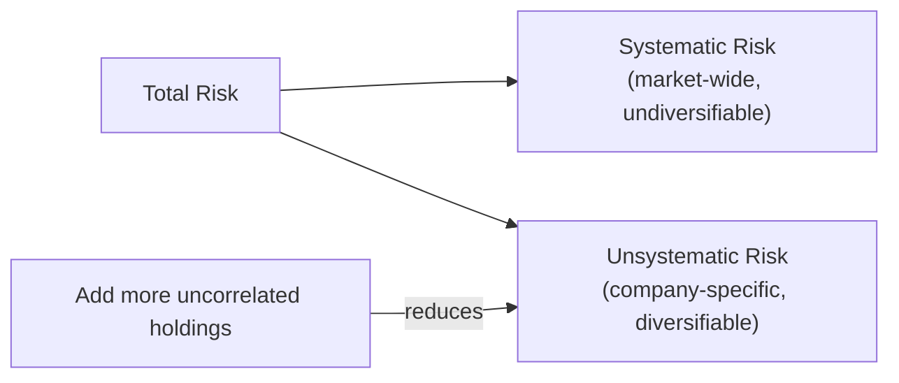

```python
# Demonstrate diversification reducing unsystematic risk
import numpy as np

n_assets_list = [1, 5, 10, 20, 50, 100]
portfolio_vols = []

for n in n_assets_list:
    np.random.seed(42)
    # Each asset: market factor + idiosyncratic noise
    market = np.random.normal(0.0005, 0.01, 252)
    idiosyncratic = np.random.normal(0, 0.02, (252, n))
    returns = 0.5 * market.reshape(-1, 1) + 0.5 * idiosyncratic
    
    # Equal-weight portfolio
    weights = np.ones(n) / n
    portfolio_returns = returns @ weights
    portfolio_vols.append(np.std(portfolio_returns, ddof=1) * np.sqrt(252))

for i, n in enumerate(n_assets_list):
    print(f"Assets: {n:3d}, Portfolio vol: {portfolio_vols[i]:.2%}")
```

Notice that portfolio volatility decreases as you add assets, but it approaches a floor: the systematic risk that cannot be diversified away.

### Beta and Alpha
Beta measures sensitivity to market movements. A stock with beta of 1.2 tends to move 20% more than the market. If the market goes up 10%, the stock tends to go up 12%. If the market goes down 10%, the stock tends to go down 12%.

Beta is estimated by regressing the stock's returns on market returns (Node 12). The slope coefficient of this regression is beta. The intercept is alpha.

Alpha is the excess return not explained by market exposure. A positive alpha means the stock outperformed its expected return given its beta. Generating positive, consistent alpha is the goal of every active quant strategy.

```python
import numpy as np
import statsmodels.api as sm

# Estimate beta and alpha
np.random.seed(42)
market_returns = np.random.normal(0.0005, 0.01, 252)
stock_returns = 0.0003 + 1.2 * market_returns + np.random.normal(0, 0.005, 252)

X = sm.add_constant(market_returns)
model = sm.OLS(stock_returns, X).fit()
alpha, beta = model.params
print(f"Alpha (annualized): {alpha * 252:.2%}")
print(f"Beta: {beta:.2f}")
```

### Diversification
Diversification is the only free lunch in finance. The mathematical proof is in the portfolio variance formula for two assets:

$$\sigma_p^2 = w_1^2\sigma_1^2 + w_2^2\sigma_2^2 + 2w_1 w_2 \rho_{12}\sigma_1\sigma_2$$

When the correlation rho is less than 1, the portfolio variance is less than the weighted sum of individual variances. When rho is negative, the portfolio variance can be lower than either individual asset's variance.

```python
# Explore the diversification benefit at different correlation levels
import numpy as np

def portfolio_vol(w1, sig1, sig2, rho):
    w2 = 1 - w1
    var = w1**2 * sig1**2 + w2**2 * sig2**2 + 2*w1*w2*rho*sig1*sig2
    return np.sqrt(var)

sig1, sig2 = 0.20, 0.30  # annualized volatilities
correlations = [-0.5, 0.0, 0.5, 0.9]
w1 = 0.5

for rho in correlations:
    vol = portfolio_vol(w1, sig1, sig2, rho)
    avg_vol = w1 * sig1 + (1-w1) * sig2
    benefit = avg_vol - vol
    print(f"Correlation: {rho:.1f}, Portfolio vol: {vol:.2%}, Diversification benefit: {benefit:.2%}")
```

The diversification benefit increases as correlation decreases. This is why international diversification, multi-asset portfolios, and alternative strategies are valuable: they bring low-correlation return streams into the portfolio.

### Drawdown
Drawdown measures the decline from a portfolio's peak value to a subsequent trough. It captures the worst realized loss an investor would have experienced, making it one of the most emotionally relevant risk metrics.

Maximum drawdown is the largest peak-to-trough decline over the entire history. Average drawdown and drawdown duration provide additional context. A strategy with high returns but a 50% drawdown may be unacceptable to investors who cannot tolerate losing half their capital.

```python
import numpy as np
import pandas as pd

# Simulate a strategy with a significant drawdown
np.random.seed(42)
cumulative_returns = pd.Series(
    (1 + np.random.normal(0.0003, 0.012, 500)).cumprod()
)

# Add a crash
cumulative_returns.iloc[300:330] *= np.linspace(1, 0.7, 30)

running_max = cumulative_returns.cummax()
drawdown = (cumulative_returns - running_max) / running_max
max_drawdown = drawdown.min()
drawdown_duration = (drawdown < 0).sum()

print(f"Maximum Drawdown: {max_drawdown:.2%}")
print(f"Days in drawdown: {drawdown_duration}")

# Recovery: when does the portfolio regain its prior peak?
if max_drawdown < 0:
    peak_idx = cumulative_returns.idxmax()
    recovery_idx = cumulative_returns[cumulative_returns >= running_max.max()].index[0]
    days_to_recovery = (recovery_idx - peak_idx).days
    print(f"Days to recover from max drawdown: {days_to_recovery}")
```

### Value at Risk and Expected Shortfall
Value at Risk (VaR) answers the question: what is the maximum loss I can expect over a given period with a given confidence level? A 1-day 95% VaR of Rs. 50,000 means there is only a 5% chance of losing more than Rs. 50,000 in a single day.

VaR can be computed in three ways. The parametric method assumes returns follow a normal distribution and uses the mean and standard deviation. The historical method uses actual historical returns and reads off the relevant percentile. The Monte Carlo method simulates thousands of possible scenarios.

Expected Shortfall (ES, also called CVaR) addresses VaR's main limitation: VaR tells you the threshold but not how bad losses are beyond it. Expected Shortfall measures the average loss in the worst-case scenarios beyond the VaR threshold.

```python
import numpy as np

returns = np.random.normal(0.0003, 0.012, 10000)

# Parametric VaR
from scipy import stats
var_95_parametric = stats.norm.ppf(0.05, loc=np.mean(returns), scale=np.std(returns))
print(f"Parametric 95% VaR (1-day): {var_95_parametric:.4%}")

# Historical VaR
var_95_historical = np.percentile(returns, 5)
print(f"Historical 95% VaR (1-day): {var_95_historical:.4%}")

# Expected Shortfall (beyond VaR)
es_95 = returns[returns <= var_95_historical].mean()
print(f"95% Expected Shortfall: {es_95:.4%}")

# Annualize
print(f"Annualized 95% VaR: {var_95_historical * np.sqrt(252):.2%}")
print(f"Annualized 95% ES: {es_95 * np.sqrt(252):.2%}")
```

For most financial data, the true VaR is larger than the parametric estimate because of fat tails. The historical method naturally captures fat tails, but requires sufficient data. A rule of thumb: at least 500 observations for 95% VaR, and at least 1000 observations for 99% VaR.

### The Risk-Return Tradeoff
All of these risk measures serve one purpose: to evaluate whether a strategy's expected return justifies its risk. The Sharpe ratio (return per unit of volatility), the Sortino ratio (return per unit of downside deviation), and the Calmar ratio (return per unit of maximum drawdown) each capture a different aspect of this tradeoff.

The fundamental principle: higher expected returns come with higher risk. Any strategy that claims high returns with low risk deserves intense skepticism. If it sounds too good to be true, it usually is. Understanding this relationship is the foundation of every risk management decision in the course. Always ask: what risk is being taken to generate this return, and is the compensation adequate? The best strategies are those where the answer is clearly yes across multiple risk measures. No single metric tells the whole story, which is why you should always examine the full risk profile. Combining volatility, drawdown, VaR, and expected shortfall gives a comprehensive picture of strategy risk. Each metric captures a different dimension of risk, and together they leave no blind spots. Mastering these risk measures is essential before moving to strategy design.

---

### 🔗 Free Resources
- [Investopedia — Systematic vs Unsystematic Risk](https://www.investopedia.com/ask/answers/09/systematic-unsystematic-risk.asp) — free
- [Khan Academy — Beta and CAPM](https://www.khanacademy.org/economics-finance-domain/core-finance/stock-and-bonds/beta-and-CAPM) — free
- [PyPortfolioOpt — Documentation](https://pyportfolioopt.readthedocs.io/) — free, covers VaR/risk in practice

### 📝 Quiz
1. **How do you annualize a daily volatility estimate?**
   - A) Take the square root of the daily standard deviation
   - B) Multiply the daily standard deviation by 252 exactly
   - C) Divide the daily standard deviation by 252 days
   - D) Multiply daily volatility by the square root of 252 ✅

2. **A stock with beta = 1.5 tends to:**
   - A) Move independently of the market's direction
   - B) Move roughly 50% more than the market's direction ✅
   - C) Always outperform the market over the long run
   - D) Have zero volatility in its daily return series

3. **Expected Shortfall differs from VaR in that it:**
   - A) Is always a smaller number than the VaR figure
   - B) Measures average losses beyond the VaR threshold ✅
   - C) Ignores tail risk entirely and only looks at median
   - D) Is unrelated to VaR in every possible way

4. **A portfolio holds two assets equally, with volatilities of 20% and 30% and correlation exactly 1. What is the portfolio volatility?**
   - A) 25%, the average of the two volatilities ✅
   - B) 20%, the lower of the two volatilities
   - C) 30%, the higher of the two volatilities
   - D) 50%, the sum of the two volatilities

5. **A 1-day 95% VaR of Rs 50,000 means:**
   - A) There is a 95% chance of losing Rs 50,000 today
   - B) The maximum possible daily loss is always Rs 50,000
   - C) The portfolio cannot gain more than Rs 50,000 today
   - D) There is a 5% chance of losing over Rs 50,000 in one day ✅

6. **A strategy has a daily volatility of 1.5%. What is its approximate annualized volatility?**
   - A) About 15% for the full year
   - B) About 19% for the full year
   - C) About 24% for the full year ✅
   - D) About 28% for the full year

7. **Which type of risk cannot be reduced by diversification?**
   - A) Unsystematic risk of a single company
   - B) Idiosyncratic risk of a sector's firms
   - C) Systematic risk that affects the entire market ✅
   - D) Firm specific risk such as a factory fire

8. **Why does parametric VaR tend to underestimate true VaR for real financial returns?**
   - A) The historical method uses too little data
   - B) Real returns are always perfectly normal in shape
   - C) Real returns have fatter tails than normal models ✅
   - D) Parametric VaR assumes zero volatility over time

9. **What is maximum drawdown?**
   - A) The largest peak-to-trough decline in the history ✅
   - B) The average daily loss across the whole period
   - C) The total profit divided by the total risk taken
   - D) The longest streak of consecutive losing days

10. **A strategy earns high returns but suffers a 50% drawdown. What should an investor consider?**
    - A) Whether they can tolerate losing half of their capital ✅
    - B) Whether the strategy trades on more liquid assets
    - C) Whether the Sharpe ratio exceeds one point five
    - D) Whether the strategy uses the historical VaR method

---
---

# WORLD 6 — Econometrics & Time Series

## Node 21: Time Series Analysis

### 🎯 Hook
Financial time series break the "independent observations" assumption behind most basic statistics — today's price depends on yesterday's. This node gives you the tools built specifically for that dependency.

### 📌 Learning Objectives
- Identify trend and seasonality in a series
- Test for stationarity and unit roots
- Read ACF and PACF plots
- Apply differencing to achieve stationarity
- Understand AR, MA, and ARIMA models conceptually

---

### Trend and Seasonality
Time series data typically contains three components: trend, seasonality, and residual noise. The trend is a long-term upward or downward drift. In financial markets, a bull market represents a positive trend and a bear market a negative trend.

Seasonality is a pattern that repeats at fixed intervals. Financial data exhibits multiple forms of seasonality. The January effect refers to the historical tendency for stock prices to rise in January. The turn-of-the-month effect shows higher returns around month ends. Day-of-week effects show that returns on Mondays differ from returns on other days. These seasonal patterns are well-documented but tend to weaken once they are widely known and traded upon.

Decomposing a time series into its components helps you understand which patterns are systematic and which are noise.

```python
from statsmodels.tsa.seasonal import seasonal_decompose
import pandas as pd

# Decompose a time series
dates = pd.date_range("2024-01-01", periods=504, freq="B")
np.random.seed(42)
trend = np.linspace(0, 0.2, 504)
seasonal = 0.02 * np.sin(np.arange(504) * 2 * np.pi / 63)  # ~quarterly cycle
noise = np.random.normal(0, 0.01, 504)
series = pd.Series(100 * (1 + trend + seasonal + noise), index=dates)

decomposition = seasonal_decompose(series, model="additive", period=63)
print(f"Trend component range: {decomposition.trend.min():.2f} to {decomposition.trend.max():.2f}")
print(f"Seasonal component range: {decomposition.seasonal.min():.4f} to {decomposition.seasonal.max():.4f}")
```

### Stationarity and Unit Roots
Stationarity is a critical concept in time series analysis. A stationary series has constant mean, constant variance, and constant autocorrelation structure over time. Most standard statistical models require stationarity to produce reliable results.

Raw price series are almost always non-stationary because they trend upward over time (reflecting economic growth and inflation). Returns, however, are typically much closer to stationary: the average daily return is roughly constant over long periods, and the volatility may change but the series does not have a persistent trend.

The Augmented Dickey-Fuller (ADF) test is the standard statistical test for stationarity. The null hypothesis is that the series has a unit root, meaning it is non-stationary. A low p-value (below 0.05) rejects this null hypothesis, providing evidence that the series is stationary.

```python
from statsmodels.tsa.stattools import adfuller
import numpy as np
import pandas as pd

# Generate a non-stationary series (random walk)
np.random.seed(42)
n = 500
random_walk = 100 + np.cumsum(np.random.normal(0, 1, n))
returns = np.diff(random_walk)

# Test prices (non-stationary)
result_prices = adfuller(random_walk)
print(f"Prices ADF: stat={result_prices[0]:.3f}, p-value={result_prices[1]:.4f}")
print(f"  Prices are {'stationary' if result_prices[1] < 0.05 else 'non-stationary'}")

# Test returns (stationary)
result_returns = adfuller(returns)
print(f"Returns ADF: stat={result_returns[0]:.3f}, p-value={result_returns[1]:.4f}")
print(f"  Returns are {'stationary' if result_returns[1] < 0.05 else 'non-stationary'}")
```

The ADF statistic for prices should be close to zero (non-stationary), while for returns it should be a large negative number (stationary). This is why quant models work on returns, not raw prices.

### Autocorrelation Function (ACF) and Partial ACF (PACF)
The ACF measures the correlation between a series and its lagged values. If today's return has a statistically significant correlation with yesterday's return, the ACF at lag 1 will be significant.

The PACF measures the correlation with a lagged value after removing the effects of shorter lags. If the PACF drops sharply after lag p, this suggests an AR(p) model. If the ACF drops sharply after lag q, this suggests an MA(q) model.

```python
from statsmodels.graphics.tsaplots import plot_acf, plot_pacf

# Generate AR(1) process: y_t = 0.7 * y_{t-1} + epsilon
np.random.seed(42)
n = 500
ar_returns = np.zeros(n)
for t in range(1, n):
    ar_returns[t] = 0.7 * ar_returns[t-1] + np.random.normal(0, 0.01)

plot_acf(ar_returns, lags=20)
plot_pacf(ar_returns, lags=20)
```

The ACF of an AR(1) process decays gradually, while the PACF cuts off sharply after lag 1. These patterns help you identify the appropriate model order. In practice, financial returns show weak autocorrelation, meaning the ACF and PACF are mostly within the confidence bands.

### Differencing
Differencing is the standard technique to convert a non-stationary series into a stationary one. First-order differencing subtracts each value from the previous one. This removes linear trends. Second-order differencing subtracts the first differences, removing quadratic trends.

```python
# First-order differencing
prices_diff = prices.diff().dropna()

# Check if differencing achieved stationarity
result_diff = adfuller(prices_diff)
print(f"After differencing: p-value = {result_diff[1]:.4f}")

# Second-order differencing (rarely needed in finance)
prices_diff2 = prices_diff.diff().dropna()
```

In most financial applications, first differencing of prices (which produces returns) is sufficient to achieve stationarity. This is why nearly all quant models are estimated on returns or log returns.

### Autoregressive (AR) Models
An AR(p) model expresses the current value as a linear combination of p previous values plus noise:

$$y_t = c + \phi_1 y_{t-1} + \phi_2 y_{t-2} + \ldots + \phi_p y_{t-p} + \epsilon_t$$

The AR model captures mean-reversion or momentum effects. A positive phi_1 coefficient means high values tend to be followed by high values (momentum). A negative phi_1 means high values tend to be followed by low values (mean reversion).

### Moving Average (MA) Models
An MA(q) model expresses the current value as a linear combination of q previous forecast errors:

$$y_t = c + \epsilon_t + \theta_1 \epsilon_{t-1} + \theta_2 \epsilon_{t-2} + \ldots + \theta_q \epsilon_{t-q}$$

The MA model captures the effect of unpredictable shocks. If a large shock affects returns for several periods, the MA terms capture this propagation.

### ARIMA Models
ARIMA combines differencing, autoregression, and moving average components. ARIMA(p,d,q) means p autoregressive terms, d differencing steps, and q moving average terms.

```python
from statsmodels.tsa.arima.model import ARIMA

# Fit ARIMA(1,1,1) to price data
model = ARIMA(prices, order=(1, 1, 1))
fitted = model.fit()
print(fitted.summary())

# Forecast the next 10 periods
forecast = fitted.forecast(steps=10)
print(f"Forecast: {forecast}")
```

ARIMA models are most useful for short-term forecasting. For long-term financial forecasting, they perform poorly because market dynamics change over time (regime shifts). They remain valuable, however, as baseline models and for understanding the temporal structure of return series.

### Model Selection: AIC and BIC
Choosing the right ARIMA order is part art and part science. The Akaike Information Criterion (AIC) and Bayesian Information Criterion (BIC) provide quantitative guidance. Both measure goodness of fit while penalizing model complexity. Lower values indicate better models. BIC penalizes complexity more heavily than AIC.

```python
import warnings
from statsmodels.tsa.arima.model import ARIMA

# Compare different ARIMA orders
best_aic, best_bic = float("inf"), float("inf")
best_order_aic, best_order_bic = None, None

for p in range(0, 4):
    for q in range(0, 4):
        try:
            model = ARIMA(prices, order=(p, 1, q))
            fitted = model.fit()
            if fitted.aic < best_aic:
                best_aic = fitted.aic
                best_order_aic = (p, 1, q)
            if fitted.bic < best_bic:
                best_bic = fitted.bic
                best_order_bic = (p, 1, q)
        except:
            continue

print(f"Best AIC: order={best_order_aic}, AIC={best_aic:.2f}")
print(f"Best BIC: order={best_order_bic}, BIC={best_bic:.2f}")
```

In practice, the AIC and BIC often suggest different orders. AIC tends to select more complex models, BIC simpler ones. A reasonable approach is to consider both and validate the chosen model on out-of-sample data.

### Residual Diagnostics for ARIMA
After fitting an ARIMA model, check whether the residuals resemble white noise. If they do, the model has captured all available information. If they show patterns, the model can be improved.

The Ljung-Box test formally tests whether residuals are independent. A high p-value (above 0.05) suggests the residuals are white noise.

```python
from statsmodels.stats.diagnostic import acorr_ljungbox

residuals = fitted.resid
lb_test = acorr_ljungbox(residuals, lags=[10], return_df=True)
print(f"Ljung-Box p-value: {lb_test['lb_pvalue'].iloc[0]:.4f}")

# Plot residuals and ACF
import matplotlib.pyplot as plt
fig, axes = plt.subplots(2, 1, figsize=(10, 6))
axes[0].plot(residuals)
axes[0].set_title("ARIMA Residuals")
plot_acf(residuals.dropna(), lags=20, ax=axes[1])
plt.tight_layout()
```

If the residuals show significant autocorrelation at any lag, consider increasing the model order or adding seasonal terms.

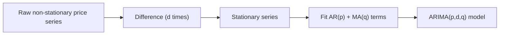

### Practical Application: Building a Mean-Reversion Signal
Here is how time series analysis informs a mean-reversion trading signal. If the ACF shows negative autocorrelation at lag 1, a large positive return today suggests a negative return tomorrow.

```python
import numpy as np
import pandas as pd
from statsmodels.tsa.stattools import acf

np.random.seed(42)
prices = 100 * np.exp(np.cumsum(np.random.normal(0.0003, 0.01, 504)))
returns = prices.pct_change().dropna()

# Compute autocorrelation
acf_values = acf(returns, nlags=10)
print(f"Lag 1 autocorrelation: {acf_values[1]:.3f}")

# Mean-reversion signal: go short when returns are high, long when low
signal = -returns.rolling(20).apply(lambda x: x.iloc[-1] - x.mean()) / returns.rolling(20).std()
print(f"Signal range: {signal.min():.2f} to {signal.max():.2f}")
```

A negative lag 1 autocorrelation supports a mean-reversion strategy. A positive lag 1 autocorrelation supports a momentum strategy. This direct link between time series analysis and strategy design makes the concepts in this node practically relevant for every trading strategy you will develop.

### Forecasting Evaluation
When you generate forecasts from a time series model, you need to evaluate their accuracy. Common metrics include Mean Absolute Error (MAE) and Root Mean Squared Error (RMSE). Lower values indicate better forecasts.

```python
from sklearn.metrics import mean_absolute_error, mean_squared_error

# Generate forecasts and compare to actual
train = prices[:400]
test = prices[400:]
model = ARIMA(train, order=(1, 1, 1)).fit()
forecast = model.forecast(steps=len(test))

mae = mean_absolute_error(test, forecast)
rmse = np.sqrt(mean_squared_error(test, forecast))
print(f"MAE: {mae:.4f}, RMSE: {rmse:.4f}")

# Compare to naive forecast (last observation carried forward)
naive_mae = mean_absolute_error(test, train.iloc[-1])
print(f"Naive MAE: {naive_mae:.4f}")
print(f"ARIMA improvement: {(1 - mae / naive_mae):.1%}")
```

A good forecast should beat a naive baseline. If your ARIMA model cannot beat simply using the last observation, the model is not adding value. In practice, financial time series are notoriously difficult to forecast, and beating the naive baseline is a meaningful achievement.

---

### 🔗 Free Resources
- [statsmodels — Time Series Analysis Documentation](https://www.statsmodels.org/stable/tsa.html) — free, official
- [Towards Data Science — ARIMA Explained](https://towardsdatascience.com/) — free articles (search "ARIMA")
- [IBM Technology — What is Time Series Analysis? (YouTube)](https://www.youtube.com/watch?v=GE3JOFwTWVM) — free

### 📝 Quiz
1. **Why do quant models typically use returns rather than raw prices?**
   - A) Returns are much closer to being stationary ✅
   - B) Raw prices contain no information at all
   - C) Returns are easier to compute by hand
   - D) Prices cannot be plotted on a chart

2. **The Augmented Dickey-Fuller test checks for:**
   - A) Whether returns follow a normal distribution
   - B) The presence of a unit root (non-stationarity) ✅
   - C) Whether two asset series are correlated
   - D) The presence of unusual outliers in the data

3. **An ARIMA(1,1,1) model means:**
   - A) One differencing, one AR and one MA term ✅
   - B) A purely moving average model was fitted
   - C) The series was never differenced at all
   - D) The model requires no historical data

4. **An AR(1) model with phi_1 = -0.6 implies that high values:**
   - A) Tend to be followed by even higher values
   - B) Tend to be followed by lower values, mean reversion ✅
   - C) Have no effect whatsoever on the following values
   - D) Cause the series to become non-stationary

5. **Which time series component repeats at fixed intervals?**
   - A) Trend, which drifts slowly over the long run
   - B) Noise, which is completely unpredictable
   - C) Seasonality, such as day-of-week effects ✅
   - D) All of the components repeat at fixed intervals

6. **An ADF test on a series returns a p-value of 0.001. What do you conclude?**
   - A) The series has a unit root and is non-stationary
   - B) The test failed due to insufficient data here
   - C) The series is stationary at the 5% level now ✅
   - D) The series must be differenced twice at once

7. **The ACF of a series decays gradually while the PACF cuts off after lag 1. Which model fits best?**
   - A) An MA(1) model with one moving average term
   - B) An AR(1) model with one autoregressive term ✅
   - C) A pure random walk with no structure at all
   - D) An ARIMA model with seasonal differencing

8. **What does the Ljung-Box test check after fitting a model?**
   - A) Whether the fitted coefficients are significant
   - B) Whether the residuals follow a normal distribution
   - C) Whether the forecast errors grow over time
   - D) Whether the residuals are independent white noise ✅

9. **How does the BIC differ from the AIC in model selection?**
   - A) The BIC never penalizes model complexity
   - B) The BIC prefers more complex models always
   - C) The BIC penalizes complexity more heavily ✅
   - D) The BIC ignores the likelihood function

10. **AIC selects a complex ARIMA order while BIC selects a simpler one. What is the best practical approach?**
    - A) Always trust the BIC and ignore the AIC result
    - B) Pick the most complex model to maximize fit
    - C) Use the AIC model only for longer horizons
    - D) Validate both candidates out of sample and choose ✅

---
---

## Node 22: Applied Econometrics (Core)

### 🎯 Hook
Real financial data routinely breaks the clean assumptions behind Node 12's regression. This node teaches you to recognize when that's happening and what to do about it — the difference between a naive regression and a defensible one.

### 📌 Learning Objectives
- Detect and address heteroskedasticity
- Detect and address autocorrelation
- Detect and address multicollinearity
- Know when and why to use robust standard errors

---

### Heteroskedasticity
Heteroskedasticity occurs when the variance of the residuals is not constant across observations. In financial data, this is the norm rather than the exception. During periods of high market volatility, residual variance increases. During calm periods, it shrinks.

This violates a core OLS assumption from Node 12, which requires constant variance (homoskedasticity) for standard errors and p-values to be valid. With heteroskedasticity present, standard errors are biased, which means your hypothesis tests may be unreliable.

The Breusch-Pagan test formally tests for heteroskedasticity. The null hypothesis is constant variance. A low p-value indicates heteroskedasticity is present.

```python
from statsmodels.stats.diagnostic import het_breuschpagan
import numpy as np
import statsmodels.api as sm

# Simulate data with heteroskedasticity
np.random.seed(42)
n = 500
X = np.random.normal(0, 1, n)
# Variance increases with X
y = 0.5 * X + np.random.normal(0, 0.5 * np.abs(X) + 0.1, n)
model = sm.OLS(y, sm.add_constant(X)).fit()

bp_test = het_breuschpagan(model.resid, model.model.exog)
print(f"Breusch-Pagan p-value: {bp_test[1]:.4f}")
if bp_test[1] < 0.05:
    print("Evidence of heteroskedasticity detected")
```

When heteroskedasticity is present, you have two options. The first is to use heteroskedasticity-consistent standard errors (HC0, HC1, HC2, HC3), which adjust the standard errors to be valid. The second is to model the variance explicitly using methods like GARCH (Node 27).

### Autocorrelation
Autocorrelation in residuals means that today's error is correlated with yesterday's error. This is extremely common in time series regressions because financial returns exhibit volatility clustering and momentum effects.

When residuals are autocorrelated, the effective sample size is smaller than the actual sample size, and standard errors are too small. This leads to inflated t-statistics and p-values that are too significant.

The Durbin-Watson statistic tests for first-order autocorrelation. The statistic ranges from 0 to 4. A value around 2 indicates no autocorrelation. Values below 2 indicate positive autocorrelation, and values above 2 indicate negative autocorrelation.

```python
from statsmodels.stats.stattools import durbin_watson

# Simulate autocorrelated residuals
np.random.seed(42)
n = 500
X = np.random.normal(0, 1, n)
errors = np.zeros(n)
for t in range(1, n):
    errors[t] = 0.8 * errors[t-1] + np.random.normal(0, 0.01)
y = 0.5 * X + errors

model = sm.OLS(y, sm.add_constant(X)).fit()
dw_stat = durbin_watson(model.resid)
print(f"Durbin-Watson statistic: {dw_stat:.3f}")
if dw_stat < 1.5 or dw_stat > 2.5:
    print("Autocorrelation likely present")
```

Using HAC (heteroskedasticity and autocorrelation consistent) standard errors is the standard remedy. These standard errors remain valid even when both heteroskedasticity and autocorrelation are present.

### Multicollinearity
Multicollinearity occurs when predictor variables are highly correlated with each other. This makes it difficult to isolate each predictor's individual effect on the dependent variable. The coefficients become unstable: small changes in the data can produce large changes in the estimated coefficients.

Multicollinearity is common when using many overlapping technical indicators as regression inputs. For example, using both a 10-day and 20-day moving average as separate predictors will create multicollinearity because they are highly correlated.

The Variance Inflation Factor (VIF) measures how much the variance of a coefficient is inflated due to multicollinearity. A VIF of 1 means no multicollinearity. VIF above 5 indicates moderate multicollinearity. VIF above 10 indicates severe multicollinearity that should be addressed.

```python
from statsmodels.stats.outliers_influence import variance_inflation_factor
import pandas as pd

# Simulate multicollinear predictors
np.random.seed(42)
n = 200
X1 = np.random.normal(0, 1, n)
X2 = 0.9 * X1 + 0.1 * np.random.normal(0, 1, n)  # highly correlated with X1
X3 = np.random.normal(0, 1, n)  # independent
X_df = pd.DataFrame({"X1": X1, "X2": X2, "X3": X3})

vif_data = pd.DataFrame({
    "feature": X_df.columns,
    "VIF": [variance_inflation_factor(X_df.values, i) for i in range(X_df.shape[1])]
})
print(vif_data)
```

X2 should have a high VIF because it is almost a linear combination of X1. The solutions are to drop one of the correlated predictors, combine them into a single index, or use regularization methods like Ridge or Lasso.

### Robust Standard Errors
Rather than fixing heteroskedasticity or autocorrelation directly, you can use robust standard errors that remain valid even when these violations are present. The HC (heteroskedasticity-consistent) family handles heteroskedasticity. The HAC (heteroskedasticity and autocorrelation consistent) family handles both.

```python
# Standard OLS (may have invalid standard errors)
model_standard = sm.OLS(y, X).fit()

# Robust to heteroskedasticity only
model_hc = sm.OLS(y, X).fit(cov_type='HC3')

# Robust to both heteroskedasticity and autocorrelation
model_hac = sm.OLS(y, X).fit(cov_type='HAC', cov_kwds={'maxlags': 5})

# Compare standard errors
import pandas as pd
comparison = pd.DataFrame({
    "Standard": model_standard.bse,
    "HC3": model_hc.bse,
    "HAC": model_hac.bse
}, index=["const", "X1"])
print(comparison)
```

The robust standard errors are typically larger than the standard ones, reflecting the additional uncertainty introduced by the violated assumptions. In financial applications, always use at least HC standard errors as a default.

### Practical Workflow
When fitting any regression to financial data, follow this workflow. First, fit the model. Second, check residuals for heteroskedasticity (Breusch-Pagan test) and autocorrelation (Durbin-Watson statistic). Third, if either is present, re-estimate with robust standard errors. Fourth, check for multicollinearity using VIF. Fifth, interpret the results using the robust standard errors.

```mermaid
flowchart TD
    A["Fit OLS regression"] --> B{"Check residuals"}
    B -->|Heteroskedastic| C["Use robust/HAC standard errors"]
    B -->|Autocorrelated| C
    B -->|High VIF| D["Drop or combine correlated predictors"]
    B -->|Clean| E["Standard OLS inference is valid"]
```

This workflow ensures that your conclusions are not artifacts of violated assumptions. It is the standard approach used in academic finance research and professional quant teams.

### Cointegration and Pairs Trading
Cointegration is a more sophisticated concept than correlation. Two series are cointegrated if they move together in the long run despite short-term deviations. A linear combination of them is stationary even though each individual series is non-stationary.

Pairs trading exploits cointegration. If two stocks (like Reliance and HDFC in some sectors) are cointegrated, you go long the underperformer and short the outperformer when they diverge, betting on convergence.

```python
from statsmodels.tsa.stattools import coint

# Test for cointegration between two stocks
np.random.seed(42)
n = 500
common_trend = np.cumsum(np.random.normal(0, 0.1, n))
stock1 = common_trend + np.random.normal(0, 0.2, n)
stock2 = common_trend + np.random.normal(0, 0.2, n) + 5  # constant spread

_, p_value, _ = coint(stock1, stock2)
print(f"Cointegration p-value: {p_value:.4f}")
if p_value < 0.05:
    print("Stocks are cointegrated: suitable for pairs trading")
```

Cointegration testing is essential before implementing any pairs trading strategy. Without it, you are betting on a relationship that may be spurious and temporary rather than structural and mean-reverting.

### Structural Breaks and Regime Shifts
Financial relationships change over time. A regression model that works perfectly for one period may fail completely in another. Structural break tests detect these changes.

The Chow test checks whether the coefficients in a regression are stable across two sub-periods. A significant result indicates that a structural break occurred at the specified point.

```python
from statsmodels.stats.diagnostic import breaks_chow

# Test for structural break at a known point
break_point = 250  # mid-sample
chow_test = breaks_chow(model.resid, model.model.exog, break_point)
print(f"Chow test p-value: {chow_test.pvalue:.4f}")
```

Identifying regime shifts is important for walk-forward optimization (Node 32) and regime-switching models. A strategy that works in a bull market may fail in a bear market, and detecting the transition helps you adapt.

### Granger Causality
Granger causality tests whether one time series helps predict another. If past values of X help predict Y beyond past values of Y alone, X is said to Granger-cause Y.

```python
from statsmodels.tsa.stattools import grangercausalitytests

# Test if stock1 returns help predict stock2 returns
data = np.column_stack([stock1_returns, stock2_returns])
gc_result = grangercausalitytests(data, maxlag=5, verbose=False)
for lag, result in gc_result.items():
    p_val = result[0]["ssr_chi2test"][1]
    print(f"Lag {lag}: p-value = {p_val:.4f}")
```

Granger causality is not true causality. It only establishes predictive relationships. However, it is a useful tool for variable selection in forecasting models and for identifying leading indicators. Combined with economic intuition, Granger causality tests help you build more predictive models without resorting to pure data mining.

### Seasonality and Calendar Effects
Financial data exhibits regular seasonal patterns that econometric models should capture. Day-of-week effects show that Monday returns differ systematically from Friday returns. Month-of-year effects show patterns like the January effect. Holiday effects show pre-holiday return anomalies.

```python
# Test for day-of-week effects
import pandas as pd

returns = pd.Series(np.random.normal(0.0003, 0.01, 1000),
                    index=pd.date_range("2022-01-01", periods=1000, freq="B"))
dow_returns = returns.groupby(returns.index.dayofweek).mean()
dow_labels = ["Mon", "Tue", "Wed", "Thu", "Fri"]
for i, label in enumerate(dow_labels):
    print(f"{label}: {dow_returns[i]:.4%}")
```

Seasonal effects in financial data tend to be small and unstable over time. They are best used as control variables in regressions rather than as standalone trading signals. Adding day-of-week dummies to a return prediction model often improves its specification even if the individual effects are not significant. The key insight is that seasonal effects exist and ignoring them can bias your results, but trading them directly is rarely profitable after transaction costs. The proper use of seasonality in quant research is as control variables, not as standalone signals. Ignoring seasonality can bias your regression estimates, so including seasonal dummies is good practice.

---

### 🔗 Free Resources
- [statsmodels — Diagnostic Tests Documentation](https://www.statsmodels.org/stable/stats.html#residual-diagnostics-and-specification-tests) — free, official
- [Ben Lambert — Heteroskedasticity summary (YouTube)](https://www.youtube.com/watch?v=zRklTsY9w9c) — free
- [Introduction to Econometrics with R (free online book, concepts transfer to Python)](https://www.econometrics-with-r.org/) — free

### 📝 Quiz
1. **Heteroskedasticity refers to:**
   - A) A special type of non-stationary time series
   - B) Constant residual variance across all observations
   - C) Perfectly correlated predictor variables in the model
   - D) Non-constant residual variance across observations ✅

2. **A VIF (Variance Inflation Factor) above ~10 for a predictor suggests:**
   - A) The regression model is perfect with no issues
   - B) Severe multicollinearity with other predictors ✅
   - C) The predictor should be multiplied by ten
   - D) Nothing concerning about the model at all

3. **What do HAC standard errors correct for?**
   - A) Heteroskedasticity and autocorrelation together ✅
   - B) Only for multicollinearity between predictors
   - C) Measurement error in the dependent variable
   - D) Outliers in the independent variable data

4. **A Durbin-Watson statistic of 2.0 indicates:**
   - A) Strong positive autocorrelation in the residuals
   - B) Strong negative autocorrelation in the residuals
   - C) The regression is likely misspecified badly
   - D) No first-order autocorrelation in the residuals ✅

5. **Two series are cointegrated when:**
   - A) A linear combination of them is stationary ✅
   - B) Their correlation is exactly equal to one
   - C) Both series follow the same random walk
   - D) One series is always twice the other

6. **The Chow test is used to detect:**
   - A) Whether residuals follow a normal distribution
   - B) Whether two stocks have different betas
   - C) Structural breaks in regression coefficients ✅
   - D) Seasonal patterns in daily return data

7. **X Granger-causes Y when:**
   - A) X and Y have the same mean and variance
   - B) Past values of X help predict Y beyond Y alone ✅
   - C) X and Y are always perfectly correlated
   - D) X is larger than Y in every single period

8. **The Breusch-Pagan test returns p = 0.002. What do you conclude?**
   - A) Residuals are homoskedastic and perfectly fine
   - B) The model has severe multicollinearity present
   - C) The residuals are not autocorrelated at all
   - D) Heteroskedasticity is present in the residuals ✅

9. **Using both a 10-day and a 20-day moving average as predictors in one regression often causes:**
   - A) Autocorrelation, so HAC errors are required
   - B) Heteroskedasticity, so weights should change
   - C) Multicollinearity, so drop one or combine them ✅
   - D) Stationarity, so differencing is no longer needed

10. **In financial regressions, what is the recommended default for standard errors?**
    - A) At least HC errors, since assumptions often fail ✅
    - B) Standard OLS errors, since they are the easiest
    - C) No standard errors are needed whatsoever
    - D) Only bootstrap errors ever work in finance

---
---

## Node 23: Research Methodology

### 🎯 Hook
Good statistics applied to a badly-framed question still produces a bad answer. This node is about asking the right question, the right way, before a single line of analysis code gets written.

### 📌 Learning Objectives
- Formulate strong research questions and conduct a literature review
- Develop testable hypotheses
- Select variables deliberately and defensibly
- Design a sound experiment/study
- Apply basic research and data ethics

---

### Research Questions and Literature Review
The foundation of credible quant research is asking the right question. A good research question must be specific, testable, and falsifiable. The question "does momentum work?" is too vague. A better question is: does 12-month price momentum predict next-month cross-sectional returns in NIFTY 500 stocks, after controlling for size and volatility?

A specific question forces you to define every term precisely. What is momentum? How is it measured? What is the universe of stocks? What controls are included? The answer to a specific question produces actionable knowledge. The answer to a vague question produces confusion.

Before running any analysis, conduct a brief literature review. Find out what is already known about your question. Academic research on momentum dates back to Jegadeesh and Titman in 1993 and is extensively documented. If you skip the literature review, you may spend weeks rediscovering a well-known, already-arbitraged effect and mistake it for a new edge.

```python
# Conceptual framework for a research question
research_question = {
    "phenomenon": "Momentum",
    "definition": "Cumulative return over trailing 12 months skipping 1 month",
    "universe": "NIFTY 500 constituents",
    "period": "2010-2024",
    "controls": ["size", "volatility", "sector"],
    "success_criteria": "Sharpe ratio > 1.0 out-of-sample"
}
print(f"Researching: {research_question['phenomenon']} in {research_question['universe']}")
```

### Hypothesis Development
Translate the research question into a formal, statistically testable hypothesis using the framework from Node 11.

The null hypothesis represents no effect. For a momentum strategy, H0 is that 12-month momentum has no predictive power for next-month returns. The alternative hypothesis is the effect you expect to find. A one-sided alternative states the direction: momentum positively predicts returns. A two-sided alternative states only that a difference exists.

```python
# Formal hypothesis
h0 = "12-month momentum has no predictive power for next-month returns"
h1 = "12-month momentum positively predicts next-month returns"
significance_level = 0.05
```

Pre-registering your hypothesis before analyzing data is the gold standard. Write down your hypothesis, your variable definitions, your model specification, and your success criteria before looking at the results. This prevents rationalization after the fact.

### Variable Selection
Variable selection is one of the most consequential decisions in any research project. Choose predictor and outcome variables before looking at results, based on theory or prior literature.

A common mistake is to test many different variable definitions and keep the one that produces the most significant result. This is a form of multiple testing that inflates false positive risk. If you try 20 different momentum definitions and report only the one with the best backtest, your apparent edge is likely an artifact of selection bias.

```python
# Bad: try many variations and pick the best
# Good: pre-specify one based on prior research
momentum_definition = "cumulative return months t-12 to t-2 (skipping 1 month)"
```

```mermaid
flowchart LR
    A["Theory / Literature"] --> B["Pre-register hypothesis & variables"]
    B --> C["Collect & analyze data"]
    C --> D["Report result — whatever it is"]
```

### Experimental Design
Experimental design in quant research means specifying the sample period, the universe of assets, the train/test split strategy, and the success criteria before running any analysis.

The sample period should include both bull and bear markets to test strategy robustness across market regimes. The universe should be defined clearly and consistently. The train/test split should separate data used for model development from data used for validation. The success criteria should be defined in advance, not adjusted after seeing results.

```python
experimental_design = {
    "training_period": ("2010-01-01", "2019-12-31"),
    "validation_period": ("2020-01-01", "2022-12-31"),
    "test_period": ("2023-01-01", "2024-12-31"),
    "universe": "NIFTY 500 (filtered for liquidity)",
    "min_training_years": 5,
    "success_criteria": {
        "min_sharpe": 1.0,
        "max_drawdown": -0.30,
        "min_annual_return": 0.10
    }
}
```

This discipline is what will let your Capstone project survive scrutiny. A reviewer who asks "why did you choose this period?" or "what was your success criterion?" should get a clear, pre-specified answer, not a post-hoc rationalization.

### Research Ethics and Data Ethics
Research ethics in quant finance is about honesty and transparency. Never present in-sample-only results as if they were out-of-sample validated. The backtest period is not the same as the live trading period, and the best-performing strategy in-sample often underperforms out-of-sample.

Disclose data limitations and known biases in your dataset. Survivorship bias occurs when your dataset includes only currently listed stocks, excluding those that delisted or went bankrupt. This makes historical backtests look better than reality because it avoids the worst performers. Always note whether your data is free from survivorship bias.

Respect data licensing agreements. Many financial datasets have restrictions on redistribution and commercial use. Read the license terms before using any data in a project you intend to share or publish.

Be honest about negative or null results. A rigorous finding that a strategy does not work has real value. It saves other researchers time and contributes to the collective knowledge. Null results should be reported, not hidden. The bias toward publishing only positive results is a well-documented problem in academic finance, and individual researchers can help correct it by documenting what does not work.

```python
# Example of ethical disclosure
disclosure = """
DISCLOSURE:
- Data source: Yahoo Finance (free tier, adjusted close)
- Data limitations: survivorship bias possible, corporate actions may be incomplete
- In-sample period: 2010-2019
- Out-of-sample period: 2020-2024
- This is a research project and does not constitute investment advice
"""
```

Ethical research practices are not just about compliance. They directly improve the quality of your work by forcing transparency and rigor at every step.

### Replication Crisis in Finance
Academic finance is experiencing a replication crisis. Many published anomalies fail to replicate in out-of-sample tests. The size effect, value effect, and even momentum have periods where they weaken or reverse. This does not mean the original research was fraudulent; it means that statistical significance in one dataset does not guarantee robustness.

The replication crisis has several lessons for quant researchers. First, be skeptical of any result that has not been validated across multiple time periods and markets. Second, understand that data mining produces apparently significant results by chance. Third, recognize that even robust anomalies can stop working once they become widely known and traded.

```python
# Simulate the replication crisis
def test_anomaly(data, threshold=0.05):
    """Test if an anomaly is significant."""
    np.random.seed(42)
    results = []
    for period in range(10):
        sample = np.random.normal(0.0003, 0.01, 252)
        t_stat, p_val = stats.ttest_1samp(sample, 0)
        results.append(p_val < threshold)
    success_rate = np.mean(results)
    print(f"Anomaly significant in {success_rate:.0%} of periods")
    return success_rate
```

A strategy that is significant in 9 out of 10 independent test periods is far more credible than one significant in 2 out of 10. Always test across multiple periods and market conditions.

### Pre-Registration and Research Transparency
Pre-registration is the practice of documenting your research design, hypotheses, and analysis plan before examining the data. This prevents several forms of researcher bias.

Without pre-registration, it is tempting to adjust your hypothesis based on what the data shows, then present it as if it were the original hypothesis. It is tempting to try multiple variable definitions and report only the one that works. It is tempting to choose the sample period that produces the best results.

```python
# Pre-registration template
research_plan = {
    "title": "Momentum in Indian Equities",
    "hypothesis": "12-month momentum predicts next-month returns",
    "universe": "NIFTY 500",
    "period": {"train": "2010-2019", "test": "2020-2024"},
    "variable_definitions": {
        "momentum": "cumulative return t-12 to t-2",
        "size": "log market cap",
    },
    "model": "cross-sectional regression with Newey-West SE",
    "success_criteria": "t-stat > 2.0 and positive coefficient in test period"
}
```

Pre-registration does not prevent you from exploring data freely. It simply creates a clear separation between hypothesis-generating exploration and hypothesis-testing confirmation. Both activities are valuable, but they should not be confused. The most productive research workflows alternate between exploration (open-ended, creative) and confirmation (rigorous, pre-specified), keeping the two phases clearly separated.

### Practical Workflow: From Question to Result
Here is a step-by-step research workflow that incorporates all the principles from this node.

```python
def research_workflow(question, data, hypothesis):
    """Execute a disciplined research workflow."""
    # Step 1: Define the question
    assert question is not None
    # Step 2: Conduct literature review
    print("Literature review: checking prior research")
    # Step 3: Pre-register hypothesis and variables
    print(f"Hypothesis: {hypothesis}")
    # Step 4: Train/test split
    train = data[:len(data)//2]
    test = data[len(data)//2:]
    # Step 5: Train on in-sample data
    print("Fitting model on training data")
    # Step 6: Validate on out-of-sample data
    print("Validating on test data")
    # Step 7: Report both results
    print("Reporting in-sample and out-of-sample results")
```

Following this workflow for every research project ensures consistency and credibility. It is the standard used by professional quant teams and academic researchers alike. The discipline of following a consistent workflow is what separates rigorous research from ad-hoc analysis.

---

### 🔗 Free Resources
- [SSRN — Free Access to Finance Working Papers](https://www.ssrn.com/) — free preprints, searchable by topic
- [Google Scholar](https://scholar.google.com/) — free literature search
- [Investopedia — Momentum Investing (background reading)](https://www.investopedia.com/terms/m/momentum_investing.asp) — free

### 📝 Quiz
1. **Why conduct a literature review before starting quant research?**
   - A) It prevents rediscovering a known effect as new ✅
   - B) It is just a formality with no real value at all
   - C) It replaces the need for running a backtest
   - D) It matters only for academic paper writing

2. **Selecting variables only after seeing which ones produce significant results is problematic because:**
   - A) It is actually considered the correct approach
   - B) It is data snooping that inflates false positive risk ✅
   - C) It saves a lot of time but has no downside at all
   - D) It has no effect on the validity whatsoever

3. **Good research ethics in quant finance includes:**
   - A) Reporting only the strategies that worked well
   - B) Avoiding literature review to stay more original
   - C) Disclosing null results and known data limitations ✅
   - D) Reusing licensed data freely without restriction

4. **What does pre-registration of a research plan mean?**
   - A) Publishing results before collecting any data at all
   - B) Documenting the hypothesis before examining the data ✅
   - C) Asking reviewers to approve your code first
   - D) Running the backtest on the full historical dataset

5. **Survivorship bias occurs when a dataset:**
   - A) Includes only stocks that are currently still listed ✅
   - B) Contains every stock that ever traded in history
   - C) Has adjusted prices with all dividends added
   - D) Includes delisted stocks with zero returns

6. **A good research question must be:**
   - A) Broad enough to cover every possible strategy
   - B) Open-ended so results can go either way
   - C) Specific, testable, and falsifiable in nature ✅
   - D) Simple enough to answer without any data

7. **Why is "does momentum work?" a vague research question?**
   - A) It has already been answered by every textbook
   - B) It uses too many technical statistics in it
   - C) It is impossible to backtest under any setup
   - D) It does not define the universe, period, or measure ✅

8. **For strategy robustness, the sample period should ideally:**
   - A) Cover only recent bull market conditions
   - B) Be as short as possible to save time
   - C) Use only out-of-sample future data
   - D) Include both bull and bear market regimes ✅

9. **Why is reporting null results valuable?**
   - A) It makes the researcher look more experienced
   - B) It guarantees funding for future research
   - C) It saves other researchers time and effort ✅
   - D) It proves the data was collected properly

10. **A strategy shows significance in 9 of 10 independent test periods. What should you conclude?**
    - A) It is more credible than one significant in 2 of 10 ✅
    - B) It is definitely fraud, since 10 of 10 is expected
    - C) It should only be tested on one long period
    - D) Statistical significance is irrelevant in finance

---
---

# WORLD 7 — Technical Indicators & Signal Logic

## Node 24: Technical Analysis Foundations

### 🎯 Hook
Technical analysis is the study of price action itself as a source of information — the philosophical foundation for every indicator you'll build in this World. Understanding *why* it might work (or not) matters more than memorizing chart patterns.

### 📌 Learning Objectives
- Understand price action as a concept
- Identify support and resistance levels
- Analyze trend and market structure

---

### Price Action
Price action is the study of raw price movement without relying on derived indicators. The practitioner examines candlestick shapes, highs and lows, and patterns formed by consecutive candles. The underlying premise is that price already reflects all available information, so the patterns formed by price itself can be informative.

This premise is debated. The efficient market hypothesis suggests that price patterns should not be predictable. However, behavioral finance provides a rationale: traders exhibit consistent psychological biases that create recurring patterns in price action. Whether these patterns are economically significant is an empirical question that each researcher must evaluate.

Common price action patterns include doji candles (indicating indecision), engulfing patterns (indicating potential reversals), and pin bars (indicating rejection of a price level). These patterns are most reliable when they occur at established support or resistance levels and when they are confirmed by volume.

```python
import numpy as np
import pandas as pd

# Identify doji candles: open approximately equal to close
def detect_doji(open_price, close, high, low, body_threshold=0.001):
    body = np.abs(close - open_price)
    total_range = high - low
    doji = (body / total_range) < body_threshold
    return doji

# Example
opens = np.array([100, 102, 101, 105])
closes = np.array([100.5, 102.1, 101.2, 104.8])
highs = np.array([102, 103, 102.5, 106])
lows = np.array([99, 101, 100, 104])
dojis = detect_doji(opens, closes, highs, lows)
print(f"Doji candles detected: {np.sum(dojis)}")
```

### Support and Resistance
Support is a price level where buying pressure has historically emerged, slowing or reversing declines. Resistance is a price level where selling pressure has historically emerged, capping advances.

These levels are not exact prices but zones. A support level might span a range of a few rupees. The more times a level is tested, the stronger it is considered to be. However, each test weakens the level because standing orders get filled.

When a support or resistance level is broken decisively, the roles often reverse. Broken resistance becomes new support. Broken support becomes new resistance. This is called role reversal and is one of the most reliable concepts in technical analysis.

```python
import numpy as np
import pandas as pd

# Identify potential support and resistance levels
np.random.seed(42)
prices = pd.Series(100 + np.cumsum(np.random.normal(0, 1, 200)))

# Use rolling windows to find local extrema
window = 10
resistance_levels = prices.rolling(window, center=True).max()
support_levels = prices.rolling(window, center=True).min()

# A level is significant if price has touched it multiple times
touches_resistance = (prices >= resistance_levels * 0.995).sum()
touches_support = (prices <= support_levels * 1.005).sum()
print(f"Resistance touches: {touches_resistance}")
print(f"Support touches: {touches_support}")
```

```mermaid
graph TD
    A["Price approaches resistance"] --> B{"Breaks through?"}
    B -->|No| C["Reverses down — resistance holds"]
    B -->|Yes| D["Resistance becomes new support (role reversal)"]
```

### Trend Analysis and Market Structure
A trend is defined structurally by the sequence of highs and lows. An uptrend consists of higher highs and higher lows. A downtrend consists of lower highs and lower lows. A sideways market has no clear directional structure.

The trend is your friend is a common saying in technical analysis because trending markets offer the clearest risk-reward profiles. In an uptrend, buying pullbacks to support offers a defined risk (below the recent low) and undefined reward (continuation higher).

When the structure of a trend breaks, it may signal a trend change. If an uptrend produces a lower low (violating the higher low pattern), the trend may be transitioning from up to sideways or down. These structural breaks are early signals that trend-following strategies use to exit positions.

```python
# Identify trend structure
def identify_trend(prices, lookback=20):
    recent_high = prices.rolling(lookback).max()
    recent_low = prices.rolling(lookback).min()
    # Compare recent extremes to prior extremes
    # (Simplified: in production, use swing point detection)
    return recent_high, recent_low
```

### Volume Analysis
Volume confirms price movement. Rising prices on increasing volume suggest genuine buying pressure. Rising prices on decreasing volume suggest the move may be running out of momentum. Volume analysis adds a dimension beyond price alone and is used alongside price action for confirmation.

The volume-weighted average price (VWAP) is a key institutional benchmark. It represents the average price weighted by volume and is used by large traders to assess execution quality.

```python
# Compute VWAP
def compute_vwap(high, low, close, volume):
    typical_price = (high + low + close) / 3
    vwap = (typical_price * volume).sum() / volume.sum()
    return vwap
```

### Limitations of Technical Analysis
Technical analysis has genuine limitations that every quant researcher should acknowledge. Patterns are subjective: one trader's head and shoulders is another trader's consolidation. Many patterns have no statistical validation. The risk of data snooping is enormous: with enough chart patterns and enough historical data, some patterns will appear significant by chance.

The most defensible approach is to treat technical patterns as hypotheses to be tested statistically, not as self-evident truths. Define the pattern precisely, code it algorithmically, and test it on out-of-sample data before trusting it. This is the approach taken in the next node on trend indicators.

### Chart Patterns and Their Statistical Properties
Chart patterns are specific formations in price data that are believed to predict future price movements. Common patterns include head and shoulders, double tops and bottoms, triangles, flags, and wedges.

The head and shoulders pattern consists of three peaks: a higher middle peak (head) between two lower peaks (shoulders). It is considered a bearish reversal pattern when it forms after an uptrend. The neckline connects the lows of the two troughs between the peaks. A break below the neckline confirms the pattern.

```python
# Simplified head and shoulders detection
def detect_head_and_shoulders(prices, window=10):
    """Detect potential head and shoulders pattern."""
    # Find local extrema
    local_highs = (prices > prices.shift(1)) & (prices > prices.shift(-1))
    local_lows = (prices < prices.shift(1)) & (prices < prices.shift(-1))
    # (Full implementation requires pattern matching logic)
    return local_highs, local_lows
```

Double tops form when price reaches a resistance level twice and fails to break through, indicating a potential reversal. Double bottoms are the mirror image, forming at support levels.

The statistical validity of chart patterns is debated. Academic studies have found that many patterns provide no better than random predictions. However, some patterns, particularly head and shoulders and double tops and bottoms, have shown statistically significant predictive power in some studies when combined with volume confirmation.

### Candlestick Patterns
Candlestick patterns originated in 18th-century Japan and remain popular today. Single-candle patterns include doji (indecision), hammer (potential bottom), and shooting star (potential top). Multi-candle patterns include engulfing (strong reversal signal), harami (weakening trend), and morning and evening stars (trend reversal).

```python
# Detect bullish engulfing pattern
def detect_bullish_engulfing(open_prices, close, prev_open, prev_close):
    """Bullish engulfing: large green candle engulfs previous red candle."""
    current_bullish = close > open_prices
    prev_bearish = prev_close < prev_open
    engulfs_prev = close > prev_open and open_prices < prev_close
    return current_bullish & prev_bearish & engulfs_prev
```

The reliability of candlestick patterns depends on the market context. A bullish engulfing pattern that forms at a support level is more significant than one that forms in the middle of a range. Volume confirmation adds further weight.

### Combining Technical and Quantitative Approaches
The most defensible approach to technical analysis combines traditional pattern recognition with rigorous statistical testing. Rather than relying on visual pattern identification, define the pattern mathematically and test its predictive power using the tools from Nodes 11 and 12.

```python
# Statistical test of a pattern's predictive power
from scipy import stats

def test_pattern_predictive_power(pattern_occurrences, forward_returns):
    """Test if a pattern predicts future returns."""
    pattern_days = pattern_occurrences.astype(bool)
    returns_after_pattern = forward_returns[pattern_days]
    returns_no_pattern = forward_returns[~pattern_days]
    t_stat, p_val = stats.ttest_ind(returns_after_pattern, returns_no_pattern)
    return t_stat, p_val
```

This approach transforms technical analysis from an art into a science. The patterns either pass the statistical test or they do not. Those that pass become components of systematic strategies. Those that fail are discarded, regardless of how compelling they look on a chart.

### Market Profile and Auction Theory
Market Profile, developed by Peter Steidlmayer, views markets as auction processes. Price moves to find where supply and demand are in balance. The Value Area is the price range where approximately 70% of trading occurred in a given period.

Auction theory concepts like acceptance (price stays within a range) and rejection (price breaks out of a range) provide a framework for understanding price action beyond simple pattern recognition. These concepts are particularly useful for intraday trading and market microstructure analysis.

### Putting It All Together
Technical analysis is most powerful when used as part of a systematic, multi-factor approach. Combine trend analysis (Node 25) with momentum indicators (Node 26) and volume confirmation. Use risk management (Node 20) to control downside. Validate everything statistically before committing capital.

The key takeaway from this node is not any specific pattern or indicator. It is the approach: observe price action, form hypotheses, test them rigorously, and use only what survives statistical scrutiny. This quantitative approach to technical analysis bridges the gap between traditional charting and modern systematic trading.

---

### 🔗 Free Resources
- [Zerodha Varsity — Technical Analysis Module](https://zerodha.com/varsity/module/technical-analysis/) — free, comprehensive, India-context
- [Investopedia — Support and Resistance Basics](https://www.investopedia.com/trading/support-and-resistance-basics/) — free
- [BabyPips — Technical Analysis (YouTube/site)](https://www.babypips.com/learn/forex/support-and-resistance-levels) — free

### 📝 Quiz
1. **In an uptrend, market structure is characterized by:**
   - A) Higher highs and higher lows in sequence ✅
   - B) Lower highs and lower lows in sequence
   - C) A flat price with no directional structure
   - D) Random price movement with no pattern

2. **When resistance is broken decisively, it often becomes:**
   - A) A brand new resistance at a higher level
   - B) A new support level due to role reversal ✅
   - C) A completely irrelevant price level now
   - D) A stop-loss trigger set automatically

3. **The most defensible approach to technical analysis is:**
   - A) Memorizing all known chart patterns in detail
   - B) Relying purely on intuition and experience
   - C) Testing patterns statistically before using them ✅
   - D) Using only Japanese candlestick patterns here

4. **What does a doji candlestick indicate?**
   - A) Strong buying pressure from the market
   - B) A guaranteed reversal of the trend
   - C) Very high volume with a large range
   - D) Indecision between buyers and sellers ✅

5. **Rising prices on decreasing volume suggest:**
   - A) The move may be running out of momentum ✅
   - B) Genuine and strong buying pressure exists
   - C) The uptrend will continue indefinitely
   - D) Institutional investors are buying heavily

6. **What does VWAP stand for and represent?**
   - A) A simple average of all daily closing prices
   - B) The highest price traded during the day
   - C) A price average weighted by traded volume ✅
   - D) The total value of shares bought in a day

7. **A head and shoulders pattern that forms after an uptrend is considered:**
   - A) A continuation signal confirming the trend
   - B) A potential bearish reversal signal pattern ✅
   - C) A bullish signal when volume is rising
   - D) A neutral pattern with no implications

8. **What is a bullish engulfing pattern?**
   - A) A small red candle followed by a bigger red candle
   - B) A large green candle following a smaller red one ✅
   - C) A doji candle appearing right after a hammer
   - D) Three consecutive green candles in a row

9. **In Market Profile, the Value Area represents:**
   - A) The price range where about 70% of trading occurred ✅
   - B) The single most traded price of the entire day
   - C) The range between the day's high and low prices
   - D) The price level where volume was the lowest

10. **What is the key takeaway of this node for quant researchers?**
    - A) Avoid technical analysis in all strategies
    - B) Memorize every candlestick pattern perfectly
    - C) Trust visual patterns without any validation
    - D) Treat patterns as hypotheses that must be tested ✅

---
---

## Node 25: Trend Indicators

### 🎯 Hook
Trend indicators smooth out noisy price action to answer one core question: which direction is the market actually heading, net of the day-to-day chop? These are the most widely used tools in all of technical trading.

### 📌 Learning Objectives
- Compute SMA, EMA, WMA
- Understand and compute MACD
- Understand ADX
- Understand the Ichimoku system at an overview level

---

### Simple Moving Average (SMA)
The simple moving average is the most basic trend indicator. It computes the average price over a fixed window of N periods. Each observation in the window is weighted equally.

The choice of window length determines the tradeoff between responsiveness and smoothness. A short window (5-10 periods) responds quickly to price changes but produces many false signals. A long window (50-200 periods) produces smoother, more reliable signals but responds slowly to genuine trend changes.

In practice, traders use multiple SMAs together. A common system uses a short SMA (e.g., 20 periods) and a long SMA (e.g., 200 periods). When the short SMA crosses above the long SMA, it is called a golden cross and is considered bullish. When the short SMA crosses below the long SMA, it is called a death cross and is considered bearish.

```python
import pandas as pd
import numpy as np

# Simulate prices
np.random.seed(42)
prices = pd.Series(100 + np.cumsum(np.random.normal(0, 1, 200)))

# SMAs of different lengths
sma_20 = prices.rolling(20).mean()
sma_50 = prices.rolling(50).mean()
sma_200 = prices.rolling(200).mean()

# Crossover signals
signal = pd.Series(0, index=prices.index)
signal[sma_20 > sma_50] = 1  # long when short SMA > long SMA
signal[sma_20 < sma_50] = -1  # short when short SMA < long SMA
```

SMA crossovers are among the most widely followed signals in financial markets. Their popularity creates a self-fulfilling element: many traders acting on the same signal can push prices in the expected direction.

### Exponential Moving Average (EMA)
The exponential moving average addresses a key limitation of the SMA. In an SMA, a price that falls out of the window is completely removed, causing an abrupt shift in the average. The EMA applies exponentially decaying weights, so every past observation influences the current value, with older observations receiving less weight.

```python
ema_12 = prices.ewm(span=12, adjust=False).mean()
ema_26 = prices.ewm(span=26, adjust=False).mean()
ema_50 = prices.ewm(span=50, adjust=False).mean()
```

EMA reacts faster to recent price changes than SMA because of its exponential weighting. This is a key tradeoff that recurs across every indicator in this World: responsiveness versus noise. A more responsive indicator catches trends earlier but produces more false signals. A smoother indicator misses early entries but produces more reliable signals.

```python
# Compare SMA and EMA responsiveness
sma_20 = prices.rolling(20).mean()
ema_20 = prices.ewm(span=20, adjust=False).mean()

comparison = pd.DataFrame({"Price": prices, "SMA": sma_20, "EMA": ema_20})
print(comparison.tail(10))
```

### Weighted Moving Average (WMA)
The weighted moving average assigns weights to each observation within the window, typically with the most recent observations receiving the highest weight. The weights sum to 1 and increase linearly.

```python
# Linear weighted moving average
def wma(series, window):
    weights = np.arange(1, window + 1)
    return series.rolling(window).apply(
        lambda x: np.dot(x, weights) / weights.sum(), raw=True
    )

wma_20 = wma(prices, 20)
```

WMA offers a compromise between SMA and EMA. It is more responsive than SMA because recent data gets more weight, but it avoids the infinite memory of EMA (which technically weights all past observations).

### Moving Average Convergence Divergence (MACD)
MACD is built from three exponential moving averages. The MACD line is the difference between a 12-period EMA and a 26-period EMA, capturing the convergence and divergence of short and long-term trends.

The signal line is a 9-period EMA of the MACD line. When the MACD line crosses above the signal line, it generates a bullish signal. When it crosses below, it generates a bearish signal.

The MACD histogram measures the distance between the MACD line and the signal line. The histogram grows when momentum is accelerating and shrinks when momentum is decelerating. Divergences between the histogram and price can signal potential reversals.

```python
import pandas as pd

ema_12 = prices.ewm(span=12, adjust=False).mean()
ema_26 = prices.ewm(span=26, adjust=False).mean()
macd_line = ema_12 - ema_26
signal_line = macd_line.ewm(span=9, adjust=False).mean()
histogram = macd_line - signal_line

# Generate signals
macd_signal = pd.Series(0, index=prices.index)
macd_signal[macd_line > signal_line] = 1
macd_signal[macd_line < signal_line] = -1
```

```mermaid
graph LR
    A["EMA(12)"] --> C["MACD Line = EMA(12) - EMA(26)"]
    B["EMA(26)"] --> C
    C --> D["Signal Line = EMA(9) of MACD"]
    C --> E["Histogram = MACD - Signal"]
```

A bullish divergence occurs when price makes a lower low but MACD makes a higher low, suggesting weakening selling pressure. A bearish divergence occurs when price makes a higher high but MACD makes a lower high, suggesting weakening buying pressure. Divergences are some of the most reliable signals in technical analysis.

### Average Directional Index (ADX)
ADX measures trend strength, not direction. It ranges from 0 to 100. ADX above 25 suggests a strong trend is in place, making trend-following strategies appropriate. ADX below 20 suggests a weak or ranging market, where mean-reversion strategies may perform better.

ADX is computed from the directional movement indicators (DI+ and DI-), which measure upward and downward price movement. The relationship between DI+ and DI- indicates trend direction.

```python
# Simplified ADX calculation
def compute_adx(high, low, close, period=14):
    # Compute directional movement
    up_move = high.diff()
    down_move = -low.diff()
    plus_dm = ((up_move > down_move) & (up_move > 0)).astype(int) * up_move
    minus_dm = ((down_move > up_move) & (down_move > 0)).astype(int) * down_move
    tr = pd.concat([high - low, (high - close.shift()).abs(), (low - close.shift()).abs()], axis=1).max(axis=1)
    # Smooth
    atr = tr.rolling(period).mean()
    plus_di = 100 * plus_dm.rolling(period).sum() / atr
    minus_di = 100 * minus_dm.rolling(period).sum() / atr
    dx = 100 * (plus_di - minus_di).abs() / (plus_di + minus_di)
    adx = dx.rolling(period).mean()
    return adx, plus_di, minus_di
```

ADX is particularly useful for regime detection. It tells you whether to use a trend-following or mean-reversion approach, without telling you which direction to trade.

### Ichimoku Cloud (Overview)
Ichimoku Kinko Hyo is a comprehensive Japanese charting system that displays trend direction, momentum, and support and resistance in a single view. It consists of five lines:

The Tenkan-sen (conversion line) is the average of the highest high and lowest low over the past 9 periods, acting as a short-term indicator. The Kijun-sen (base line) is the average of the highest high and lowest low over the past 26 periods, acting as a medium-term indicator. The Senkou Span A (leading span A) is the average of the Tenkan-sen and Kijun-sen, shifted forward 26 periods. The Senkou Span B (leading span B) is the average of the highest high and lowest low over the past 52 periods, shifted forward 26 periods. The Chikou Span (lagging span) is the current price shifted backward 26 periods.

The shaded area between Senkou Span A and Senkou Span B is called the Kumo (cloud). When price is above the cloud, the trend is considered bullish. When price is below the cloud, the trend is bearish. The thickness of the cloud indicates the strength of the support and resistance levels.

Ichimoku is more visually complex than SMA and EMA-based systems but is designed to give an at-a-glance, complete picture of trend, momentum, and support and resistance. It is widely used in forex and futures markets.

### Practical Application: Building a Trend-Following Strategy
Here is how the trend indicators in this node come together to build a simple trend-following strategy:

```python
import pandas as pd
import numpy as np

np.random.seed(42)
prices = pd.Series(100 + np.cumsum(np.random.normal(0, 0.5, 500)))

# Multiple trend signals
sma_signal = (prices.rolling(20).mean() > prices.rolling(50).mean()).astype(int)
ema_12 = prices.ewm(span=12, adjust=False).mean()
ema_26 = prices.ewm(span=26, adjust=False).mean()
macd_signal = (ema_12 > ema_26).astype(int)

# Combined signal (2 out of 3)
combined = sma_signal + macd_signal
final_signal = (combined >= 2).astype(int)

# Performance
returns = prices.pct_change()
strategy_returns = final_signal.shift(1) * returns
print(f"Strategy Sharpe: {np.sqrt(252) * strategy_returns.mean() / strategy_returns.std():.2f}")
```

This strategy combines SMA crossover and MACD signals, requiring at least 2 of 3 signals to agree before taking a position. The combination reduces false signals compared to using any single indicator alone. In practice, combining 2-3 uncorrelated indicators produces more robust signals than relying on any single indicator.

### Choosing the Right Trend Indicator
The choice of trend indicator depends on the strategy's time horizon and the market being traded. Short-term traders (holding periods of days to weeks) benefit from EMA and MACD because they respond quickly to price changes. Long-term investors (holding periods of months to years) prefer SMA and Ichimoku because they filter out short-term noise.

The market regime also matters. In strongly trending markets, any trend indicator will work. In choppy, sideways markets, trend indicators produce repeated false signals. Using ADX to identify the regime before applying trend indicators improves performance significantly.

```python
def select_trend_indicator(adx_value, holding_period):
    """Recommend a trend indicator based on market conditions."""
    if adx_value > 25:
        return "MACD or EMA (strong trend in place)"
    elif holding_period < 20:
        return "EMA (short-term responsive)"
    else:
        return "SMA or Ichimoku (long-term smooth)"
```

No single indicator works in all market conditions. The skill is in matching the indicator to the current market regime and adapting when the regime changes.

---

### 🔗 Free Resources
- [Investopedia — Moving Average Convergence Divergence (MACD)](https://www.investopedia.com/terms/m/macd.asp) — free
- [Zerodha Varsity — Technical Indicators Module](https://zerodha.com/varsity/) — free, India-context
- [TA-Lib — Python Technical Analysis Library documentation](https://ta-lib.org/) — free, widely used

### 📝 Quiz
1. **Why does EMA react faster to recent price changes than SMA?**
   - A) It weights recent data exponentially higher ✅
   - B) It uses a smaller number of data points in it
   - C) There is no real difference between the two
   - D) It ignores old data entirely by design

2. **A high ADX value (e.g., above 25) suggests:**
   - A) The market is ranging sideways and flat
   - B) A strong trend in either direction exists ✅
   - C) The asset is overbought at this level
   - D) A trend reversal is imminent right now

3. **The MACD histogram represents:**
   - A) The trading volume of the asset today
   - B) The raw price level of the asset itself
   - C) The gap between the MACD and signal lines ✅
   - D) The support and resistance levels

4. **What is a golden cross?**
   - A) The short SMA crossing above the long SMA ✅
   - B) The long SMA crossing above the short SMA
   - C) Price crossing above the 200 day SMA
   - D) MACD crossing below its signal line

5. **The last five closing prices are 10, 12, 14, 16, and 18. What is the 5-period SMA?**
   - A) 16, the midpoint of the five prices
   - B) 18, since the most recent price dominates
   - C) 12, the average of the first four prices
   - D) 14, the average of all five closing prices ✅

6. **A bullish MACD divergence occurs when:**
   - A) Price makes a higher high but MACD makes a lower high
   - B) Price and MACD both make new identical highs
   - C) Price makes a lower low but MACD makes a higher low ✅
   - D) MACD stays completely flat while price falls

7. **An ADX below 20 typically suggests:**
   - A) A strong trend that should be followed
   - B) A weak market where mean reversion works ✅
   - C) A market crash is about to happen
   - D) The asset is guaranteed to go higher

8. **What key limitation of the SMA does the EMA address?**
   - A) The SMA produces too many signals in trends
   - B) The SMA is too complex to compute by hand
   - C) The SMA ignores the closing price entirely
   - D) Old prices vanish abruptly when leaving the window ✅

9. **In the Ichimoku system, what does the Kumo (cloud) show?**
   - A) The area between the two Senkou Spans ✅
   - B) The lagging price shifted back 26 periods
   - C) The highest high over the past 52 periods
   - D) The average of the highest high and lowest low

10. **In a choppy, sideways market, what typically happens to trend indicators?**
    - A) They stop computing entirely by themselves
    - B) They perform better than in trending markets
    - C) They always identify the trend correctly
    - D) They produce many false signals repeatedly ✅

---
---

## Node 26: Momentum Indicators

### 🎯 Hook
Momentum indicators quantify a different question than trend indicators: not "which way is price going" but "how fast, and is that speed becoming exhausted?" This distinction is what lets momentum tools flag reversals that pure trend tools miss.

### 📌 Learning Objectives
- Compute RSI, ROC, and momentum
- Understand the Stochastic Oscillator
- Understand CCI and Williams %R

---

### RSI: Relative Strength Index
RSI is one of the most widely used momentum indicators. It compares the magnitude of recent gains to recent losses, producing a value between 0 and 100. The standard calculation uses a 14-period lookback.

The RSI formula first separates price changes into gains and losses over the lookback period. It computes the average gain and average loss, then calculates the relative strength as the ratio of average gain to average loss. The final RSI converts this ratio to a 0-100 scale.

```python
import pandas as pd
import numpy as np

prices = pd.Series(100 + np.cumsum(np.random.normal(0, 1, 200)))
delta = prices.diff()

gain = delta.clip(lower=0).rolling(14).mean()
loss = (-delta.clip(upper=0)).rolling(14).mean()
rs = gain / loss
rsi = 100 - (100 / (1 + rs))

# Generate signals: overbought (>70) and oversold (<30)
overbought = rsi > 70
oversold = rsi < 30
print(f"Overbought periods: {overbought.sum()}")
print(f"Oversold periods: {oversold.sum()}")
```

Conventional interpretation says RSI above 70 indicates overbought conditions, and RSI below 30 indicates oversold conditions. In practice, during strong trends, RSI can remain in overbought or oversold territory for extended periods. Selling simply because RSI is above 70 during a powerful uptrend will cause you to exit early and miss the bulk of the move.

The most reliable RSI signals come from divergences. A bullish divergence occurs when price makes a lower low but RSI makes a higher low, suggesting weakening selling momentum. A bearish divergence occurs when price makes a higher high but RSI makes a lower high, suggesting weakening buying momentum.

```python
# Detect RSI divergence
def detect_rsi_divergence(prices, rsi, lookback=20):
    """Simple divergence detection."""
    price_low = prices.rolling(lookback).min()
    price_high = prices.rolling(lookback).max()
    rsi_low = rsi.rolling(lookback).min()
    rsi_high = rsi.rolling(lookback).max()
    # Bullish divergence: price lower low, RSI higher low
    bullish_div = (prices == price_low) & (rsi > rsi_low.shift(1))
    # Bearish divergence: price higher high, RSI lower high
    bearish_div = (prices == price_high) & (rsi < rsi_high.shift(1))
    return bullish_div, bearish_div
```

Divergences are rarer than simple overbought and oversold readings but produce more reliable signals. They are particularly useful for spotting trend exhaustion before a reversal.

### Rate of Change (ROC)
ROC measures the percentage change in price over a specified number of periods. A positive ROC indicates upward momentum. A negative ROC indicates downward momentum. The magnitude of ROC indicates the strength of the momentum.

```python
# Rate of Change
roc_12 = prices.pct_change(periods=12) * 100
roc_25 = prices.pct_change(periods=25) * 100

# ROC crossover signal
roc_signal = (roc_12 > roc_25).astype(int)  # short-term > long-term momentum
```

ROC is simpler than RSI but more prone to noise. Its primary use is as a trend confirmation tool. If price is making new highs and ROC is also making new highs, the trend is strong. If price is making new highs but ROC is declining, the trend may be weakening.

### Momentum (Raw)
Raw momentum is simply the difference between the current price and the price N periods ago. Unlike ROC, which expresses this as a percentage, raw momentum expresses it as an absolute difference.

Raw momentum is scale-dependent. A momentum of 10 points means something different for a Rs. 100 stock versus a Rs. 1000 stock. ROC avoids this issue by normalizing to percentage terms.

### Stochastic Oscillator
The Stochastic Oscillator compares the current closing price to the recent trading range. It answers the question: where is price within its recent high-low range?

The %K line is the raw oscillator value. The %D line is a 3-period moving average of %K, used as a signal line. Crossovers of %K and %D generate trading signals.

```python
# Stochastic Oscillator
low_14 = prices.rolling(14).min()
high_14 = prices.rolling(14).max()
percent_k = 100 * (prices - low_14) / (high_14 - low_14)
percent_d = percent_k.rolling(3).mean()

# Stochastic signals
stoch_overbought = percent_k > 80
stoch_oversold = percent_k < 20
stoch_crossover_bullish = (percent_k > percent_d) & (percent_k.shift(1) <= percent_d.shift(1))
```

The Stochastic Oscillator differs from RSI in a key way. RSI compares recent gains to recent losses. Stochastic compares current price to its recent range. In practice, they often produce similar signals but can diverge in important ways.

### CCI: Commodity Channel Index
CCI measures the deviation of price from its statistical average. A CCI above +100 suggests price is unusually high relative to its recent average (potential overbought). A CCI below -100 suggests price is unusually low (potential oversold).

```python
def compute_cci(high, low, close, period=20):
    """Compute Commodity Channel Index."""
    typical_price = (high + low + close) / 3
    sma_tp = typical_price.rolling(period).mean()
    mean_deviation = typical_price.rolling(period).apply(
        lambda x: np.abs(x - x.mean()).mean()
    )
    cci = (typical_price - sma_tp) / (0.015 * mean_deviation)
    return cci
```

CCI was originally developed for commodities but is now used across all asset classes. It is particularly useful for identifying cyclical turning points.

### Williams %R
Williams %R is mathematically similar to the Stochastic Oscillator but plotted on an inverted scale from 0 to -100. Readings above -20 suggest overbought conditions. Readings below -80 suggest oversold conditions.

```python
# Williams %R
williams_r = -100 * (prices.rolling(14).max() - prices) / (prices.rolling(14).max() - prices.rolling(14).min())
```

Williams %R tends to be more sensitive to price movements than RSI and the Stochastic Oscillator. This can be an advantage in fast-moving markets but a disadvantage in choppy markets where it produces many false signals.

### Using Momentum Indicators in a Strategy
Momentum indicators are most effective when combined with trend indicators. Use trend indicators to determine the overall direction, then use momentum indicators to time entries and exits in the direction of the trend.

```python
# Combined trend and momentum signal
trend_up = prices > prices.rolling(200).mean()  # above long-term average
oversold_rsi = rsi < 30  # oversold condition
entry_signal = trend_up & oversold_rsi  # buy when in uptrend and oversold

print(f"Entry signals: {entry_signal.sum()} out of {len(prices)} days")
```

This approach of using momentum in the direction of the trend reduces false signals. In an uptrend, you only take long signals from oversold conditions. In a downtrend, you only take short signals from overbought conditions.

### Choosing the Right Momentum Indicator
The choice of momentum indicator depends on the market and time frame. RSI works well across all time frames and is the most versatile. The Stochastic Oscillator is more sensitive and works better in ranging markets. CCI excels at identifying cyclical extremes in commodities and forex.

```python
def select_momentum_indicator(market_type, time_frame):
    """Recommend a momentum indicator based on context."""
    if market_type == "ranging":
        return "Stochastic Oscillator"
    elif market_type == "trending":
        return "RSI with divergence focus"
    elif time_frame == "short_term":
        return "Williams %R"
    else:
        return "ROC"
```

No single momentum indicator is best for all situations. The key is understanding what each indicator measures and matching it to the current market conditions.

### Limitations of Momentum Indicators
Momentum indicators are derived from price, so they cannot predict events that have no precedent in recent price action. A sudden news event can cause price to gap through all momentum-based levels, rendering the indicators useless until they recalibrate.

Momentum indicators are also subject to curve-fitting. With enough parameter tweaking, any indicator can be made to look profitable in-sample. Always validate momentum-based strategies on out-of-sample data before deployment.

The most important limitation: momentum indicators are lagging indicators. They react to price movement rather than predicting it. By the time RSI confirms an overbought condition, the price may have already reversed. Leading signals like divergence are rarer but more valuable because they anticipate reversals rather than confirming them after the fact.

### Practical Application: Momentum Screener
A common use of momentum indicators is to screen for stocks with strong or weak momentum. A momentum screener computes one or more indicators across a universe of stocks and ranks them.

```python
def momentum_score(prices, rsi_weight=0.4, roc_weight=0.3, mom_weight=0.3):
    """Compute a composite momentum score for a stock."""
    rsi = compute_rsi(prices)
    roc = prices.pct_change(periods=21) * 100
    mom_raw = prices - prices.shift(63)
    # Normalize to 0-100 scale
    rsi_norm = rsi / 100
    roc_norm = (roc - roc.min()) / (roc.max() - roc.min() + 1e-8)
    mom_norm = (mom_raw - mom_raw.min()) / (mom_raw.max() - mom_raw.min() + 1e-8)
    score = rsi_weight * rsi_norm + roc_weight * roc_norm + mom_weight * mom_norm
    return score
```

A screener that ranks stocks by momentum score at the end of each month can form the basis of a momentum-based portfolio. The top decile by momentum score historically outperforms the bottom decile, though the magnitude of this premium varies over time and across markets. Regular rebalancing is required to maintain exposure to the strongest momentum stocks as rankings change.

```mermaid
graph LR
    A["Momentum Indicators"] --> B["RSI: compares up-moves vs down-moves"]
    A --> C["Stochastic: compares close to recent range"]
    A --> D["ROC: percentage change over N periods"]
```

Each momentum indicator has its own strengths and weaknesses; the key is choosing the right one for the market context and time frame you are trading. A momentum screener that combines multiple indicators can provide a more robust signal than any single one alone. The practical value of these tools lies in their ability to quantify price speed and flag potential turning points before they become obvious to the naked eye.---

### 🔗 Free Resources
- [Investopedia — RSI](https://www.investopedia.com/terms/r/rsi.asp) — free
- [Investopedia — Stochastic Oscillator](https://www.investopedia.com/terms/s/stochasticoscillator.asp) — free
- [TA-Lib — Momentum Indicators documentation](https://ta-lib.org/functions/) — free

### 📝 Quiz
1. **A common (though not infallible) RSI interpretation is that a reading above 70 suggests:**
   - A) A potentially overbought market state ✅
   - B) A potentially oversold market state
   - C) The market is completely closed today
   - D) Volatility is currently at exactly zero

2. **The Stochastic Oscillator compares current price to:**
   - A) Its own value from exactly 14 days ago
   - B) Its recent high and low trading range ✅
   - C) The level of the market index only
   - D) Nothing, since it is a random signal

3. **Why can RSI extremes persist during strong trends?**
   - A) RSI stops working correctly during trends
   - B) RSI automatically resets every 14 days here
   - C) Sustained buying or selling keeps RSI extreme ✅
   - D) It never happens; RSI always reverses at extremes

4. **How does raw momentum differ from ROC?**
   - A) Raw momentum ignores the closing price
   - B) ROC is always expressed as a negative number
   - C) The two are completely identical in every way
   - D) Raw momentum is an absolute price difference ✅

5. **Price was 120 twelve periods ago and is 100 now. What is the 12-period ROC?**
   - A) About -17%, since price fell by 20 points ✅
   - B) About +20%, since price fell by 20 points
   - C) About +17%, since price fell by 20 points
   - D) About -20%, since price fell by 20 points

6. **A bearish RSI divergence occurs when:**
   - A) Price makes a lower low but RSI a higher low
   - B) Price and RSI both make equal new highs
   - C) Price makes a higher high, RSI a lower high ✅
   - D) RSI stays flat while price falls sharply

7. **In Williams %R, readings above -20 suggest:**
   - A) Oversold conditions are present
   - B) Possible overbought conditions ✅
   - C) The market is perfectly balanced
   - D) Zero momentum in the asset

8. **A CCI reading above +100 suggests:**
   - A) Price is unusually low relative to its average
   - B) The market is in a perfect downtrend right now
   - C) The trading volume has fallen to near zero
   - D) Price is unusually high relative to its average ✅

9. **Why are momentum indicators considered lagging?**
   - A) They predict price far into the future
   - B) They only work on weekly time frames
   - C) They react to price rather than anticipate it ✅
   - D) They require too much historical data

10. **In an uptrend, the trend-plus-momentum approach says to take longs when:**
    - A) Oversold conditions appear within the uptrend ✅
    - B) Overbought conditions appear in the uptrend
    - C) The price breaks below the 200 day average
    - D) Momentum crosses below the zero line

---
---

## Node 27: Volatility & Volume Indicators

### 🎯 Hook
Price direction is only half the story — volatility and volume indicators tell you how much conviction and risk sit behind a move, which is often what separates a real signal from noise.

### 📌 Learning Objectives
- Compute and interpret ATR
- Build and interpret Bollinger Bands
- Understand Keltner and Donchian Channels
- Understand VWAP, OBV, and Chaikin-family indicators

---

### ATR: Average True Range
ATR measures the average magnitude of price movement over a specified period, regardless of direction. It is the most widely used volatility indicator in trading.

True range is the greatest of three values: the current high minus the current low, the absolute value of the current high minus the previous close, and the absolute value of the current low minus the previous close. This captures the full range of price movement, including gaps.

```python
import pandas as pd
import numpy as np

# Compute true range with realistic data
np.random.seed(42)
dates = pd.date_range("2024-01-01", periods=100, freq="B")
close = 100 + np.cumsum(np.random.normal(0, 1, 100))
high = close + np.abs(np.random.normal(0, 0.5, 100))
low = close - np.abs(np.random.normal(0, 0.5, 100))

prev_close = pd.Series(close).shift(1)
true_range = pd.concat([
    pd.Series(high - low),
    (pd.Series(high) - prev_close).abs(),
    (pd.Series(low) - prev_close).abs()
], axis=1).max(axis=1)

atr_14 = true_range.rolling(14).mean()
print(f"Current ATR(14): {atr_14.iloc[-1]:.4f}")
```

ATR is used for position sizing and stop-loss placement. A common approach is to set a stop-loss at 2 or 3 times the ATR below the entry price. This means the stop widens during volatile periods and narrows during calm periods, adapting risk to current market conditions.

```python
# ATR-based position sizing
def position_size(account_value, risk_percent, atr_value, entry_price, atr_multiple=2):
    """Calculate position size based on ATR."""
    risk_amount = account_value * risk_percent
    stop_distance = atr_multiple * atr_value
    shares = risk_amount / (stop_distance * entry_price)
    return int(shares)

account = 1000000  # Rs. 10 lakh
risk = 0.01  # 1% risk per trade
shares = position_size(account, risk, atr_14.iloc[-1], close[-1])
print(f"Position size: {shares} shares")
```

ATR does not tell you direction. A high ATR can occur in a strong uptrend, a strong downtrend, or a volatile sideways market. It only measures the magnitude of movement, not its character.

### Bollinger Bands
Bollinger Bands consist of three lines: a middle band (simple moving average), an upper band (middle band plus a multiple of standard deviation), and a lower band (middle band minus a multiple of standard deviation). The default parameters are a 20-period SMA and 2 standard deviations.

The bands widen when volatility increases and narrow when volatility decreases. A period of narrow bands (squeeze) often precedes a significant price move. The direction of the breakout from the squeeze is unpredictable, but the magnitude of the move tends to be proportional to the duration of the squeeze.

```python
# Bollinger Bands
sma_20 = pd.Series(close).rolling(20).mean()
std_20 = pd.Series(close).rolling(20).std()
upper_band = sma_20 + 2 * std_20
lower_band = sma_20 - 2 * std_20
band_width = upper_band - lower_band

# Bollinger Squeeze: lowest band width in 6 months
squeeze = band_width < band_width.rolling(50).min()
print(f"Bollinger Squeeze detected: {squeeze.iloc[-1]}")
```

Price touching the upper band is not automatically a sell signal. In a strong uptrend, price can ride the upper band for many days. The context matters: if price touches the upper band while the bands are widening and volume is increasing, the trend is strong. If price touches the upper band after a long move and the bands are narrowing, exhaustion may be near.

Bollinger Bands are most effective in ranging markets where price oscillates between the bands. In strongly trending markets, they produce premature reversal signals.

```mermaid
graph LR
    A["20-day SMA (middle band)"] --> B["+2 std dev = Upper Band"]
    A --> C["-2 std dev = Lower Band"]
    D["Price near Upper Band"] --> E["Mean-reversion view: possibly overbought"]
    D --> F["Breakout view: possible momentum continuation"]
```

### Keltner Channels
Keltner Channels are similar to Bollinger Bands but use ATR instead of standard deviation for band width. The middle band is typically an exponential moving average, and the upper and lower bands are set at a multiple of ATR.

The main difference from Bollinger Bands is that Keltner Channels respond more smoothly to volatility changes because ATR is less sensitive to individual extreme observations than standard deviation. This makes Keltner Channels preferred by some traders for continuous-position-sizing systems.

```python
# Keltner Channels
ema_20 = pd.Series(close).ewm(span=20).mean()
keltner_upper = ema_20 + 2 * atr_14
keltner_lower = ema_20 - 2 * atr_14
```

### Donchian Channels
Donchian Channels are the simplest volatility indicator. They consist of the highest high and lowest low over a specified period. The middle line is the average of the two.

Donchian Channels were popularized by Richard Dennis's Turtle Trading experiment in the 1980s. The Turtles used a 20-day Donchian breakout as their entry signal: buy when price exceeds the 20-day high, sell when price falls below the 20-day low.

```python
# Donchian Channels
period = 20
donchian_upper = pd.Series(high).rolling(period).max()
donchian_lower = pd.Series(low).rolling(period).min()
donchian_middle = (donchian_upper + donchian_lower) / 2
```

Donchian Channels are effective for trend-following strategies. The breakout of a Donchian channel signals a potential new trend. The longer the period, the more significant the breakout but the later the entry.

### VWAP: Volume-Weighted Average Price
VWAP is the ratio of the cumulative price-volume product to cumulative volume over a given period, typically the trading day. It represents the true average price paid considering trading volume.

Institutional traders use VWAP as a benchmark. If they buy below VWAP, they are getting better-than-average execution. If they buy above VWAP, their execution is worse than average. Many algorithmic execution strategies aim to track VWAP.

```python
# VWAP calculation
typical_price = (pd.Series(high) + pd.Series(low) + pd.Series(close)) / 3
volume = pd.Series(np.random.randint(100000, 500000, 100))
vwap = (typical_price * volume).cumsum() / volume.cumsum()

# VWAP bands
vwap_upper = vwap + 2 * vwap * 0.01  # 2% above VWAP
vwap_lower = vwap - 2 * vwap * 0.01  # 2% below VWAP
```

### OBV: On-Balance Volume
OBV is a running cumulative volume indicator. Volume is added to the cumulative total on days when price closes higher and subtracted on days when price closes lower. The idea is that volume precedes price changes.

Divergence between OBV and price is the primary signal. If price is making new highs but OBV is declining, the move lacks volume confirmation and may reverse. If price is making new lows but OBV is rising, accumulation may be underway despite the price decline.

```python
# On-Balance Volume
close_series = pd.Series(close)
obv = (volume * (close_series.diff() > 0).astype(int) - 
       volume * (close_series.diff() < 0).astype(int)).cumsum()
```

OBV is a simple but effective indicator for confirming price trends. It is most reliable when used over intermediate time horizons (weeks to months).

### Chaikin Money Flow
Chaikin Money Flow (CMF) combines price and volume into a single indicator. It measures the amount of buying or selling pressure over a specified period. A positive CMF indicates accumulation (buying pressure). A negative CMF indicates distribution (selling pressure).

```python
# Chaikin Money Flow
money_flow_volume = ((close - low) - (high - close)) / (high - low) * volume
cmf_20 = money_flow_volume.rolling(20).sum() / volume.rolling(20).sum()
```

CMF above 0.2 suggests strong buying pressure. CMF below -0.2 suggests strong selling pressure. Like OBV, divergences between CMF and price are the most reliable signals.

### Combining Volatility and Volume Indicators
Volatility and volume indicators work best together. A breakout accompanied by high volatility (wide Bollinger Bands, high ATR) and high volume (rising OBV, positive CMF) is more significant than one with low volatility and low volume.

```python
# Combined breakout confirmation
breakout = close > pd.Series(high).rolling(20).max().shift(1)
high_vol = atr_14 > atr_14.rolling(50).mean()
high_volume = volume > volume.rolling(20).mean()
confirmed_breakout = breakout & high_vol & high_volume
print(f"Confirmed breakouts: {confirmed_breakout.sum()}")
```

This multi-indicator confirmation approach reduces false signals. The more evidence you require before acting, the fewer trades you take, but the higher the quality of each trade.

### A Practical Walkthrough: Applying Volatility and Volume Indicators
Suppose you are analyzing Nifty 50 on a daily chart. You notice that the Bollinger Bands have narrowed over the past 10 days, indicating a squeeze. The ATR has dropped to its lowest level in 3 months. Volume has been declining during the squeeze, which is typical. You are watching for a breakout.

On day 11, price gaps up and closes above the upper Bollinger Band. Volume surges to twice the 20-day average. The OBV line, which was flat during the squeeze, turns up sharply. CMF moves from -0.1 to +0.3. The 20-day high is broken, triggering a Donchian breakout.

You have convergence: volatility expansion (bands widen, ATR rises), volume confirmation (OBV up, volume surge, CMF positive), and price breakout (above 20-day high). This combination of signals across different indicator families gives you high confidence. Without the volatility and volume indicators, you would only have the price breakout, which could have been a false signal.

This is the power of volatility and volume indicators. They add context to price action and help you distinguish between genuine moves and noise.

### Choosing the Right Volatility Indicator
The choice depends on your trading style. Day traders rely on VWAP for intraday benchmark pricing. Swing traders use ATR for position sizing and stop-loss placement. Breakout traders use Bollinger Bands for squeeze detection and Donchian Channels for entry signals. Position traders use OBV and CMF for trend confirmation over weeks and months.

There is no single best volatility or volume indicator. The best approach is to use one indicator from each category and confirm signals across them.

---

### 🔗 Free Resources
- [Investopedia — Bollinger Bands](https://www.investopedia.com/terms/b/bollingerbands.asp) — free
- [Investopedia — VWAP](https://www.investopedia.com/terms/v/vwap.asp) — free
- [TA-Lib — Volatility/Volume Indicators documentation](https://ta-lib.org/functions/) — free

### 📝 Quiz
1. **Bollinger Bands widen when:**
   - A) Volatility decreases in the market
   - B) Volatility increases in the market ✅
   - C) Trading volume decreases in the market
   - D) The bands never change their width

2. **The key difference between Keltner Channels and Bollinger Bands is:**
   - A) Keltner uses ATR; Bollinger uses std deviation ✅
   - B) The two channels are mathematically identical
   - C) Keltner channels ignore price data entirely
   - D) Bollinger Bands only work on crypto assets

3. **VWAP is primarily used by institutional traders to:**
   - A) Predict the returns for the next full year
   - B) Replace the need for any other indicator
   - C) Benchmark execution quality vs the daily average ✅
   - D) Measure the long-term trend of the asset

4. **The true range for a period is the greatest of three values:**
   - A) Only the current high minus the current low
   - B) Current high minus low, and two gap-adjusted values ✅
   - C) Only the absolute change from the previous close
   - D) The open minus close and the close minus low

5. **Entry at Rs 100, ATR is 3, and the stop is set 2 ATRs below entry. Where is the stop?**
   - A) At Rs 100, since ATR does not matter
   - B) At Rs 97, half an ATR below the entry
   - C) At Rs 106, two ATRs above the entry
   - D) At Rs 94, two ATRs below the entry price ✅

6. **A Bollinger Band squeeze (very narrow bands) often precedes:**
   - A) A long period of absolutely no trading
   - B) A guaranteed decline in the asset price
   - C) A significant price move of either direction ✅
   - D) A permanent narrowing of the Bollinger bands

7. **Donchian Channels were popularized by:**
   - A) The Turtle Trading experiment of the 1980s ✅
   - B) A Japanese rice trader in the 1700s era
   - C) A Nobel prize winning economist in 1990
   - D) The Chicago Board of Trade in 1950

8. **How does OBV treat volume on a day when price closes higher?**
   - A) Volume is ignored for that particular day
   - B) Volume is subtracted from the running total
   - C) Volume is divided by the daily price range
   - D) Volume is added to the running cumulative total ✅

9. **A positive Chaikin Money Flow indicates:**
   - A) Distribution, or selling pressure, is dominant
   - B) The asset is perfectly neutral right now
   - C) Accumulation, or buying pressure, is dominant ✅
   - D) The volume data is unavailable for today

10. **In the breakout walkthrough, why does signal convergence give high confidence?**
    - A) Several indicator families confirm the same move ✅
    - B) Because the price gapped up and closed higher
    - C) The ATR reached its three month low point
    - D) The bands were narrow for ten days in a row

---
---

# WORLD 8 — Strategy Design & Philosophies

## Node 28: Strategy Design

### 🎯 Hook
This is the node where everything you've learned — statistics, indicators, risk — gets assembled into an actual, codified set of rules. A strategy is nothing more (and nothing less) than a precise, repeatable decision process.

### 📌 Learning Objectives
- Define entry/exit trading rules precisely
- Use filters and confirmation logic
- Apply position sizing methods
- Apply risk controls at the strategy level

---

### Trading Rules, Entry/Exit Logic
Every rule-based strategy needs unambiguous entry and exit conditions. Vague rules like buy when it looks oversold cannot be backtested or audited. Every rule must evaluate to a Boolean: True or False, nothing in between.

A complete strategy specifies four types of rules:
- **Entry rules**: conditions under which a new position is opened
- **Exit rules**: conditions under which an existing position is closed
- **Filter rules**: conditions that must be true before any entry is considered
- **Risk rules**: constraints on position sizing, stop-loss placement, and portfolio limits

```python
def entry_signal(rsi, rsi_threshold=30):
    return rsi < rsi_threshold  # unambiguous: True or False, nothing in between

def exit_signal(rsi, rsi_exit=50):
    return rsi > rsi_exit
```

Entry and exit rules should be symmetric in complexity. A common mistake is having a very sophisticated entry rule but a trivial exit rule. Markets can move against you quickly, and an exit rule that can only close on a close price is at a disadvantage compared to one that can act on intraday data.

Time-based exits are an important category. A rule like exit after 10 trading days if the stop has not been hit imposes a maximum holding period. This prevents capital from being tied up in trades that go nowhere. Many profitable strategies combine a price-based exit with a time-based exit, taking whichever triggers first.

Trailing stops are another key exit technique. A trailing stop moves up with the price, locking in profits as the trade moves in your favor. The stop distance can be fixed (e.g., Rs. 5 below the highest price since entry) or variable (e.g., 2 ATR below the highest price since entry).

```python
def trailing_stop(current_price, highest_price, trailing_distance=0.05):
    """Calculate trailing stop price."""
    stop_price = highest_price * (1 - trailing_distance)
    if current_price < stop_price:
        return "EXIT"
    return "HOLD"
```

A trailing stop that is too tight will exit on normal price fluctuations. A trailing stop that is too loose will give back too much profit before exiting. The optimal distance depends on the volatility of the instrument and the time frame of the strategy.

### Filters and Confirmation
A single indicator firing is rarely enough. Filters reduce false signals by requiring multiple conditions to align. Filters operate at a higher level than entry rules: they determine whether the strategy is allowed to take trades at all.

```python
def confirmed_entry(rsi, adx, trend_up):
    return (rsi < 30) and (adx > 25) and trend_up
```

This combines trend strength (ADX from Node 25) with momentum (RSI from Node 26) and trend direction into one coherent rule set. The essence of strategy design is combining single-purpose tools like this thoughtfully.

There are three types of filters:
- **Trend filters**: only take long trades in uptrends, only take short trades in downtrends. A simple 200-day SMA above price is a common trend filter.
- **Volatility filters**: avoid trading during extremely volatile periods. A VIX above a certain threshold might trigger a filter that prevents new entries.
- **Regime filters**: avoid trading in certain market regimes. For example, a strategy might only trade during the first two hours of the trading day, or only during months with historically higher returns.

```python
def trend_filter(close_price, sma_200):
    return close_price > sma_200  # Only take longs when price is above 200-day SMA

def volatility_filter(vix, vix_threshold=30):
    return vix < vix_threshold  # Avoid trading when VIX is elevated

def regime_filter(month):
    return month not in [9, 10]  # Avoid historically weak months
```

Filters are most effective when they are based on a fundamentally different data source than the entry signal. An entry signal based on RSI combined with a filter based on volume (OBV) combines price-derived information with volume-derived information, reducing the overlap between signal and filter.

### Strategy Types: Trend Following vs. Mean Reversion
Most strategies fall into one of two categories. Trend-following strategies buy breakouts and ride trends. They have low win rates (typically 30-40%) but high reward-to-risk ratios. Mean-reversion strategies buy pullbacks and fade extremes. They have high win rates (60-70%) but lower reward-to-risk ratios.

```python
def trend_following_entry(price, sma_20, sma_50):
    """Buy when fast SMA crosses above slow SMA."""
    return sma_20[-1] > sma_50[-1] and sma_20[-2] <= sma_50[-2]

def mean_reversion_entry(rsi, rsi_lower=30):
    """Buy when RSI is oversold."""
    return rsi < rsi_lower
```

Neither type is inherently superior. The key is matching the strategy type to the instrument and time frame. Currencies and commodities tend to trend well. Individual stocks tend to mean-revert over short time frames.

### Position Sizing
How much capital to allocate per trade is arguably more important to long-run survival than entry or exit timing itself. A strategy with a positive edge can be destroyed by poor position sizing.

The Kelly Criterion is a mathematical formula that determines the optimal fraction of capital to bet on each trade:

$$f^* = \frac{bp - q}{b}$$

where $f^*$ is the optimal fraction, $b$ is the odds received on the bet, $p$ is the probability of winning, and $q$ is the probability of losing.

```python
def kelly_fraction(win_rate, avg_win, avg_loss):
    """Calculate optimal Kelly fraction."""
    b = avg_win / avg_loss  # odds ratio
    p = win_rate
    q = 1 - p
    kelly = (b * p - q) / b
    # Many traders use fractional Kelly (25-50%) to reduce volatility
    return max(0, kelly * 0.25)  # 25% Kelly for safety
```

Full Kelly is extremely aggressive. A full Kelly bettor can expect to see drawdowns of 50% or more. Most professional traders use fractional Kelly, betting 25-50% of the Kelly recommended amount.

Risk parity position sizing allocates capital so that each position contributes equal risk to the portfolio:

```python
def risk_parity_size(capital, atr_ratio):
    """Allocate capital inversely proportional to volatility."""
    total_atr = sum(atr_ratio.values())
    allocation = {k: v / total_atr for k, v in atr_ratio.items()}
    return {k: capital * v for k, v in allocation.items()}
```

Sizing positions relative to ATR means you naturally take smaller positions in volatile instruments and larger ones in calm instruments, keeping risk roughly constant per trade.

### Risk Controls
Risk controls are the safety net of any strategy. They are separate from entry and exit rules and operate at the portfolio level.

- **Stop-loss**: predefined maximum loss per position. The stop-loss should be set at a level that invalidates your trading thesis, not at an arbitrary percentage.
- **Take-profit**: predefined target exit. The take-profit level should correspond to a level where the risk-reward ratio is no longer favorable.
- **Maximum drawdown circuit-breaker**: if the strategy's cumulative drawdown breaches a threshold, stop trading entirely. This prevents the strategy from digging a deeper hole during a period of poor performance.
- **Position limits**: cap on the maximum allocation to any single position, typically 5-10% of total capital.
- **Sector limits**: cap on the maximum allocation to any single sector, typically 20-25% of total capital.
- **Correlation limits**: if two open positions are highly correlated, the effective exposure is larger than it appears. Correlation limits prevent overconcentration in related instruments.

```python
def apply_risk_controls(positions, capital, max_drawdown, current_drawdown):
    """Apply portfolio-level risk controls."""
    if current_drawdown > max_drawdown:
        return "CIRCUIT_BREAKER: Close all positions"
    total_exposure = sum(p["value"] for p in positions)
    if total_exposure > capital * 0.5:
        return "EXPOSURE_LIMIT: Reduce positions"
    return "OK"
```

The most important risk control is the maximum drawdown circuit-breaker. Without it, a strategy in a losing streak can drain the entire account. A common rule is to stop trading when drawdown exceeds 20-30% of peak capital and only resume after a recovery period.

```mermaid
flowchart TD
    A["Entry Signal Fires"] --> B{"Filters confirm?"}
    B -->|No| Z["No trade"]
    B -->|Yes| C["Risk controls passed?"]
    C -->|No| Z
    C -->|Yes| D["Calculate position size (Kelly/ATR)"]
    D --> E["Enter trade with stop-loss + take-profit"]
    E --> F{"Exit signal, stop, or take-profit hit?"}
    F -->|Yes| G["Exit position"]
    G --> H["Update P&L and drawdown tracker"]
    H --> I{"Drawdown > limit?"}
    I -->|Yes| J["Circuit-breaker: pause trading"]
    I -->|No| A
```

### Backtesting the Strategy
Once the rules are defined, the strategy must be tested on historical data. Backtesting reveals whether the rules would have been profitable in the past and helps identify weaknesses.

The first step is to write a simulation loop. For each bar of historical data, check entry conditions, manage open positions, and track performance.

```python
def backtest(prices, signals, initial_capital=100000):
    """Simple backtest loop."""
    capital = initial_capital
    position = 0
    equity_curve = []
    for i in range(len(prices)):
        if signals[i] == "BUY" and capital > 0:
            position = capital / prices[i]
            capital = 0
        elif signals[i] == "SELL" and position > 0:
            capital = position * prices[i]
            position = 0
        equity = capital + position * prices[i]
        equity_curve.append(equity)
    return equity_curve
```

Backtesting must account for realistic constraints: slippage (the difference between the signal price and the execution price), commissions, market impact (large orders move price), and data quality issues like survivorship bias.

The most dangerous problem in backtesting is overfitting: fitting the strategy too closely to historical data so that it captures noise rather than signal. A strategy that is highly optimized on historical data often fails in live trading. Simple strategies with few parameters tend to be more robust.

Strategy design is an iterative process. You define rules, test them, analyze the results, refine the rules, and test again. The goal is not perfection but consistency: a strategy that performs well across different market conditions and time periods is worth trading. A strategy that only worked in one specific period is not a strategy at all, it is a coincidence.

---

### 🔗 Free Resources
- [QuantStart — Successful Backtesting of Algorithmic Trading Strategies](https://www.quantstart.com/articles/Successful-Backtesting-of-Algorithmic-Trading-Strategies-Part-I/) — free article
- [Van Tharp Institute — Position Sizing (overview articles)](https://www.vantharp.com/) — free overview content
- [Investopedia — Stop-Loss Orders](https://www.investopedia.com/terms/s/stop-lossorder.asp) — free

### 📝 Quiz
1. **Why use filters/confirmation logic instead of a single indicator?**
   - A) It reduces false signals via alignment ✅
   - B) It guarantees profits on every single trade
   - C) It makes backtesting impossible to run
   - D) It has no real benefit for strategies

2. **Sizing positions relative to ATR means:**
   - A) Every position gets the same number of shares
   - B) Smaller positions in volatile assets even out risk ✅
   - C) ATR has nothing to do with position size
   - D) Position size ignores volatility entirely

3. **A max drawdown circuit-breaker is an example of a:**
   - A) Trend indicator used for entries
   - B) Momentum indicator for exits
   - C) A portfolio-level risk control ✅
   - D) Data cleaning step in pipelines

4. **The Kelly Criterion determines:**
   - A) The best day of the week to enter a trade
   - B) The optimal number of assets to trade
   - C) The ideal time horizon for the strategy
   - D) The optimal capital fraction to bet per trade ✅

5. **Win rate is 60% and average win equals average loss. What is the full Kelly fraction?**
   - A) 20%, since (0.6 - 0.4) / 1 equals 0.2 ✅
   - B) 60%, since the win rate alone decides
   - C) 10%, since half the win rate is used
   - D) 40%, since the loss rate is subtracted

6. **A trailing stop that is too tight will:**
   - A) Lock in profits exactly at the market top
   - B) Let losses run much larger than needed
   - C) Exit on normal fluctuations of the asset ✅
   - D) Ignore the highest price since entry

7. **What can a full Kelly bettor expect?**
   - A) Zero drawdowns on the account ever
   - B) Drawdowns of 50% or more at some point ✅
   - C) Identical returns to a fractional Kelly
   - D) Guaranteed profits without any risk

8. **What does a time-based exit accomplish?**
   - A) It removes the need for any stop loss
   - B) It guarantees a profitable exit always
   - C) It doubles the position after losses
   - D) It imposes a maximum holding period ✅

9. **Which of these is a typical trend filter?**
   - A) Volume exceeding its 20 day average
   - B) RSI falling below the 30 level
   - C) MACD crossing above its signal line
   - D) Price trading above the 200 day SMA ✅

10. **Where should a stop-loss be placed?**
    - A) At a level that invalidates the thesis ✅
    - B) At an arbitrary round percentage like 5%
    - C) As close to entry as possible always
    - D) At the exact point of maximum profit

---
---

## Node 29: Mean Reversion

### 🎯 Hook
Mean reversion strategies bet on a simple, testable idea: things that stray too far from "normal" tend to come back. This node turns that intuition into a statistically grounded strategy family.

### 📌 Learning Objectives
- Understand mean reversion theory
- Use Z-scores and oscillators to identify reversion opportunities
- Understand reversion speed and half-life

---

### Mean Reversion Theory
Mean reversion is the statistical tendency of a time series to return to its long-term average after a significant deviation. This is the opposite of momentum, where trends are expected to persist. The two philosophies represent a fundamental split in quantitative finance.

The mathematical basis of mean reversion is stationarity. A stationary series has a constant mean and variance over time. Any deviation from the mean is temporary, and the series will eventually revert. A non-stationary series, by contrast, can drift arbitrarily far from any historical average without any pullback force.

The Ornstein-Uhlenbeck process models mean reversion mathematically:

$$dX_t = \theta(\mu - X_t)dt + \sigma dW_t$$

Here, $\theta$ is the speed of reversion (higher values mean faster reversion), $\mu$ is the long-term mean, $\sigma$ is the volatility, and $dW_t$ is a Wiener process. The term $\theta(\mu - X_t)dt$ is the drift component that pulls the process back toward the mean whenever it deviates.

Mean reversion strategies work best on instruments that are genuinely mean-reverting: currency pairs, interest rate differentials, and pairs of related stocks. They perform poorly on strongly trending instruments like technology stocks in a bull market.

### Z-Scores and Oscillators
The Z-score is the most direct measure of mean reversion opportunity. It measures how many standard deviations the current price is from its historical mean:

$$Z_t = \frac{P_t - \mu}{\sigma}$$

The Z-score transforms price into a standardized deviation that can be compared across instruments and time periods.

```python
import pandas as pd
import numpy as np

prices = pd.Series(100 + np.cumsum(np.random.normal(0, 1, 300)))
rolling_mean = prices.rolling(30).mean()
rolling_std = prices.rolling(30).std()
z_score = (prices - rolling_mean) / rolling_std

# Simple mean-reversion rule
long_entry = z_score < -2
short_entry = z_score > 2
exit_signal = z_score.abs() < 0.5
```

A Z-score of -2 means price is two standard deviations below its mean, suggesting it is unusually low and likely to revert upward. A Z-score of +2 suggests price is unusually high and likely to revert downward. These thresholds correspond to approximately the 2.5th and 97.5th percentiles of a normal distribution.

The choice of lookback period for the rolling mean and standard deviation is critical. A 20-period lookback captures short-term deviations but may be too sensitive. A 100-period lookback captures longer-term deviations but may be slow to adapt to regime changes. The optimal lookback depends on the half-life of mean reversion for the specific instrument.

RSI is effectively a bounded version of the Z-score. RSI values below 30 correspond roughly to Z-scores below -1.5. Values above 70 correspond to Z-scores above +1.5. The advantage of Z-scores over RSI is that they are unbounded and provide finer granularity at extreme levels.

### Entry and Exit Rules for Mean Reversion
A complete mean reversion strategy requires both entry and exit rules. The entry rule identifies when price has deviated far enough from the mean to justify a bet on reversion. The exit rule determines when to close the trade.

The simplest entry rule is a fixed Z-score threshold. Enter long when Z-score falls below -2. Enter short when Z-score rises above +2. The exit is when the Z-score returns to near zero, say between -0.5 and +0.5.

```python
def mean_reversion_signal(z_score, entry_threshold=2.0, exit_threshold=0.5):
    """Generate mean reversion signals based on Z-score."""
    if z_score < -entry_threshold:
        return "LONG"
    elif z_score > entry_threshold:
        return "SHORT"
    elif abs(z_score) < exit_threshold:
        return "EXIT"
    return "HOLD"
```

More sophisticated strategies use adaptive thresholds based on current volatility. During high-volatility periods, the thresholds widen to avoid entering trades that are likely to hit stop-losses due to noise. During low-volatility periods, thresholds narrow to capture smaller deviations.

```python
def adaptive_threshold(atr_ratio, base_threshold=2.0, atr_period=20):
    """Adjust entry threshold based on volatility."""
    atr = atr_ratio.iloc[-atr_period:].mean()
    return base_threshold * (1 + atr)
```

### Reversion Speed and Half-Life
Not all deviations revert at the same speed. The half-life of mean reversion estimates how many periods it takes for a deviation to close by half. This is essential for setting realistic holding periods and avoiding trades that take too long to work out.

Half-life is estimated by regressing the change in the spread against the lagged level of the spread:

$$\Delta S_t = \alpha + \beta S_{t-1} + \epsilon_t$$

The coefficient $\beta$ (which should be negative for a mean-reverting series) gives the speed of reversion. The half-life in periods is:

$$\text{Half-life} = \frac{\ln(2)}{-\beta}$$

```python
import statsmodels.api as sm

spread = prices - rolling_mean
spread_lag = spread.shift(1).dropna()
spread_ret = spread.diff().dropna()
spread_lag = spread_lag.loc[spread_ret.index]

model = sm.OLS(spread_ret, sm.add_constant(spread_lag)).fit()
theta = -model.params.iloc[1]
half_life = np.log(2) / theta
print(f"Estimated half-life: {half_life:.1f} periods")
```

If the half-life is 5 days, most deviations close by half within 5 days. A trade entered on a deviation of -3 standard deviations should expect to see a return to -1.5 standard deviations within about 5 days. This helps set appropriate stop-loss levels: if the deviation has not started to revert after two half-lives, the thesis may be wrong.

A short half-life (1-5 periods) indicates fast reversion, suitable for high-frequency mean reversion. A long half-life (20+ periods) reflects slow reversion and is more suitable for swing trading or pairs trading.

```mermaid
graph LR
    A["Price deviates from mean"] --> B["Z-score exceeds threshold"]
    B --> C["Enter mean-reversion trade"]
    C --> D["Hold for ~half-life periods"]
    D --> E["Exit as price reverts toward mean"]
```

### Pairs Trading: A Classic Mean Reversion Strategy
Pairs trading is the most well-known mean reversion strategy. It involves finding two historically correlated instruments, computing the spread between them, and trading the spread when it deviates from its mean.

```python
def pairs_trade_signal(price_a, price_b, lookback=30, entry=2.0):
    """Generate pairs trading signals."""
    ratio = price_a / price_b
    z_score = (ratio - ratio.rolling(lookback).mean()) / ratio.rolling(lookback).std()
    if z_score.iloc[-1] > entry:
        return "SHORT_RATIO"  # Short A, long B
    elif z_score.iloc[-1] < -entry:
        return "LONG_RATIO"   # Long A, short B
    return "HOLD"
```

The key to pairs trading is finding pairs that are genuinely cointegrated, not just correlated. Two stocks can be correlated by chance but not cointegrated. A cointegrated pair has a spread that is stationary, which means the mean reversion logic has a solid statistical foundation.

### Limitations of Mean Reversion
Mean reversion strategies fail in strongly trending markets. If the underlying series undergoes a regime change, the historical mean becomes irrelevant. A stock that has structurally appreciated will never revert to its old mean.

Mean reversion is vulnerable to gap moves against the position. If price gaps through the mean, the stop-loss may be triggered at a much worse price than expected. This is why mean reversion strategies require careful stop-loss placement and risk management.

The most dangerous risk is the value trap: a stock that looks cheap based on historical measures but is cheap for a fundamental reason (bankruptcy risk, regulatory threat, technological disruption). The Z-score will keep expanding, and the mean reversion trader keeps adding to a losing position. This is why fundamental analysis must complement statistical mean reversion signals.

Mean reversion is a powerful and testable philosophy, but it requires careful statistical validation, appropriate instrument selection, and discipline in execution. It is the complement to momentum, and the best quantitative traders know when to use each approach.

### Mean Reversion vs. Momentum: When to Use Each
The choice between mean reversion and momentum depends on the time frame and market regime. Over very short time frames (minutes to hours), mean reversion dominates due to market micro-structure noise. Over intermediate time frames (days to weeks), momentum dominates as trends develop. Over long time frames (months to years), mean reversion reappears as markets cycle.

Market regime also matters. In ranging markets with no clear trend, mean reversion thrives. In strongly trending markets, momentum outperforms. A robust strategy system might switch between the two based on market regime: use mean reversion when ADX is below 25, use momentum when ADX is above 25.

Combining the two approaches in a portfolio diversifies the strategy risk. Mean reversion tends to perform well during mean-reverting periods and poorly during trending periods. Momentum does the opposite. A portfolio that allocates capital to both can achieve smoother returns than either alone. The correlation between mean reversion and momentum strategies is typically negative during normal market conditions, providing a natural hedge.

### Practical Example: Mean Reversion on a Single Stock
Consider a stock trading at Rs. 100 with a 20-day average of Rs. 105 and a standard deviation of Rs. 3. The Z-score is (100 - 105) / 3 = -1.67, just below the -2 threshold. You enter a long position expecting reversion to Rs. 105. The half-life is estimated at 4 days. You set a stop-loss at 2 ATR below entry (approximately Rs. 97) and a target at the mean (Rs. 105).

Over the next 4 days, the stock rises to Rs. 104. You exit near the target with a 4% gain. The trade worked because the deviation was genuine and the stock was genuinely mean-reverting over this period. Had the stock continued to decline after entry, the stop-loss would have limited the loss to approximately 3%.

---

### 🔗 Free Resources
- [QuantStart — Mean Reversion Strategies](https://www.quantstart.com/articles/Basics-of-Statistical-Mean-Reversion-Testing/) — free article
- [Investopedia — Mean Reversion](https://www.investopedia.com/terms/m/meanreversion.asp) — free
- [Ernest Chan — free blog posts on mean reversion (search "Ernie Chan mean reversion")](https://epchan.blogspot.com/) — free blog by a well-known quant author

### 📝 Quiz
1. **Mean reversion strategies work best on series that are:**
   - A) Genuinely stationary and mean-reverting ✅
   - B) Strongly trending in one direction
   - C) Completely random with no structure
   - D) Always increasing over the long run

2. **The "half-life" of mean reversion estimates:**
   - A) The total profit of a trading strategy
   - B) How long a deviation takes to close halfway ✅
   - C) The total number of trades in the year
   - D) The Sharpe ratio of the overall strategy

3. **A Z-score below -2 in a mean-reversion strategy typically triggers:**
   - A) A short entry on the same instrument
   - B) No action until the mean is reached
   - C) A long entry since price is unusually low ✅
   - D) An immediate exit of all open positions

4. **What is the mathematical basis of mean reversion?**
   - A) The presence of a strong linear trend
   - B) The randomness of a pure random walk
   - C) The existence of fat tail returns
   - D) Stationarity of the series over time ✅

5. **Price is 100, the 20-day mean is 105, and the standard deviation is 3. What is the Z-score?**
   - A) About -1.67, below the -2 threshold ✅
   - B) About -2.00, exactly at the threshold
   - C) About +1.67, above the threshold
   - D) About -0.60, quite close to the mean

6. **In the Ornstein-Uhlenbeck process, what does theta represent?**
   - A) The long term mean that price reverts to
   - B) The volatility of the random shocks
   - C) The speed of reversion toward the mean ✅
   - D) The drift of the underlying trend

7. **RSI below 30 roughly corresponds to which Z-score range?**
   - A) Z-scores above +1.5 in the data
   - B) Z-scores below about -1.5 ✅
   - C) Z-scores near zero exactly
   - D) Z-scores above +2.5 for sure

8. **What is the key requirement for a pairs trading pair?**
   - A) High correlation alone is fully sufficient
   - B) Both stocks must be in the same sector
   - C) The pair must have perfectly identical betas
   - D) Genuine cointegration, not just correlation ✅

9. **What is a value trap in mean reversion?**
   - A) A stock that reverts faster than expected
   - B) A stock with absolutely zero volatility at all
   - C) A stock that is cheap for a fundamental reason ✅
   - D) A stock that always trades above its mean

10. **How can a strategy system choose between mean reversion and momentum?**
    - A) Mean reversion when ADX low, momentum when high ✅
    - B) Always use both approaches at the same time
    - C) Never switch strategies based on market regime
    - D) Momentum works only in bear market regimes

---
---

## Node 30: Momentum Strategies

### 🎯 Hook
Momentum strategies bet the opposite of mean reversion: what's been moving tends to keep moving. Understanding both philosophies — and when each tends to work — is core quant literacy.

### 📌 Learning Objectives
- Distinguish absolute from relative momentum
- Distinguish cross-sectional from time-series momentum
- Understand ranking and rebalancing mechanics
- Understand momentum decay

---

### Absolute vs Relative Momentum
Momentum strategies fall into two broad categories based on what they compare. Absolute momentum asks whether a single asset's own return is positive over a lookback period. It is a trend-following approach: if the asset has gone up, buy it; if it has gone down, sell it or stay out. Relative momentum compares returns across assets and asks which assets have performed best relative to their peers.

```python
# Absolute momentum: single-asset decision
def absolute_momentum(returns_12m):
    """Go long if trailing 12-month return is positive."""
    return "LONG" if returns_12m > 0 else "CASH"

# Relative momentum: ranking across assets
def relative_momentum(returns_series):
    """Rank assets by trailing return."""
    ranks = returns_series.rank(ascending=False)
    top = ranks[ranks <= len(ranks) * 0.1].index
    bottom = ranks[ranks > len(ranks) * 0.9].index
    return top, bottom
```

Absolute momentum is simpler and trades fewer assets. Relative momentum requires a multi-asset portfolio but can benefit from the diversification of holding multiple top-ranked assets simultaneously.

### Cross-Sectional vs Time-Series Momentum
Time-series momentum examines a single asset's own past return and trades based on whether that return is positive or negative. It is the momentum equivalent of trend following.

Cross-sectional momentum ranks assets against each other in a given universe. It goes long the top-performing assets and short the bottom-performing assets. This is a relative-value approach: you profit from the continuation of performance differences between assets.

```python
import pandas as pd
import numpy as np

returns_12m = pd.DataFrame(np.random.normal(0.08, 0.15, (1, 20)),
                            columns=[f"Stock_{i}" for i in range(20)]).iloc[0]

ranked = returns_12m.rank(ascending=False)
top_decile = ranked[ranked <= 2].index    # top 2 out of 20 = top decile
bottom_decile = ranked[ranked > 18].index  # bottom 2 out of 20

print("Long:", list(top_decile), "Short:", list(bottom_decile))
```

The two approaches can be combined. A common implementation is to first apply a time-series momentum filter to eliminate assets in downtrends, then apply cross-sectional ranking to the remaining assets. This reduces the risk of going long on the best-performing assets in a bear market, which are simply the least bad performers.

```python
def combined_momentum(all_returns, universe_filter=True):
    """Apply time-series filter then cross-sectional ranking."""
    if universe_filter:
        # Keep only assets with positive trailing return
        eligible = all_returns[all_returns > 0]
    else:
        eligible = all_returns
    # Cross-sectional ranking on eligible assets
    ranks = eligible.rank(ascending=False)
    top = ranks[ranks <= len(ranks) * 0.2].index
    return list(top)
```

### Ranking and Rebalancing
Cross-sectional momentum strategies require a periodic rebalancing cycle. At the end of each period (typically one month), the universe is re-ranked, and the portfolio is adjusted to reflect the new rankings.

```python
def rebalance(returns, rebalance_freq=21):
    """Periodic rebalancing of momentum portfolio."""
    for i in range(rebalance_freq, len(returns), rebalance_freq):
        window = returns.iloc[i-12:i].sum()
        ranks = window.rank(ascending=False)
        yield ranks
```

The rebalancing frequency is a critical design parameter. Monthly rebalancing is the most common in academic studies. Weekly rebalancing may capture momentum more accurately but incurs higher transaction costs. Annual rebalancing would likely miss significant momentum shifts.

Transaction costs are the main drag on momentum strategies. Each rebalance requires selling some positions and buying others, generating brokerage fees and slippage. A strategy that rebalances too frequently may have a high gross return but a poor net return after costs.

```python
def net_return(gross_return, turnover, cost_per_trade=0.001):
    """Calculate net return after transaction costs."""
    return gross_return - turnover * cost_per_trade
```

```mermaid
flowchart LR
    A["Rank all assets by trailing return"] --> B["Long top decile"]
    A --> C["Short bottom decile"]
    B --> D["Hold until next rebalance"]
    C --> D
    D --> E["Re-rank and repeat"]
```

### Momentum Crash
Momentum strategies can experience sudden, severe drawdowns known as momentum crashes. These typically occur during periods of sharp market reversals, such as the end of a bear market when previously weak stocks suddenly rally.

The classic momentum crash occurred in 2009. After the 2008 financial crisis, momentum strategies were short weak financial stocks and long defensive stocks. When the market reversed in March 2009, the short positions rallied sharply while the long positions lagged, causing catastrophic losses for momentum strategies.

```python
def momentum_crash_risk(volatility_regime, reversal_magnitude):
    """Assess momentum crash risk based on market conditions."""
    if volatility_regime == "HIGH" and reversal_magnitude > 0.1:
        return "HIGH_RISK"
    elif volatility_regime == "HIGH":
        return "MODERATE_RISK"
    return "LOW_RISK"
```

Momentum crashes are the primary reason momentum strategies require careful risk controls. A max drawdown circuit-breaker (Node 28) can protect against momentum crashes by pausing trading when losses exceed a threshold.

### Momentum Decay
Momentum effects follow a characteristic pattern over time. Short-term reversal (1-4 weeks) shows negative momentum as short-term overreactions correct. Medium-term momentum (3-12 months) shows the strongest positive momentum. Long-term reversal (3-5 years) shows negative momentum as overvalued assets eventually mean-revert.

```python
def momentum_lookback(horizon_days):
    """Select lookback period based on horizon."""
    if horizon_days <= 20:
        return "SHORT_TERM_REVERSAL"
    elif horizon_days <= 250:
        return "MEDIUM_TERM_MOMENTUM"
    else:
        return "LONG_TERM_REVERSAL"
```

The existence of long-term reversal means every momentum strategy has a shelf life. A stock that has performed well for 3 years is more likely to underperform over the next 3 years. This is the fundamental tension between momentum and value investing.

### The Academic Foundation of Momentum
Momentum is one of the most robust anomalies in academic finance. The seminal paper by Jegadeesh and Titman (1993) found that buying past winners and selling past losers over 3-12 month horizons generated significant excess returns.

The source of momentum profits is debated. Behavioral explanations include investor under-reaction to new information and herding behavior. Risk-based explanations argue that momentum compensates for bearing certain risks that are not captured by standard models. Whatever the cause, momentum has been confirmed across dozens of countries, asset classes, and time periods.

### Practical Implementation: Building a Momentum Portfolio
A practical momentum portfolio starts with a universe of liquid stocks. Compute the trailing 12-month return for each stock, skipping the most recent month to avoid short-term reversal. Rank the stocks and select the top decile. Hold for one month, then re-rank.

```python
def build_momentum_portfolio(daily_returns, skip_month=21, lookback=252):
    """Build monthly momentum portfolio."""
    # Skip last month to avoid short-term reversal
    momentum_return = daily_returns.iloc[-(lookback + skip_month):-skip_month]
    total_return = (1 + momentum_return).prod() - 1
    ranks = total_return.rank(ascending=False)
    portfolio = ranks[ranks <= len(ranks) * 0.1].index
    return list(portfolio)
```

The skipped month is important. Academic research shows that momentum returns are higher when you skip the most recent month because short-term reversal contaminates the momentum signal. This implementation detail can significantly affect strategy performance.

Momentum is a powerful and empirically robust strategy. Its main drawback is vulnerability to crashes during market reversals. Combining momentum with other strategies (particularly mean reversion and trend following) and applying strict risk controls is the key to long-term success.

### Position Sizing for Momentum Strategies
Momentum portfolios often use equal-weight or volatility-weight schemes. Equal-weight is simple: each selected asset gets the same capital allocation. Volatility-weight adjusts allocations so that each position contributes similar risk, reducing the impact of high-volatility positions on portfolio returns.

```python
def volatility_weighted_position(returns, capital_per_position=100000, lookback=60):
    """Size positions inversely proportional to volatility."""
    vols = returns.std()
    weights = 1 / vols
    weights = weights / weights.sum()
    return {asset: capital_per_position * w for asset, w in weights.items()}
```

Position sizing matters more for momentum than for mean reversion because momentum trades can run for extended periods, accumulating large gains or losses. A momentum position that grows to 20% of the portfolio through appreciation may need partial profit-taking to maintain risk discipline.

### Monitoring Momentum Strategy Health
A momentum strategy should be monitored for signs of decay. If the strategy stops producing excess returns for 6-12 months, it may be suffering from crowding (too many traders using the same signal) or a regime change in the underlying market.

Key health metrics include the spread between top and bottom decile returns, the hit rate (percentage of positions that are profitable), and the correlation between the momentum strategy and other strategies in the portfolio. A declining top-bottom spread suggests that the momentum premium is shrinking, which may warrant reducing the strategy allocation.

Momentum strategies require patience. They can underperform for extended periods before reverting to their historical performance. The key is to survive the bad periods to capture the good ones, which means sizing the strategy appropriately within a diversified portfolio.

### Momentum in Indian Markets
Momentum has been extensively studied in Indian equity markets. Research shows that momentum strategies work in India with similar characteristics to developed markets: positive returns over 3-12 month horizons, crash risk during market reversals, and sensitivity to transaction costs.

The National Stock Exchange (NSE) provides a liquid universe of stocks for momentum implementation. A momentum strategy on Nifty 500 constituents, rebalanced monthly with a 12-month lookback (skipping 1 month), has shown statistically significant excess returns over the long term. The key challenge in Indian markets is transaction costs, which are higher than in US markets, requiring careful cost management.

---

### 🔗 Free Resources
- [Investopedia — Momentum Investing](https://www.investopedia.com/terms/m/momentum_investing.asp) — free
- [AQR — free research papers on momentum (search "AQR momentum")](https://www.aqr.com/Insights/Research) — free institutional research
- [QuantStart — Cross-Sectional Momentum Strategies](https://www.quantstart.com/) — free articles

### 📝 Quiz
1. **Cross-sectional momentum ranks assets:**
   - A) Against each other: long top, short bottom ✅
   - B) Against their own past values only
   - C) By market capitalization size only
   - D) Alphabetically just for convenience

2. **"Momentum crashes" refer to:**
   - A) Momentum strategies never losing any money
   - B) Severe reversals during volatile regime shifts ✅
   - C) A technical indicator for entry signals
   - D) A data error in the backtest engine itself

3. **Time-series momentum asks:**
   - A) How does this asset compare to others
   - B) What is the asset's dividend yield
   - C) Has this asset's own return been positive ✅
   - D) What is the current bid-ask spread

4. **What is absolute momentum?**
   - A) A decision based on the asset's own return ✅
   - B) A ranking of all assets against peers
   - C) A comparison with the market index
   - D) A measure of trading volume trends

5. **Gross monthly return is 1.5%, turnover is 100% per month, and cost is 0.1% per trade. What is the net return?**
   - A) 1.4%, since costs subtract from the gross ✅
   - B) 1.5%, since costs are negligible here
   - C) 1.6%, since costs add to the gross
   - D) 0.5%, since turnover doubles the loss

6. **Why do momentum strategies skip the most recent month?**
   - A) To avoid the high transaction costs
   - B) To keep the portfolio fully invested
   - C) To avoid short-term reversal contamination ✅
   - D) To match the accounting calendar month

7. **Jegadeesh and Titman (1993) found that:**
   - A) Momentum works only in emerging markets
   - B) Past winners over 3-12 months beat past losers ✅
   - C) Momentum profits never survive transaction costs
   - D) Value investing beats momentum every time

8. **Why did momentum strategies crash in 2009?**
   - A) Interest rates rose suddenly in the crisis
   - B) The data provider stopped updating prices
   - C) Transaction costs tripled during the year
   - D) Weak stocks rallied sharply in the reversal ✅

9. **According to momentum decay patterns, the strongest positive momentum appears over:**
   - A) 1 to 4 weeks, the short term
   - B) 3 to 5 years, the long term
   - C) 3 to 12 months, the medium term ✅
   - D) 1 to 2 days, the ultra short term

10. **A declining top-bottom decile spread for your momentum strategy suggests:**
    - A) The market regime is improving, so hold on tight
    - B) The strategy is working perfectly, so increase size
    - C) Transaction costs are falling, so rebalance more
    - D) The momentum premium is shrinking, so reduce allocation ✅

---
---

## Node 31: Statistical Arbitrage

### 🎯 Hook
Stat arb is where mean reversion (Node 29) gets applied not to a single asset, but to the *relationship* between two related assets — one of the most iconic quant strategy families, and a great synthesis of nearly everything in this course so far.

### 📌 Learning Objectives
- Distinguish correlation from cointegration
- Perform the Engle-Granger cointegration test
- Construct a hedge ratio and spread
- Select pairs appropriately
- Understand market neutrality

---

### Correlation vs Cointegration
Correlation measures the degree to which two series move together in the same direction at the same time. Two stocks can have a correlation of 0.9 in daily returns but diverge permanently in price levels. This happens because correlation captures short-term co-movement but not long-term equilibrium.

Cointegration is a much stronger condition. Two price series are cointegrated if a linear combination of them is stationary. Intuitively, they can wander apart in the short term but a force pulls them back together over time. The spread between them has a stable mean and variance.

```python
import numpy as np
import pandas as pd

# Example: correlated but NOT cointegrated
np.random.seed(42)
drift = np.cumsum(np.random.normal(0.001, 0.02, 1000))  # Random walk
random1 = np.random.normal(0, 0.5, 1000)
random2 = np.random.normal(0, 0.5, 1000)
series_a = 100 + drift + random1
series_b = 100 + drift + random2  # Highly correlated but spread drifts

# Example: cointegrated
common = np.cumsum(np.random.normal(0, 0.5, 1000))  # I(1) common factor
noise1 = np.random.normal(0, 0.2, 1000)
noise2 = np.random.normal(0, 0.2, 1000)
coint_a = common + noise1 + 100
coint_b = common + noise2 + 100  # Spread is stationary
```

In the correlated case, the spread between series_a and series_b drifts indefinitely because both share a common random walk but with independent noise that can accumulate. In the cointegrated case, the noise components are stationary, so the spread always reverts to zero.

```mermaid
graph TD
    A["Two price series"] --> B{"Correlated returns?"}
    B -->|Yes| C{"Spread also stationary/cointegrated?"}
    C -->|No| D["Risky pair — prices can drift apart permanently"]
    C -->|Yes| E["Good pairs-trading candidate"]
    B -->|No| F["No meaningful relationship"]
```

### Engle-Granger Cointegration Test
The Engle-Granger test is the standard method for testing cointegration. It involves two steps:

1. Estimate the cointegrating regression: $Y_t = \alpha + \beta X_t + \epsilon_t$
2. Test whether the residuals $\epsilon_t$ are stationary using the Augmented Dickey-Fuller test

If the residuals are stationary, the pair is cointegrated.

```python
from statsmodels.tsa.stattools import coint, adfuller

np.random.seed(0)
common_factor = np.cumsum(np.random.normal(0, 1, 500))
stock_a = pd.Series(common_factor + np.random.normal(0, 0.5, 500) + 50)
stock_b = pd.Series(0.8 * common_factor + np.random.normal(0, 0.5, 500) + 30)

score, p_value, critical_values = coint(stock_a, stock_b)
print(f"Cointegration p-value: {p_value:.4f}")
print(f"Critical values (1%, 5%, 10%): {critical_values}")
```

A low p-value (below 0.05) provides evidence that the pair is cointegrated. But cointegration tests have limitations. They require a reasonably long history (at least 200 observations). They assume a constant cointegrating relationship over the entire sample period. And they can give false positives when tested on many pairs simultaneously.

To address the multiple testing problem, use a Bonferroni correction: if testing 100 pairs, use a significance threshold of 0.05 / 100 = 0.0005 instead of 0.05.

### Hedge Ratio and Spread Construction
Once cointegration is confirmed, the next step is to estimate the hedge ratio. This is the coefficient $\beta$ in the cointegrating regression $Y_t = \alpha + \beta X_t + \epsilon_t$. The hedge ratio tells you how many units of Stock B to trade against one unit of Stock A.

```python
import statsmodels.api as sm

model = sm.OLS(stock_a, sm.add_constant(stock_b)).fit()
hedge_ratio = model.params.iloc[1]
intercept = model.params.iloc[0]

# Construct the spread
spread = stock_a - hedge_ratio * stock_b
```

The spread is the portfolio that you actually trade. When the spread widens (stock_a goes up relative to stock_b), you short the spread by selling stock_a and buying stock_b. When the spread narrows, you go long by buying stock_a and selling stock_b.

The hedge ratio is not necessarily stable over time. A rolling regression with a fixed window can adapt to changing relationships:

```python
def rolling_hedge_ratio(price_a, price_b, window=60):
    """Compute rolling hedge ratio."""
    ratios = []
    for i in range(window, len(price_a)):
        model = sm.OLS(price_a[i-window:i], sm.add_constant(price_b[i-window:i])).fit()
        ratios.append(model.params.iloc[1])
    return pd.Series(ratios, index=price_a.index[window:])
```

### Pair Selection Methodology
Selecting the right pairs is the most important determinant of success in statistical arbitrage. The process typically involves:

1. **Universe definition**: start with a liquid universe (e.g., Nifty 500)
2. **Sector grouping**: group stocks by sector. Pairs within the same sector share economic drivers
3. **Correlation screening**: screen for pairs with high return correlation (above 0.7)
4. **Cointegration testing**: test the top candidate pairs for cointegration
5. **Spread quality check**: verify that the spread has adequate mean-reversion characteristics (half-life between 5 and 30 days, adequate volatility for trading)

```python
def find_pairs(universe, sector_map, min_corr=0.7, alpha=0.05):
    """Find cointegrated pairs within sectors."""
    candidates = []
    for sector in sector_map.unique():
        stocks_in_sector = sector_map[sector_map == sector].index
        for i in range(len(stocks_in_sector)):
            for j in range(i+1, len(stocks_in_sector)):
                a, b = stocks_in_sector[i], stocks_in_sector[j]
                corr = universe[a].corr(universe[b])
                if corr > min_corr:
                    _, p_val, _ = coint(universe[a], universe[b])
                    if p_val < alpha:
                        candidates.append((a, b, p_val))
    return candidates
```

Fundamental economic logic should support every pair. Statistical relationships can break, but economic relationships are more persistent. A pair like Reliance Industries and its subsidiaries share fundamental business drivers. A pair like Infosys and HCL Technologies share industry exposure to IT services. These economic links provide confidence that the relationship is real.

### Market Neutrality in Pairs Trading
Market neutrality is the key advantage of pairs trading. Because you are simultaneously long one stock and short another, broad market movements affect both sides of the trade similarly, canceling out systematic risk.

The net market exposure of a properly hedged pair is near zero. If the market rises 2%, both the long and short positions should rise approximately by similar amounts, leaving the spread largely unaffected. This means the trade's profit depends only on the relative movement of the two stocks, not on market direction.

```python
def compute_net_exposure(long_value, short_value, hedge_ratio):
    """Compute net market exposure of a pairs trade."""
    net = long_value - hedge_ratio * short_value
    return net / (long_value + short_value)
```

Market neutrality is never perfect. The two stocks may have different betas to the market, and the hedge ratio may not fully capture these differences. Residual market exposure can be monitored and hedged with index futures if necessary.

### Entry and Exit Rules for Pairs Trading
Once the spread is constructed and the hedge ratio is known, the trading rules follow the same Z-score logic as Node 29:

```python
def pairs_trade_signal(spread, lookback=30, entry_z=2.0, exit_z=0.5):
    """Generate trading signals for a cointegrated pair."""
    z = (spread - spread.rolling(lookback).mean()) / spread.rolling(lookback).std()
    if z.iloc[-1] > entry_z:
        return "SHORT_SPREAD"  # Spread is too wide, short it
    elif z.iloc[-1] < -entry_z:
        return "LONG_SPREAD"   # Spread is too narrow, long it
    elif abs(z.iloc[-1]) < exit_z:
        return "EXIT"
    return "HOLD"
```

The stop-loss for a pairs trade should be set based on the spread's volatility. A common approach is to exit if the spread reaches 3 or 4 standard deviations, at which point the mean-reversion thesis is likely wrong. Alternatively, a time stop can exit after a fixed number of periods if the trade has not worked out.

Pairs trading is one of the most accessible quantitative strategies for retail traders. It requires no directional market view, benefits from the diversification of being market-neutral, and has a solid statistical foundation. The main challenge is finding and maintaining a large enough universe of cointegrated pairs to trade consistently.

### Risks in Statistical Arbitrage
Statistical arbitrage has several specific risks. Regime change risk occurs when the fundamental relationship between the two stocks changes. A merger, acquisition, or industry disruption can permanently alter the relationship, causing the spread to diverge permanently.

Liquidity risk affects pairs trading because you are trading two instruments simultaneously. If one stock becomes illiquid, the execution of the pair becomes difficult and slippage increases. Always check the average daily volume of both stocks before trading a pair.

Model risk arises from the estimation of the hedge ratio. A hedge ratio estimated on one period may not hold in the next. Using rolling estimation with a window that matches the half-life of the spread helps mitigate this risk.

Transaction costs are particularly important in pairs trading because each trade involves four transactions: buy stock A, sell stock B (entry), then sell stock A, buy stock B (exit). Costs must be low enough that the expected spread movement covers them.

### Practical Implementation: A Pairs Trading System
A complete pairs trading system includes:
1. A daily scan of the candidate pair universe
2. Cointegration retesting at monthly intervals
3. Entry when the spread exceeds the Z-score threshold
4. Position sizing based on the spread's ATR
5. Exit when the spread reverts or the stop-loss is hit
6. Risk limits to prevent overconcentration in any single pair or sector

The expected return of a pairs trade is the mean reversion of the spread from the entry threshold back to zero, multiplied by the hedge ratio. The holding period is approximately the half-life of the spread. With careful pair selection and risk management, statistical arbitrage can provide a consistent, low-correlation return stream in a diversified portfolio.

---

### 🔗 Free Resources
- [QuantStart — Cointegration and Pairs Trading](https://www.quantstart.com/articles/Cointegrated-Augmented-Dickey-Fuller-Test-for-Pairs-Trading-Evaluation-in-R/) — free article (concepts transfer to Python)
- [Ernest Chan — free blog on stat arb](https://epchan.blogspot.com/) — free
- [statsmodels — coint() documentation](https://www.statsmodels.org/stable/generated/statsmodels.tsa.stattools.coint.html) — free, official

### 📝 Quiz
1. **Two series can be highly correlated in returns but NOT cointegrated. This means:**
   - A) This situation is impossible in data
   - B) They move together perfectly forever
   - C) Correlation equals cointegration here
   - D) They may drift apart in price over time ✅

2. **The hedge ratio in pairs trading determines:**
   - A) The stop-loss level for the trade
   - B) Units of one asset against the other ✅
   - C) The RSI threshold for the entries
   - D) The dividend yield of the stocks

3. **"Market neutral" in a pairs trade means:**
   - A) The trade has absolutely zero risk
   - B) No hedge ratio is ever needed at all
   - C) Broad market moves largely cancel out ✅
   - D) The trade only works in flat markets

4. **The Engle-Granger test for cointegration involves:**
   - A) Regress Y on X, then ADF test residuals ✅
   - B) Comparing the means of the two price series
   - C) Computing the correlation of daily returns
   - D) Fitting two separate ARIMA models here

5. **You test 100 pairs for cointegration. Using the Bonferroni correction, what significance threshold should you use?**
   - A) 0.0100, since 1% is the standard
   - B) 0.0500, since the threshold never moves
   - C) 0.0001, since 0.01 divided by 100
   - D) 0.0005, since 0.05 divided by 100 ✅

6. **The spread widens because Stock A rises relative to Stock B. What is the correct trade?**
   - A) Buy the spread: buy A and buy B together
   - B) Hold until the spread widens further
   - C) Short the spread: sell A and buy B ✅
   - D) Exit all positions and stop trading

7. **What is the first step in pair selection methodology?**
   - A) Running the cointegration test on the pair
   - B) A liquid universe grouped by sector first ✅
   - C) Computing the hedge ratio for the pair
   - D) Placing the first order immediately

8. **What is a common stop-loss approach for a pairs trade?**
   - A) Exit if the spread hits 3-4 standard deviations ✅
   - B) Never use a stop loss in pairs trading
   - C) Exit when the market index falls below 2%
   - D) Exit at the very first sign of any profit

9. **What is regime change risk in stat arb?**
   - A) Transaction costs rising without warning
   - B) The spread becoming too volatile to trade
   - C) A merger permanently altering the relationship ✅
   - D) The hedge ratio becoming perfectly stable

10. **Why should fundamental economic logic support every pair?**
    - A) Economic relationships tend to persist ✅
    - B) Statistical relationships never break down
    - C) It makes the backtest run much faster
    - D) It removes the need for risk controls

---
---

# WORLD 9 — Backtesting & Robustness

## Node 32: Backtesting

### 🎯 Hook
A backtest is a simulation of history, not a guarantee of the future — but a *badly built* backtest is worse than useless, because it actively misleads you. This node builds a backtest engine that respects reality's constraints.

### 📌 Learning Objectives
- Understand backtest architecture
- Distinguish event-driven from vectorized backtesting
- Model transaction costs and slippage properly
- Handle portfolio accounting correctly
- Apply walk-forward testing and out-of-sample validation

---

### Backtest Architecture
Every backtest needs, at minimum: historical data, a signal generator, a position sizer, a simulated execution or fill model, and a performance accounting layer that tracks capital over time.

The architecture should be modular so that each component can be tested independently. A bug in the signal generator looks like a bad strategy. A bug in the execution model looks like terrible slippage. Separating them allows you to identify which component is causing poor performance.

```mermaid
flowchart TD
    A["Historical Data"] --> B["Signal Generator"]
    B --> C["Position Sizer"]
    C --> D["Execution Simulator (costs, slippage)"]
    D --> E["Portfolio Accounting"]
    E --> F["Performance Metrics"]
```

Data cleaning is a critical preprocessing step. Raw market data contains errors: missing values, incorrect prices, stock splits, dividend adjustments, and survivorship bias. A backtest is only as good as its data.

```python
def clean_price_data(price_series):
    """Basic data cleaning for backtesting."""
    # Forward fill missing values
    cleaned = price_series.fillna(method='ffill')
    # Remove outliers (moves > 20% in one day are likely errors)
    returns = cleaned.pct_change()
    outlier_mask = returns.abs() < 0.20
    cleaned[~outlier_mask] = np.nan
    cleaned = cleaned.fillna(method='ffill')
    return cleaned
```

### Event-Driven vs Vectorized Backtesting
Vectorized backtesting applies signals to the entire price series at once using array operations. It is fast and simple, great for early idea exploration. The signal generator produces a vector of positions, which is shifted by one period to avoid lookahead bias and then multiplied by returns.

```python
import pandas as pd
import numpy as np

prices = pd.Series(100 + np.cumsum(np.random.normal(0.0005, 0.01, 500)))
sma_fast = prices.rolling(10).mean()
sma_slow = prices.rolling(50).mean()

# Vectorized signal: 1 = long, 0 = flat
signal = (sma_fast > sma_slow).astype(int)
strategy_returns = signal.shift(1) * prices.pct_change()
```

The `shift(1)` is critical. Without it, you are using today's signal to trade on today's return, which is lookahead bias. In reality, a signal is computed at the end of the day and the trade is executed the next day.

Vectorized backtesting cannot handle complex logic like pyramiding (adding to a position over time), partial fills, or position-dependent signals. These require event-driven backtesting.

Event-driven backtesting simulates the strategy bar by bar. At each bar, the engine checks for new signals, submits orders, simulates fills, and updates portfolio state. This is slower but far more realistic.

```python
def event_driven_backtest(prices, strategy_func, initial_capital=100000):
    """Simple event-driven backtest loop."""
    capital = initial_capital
    position = 0
    equity_curve = []
    for i in range(1, len(prices)):
        signal = strategy_func(prices[:i])
        # Execute at next bar's open
        if signal == "BUY" and position == 0:
            position = capital / prices.iloc[i]
            capital = 0
        elif signal == "SELL" and position > 0:
            capital = position * prices.iloc[i]
            position = 0
        equity = capital + position * prices.iloc[i]
        equity_curve.append(equity)
    return equity_curve
```

### Data Frequency and Alignment
Backtest frequency must match the strategy's trading frequency. A strategy that trades on daily signals should be tested on daily data. Testing a daily strategy on minute data introduces noise. Testing a minute-level strategy on daily data misses important intraday effects.

Data alignment is another common source of errors. Open, high, low, close (OHLC) data must be aligned correctly. A signal based on the close price should trade at the next bar's open, not the current close. Many beginner backtesters use the same close for both signal and execution, which is a form of lookahead bias.

```python
# Correct: signal at close t, trade at open t+1
close = prices['close']
signal = compute_signal(close)
trade_price = prices['open'].shift(-1)  # Next bar's open
returns = signal * (prices['close'].shift(-1) - trade_price) / trade_price
```

### Transaction Costs and Slippage Modeling
Realistic transaction costs are essential for meaningful backtest results. A strategy that makes 500 trades per year with a 0.5% cost per trade loses 2.5% of capital to costs alone.

Transaction costs include brokerage fees, exchange fees, stamp duty, GST, and SEBI turnover fees. In Indian markets, costs are typically 10-20 basis points (0.10-0.20%) per trade for cash equities and 3-5 basis points for futures.

```python
transaction_cost_bps = 10  # 10 basis points per trade
trades = signal.diff().abs()  # 1 whenever position changes
cost_drag = trades * (transaction_cost_bps / 10000)
net_returns = strategy_returns - cost_drag
```

Slippage is the difference between the signal price and the execution price. During volatile periods, slippage can be much larger than normal. A simple model adds a fixed slippage percentage. A more realistic model adds slippage proportional to volatility:

```python
def slippage_model(signal_price, volatility, slippage_bps=10):
    """Estimate execution price with slippage."""
    slippage_amount = signal_price * (slippage_bps / 10000) * (volatility / 0.01)
    return signal_price + slippage_amount * (1 if direction == "BUY" else -1)
```

Comparing gross vs net returns is essential. Many strategies that look profitable gross of costs disappear entirely once realistic transaction costs are included. If a strategy's gross Sharpe ratio is below 1, it is unlikely to be profitable after costs.

### Portfolio Accounting
A robust backtest tracks portfolio state explicitly: cash balance, open positions, and total equity.

```python
initial_capital = 100000
cumulative_returns = (1 + net_returns.fillna(0)).cumprod()
equity_curve = initial_capital * cumulative_returns
```

Portfolio accounting must handle practical constraints:
- **Maximum allocation**: no single position should exceed a fixed percentage of capital (e.g., 10%)
- **Minimum cash**: a percentage of capital (e.g., 5%) should remain in cash for margin requirements
- **Integer shares**: positions must be rounded to whole shares for equities
- **Order of operations**: cash is reduced before buying, positions are sold before calculating new equity

```python
def portfolio_accounting(trades, prices, initial_capital=100000, max_alloc=0.95):
    """Track portfolio state with realistic constraints."""
    cash = initial_capital
    position = 0
    equity = []
    for i in range(len(trades)):
        if trades[i] == "BUY" and position == 0:
            shares = int(cash * max_alloc / prices[i])  # Integer shares
            cash -= shares * prices[i]
            position = shares
        elif trades[i] == "SELL" and position > 0:
            cash += position * prices[i]
            position = 0
        equity.append(cash + position * prices[i])
    return equity
```

### Performance Metrics
A backtest must report more than total return. Key metrics include:
- **Total return and CAGR**: annualized return
- **Volatility**: standard deviation of returns
- **Sharpe ratio**: return per unit of risk (Node 19)
- **Maximum drawdown**: largest peak-to-trough decline (Node 20)
- **Win rate**: percentage of profitable trades
- **Profit factor**: gross profit divided by gross loss
- **Calmar ratio**: CAGR divided by maximum drawdown

```python
def backtest_metrics(equity_curve):
    """Compute key backtest metrics."""
    returns = pd.Series(equity_curve).pct_change().dropna()
    cagr = (equity_curve[-1] / equity_curve[0]) ** (252 / len(returns)) - 1
    volatility = returns.std() * np.sqrt(252)
    sharpe = cagr / volatility
    drawdown = pd.Series(equity_curve) / pd.Series(equity_curve).cummax() - 1
    max_dd = drawdown.min()
    return {"CAGR": cagr, "Volatility": volatility, "Sharpe": sharpe, "Max DD": max_dd}
```

A strategy with a Sharpe ratio below 0.5 is unlikely to be worth trading. A Sharpe ratio above 1.5 is exceptional. A Sharpe ratio above 3 is suspicious and likely indicates overfitting or data errors.

### Walk-Forward Testing and Out-of-Sample Validation
Walk-forward testing is the gold standard for backtest validation. Instead of optimizing parameters on the full dataset, it repeatedly trains on one window and tests on the next unseen window.

```python
def walk_forward(prices, train_size=100, test_size=30, param_func=None):
    """Walk-forward backtest."""
    results = []
    for start in range(0, len(prices) - train_size - test_size, test_size):
        train_data = prices[start:start + train_size]
        test_data = prices[start + train_size:start + train_size + test_size]
        params = param_func(train_data)  # Optimize on training window
        result = backtest(test_data, params)  # Test on unseen data
        results.append(result)
    return results
```

The gap between in-sample performance and out-of-sample performance is the most honest measure of overfitting. A large gap means the strategy is fitting to noise.

```mermaid
gantt
    dateFormat X
    axisFormat %s
    section Walk-Forward
    Train Window 1 :0, 100
    Test Window 1 :100, 130
    Train Window 2 :30, 130
    Test Window 2 :130, 160
    Train Window 3 :60, 160
    Test Window 3 :160, 190
```

Walk-forward testing is the closest a backtest can get to simulating genuine real-time performance. It does not eliminate overfitting entirely, but it provides the most realistic assessment of expected future performance.

### Common Backtesting Mistakes
The most common backtesting mistakes include lookahead bias (using future data in signal computation), survivorship bias (only including currently listed stocks), and ignoring corporate actions (dividends, splits, buybacks).

Peeking is a subtle form of lookahead bias. It means adjusting your strategy based on seeing the full backtest result before finalizing parameters. Every time you look at the backtest result and tweak a parameter, you reduce the strategy's out-of-sample validity.

Data snooping occurs when you test many strategies on the same data and pick the best one. The best performer is likely the one that best fit the noise. A simple correction is to test the selected strategy on a completely different time period or market.

A backtest is a tool for understanding, not a prediction of future returns. The best backtest produces a modest result with realistic costs and honest data handling. The worst backtest produces spectacular returns that disappear in live trading.

---

### 🔗 Free Resources
- [QuantStart — Successful Backtesting series](https://www.quantstart.com/articles/Successful-Backtesting-of-Algorithmic-Trading-Strategies-Part-I/) — free
- [Backtrader — Official Documentation](https://www.backtrader.com/docu/) — free, open-source Python backtesting framework
- [Zipline — GitHub Documentation](https://github.com/quantopian/zipline) — free, open-source (community-maintained)

### 📝 Quiz
1. **Why is `signal.shift(1)` important before multiplying by returns in a backtest?**
   - A) It prevents lookahead bias in the results ✅
   - B) It is purely stylistic and does nothing
   - C) It speeds up the computation only
   - D) It changes the sign of the returns

2. **The main advantage of event-driven over vectorized backtesting is:**
   - A) It is always much faster to run
   - B) It handles order-dependent effects ✅
   - C) It requires writing no code at all
   - D) There is no real advantage at all

3. **Walk-forward testing helps guard against:**
   - A) Slippage in the execution model
   - B) Errors in the data source only here
   - C) Overfitting by testing on unseen data ✅
   - D) Nothing that matters in practice

4. **A strategy makes 500 trades per year with 0.5% cost per trade. How much capital is lost to costs?**
   - A) About 5% of capital is lost
   - B) About 1% of capital is lost
   - C) About 10% of capital is lost
   - D) About 2.5% of capital is lost ✅

5. **What are typical transaction costs per trade for Indian cash equities?**
   - A) About 10-20 basis points per trade ✅
   - B) About 100-200 basis points per trade
   - C) About 1-2 basis points per trade
   - D) Zero, since costs never apply

6. **Which of these can vectorized backtesting NOT handle well?**
   - A) Simple moving average crossover signals
   - B) Buy and hold strategies on one asset
   - C) Pyramiding and partial fills in detail ✅
   - D) Weekly rebalanced portfolios of assets

7. **A signal is computed from the close price. When should the trade execute?**
   - A) At the same close price immediately now
   - B) At the opening price of the next bar ✅
   - C) One full week after the signal appears
   - D) At the next day's closing price instead

8. **A backtest Sharpe ratio above 3 is best interpreted as:**
   - A) A great strategy to deploy immediately
   - B) A sign the data is perfectly clean
   - C) The normal result for any good strategy
   - D) Suspicious and likely overfit or erroneous ✅

9. **"Peeking" in backtesting means:**
   - A) Looking at the chart before trading live
   - B) Using intraday data in daily backtests
   - C) Tweaking parameters after seeing full results ✅
   - D) Ignoring the first year of data entirely

10. **If a strategy's gross Sharpe ratio is below 1, what is likely true?**
    - A) It will probably not survive transaction costs ✅
    - B) It will definitely beat the market index
    - C) It has absolutely zero transaction costs
    - D) It should be deployed with heavy leverage

---
---

## Node 33: Bias & Robustness

### 🎯 Hook
This is arguably the single most important node in the entire course. Nearly every "amazing" backtest a beginner shows you is amazing because of one of these biases, not because of a genuine edge — learning to spot them in your own work is what makes you trustworthy as a researcher.

### 📌 Learning Objectives
- Identify lookahead bias
- Identify survivorship bias
- Identify data snooping and selection bias
- Identify overfitting and multiple testing problems
- Understand publication bias
- Apply robustness checks and peer-audit habits

---

### Lookahead Bias
Lookahead bias is the most common backtesting mistake and the easiest to fix. It occurs when information that would not have been available at the time of a trade is used to generate the signal.

There are several forms of lookahead bias. The simplest is using today's close price to generate a signal and then trading at today's close. In reality, the signal can only be computed after the close, and the trade executes at the next day's open. The fix is always to shift signals forward by one period.

```python
# Lookahead bias: signal and trade on same bar
strategy_returns_bad = signal * returns  # WRONG: uses today's info on today's trade

# Correct: signal on bar t, trade on bar t+1
strategy_returns_good = signal.shift(1) * returns  # CORRECT
```

More subtle forms of lookahead bias include using revised data. Economic data like GDP, inflation, and earnings are often revised months after initial release. A backtest that uses the revised data would have an artificial advantage because the initial release was different. Point-in-time data accounts for this by using only the data that was available on each date.

Corporate actions are another source. A stock split on June 1 means the pre-split prices need to be adjusted downward. If you compute a moving average on unadjusted prices, the split creates a price discontinuity that can generate false signals. Always use adjusted prices.

```python
def check_lookahead(signals, prices):
    """Verify no lookahead bias in signal generation."""
    # Signal should be NaN for the first period (no prior data)
    if signals.iloc[0] != 0 and not np.isnan(signals.iloc[0]):
        print("WARNING: First signal is not NaN, possible lookahead")
    # Trading return should use shift(1)
    test_returns = signals.shift(1) * prices.pct_change()
    if test_returns.isna().all():
        print("WARNING: All returns are NaN, check shift alignment")
```

### Survivorship Bias
Survivorship bias is the silent killer of backtest validity. It occurs when your universe only includes companies that still exist today, ignoring companies that were delisted, went bankrupt, or were acquired.

```python
# BAD: today's NIFTY 50 list, applied retroactively 10 years back
# GOOD: point-in-time index constituents for each historical date
```

The magnitude of survivorship bias is substantial. Research estimates that survivorship bias inflates backtest returns by 1-3% per year in equity markets (Brown et al., 1992; van Binsbergen et al., 2025). This is because the worst-performing stocks are precisely the ones that get delisted, and excluding them removes the worst outcomes from your backtest history.

To mitigate survivorship bias, use point-in-time constituent lists. These are available from data vendors and show exactly which stocks were in the index on each date. If you cannot get point-in-time data, include all stocks that ever existed in your universe and allow delistings to occur at their final prices.

```python
def point_in_time_filter(universe, date, constituent_history):
    """Filter universe to stocks that existed on a specific date."""
    constituents = constituent_history[constituent_history['date'] == date]
    existing = constituents[constituents['delisted'] == False]
    return list(set(universe) & set(existing['ticker']))
```

The same issue applies to mutual fund databases. Funds that performed poorly are merged into other funds or liquidated, disappearing from the database. A backtest that only includes funds that survived to the present day will overstate the average fund return.

### Data Snooping and Selection Bias
Data snooping occurs when you test many variations of a strategy and report only the best result. If you test 100 parameter combinations and pick the best one, your result is not a valid test of the strategy because you have implicitly used the full dataset to select the parameters.

The standard correction for data snooping is to use a separate validation dataset. Split your data into three parts: training (for initial parameter estimation), validation (for parameter selection), and testing (for final evaluation). The test set should only be used once, after all other decisions are made.

```python
def three_way_split(data, train=0.4, validate=0.3, test=0.3):
    """Split data into training, validation, and test sets."""
    n = len(data)
    train_end = int(n * train)
    val_end = int(n * (train + validate))
    return data[:train_end], data[train_end:val_end], data[val_end:]
```

A more practical approach for time series is walk-forward validation with a holdout period. Every time you would normally look at a backtest result and decide to change parameters, you should instead record that as a new hypothesis and test it on the holdout data.

### Overfitting and Multiple Testing
Overfitting occurs when a strategy is too closely fitted to historical noise rather than capturing a genuine market signal. The classic symptom is a strategy that performs brilliantly in backtesting but fails in live trading.

```python
import numpy as np

np.random.seed(1)
# Simulate 1000 completely RANDOM "strategies" with no real edge
random_sharpes = [np.mean(r)/np.std(r) * np.sqrt(252)
                   for r in np.random.normal(0, 0.01, (1000, 252))]
print(f"Best 'Sharpe' found by pure chance: {max(random_sharpes):.2f}")
# Often surprisingly high, purely due to trying 1000 random variants
```

This simulation is worth internalizing. With 1000 random attempts, the best Sharpe ratio found by pure chance is often above 2.0. A single impressive backtest number without correcting for how many variations were tried is close to meaningless.

The Deflated Sharpe Ratio addresses the multiple testing problem. It adjusts the observed Sharpe ratio downward based on the number of trials and the variance of the strategy returns:

$$DSR = SR_{observed} - \sqrt{\frac{Var(SR)}{T}} \times Z^{-1}(1 - \alpha)^{1/N}$$

where $N$ is the number of trials, $T$ is the number of observations, and $Z^{-1}$ is the inverse of the standard normal CDF.

```python
def deflated_sharpe(sharpe, n_trials, n_observations, alpha=0.05):
    """Compute deflated Sharpe ratio accounting for multiple testing."""
    adjustment = np.sqrt(1 / n_observations) * norm.ppf(1 - (1 - alpha) ** (1 / n_trials))
    return sharpe - adjustment
```

Overfitting is not always deliberate. It can happen accidentally when you tweak a parameter after seeing a backtest result. Every time you look at a backtest, you absorb information that biases future parameter choices. This is why it is essential to lock the test set away until the final evaluation.

### Publication Bias
Publication bias distorts our perception of how easy it is to find profitable strategies. Academic journals preferentially publish papers that find significant results. Trading blogs preferentially share strategies that generate impressive returns. The thousands of strategies that failed never get published.

In academic finance, the most famous anomalies (momentum, value, size) are all subject to publication bias concerns. After correcting for multiple testing across thousands of published anomalies, many of them lose their statistical significance.

As a quant researcher, the best defense against publication bias is skepticism. When you see a published strategy with a Sharpe ratio of 3.0, ask: how many strategies did the author test before finding this one? Does the strategy hold up out of sample? Has it been tested by independent researchers?

```python
def skepticism_check(strategy_sharpe, published_sharpes, n_published=1000):
    """Compare a reported Sharpe against the distribution of published results."""
    avg_published = np.mean(published_sharpes)
    if strategy_sharpe > np.percentile(published_sharpes, 95):
        print("Suspicious: Sharpe is in the top 5% of published results")
    print(f"Average published Sharpe: {avg_published:.2f}")
    print(f"Your strategy Sharpe: {strategy_sharpe:.2f}")
```

### Robustness Checks
A robust strategy degrades gracefully under stress. It should not collapse when tested on slightly different time periods, assets, or parameters.

The first robustness check is time period stability. Test the strategy on multiple non-overlapping time periods. If the strategy works from 2000-2010 but fails from 2011-2020, it may have been optimized for the specific market conditions of the earlier period.

```python
def period_stability(strategy_func, prices, periods):
    """Test strategy performance across multiple time periods."""
    results = {}
    for start, end in periods:
        sub_prices = prices[start:end]
        result = backtest(strategy_func, sub_prices)
        results[f"{start}-{end}"] = result
    return results
```

The second robustness check is cross-asset validation. Test the strategy on related but different instruments. If the strategy works on Nifty 50 stocks, does it also work on S&P 500 stocks? If it works on equities, does it work on commodities? A strategy based on a universal market mechanism (like momentum) should work across asset classes.

The third robustness check is parameter sensitivity. Vary each parameter by 10-20% and re-run the backtest. A robust strategy should show similar performance across a range of parameter values. A fragile strategy that only works at very specific parameter values is likely overfit.

```python
def parameter_sensitivity(strategy_func, prices, param_ranges, n_steps=10):
    """Test strategy performance across parameter ranges."""
    results = []
    for param_name, (low, high) in param_ranges.items():
        for value in np.linspace(low, high, n_steps):
            params = {param_name: value}
            result = backtest(strategy_func, prices, params)
            results.append({param_name: value, "sharpe": result["sharpe"]})
    return results
```

```mermaid
flowchart TD
    A["Backtest shows a promising result"] --> B["Test on different time periods"]
    B --> C["Test on different (but related) assets"]
    C --> D["Test with parameter perturbations (+/- 10-20%)"]
    D --> E["Have a peer review the methodology"]
    E --> F{"Still holds up?"}
    F -->|Yes| G["Reasonable confidence in the edge"]
    F -->|No| H["Likely overfit or lucky — discard or revise"]
```

A real edge should degrade gracefully under these stress tests, not collapse entirely. If the Sharpe ratio drops from 2.5 to 0.8 when you change a parameter by 10%, the strategy is likely overfit. If it drops from 2.5 to 2.2, the edge is robust.

### The Quant's Mindset: Trust but Verify
The most important skill in quantitative finance is not building strategies but evaluating them. A strategy that looks too good to be true probably is. A strategy with modest but consistent returns is more likely to be real than one with spectacular returns.

The best quant researchers practice peer audit. They present their results to colleagues and invite scrutiny. They document every decision, every parameter choice, and every data source. They do not fall in love with their strategies.

Remember: the market is a complex adaptive system. No backtest can perfectly capture its behavior. The goal is not to find a strategy that always works but to understand the conditions under which your strategy works and to manage the risk when those conditions change.

---

### 🔗 Free Resources
- [QuantStart — Avoiding Overfitting](https://www.quantstart.com/articles/) — free articles (search "overfitting backtesting")
- [Marcos López de Prado — Dangers of Backtest Overfitting (YouTube)](https://www.youtube.com/watch?v=QxhxLwNbMMg) — free
- [Investopedia — Survivorship Bias](https://www.investopedia.com/terms/s/survivorshipbias.asp) — free

### 📝 Quiz
1. **Survivorship bias in backtesting occurs when:**
   - A) The universe is only today's firms ✅
   - B) The strategy is tested on too little data
   - C) The strategy has far too many trades
   - D) Transaction costs are ignored entirely

2. **Why can a purely random strategy sometimes show an impressively high Sharpe ratio?**
   - A) Random strategies are secretly good in markets
   - B) With enough attempts, chance produces strong results ✅
   - C) Sharpe ratios cannot be computed for random data
   - D) It never happens in any backtest whatsoever

3. **A key sign a backtested edge might be real rather than overfit is that it:**
   - A) Only works on the exact original dataset here
   - B) Requires precise unusual parameter values to work
   - C) Degrades gracefully under out-of-sample tests ✅
   - D) Was found by testing many combos and keeping the best

4. **What is the simplest form of lookahead bias?**
   - A) Using revised economic data in the backtest
   - B) Forgetting to adjust for stock splits ever
   - C) Including delisted companies in the universe
   - D) Signaling on today's close and trading at it ✅

5. **By how much does survivorship bias typically inflate backtest returns per year?**
   - A) About 1-3% per year in equity markets ✅
   - B) About 10-20% per year in equity markets
   - C) About 0.1% per year in equity markets
   - D) It does not affect returns at all

6. **What is the standard correction for data snooping?**
   - A) Testing the strategy more times on the same data
   - B) Increasing the number of parameter combinations
   - C) Using a separate validation dataset for selection ✅
   - D) Removing the worst performing years from data

7. **In the simulation of 1000 random strategies, what best Sharpe can pure chance produce?**
   - A) Around 0.5, which is quite modest
   - B) Often above 2.0, which looks impressive ✅
   - C) Exactly 3.0 every single time for sure
   - D) Negative, since random returns lose money

8. **How does publication bias distort quant research?**
   - A) It makes failed strategies look successful
   - B) It increases the data quality over time
   - C) It reduces the number of published papers
   - D) It hides failures since only wins get published ✅

9. **What does the parameter sensitivity robustness check involve?**
   - A) Fixing parameters and never changing them
   - B) Using the best parameters from the backtest
   - C) Varying each parameter by 10-20% and re-testing ✅
   - D) Removing all parameters from the strategy

10. **A Sharpe drops from 2.5 to 0.8 when a parameter changes by 10%. What does this suggest?**
    - A) The strategy is likely overfit to parameters ✅
    - B) The strategy is extremely robust to changes
    - C) The data must contain a lot of errors
    - D) The parameter should be doubled quickly

---
---

## Node 34: Simulation

### 🎯 Hook
History gave you exactly one path of the market. Simulation lets you generate thousands of *plausible* alternate paths, so you can ask "how would my strategy have fared across a range of futures, not just the one that happened to occur?"

### 📌 Learning Objectives
- Run Monte Carlo simulations
- Apply bootstrap methods
- Understand Geometric Brownian Motion
- Perform stress testing and scenario analysis
- Perform sensitivity analysis

---

### Why Simulation Matters
Historical backtesting gives you exactly one path: the one that actually occurred. But the market could have evolved many different ways. Simulation lets you generate thousands of plausible alternate paths, allowing you to evaluate your strategy across a range of possible futures.

The key insight is that historical backtest results are just one sample from the distribution of possible outcomes. A single good backtest does not mean the strategy is robust. A strategy that works in the one realized path may fail in many alternate paths. Simulation helps quantify this uncertainty.

### Monte Carlo Simulation
Monte Carlo simulation generates random price paths based on assumed statistical properties of returns. It is the most widely used simulation method in quantitative finance.

```python
import numpy as np

n_simulations = 1000
n_days = 252
daily_mean, daily_std = 0.0005, 0.012

simulated_paths = np.zeros((n_simulations, n_days))
for i in range(n_simulations):
    daily_returns = np.random.normal(daily_mean, daily_std, n_days)
    simulated_paths[i] = 100 * np.cumprod(1 + daily_returns)

final_values = simulated_paths[:, -1]
print(f"5th percentile outcome: {np.percentile(final_values, 5):.2f}")
print(f"95th percentile outcome: {np.percentile(final_values, 95):.2f}")
```

This gives a distribution of plausible year-end outcomes rather than a single historical number. It is directly useful for setting realistic expectations and risk limits.

To apply Monte Carlo to a strategy, simulate the strategy returns rather than raw price returns. If your strategy generates daily returns with certain properties, draw from those:

```python
def simulate_strategy(strategy_returns, n_simulations=1000, horizon=252):
    """Monte Carlo simulation of strategy returns."""
    mean = np.mean(strategy_returns)
    std = np.std(strategy_returns)
    final_values = []
    for _ in range(n_simulations):
        sim_returns = np.random.normal(mean, std, horizon)
        equity = np.cumprod(1 + sim_returns)
        final_values.append(equity[-1])
    return np.array(final_values)
```

The main limitation of Monte Carlo is the assumption that returns follow a normal distribution. Real returns have fat tails and volatility clustering. Using a normal distribution underestimates the probability of extreme outcomes.

### Bootstrap Methods
Bootstrapping addresses the normality assumption by resampling actual historical returns with replacement. This preserves whatever real, non-normal quirks (fat tails, autocorrelation, volatility clustering) the actual data has.

```python
historical_returns = np.random.normal(0.0005, 0.012, 500)  # stand-in for real data

bootstrapped_path = np.random.choice(historical_returns, size=252, replace=True)
simulated_equity = 100 * np.cumprod(1 + bootstrapped_path)
```

Block bootstrapping preserves the temporal structure of returns. Instead of resampling individual returns, resample blocks of consecutive returns. This maintains autocorrelation and volatility clustering patterns.

```python
def block_bootstrap(returns, block_size=20, n_blocks=12):
    """Bootstrap using blocks to preserve autocorrelation."""
    blocks = []
    for start in range(0, len(returns) - block_size, block_size):
        blocks.append(returns[start:start + block_size])
    selected = np.random.choice(len(blocks), size=n_blocks, replace=True)
    return np.concatenate([blocks[i] for i in selected])
```

Bootstrap methods are more realistic than pure Monte Carlo but require a sufficiently long history of returns to capture the full range of market behavior.

### Geometric Brownian Motion (GBM)
GBM is the classic continuous-time model for stock prices. It assumes log returns are normally distributed with constant drift and volatility:

$$S_t = S_0 \exp\left[\left(\mu - \frac{\sigma^2}{2}\right)t + \sigma W_t\right]$$

Here $\mu$ is the drift (expected return), $\sigma$ is the volatility, and $W_t$ is a Wiener process (random walk of normally distributed increments).

```python
S0, mu, sigma, T, steps = 100, 0.08, 0.20, 1, 252
dt = T / steps
Z = np.random.standard_normal(steps)
gbm_path = S0 * np.exp(np.cumsum((mu - 0.5*sigma**2)*dt + sigma*np.sqrt(dt)*Z))
```

GBM underlies much of classical options theory, including the Black-Scholes model. It is a standard baseline for simulating price paths despite not capturing fat tails or volatility clustering perfectly.

The drift term $\mu - \sigma^2/2$ accounts for the difference between arithmetic and geometric returns. Intuitively, volatility drag reduces the compound return below the simple average return. This is why high-volatility stocks have lower long-term returns than their average daily return would suggest.

### Simulating Multiple Assets with Correlation
Realistic multi-asset simulation requires correlated random draws. Use Cholesky decomposition to generate correlated normal random variables.

```python
def correlated_simulation(means, vols, corr_matrix, n_days=252, n_sim=1):
    """Simulate multiple correlated assets."""
    n_assets = len(means)
    L = np.linalg.cholesky(corr_matrix)
    paths = np.zeros((n_days, n_assets, n_sim))
    for sim in range(n_sim):
        Z = np.random.normal(0, 1, (n_days, n_assets))
        correlated_Z = Z @ L.T
        for a in range(n_assets):
            daily = means[a] + vols[a] * correlated_Z[:, a]
            price = 100 * np.exp(np.cumsum(daily))
            paths[:, a, sim] = price
    return paths
```

Correlated simulation is essential for portfolio-level stress testing. A strategy that holds multiple positions can suffer from simultaneous adverse moves that uncorrelated simulation would not capture.

### Stress Testing and Scenario Analysis
Stress testing applies specific adverse scenarios to evaluate strategy resilience. Unlike Monte Carlo simulation, which is random, stress testing is deterministic and scenario-driven.

Common stress scenarios include:
- **2008 Financial Crisis**: equity markets drop 40-50%, credit spreads widen dramatically, volatility spikes
- **2020 COVID Crash**: rapid 30% drop in a month, followed by a sharp recovery
- **1997 Asian Crisis**: currency and equity markets in emerging markets collapse
- **Volmageddon (2018)**: volatility products collapse, VIX spikes to 50+
- **Flash Crash (2010)**: sudden 10% drop in minutes, followed by recovery

```python
def stress_test(strategy_func, price_history, stress_event):
    """Test strategy against a specific historical stress event."""
    start = stress_event["start"]
    end = stress_event["end"]
    stressed_prices = price_history[start:end]
    result = backtest(strategy_func, stressed_prices)
    return {
        "event": stress_event["name"],
        "max_drawdown": result["max_drawdown"],
        "total_return": result["total_return"],
        "sharpe": result["sharpe"]
    }
```

A strategy that survives all major stress scenarios is more robust than one that only works in normal conditions. Every strategy should be stress-tested against at least the 2008 and 2020 events.

### Sensitivity Analysis
Sensitivity analysis systematically varies one input parameter at a time to see how much strategy performance changes.

```python
def sensitivity_analysis(strategy_func, prices, param_name, param_range):
    """Analyze sensitivity of strategy to a specific parameter."""
    results = []
    for value in param_range:
        result = backtest(strategy_func, prices, {param_name: value})
        results.append({"param": value, "sharpe": result["sharpe"], "return": result["total_return"]})
    return results
```

A strategy whose performance swings wildly with tiny parameter changes is fragile and likely overfit. A robust strategy shows a smooth plateau of good performance around the optimal parameter value.

```mermaid
graph LR
    A["Base strategy parameters"] --> B["Vary lookback: 15, 20, 25, 30 days"]
    B --> C["Plot performance vs parameter value"]
    C --> D{"Smooth curve or jagged/unstable?"}
    D -->|Smooth| E["Robust parameter region"]
    D -->|Jagged| F["Likely overfit to a specific value"]
```

Three key parameters to test in sensitivity analysis are the lookback period (how far back the signal calculation goes), the entry threshold (how extreme the signal must be to trade), and the stop-loss distance. If the strategy performs well across a reasonable range of each, the strategy is robust. If it only works at one specific combination, it is likely overfit.

### Simulation in the Strategy Development Process
Simulation should be integrated into the strategy development workflow at three stages:
1. **Initial development**: Monte Carlo to understand the range of possible outcomes
2. **Validation**: bootstrap and stress testing to check robustness
3. **Pre-deployment**: sensitivity analysis to select robust parameter values

The results of simulation should inform position sizing. If the 5th percentile Monte Carlo outcome shows a 30% drawdown, the position size should be reduced to bring the worst-case drawdown to an acceptable level. Simulation turns uncertainty into actionable risk limits.

### Practical Example: Full Simulation Workflow
Consider a momentum strategy with a 12-month lookback and monthly rebalancing. The historical backtest shows a Sharpe ratio of 1.2. But is this robust?

First, run a Monte Carlo simulation with 10000 paths using the observed mean and standard deviation of strategy returns. The simulation shows that the 5th percentile Sharpe ratio is 0.3 and the 95th percentile is 2.1. The strategy has a 15% probability of having a negative Sharpe ratio over any given year.

Next, apply block bootstrapping to account for autocorrelation. The bootstrap distribution shows wider dispersion than Monte Carlo, confirming that the strategy carries more uncertainty than the normal assumption suggests.

Then, stress-test the strategy against the 2008 financial crisis. The strategy loses 25% during this period. Against the 2020 COVID crash, it loses 15%. These results are concerning but manageable with appropriate position sizing.

Finally, run sensitivity analysis on the lookback period. Vary it from 6 to 18 months. The Sharpe ratio remains above 0.8 across this range, confirming that the strategy is not overfit to the 12-month parameter.

The conclusion: the strategy has a genuine but modest edge, is vulnerable to extreme events, but is robust to parameter choice. The appropriate position size is moderate, and the strategy should be combined with others for diversification.

---

### 🔗 Free Resources
- [QuantStart — Monte Carlo Simulation for Finance](https://www.quantstart.com/articles/) — free (search site for "Monte Carlo")
- [QuantPy — Understanding Geometric Brownian Motion using Itô Calculus (YouTube)](https://www.youtube.com/watch?v=Devm4ElEhGc) — free
- [NumPy/SciPy — Official random sampling documentation](https://numpy.org/doc/stable/reference/random/index.html) — free, official

### 📝 Quiz
1. **How does the bootstrap method differ from pure Monte Carlo?**
   - A) It requires no historical data at all
   - B) It resamples actual historical returns ✅
   - C) It only works for option pricing models
   - D) It is mathematically identical to Monte Carlo

2. **Stress testing differs from random Monte Carlo simulation in that:**
   - A) It applies specific scenarios, not random ✅
   - B) It never uses historical data at all
   - C) It is the same technique under a new name
   - D) Cannot be performed in Python at all

3. **A strategy whose performance swings wildly with small parameter changes is a sign of:**
   - A) A robust and reliable edge overall
   - B) High liquidity in the market
   - C) Likely overfitting to some values ✅
   - D) Low transaction costs overall

4. **What does block bootstrapping preserve that simple bootstrapping does not?**
   - A) The calendar day of the week
   - B) The number of trading days
   - C) The original price levels
   - D) Autocorrelation and volatility ✅

5. **In a Monte Carlo simulation, the 5th percentile final value is Rs 95 for a Rs 100 start. What does this mean?**
   - A) There is a 5% chance of ending below 95 ✅
   - B) There is a 95% chance of ending at Rs 95
   - C) The median outcome is exactly Rs 95
   - D) The strategy always ends at Rs 95

6. **Why does GBM use a drift of (mu - sigma^2/2)?**
   - A) To account for the bid-ask spread
   - B) To make the model run faster
   - C) To account for volatility drag ✅
   - D) To match the calendar year length

7. **Cholesky decomposition is used in multi-asset simulation to:**
   - A) Speed up the random number generation
   - B) Generate correlated random draws ✅
   - C) Remove outliers from the data now
   - D) Convert prices into returns here

8. **What is the main limitation of Monte Carlo using normal returns?**
   - A) It runs too slowly to be useful here
   - B) It requires too much memory here
   - C) It cannot handle daily data at all
   - D) It underestimates extreme events ✅

9. **Which stress scenarios should every strategy be tested against at minimum?**
   - A) The 2008 crisis and the 2020 COVID crash ✅
   - B) The 1997 crisis and the 2018 Volmageddon
   - C) The 2010 flash crash and the 2008 crisis
   - D) No stress testing is ever required

10. **How should simulation results inform position sizing?**
    - A) Always trade the maximum position possible
    - B) Increase size based on the best percentile
    - C) Ignore simulation and use gut feel
    - D) Reduce size when drawdown is too large ✅

---
---

# WORLD 10 — Portfolio & Performance

## Node 35: Portfolio Construction

### 🎯 Hook
A great individual signal is only half the job — how you combine multiple positions into one coherent portfolio determines whether you actually capture that edge efficiently or bleed it away through poor sizing.

### 📌 Learning Objectives
- Compare equal-weight and market-cap-weight schemes
- Understand risk parity
- Understand the Kelly Criterion concept
- Apply rebalancing and diversification principles

---

### Equal Weight vs Market Cap Weight
Equal-weight portfolios allocate the same capital to each holding. This is the simplest possible portfolio construction method. It tends to tilt toward smaller and higher-volatility names because it gives the same weight to a small stock as to a large one.

```python
import numpy as np

n_stocks = 10
equal_weights = np.repeat(1/n_stocks, n_stocks)

market_caps = np.random.uniform(1e9, 5e11, n_stocks)
cap_weights = market_caps / market_caps.sum()
```

Equal-weight portfolios historically outperform market-cap-weighted portfolios in many markets because of the size effect: smaller companies tend to have higher returns on average. However, equal weight also has higher volatility and turnover.

Market-cap-weighted portfolios allocate capital proportional to each stock's market capitalization. This is the default for index investing (NIFTY 50, S&P 500). It is simple, low turnover, and highly scalable. The disadvantage is concentration risk: the largest companies dominate the portfolio.

```python
def compare_weights(returns, market_caps):
    """Compare equal-weight and cap-weight portfolio performance."""
    n = len(returns.columns)
    equal_w = np.repeat(1/n, n)
    cap_w = market_caps / market_caps.sum()
    equal_returns = returns @ equal_w
    cap_returns = returns @ cap_w
    return {"equal_sharpe": equal_returns.mean() / equal_returns.std() * np.sqrt(252),
            "cap_sharpe": cap_returns.mean() / cap_returns.std() * np.sqrt(252)}
```

The choice between equal weight and market-cap weight depends on the investor's objectives. For a quant strategy that selects a subset of stocks, equal weight is usually preferred because the selection signal is the source of edge, not the relative sizing.

### Minimum Variance and Maximum Diversification
Beyond simple weighting schemes, optimization-based methods offer more sophisticated portfolio construction. The minimum variance portfolio finds the weights that minimize portfolio volatility:

```python
def minimum_variance_portfolio(cov_matrix):
    """Find weights that minimize portfolio variance."""
    n = len(cov_matrix)
    inv_cov = np.linalg.inv(cov_matrix)
    ones = np.ones(n)
    weights = inv_cov @ ones / (ones.T @ inv_cov @ ones)
    return weights
```

The minimum variance portfolio produces the highest Sharpe ratio among all portfolios if all assets have the same expected return. This is the key insight of modern portfolio theory: with the right diversification, the lowest-risk portfolio can be highly efficient.

The maximum diversification portfolio maximizes the ratio of weighted average volatility to portfolio volatility:

```python
def maximum_diversification(volatilities, cov_matrix):
    """Find weights that maximize diversification ratio."""
    weights = minimum_variance_portfolio(cov_matrix)
    weighted_vol = weights @ volatilities
    portfolio_vol = np.sqrt(weights.T @ cov_matrix @ weights)
    diversification_ratio = weighted_vol / portfolio_vol
    return weights, diversification_ratio
```

These optimization-based methods require a reliable covariance matrix estimate (Node 13) and are sensitive to estimation error. Shrinkage estimation helps by blending the sample covariance matrix with a structured estimator.

### Risk Parity
Risk parity allocates capital so that each asset contributes equally to total portfolio risk. Volatile assets get smaller weights, calm assets get larger weights.

The simplest form is inverse-volatility weighting:

```python
volatilities = np.random.uniform(0.10, 0.40, n_stocks)
inverse_vol_weights = (1/volatilities) / np.sum(1/volatilities)
```

A full risk parity solution accounts for the entire covariance matrix, not just individual volatilities. When assets are correlated, the risk contribution of an asset depends on its covariance with all other assets.

```python
def risk_parity_weights(cov_matrix, tolerance=1e-6, max_iter=100):
    """Compute risk parity weights iteratively."""
    n = len(cov_matrix)
    weights = np.repeat(1/n, n)
    for _ in range(max_iter):
        portfolio_vol = np.sqrt(weights.T @ cov_matrix @ weights)
        marginal_contrib = cov_matrix @ weights / portfolio_vol
        risk_contrib = weights * marginal_contrib
        target_risk = portfolio_vol / n
        weights = weights * (target_risk / risk_contrib)
        weights = weights / weights.sum()
    return weights
```

Risk parity is designed for long-only portfolios. In a long-short context, risk contributions can be negative, making risk parity ill-defined. For long-short portfolios, factor-based risk allocation is more appropriate.

The main advantage of risk parity is robustness. It does not require return forecasts, only risk estimates, which are more stable and easier to estimate. This makes it a natural choice for the core portfolio allocation.

### Kelly Criterion
The Kelly Criterion determines the optimal fraction of capital to allocate to a single bet given known probabilities and payoffs:

$$f^* = \frac{bp - q}{b}$$

where $p$ is the probability of winning, $q = 1-p$ is the probability of losing, and $b$ is the ratio of win size to loss size.

```python
p, b = 0.55, 1.5  # 55% win rate, wins pay 1.5x what losses cost
kelly_fraction = p - (1 - p) / b
print(f"Kelly-optimal fraction of capital per bet: {kelly_fraction:.2%}")
```

For the numbers above, the Kelly fraction is 0.55 - 0.45/1.5 = 0.25, or 25% of capital per trade. This seems very aggressive, and it is. Full Kelly leads to extreme drawdowns.

The Kelly Criterion has several practical limitations. First, it depends on accurate estimates of $p$ and $b$, which are difficult to estimate from finite data. Small errors in these estimates lead to large errors in the recommended fraction.

Second, full Kelly maximizes long-term growth but with enormous volatility. A full Kelly portfolio can expect drawdowns of 50% or more. Most traders use fractional Kelly, typically 25-50% of the full Kelly amount.

```python
def fractional_kelly(p, b, fraction=0.25):
    """Compute fractional Kelly bet size."""
    full_kelly = p - (1 - p) / b
    return max(0, full_kelly * fraction)
```

The Kelly Criterion is most useful as a theoretical upper bound. If the Kelly fraction is very small (below 5%), the strategy likely has insufficient edge to be worth trading. If it is very large (above 50%), the estimates are probably wrong or the strategy is being evaluated on too little data.

### Rebalancing and Diversification
Rebalancing brings the portfolio back to target weights after market movements cause drift. If a stock doubles in a month, it may now represent 20% of the portfolio instead of the intended 10%. Rebalancing sells some of it to restore the target weight.

```mermaid
graph LR
    A["Set target weights"] --> B["Market moves drift weights away from target"]
    B --> C["Rebalance back to target periodically"]
    C --> B
```

Rebalancing frequency is a trade-off. Frequent rebalancing keeps the portfolio closer to target risk but incurs higher transaction costs. Infrequent rebalancing reduces costs but allows larger deviations from target.

Common rebalancing approaches include:
- **Calendar rebalancing**: rebalance at fixed intervals (monthly, quarterly, annually)
- **Threshold rebalancing**: rebalance when any weight deviates from target by more than a threshold (e.g., 5%)
- **Percentage-of-portfolio rebalancing**: rebalance a fixed percentage of the portfolio each period

```python
def threshold_rebalance(weights, current_prices, target_weights, threshold=0.05):
    """Check if rebalancing is needed based on weight drift."""
    portfolio_value = sum(w * p for w, p in zip(weights, current_prices))
    current_weights = [w * p / portfolio_value for w, p in zip(weights, current_prices)]
    deviations = [abs(c - t) for c, t in zip(current_weights, target_weights)]
    if max(deviations) > threshold:
        return target_weights  # Rebalance
    return weights  # No action
```

Diversification is the only free lunch in finance. By holding multiple uncorrelated assets, you reduce portfolio volatility without reducing expected return. The number of assets needed for effective diversification depends on their correlations.

With correlations of 0.5, holding 10-15 stocks provides most of the available diversification benefit. With correlations of 0.8, even 50 stocks may not provide adequate diversification. This is why cross-asset diversification (equities, bonds, commodities, currencies) provides the greatest benefit.

The efficient frontier shows the set of optimal portfolios that offer the highest expected return for each level of risk. The tangency portfolio on the efficient frontier is the portfolio that maximizes the Sharpe ratio. Every investor should hold some combination of the risk-free asset and the tangency portfolio.

```python
def efficient_frontier(returns, cov_matrix, n_points=100):
    """Compute the efficient frontier."""
    n = len(returns)
    results = []
    for target_return in np.linspace(returns.min(), returns.max(), n_points):
        # Find minimum variance for target return
        # (simplified; actual optimization uses quadratic programming)
        weights = np.repeat(1/n, n)
        port_return = weights @ returns
        port_vol = np.sqrt(weights.T @ cov_matrix @ weights)
        results.append({"return": port_return, "vol": port_vol})
    return results
```

Portfolio construction is not a one-time decision. It is an ongoing process of monitoring, rebalancing, and adjusting to changing market conditions. The best portfolio is one that the investor can stick with through volatility and drawdowns.

### Practical Portfolio Construction Example
Consider constructing a portfolio of 5 quantitative strategies: momentum, mean reversion, pairs trading, trend following, and carry. Each strategy has its own return series and risk characteristics.

First, estimate the covariance matrix of the five strategies. Correlations between strategies may be low or even negative, which is ideal for diversification. Second, apply risk parity to allocate capital so that each strategy contributes equally to portfolio risk. Third, set a monthly rebalancing schedule with a 5% threshold.

```python
strategies = ["momentum", "mean_rev", "pairs", "trend", "carry"]
cov_matrix = np.array(...)  # Estimated from strategy returns
weights = risk_parity_weights(cov_matrix)
portfolio = {s: w for s, w in zip(strategies, weights)}
```

The resulting portfolio has lower volatility than any individual strategy, a higher Sharpe ratio due to diversification, and better drawdown characteristics. This is the power of portfolio construction: combining imperfect strategies can produce a superior whole.

---

### 🔗 Free Resources
- [Investopedia — Risk Parity](https://www.investopedia.com/terms/r/risk-parity.asp) — free
- [Investopedia — Kelly Criterion](https://www.investopedia.com/articles/trading/04/091504.asp) — free
- [PyPortfolioOpt — Documentation](https://pyportfolioopt.readthedocs.io/) — free, implements these concepts in Python

### 📝 Quiz
1. **Risk parity allocates capital so that:**
   - A) Weighting follows the market cap only
   - B) Every asset receives exactly equal capital
   - C) The riskiest asset gets the most capital
   - D) Each asset contributes equally to total risk ✅

2. **Why do professional quants often use "fractional Kelly" instead of full Kelly?**
   - A) Full Kelly is illegal to use in the markets
   - B) Full Kelly is very sensitive to estimation errors ✅
   - C) Fractional Kelly always gives higher returns
   - D) There is no real reason to do this at all

3. **A key cost consideration when rebalancing frequently is:**
   - A) Rebalancing is always completely free
   - B) Rebalancing eliminates all portfolio risk
   - C) Transaction costs erode rebalancing gains ✅
   - D) It has no relation to trading costs

4. **A drawback of market-cap-weighting is:**
   - A) It incurs very high turnover costs
   - B) It ignores dividends completely
   - C) It needs daily rebalancing work
   - D) Large stocks dominate the portfolio ✅

5. **Win rate 55%, win size is 1.5x loss size. What is the Kelly fraction?**
   - A) 25%, since 0.55 minus 0.45/1.5 is 0.25 ✅
   - B) 55%, since the win rate alone decides it
   - C) 15%, since the loss rate is used
   - D) 35%, since 1.5 minus 0.45 is used

6. **Equal-weight portfolios tend to tilt toward:**
   - A) The largest and most liquid stocks
   - B) Low volatility blue chip companies
   - C) Smaller and higher volatility names ✅
   - D) Government bonds and treasuries

7. **When all assets have the same expected return, the minimum variance portfolio:**
   - A) Always loses to the market portfolio
   - B) Produces the highest Sharpe ratio overall ✅
   - C) Has the highest possible expected return
   - D) Cannot be computed without forecasts

8. **Risk parity is designed primarily for:**
   - A) Long-only portfolios of assets ✅
   - B) Highly leveraged short positions
   - C) Single asset day trading only
   - D) Options only portfolios instead

9. **With correlations around 0.8, how many stocks are needed for adequate diversification?**
   - A) About 5 stocks are fully sufficient
   - B) About 10 to 15 stocks are sufficient
   - C) Even 50 stocks may not be sufficient ✅
   - D) Exactly one single stock is enough

10. **A Kelly fraction below 5% suggests what about the strategy?**
    - A) It likely lacks enough edge to trade ✅
    - B) It is definitely the best strategy to use
    - C) It should be traded with maximum leverage
    - D) The estimates are perfectly accurate

---
---

## Node 36: Performance Evaluation

### 🎯 Hook
This is where you finally answer, rigorously: "was this actually a good strategy?" A single return number tells you almost nothing without the risk-adjusted context this node provides.

### 📌 Learning Objectives
- Compute total return, CAGR, and volatility for a strategy
- Compute and interpret Sharpe, Sortino, Calmar, Information, and Treynor Ratios
- Compute Maximum Drawdown
- Perform benchmark comparison correctly

---

### Total Return, CAGR, Volatility
Total return is the percentage gain or loss over the entire evaluation period. It is the simplest performance metric but the most misleading because it does not account for time or risk.

CAGR (Compound Annual Growth Rate) annualizes the total return, giving the constant annual growth rate that would produce the same final value:

$$CAGR = \left(\frac{V_{final}}{V_{initial}}\right)^{1/T} - 1$$

where $T$ is the number of years and $V_{final}/V_{initial}$ is the total growth factor.

```python
import numpy as np
import pandas as pd

returns = pd.Series(np.random.normal(0.0006, 0.011, 504))  # ~2 years daily
total_return = (1 + returns).prod() - 1
years = len(returns) / 252
cagr = (1 + total_return) ** (1/years) - 1
annual_vol = returns.std() * np.sqrt(252)

print(f"Total return: {total_return:.2%}")
print(f"CAGR: {cagr:.2%}")
print(f"Annual volatility: {annual_vol:.2%}")
```

Volatility is the standard deviation of returns, annualized by multiplying by the square root of time. It measures the dispersion of returns around the mean. Higher volatility means higher uncertainty about future returns.

Volatility must be interpreted in context. A 20% annual volatility is normal for equities. A 5% annual volatility is typical for bonds. A 50% annual volatility indicates a highly risky strategy or asset.

### Sharpe Ratio
The Sharpe ratio is the most widely used performance metric in quantitative finance. It measures excess return per unit of total risk:

$$Sharpe = \frac{R_p - R_f}{\sigma_p}$$

where $R_p$ is the portfolio return, $R_f$ is the risk-free rate, and $\sigma_p$ is the portfolio volatility.

```python
risk_free_rate = 0.06  # annual, e.g. approximate Indian T-bill rate
excess_return = cagr - risk_free_rate
sharpe = excess_return / annual_vol
print(f"Sharpe Ratio: {sharpe:.2f}")
```

A Sharpe ratio above 1.0 is considered good. Above 2.0 is excellent. Above 3.0 is suspicious and likely indicates overfitting or data errors. Most institutional strategies target Sharpe ratios between 1.0 and 1.5.

The Sharpe ratio penalizes upside volatility just as much as downside volatility. This is its main weakness. A strategy that occasionally produces huge positive returns may have a low Sharpe ratio because those returns increase volatility.

```python
def sharpe_ratio(returns, risk_free=0.06, periods_per_year=252):
    """Compute annualized Sharpe ratio."""
    excess = returns.mean() * periods_per_year - risk_free
    vol = returns.std() * np.sqrt(periods_per_year)
    return excess / vol
```

### Sortino Ratio
The Sortino ratio addresses the Sharpe ratio's main weakness by only penalizing downside volatility:

$$Sortino = \frac{R_p - R_f}{\sigma_d}$$

where $\sigma_d$ is the standard deviation of only negative returns.

```python
downside_returns = returns[returns < 0]
downside_std = downside_returns.std() * np.sqrt(252)
sortino = excess_return / downside_std
print(f"Sortino Ratio: {sortino:.2f}")
```

The Sortino ratio is often considered more intuitive because investors do not mind upside volatility (positive surprises). A strategy with frequent small losses but occasional large gains may have a poor Sharpe ratio but a respectable Sortino ratio.

### Calmar Ratio
The Calmar ratio measures return relative to maximum drawdown:

$$Calmar = \frac{CAGR}{|MaxDrawdown|}$$

```python
cumulative = (1 + returns).cumprod()
running_max = cumulative.cummax()
max_dd = ((cumulative - running_max) / running_max).min()
calmar = cagr / abs(max_dd)
print(f"Calmar Ratio: {calmar:.2f}")
```

The Calmar ratio emphasizes tail-risk-adjusted performance. A strategy that compounds at 15% annually but has a 30% drawdown has a Calmar ratio of 0.5. A strategy that compounds at 10% with a 5% drawdown has a Calmar ratio of 2.0 and is arguably safer.

### Information Ratio
The Information ratio compares strategy performance to a specific benchmark:

$$IR = \frac{R_p - R_b}{\sigma_{p-b}}$$

where $\sigma_{p-b}$ is the tracking error (standard deviation of the difference between strategy and benchmark returns).

```python
benchmark_returns = pd.Series(np.random.normal(0.0004, 0.010, 504))  # e.g., NIFTY 50 proxy
excess_vs_benchmark = returns - benchmark_returns
tracking_error = excess_vs_benchmark.std() * np.sqrt(252)
information_ratio = (excess_vs_benchmark.mean() * 252) / tracking_error
print(f"Information Ratio: {information_ratio:.2f}")
```

An Information ratio above 0.5 indicates a strategy is generating meaningful alpha relative to the benchmark. Above 1.0 is exceptional. The Information ratio is most relevant for active managers whose mandate is to beat a specific benchmark.

### Treynor Ratio
The Treynor ratio measures excess return per unit of systematic risk (beta):

$$Treynor = \frac{R_p - R_f}{\beta_p}$$

It is useful when evaluating a strategy as one piece of a larger diversified portfolio. A strategy with high total volatility but low beta (uncorrelated with the market) can still be valuable for diversification even if its Sharpe ratio is moderate.

```python
def treynor_ratio(strategy_returns, market_returns, risk_free=0.06):
    """Compute Treynor ratio."""
    beta = np.cov(strategy_returns, market_returns)[0,1] / np.var(market_returns)
    excess = strategy_returns.mean() * 252 - risk_free
    return excess / beta
```

### Maximum Drawdown
Maximum drawdown measures the largest peak-to-trough decline in the portfolio value:

$$MaxDD = \min\left(\frac{V_t - \max_{s \leq t} V_s}{\max_{s \leq t} V_s}\right)$$

Drawdown is one of the most important risk metrics because it captures the worst-case cumulative loss an investor would have experienced. A 50% drawdown requires a 100% gain to recover to breakeven.

```python
def max_drawdown(equity_curve):
    """Compute maximum drawdown."""
    peak = np.maximum.accumulate(equity_curve)
    drawdown = (equity_curve - peak) / peak
    return drawdown.min()
```

Maximum drawdown should always be reported alongside CAGR. A high CAGR with a high drawdown may be less desirable than a moderate CAGR with a low drawdown, depending on the investor's risk tolerance.

### Benchmark Comparison
Never report a strategy's performance in isolation. A strategy returning 12% annually looks great until you learn the benchmark returned 18% over the same period with lower volatility.

```python
def benchmark_comparison(strategy_returns, benchmark_returns):
    """Compare strategy to benchmark."""
    str_cagr = (1 + strategy_returns).prod() ** (252 / len(strategy_returns)) - 1
    bm_cagr = (1 + benchmark_returns).prod() ** (252 / len(benchmark_returns)) - 1
    alpha = str_cagr - bm_cagr
    # Beta
    beta = np.cov(strategy_returns, benchmark_returns)[0,1] / np.var(benchmark_returns)
    return {"alpha": alpha, "beta": beta, "strategy_cagr": str_cagr, "benchmark_cagr": bm_cagr}
```

The difference between strategy return and benchmark return is alpha. Positive alpha means the strategy outperformed the benchmark. Negative alpha means it would have been better to hold the benchmark.

```mermaid
graph TD
    A["Raw Returns"] --> B["Risk-Adjust: Sharpe, Sortino, Calmar"]
    A --> C["Compare to Benchmark: Information Ratio"]
    B --> D["Complete Performance Picture"]
    C --> D
```

### Creating a Performance Report
A complete performance report should include:
1. Total return and CAGR
2. Annualized volatility
3. Sharpe, Sortino, Calmar, and Information ratios
4. Maximum drawdown
5. Benchmark comparison (alpha, beta)
6. Equity curve chart
7. Drawdown chart
8. Monthly returns heatmap

```python
def full_performance_report(strategy_returns, benchmark_returns=None):
    """Generate a complete performance report."""
    report = {}
    report['cagr'] = (1 + strategy_returns).prod() ** (252 / len(strategy_returns)) - 1
    report['volatility'] = strategy_returns.std() * np.sqrt(252)
    report['sharpe'] = (report['cagr'] - 0.06) / report['volatility']
    report['max_dd'] = max_drawdown((1 + strategy_returns).cumprod())
    report['calmar'] = report['cagr'] / abs(report['max_dd'])
    if benchmark_returns is not None:
        report['alpha'] = report['cagr'] - ((1 + benchmark_returns).prod() ** (252 / len(benchmark_returns)) - 1)
        report['beta'] = np.cov(strategy_returns, benchmark_returns)[0,1] / np.var(benchmark_returns)
    return report
```

Every report should include a benchmark comparison. Without it, the performance numbers are incomplete and potentially misleading.

### Rolling Performance Metrics
Single-number metrics hide important variation over time. Rolling metrics show how performance changes across different market regimes. Compute rolling Sharpe ratios, rolling betas, and rolling drawdowns to see if the strategy's characteristics are stable.

```python
def rolling_sharpe(returns, window=252, risk_free=0.06):
    """Compute rolling annualized Sharpe ratio."""
    rolling_mean = returns.rolling(window).mean() * 252
    rolling_std = returns.rolling(window).std() * np.sqrt(252)
    rolling_excess = rolling_mean - risk_free
    return rolling_excess / rolling_std
```

A stable rolling Sharpe that fluctuates around a positive mean is a good sign. A rolling Sharpe that declines steadily over time suggests the strategy is decaying. A volatile rolling Sharpe that alternates between very positive and very negative may indicate an unstable strategy.

### Common Performance Evaluation Mistakes
The most common mistakes include using too little data (less than 3 years is unreliable), ignoring transaction costs (they can eliminate apparently strong returns), and failing to compare to a relevant benchmark.

Annualizing returns from short periods is dangerous. A strategy that returned 2% in one month does not have a 24% CAGR. Annualizing short-term returns magnifies noise. Always use at least 3 years of data for annualized metrics.

P-hacking in performance evaluation is selecting the time period that makes the strategy look best. A strategy evaluated from 2009 to 2021 (the longest bull market in history) looks much better than one evaluated from 2000 to 2020 (which includes two crashes). Always evaluate across multiple time periods and disclose the evaluation period.

### Practical Application: Evaluating a Sample Strategy
Suppose a strategy returned 15% CAGR over 5 years with 12% volatility and a maximum drawdown of 18%. The risk-free rate is 6%. The Sharpe ratio is (0.15 - 0.06) / 0.12 = 0.75. The Calmar ratio is 0.15 / 0.18 = 0.83. The benchmark (NIFTY 50) returned 13% CAGR with 14% volatility over the same period. The Information ratio is (0.15 - 0.13) / tracking_error = 0.15 - 0.13 / 0.06 = 0.33.

This strategy outperforms the benchmark with less risk. The Sharpe ratio of 0.75 is moderate but acceptable. The Calmar ratio of 0.83 indicates that the strategy recovers from drawdowns faster than its CAGR. The Information ratio of 0.33 suggests modest skill relative to the benchmark. The overall assessment: a decent strategy with a small but real edge, best used as part of a diversified portfolio.

---

### 🔗 Free Resources
- [Investopedia — Sharpe Ratio](https://www.investopedia.com/terms/s/sharperatio.asp) — free
- [Investopedia — Sortino Ratio](https://www.investopedia.com/terms/s/sortinoratio.asp) — free
- [QuantStart — Sharpe Ratio for Algorithmic Trading Performance Measurement](https://www.quantstart.com/articles/Sharpe-Ratio-for-Algorithmic-Trading-Performance-Measurement/) — free article

### 📝 Quiz
1. **The main difference between Sharpe and Sortino ratios is:**
   - A) Sortino penalizes only downside risk ✅
   - B) The two ratios are completely identical
   - C) Sharpe is always the higher number
   - D) Sortino ignores returns entirely

2. **Why is comparing a strategy's return to a benchmark essential?**
   - A) It is not really essential at all
   - B) A good return may still lag the index ✅
   - C) Benchmarks only matter for mutual funds
   - D) It doubles the computation needed

3. **The Calmar Ratio specifically emphasizes:**
   - A) Return relative to the max drawdown ✅
   - B) Total volatility of the returns
   - C) Systematic risk only through beta
   - D) Trading volume in the market

4. **CAGR is 15%, volatility is 12%, risk-free is 6%. What is the Sharpe ratio?**
   - A) 1.25, since 15% divided by 12%
   - B) 0.50, since 6% divided by 12%
   - C) 2.50, since 15% plus 12% over 6%
   - D) 0.75, since (15% - 6%) / 12% ✅

5. **What does the Information ratio measure?**
   - A) Excess return per tracking error ✅
   - B) Total return over the maximum drawdown
   - C) The win rate of the strategy overall
   - D) The number of trades per year here

6. **The Treynor ratio measures excess return per unit of:**
   - A) Total volatility of the returns
   - B) The maximum drawdown size used
   - C) Systematic risk measured by beta ✅
   - D) The strategy's tracking error

7. **A 50% drawdown requires what gain to recover to breakeven?**
   - A) A 50% gain, since loss is symmetric
   - B) A 100% gain, since the base shrinks ✅
   - C) A 25% gain, since losses compound
   - D) A 150% gain, since fees apply

8. **Why is annualizing a one month 2% return dangerous?**
   - A) It overstates the risk free rate
   - B) It makes the drawdown look smaller
   - C) It ignores transaction costs entirely
   - D) It magnifies noise in short periods ✅

9. **P-hacking in performance evaluation means:**
   - A) Using robust standard errors in the analysis
   - B) Comparing against multiple benchmarks
   - C) Choosing the time period that flatters ✅
   - D) Computing rolling performance metrics

10. **A rolling Sharpe that declines steadily over time suggests:**
    - A) The benchmark is outperforming
    - B) The strategy is improving steadily
    - C) The market is perfectly stable
    - D) The strategy is decaying in its edge ✅

---
---

# WORLD 11 — Dashboards & Tooling

## Node 37: Interactive Dashboards (Streamlit)

### 🎯 Hook
A backtest sitting in a Jupyter notebook is invisible to everyone but you. A dashboard turns your research into something a professor, recruiter, or teammate can actually explore themselves — a critical, often-skipped step in a real research workflow.

### 📌 Learning Objectives
- Use core Streamlit widgets: sliders, selectboxes, multiselects
- Structure layouts with columns, rows, and tabs
- Use caching for efficient data pulls
- Wire a full backtest pipeline to a live UI

---

### Why Dashboards Matter
A backtest sitting in a Jupyter notebook is invisible to everyone but you. A dashboard turns research into something a professor, recruiter, or teammate can explore interactively. In professional quant finance, dashboards are the standard way to share results and collaborate on strategy development.

Dashboards serve three primary purposes:
- **Exploration**: allowing users to change parameters and see results change in real time
- **Communication**: presenting results in a clear, visual format to non-technical stakeholders
- **Monitoring**: tracking live strategy performance against historical expectations

### Sliders, Selectboxes, Multiselects
Streamlit's widgets form the interactive layer of a dashboard. Every widget is a function call that returns the user's current selection. The script runs top to bottom on every interaction, so the output automatically updates.

```python
import streamlit as st

lookback = st.slider("Lookback period (days)", min_value=5, max_value=100, value=20)
strategy_type = st.selectbox("Strategy type", ["Mean Reversion", "Momentum", "Pairs Trading"])
tickers = st.multiselect("Select tickers", ["RELIANCE.NS", "TCS.NS", "INFY.NS", "HDFCBANK.NS"])
```

The slider lets a user explore the sensitivity analysis from Node 34 without modifying code. The selectbox and multiselect let the user choose which strategy to run and which instruments to trade.

Other useful widgets include `st.number_input` for precise numeric entry, `st.date_input` for date range selection, and `st.checkbox` for boolean options:

```python
entry_threshold = st.number_input("Entry Z-score threshold", min_value=0.5, max_value=5.0, value=2.0, step=0.1)
start_date = st.date_input("Start date", value=pd.to_datetime("2020-01-01"))
end_date = st.date_input("End date", value=pd.to_datetime("2024-01-01"))
use_trailing_stop = st.checkbox("Use trailing stop", value=True)
```

### Layout: Columns, Rows, Tabs
Layout widgets organize dashboard content. Columns place elements side by side. Tabs group related content into separate views. Expanders hide detailed content until clicked.

```python
col1, col2 = st.columns(2)
with col1:
    st.metric("Sharpe Ratio", "1.24")
with col2:
    st.metric("Max Drawdown", "-18.3%")

tab1, tab2, tab3 = st.tabs(["Equity Curve", "Trade Log", "Risk Metrics"])
with tab1:
    st.line_chart(equity_curve)
with tab2:
    st.dataframe(trade_log)
with tab3:
    st.bar_chart(risk_metrics)
```

Metrics display single numbers with optional delta indicators (green up, red down). Charts visualize time series data. DataFrames present tabular data with sorting and filtering built in.

```python
# Dashboard header
st.title("Quant Strategy Dashboard")
st.markdown("Explore how parameter changes affect strategy performance.")

# Sidebar for controls
with st.sidebar:
    st.header("Parameters")
    lookback = st.slider("Lookback", 10, 100, 50)
    threshold = st.slider("Threshold", 1.0, 3.0, 2.0)
```

### @st.cache_data for Efficient Data Loading
Without caching, Streamlit reruns the entire script on every widget interaction. This means every chart, every data pull, and every calculation executes again. For expensive operations like fetching data from an API or running a full backtest loop, this makes the dashboard unusably slow.

```python
@st.cache_data
def load_price_data(ticker, start, end):
    """Fetch price data with caching."""
    import yfinance as yf
    data = yf.download(ticker, start=start, end=end)
    return data.reset_index()

@st.cache_data
def run_backtest(prices, lookback, threshold):
    """Run backtest with caching."""
    signals = compute_signals(prices, lookback, threshold)
    results = backtest_engine(prices, signals)
    return results
```

`@st.cache_data` stores the function's return value based on its input arguments. If the same function is called again with the same arguments, the cached value is returned instead of re-executing the function. Streamlit automatically invalidates the cache when the function's source code changes.

Use caching for:
- Data loading functions (always)
- Backtest execution (when inputs are the same)
- Expensive calculations (covariance matrix estimation, Monte Carlo simulation)

Do not use caching for:
- Functions that return different results each call (random number generation)
- Functions that depend on global state (session-specific data)

### Charts, Metrics, and DataFrames
Streamlit supports multiple chart types. `st.line_chart` and `st.area_chart` are simple wrappers around Altair for quick visualization. `st.bar_chart` shows comparisons. `st.pyplot` integrates matplotlib figures.

```python
# Equity curve
st.subheader("Equity Curve")
st.line_chart(results["equity_curve"])

# Drawdown chart
st.subheader("Drawdown")
st.area_chart(results["drawdown"], color="#FF4B4B")

# Trade distribution
st.subheader("Trade Returns Distribution")
fig, ax = plt.subplots()
ax.hist(results["trade_returns"], bins=30, alpha=0.7)
st.pyplot(fig)
```

Metrics display single key numbers prominently. Use them for the most important performance indicators:

```python
metrics_cols = st.columns(4)
metrics_cols[0].metric("Total Return", f"{results['total_return']:.1%}")
metrics_cols[1].metric("Sharpe", f"{results['sharpe']:.2f}")
metrics_cols[2].metric("Max DD", f"{results['max_dd']:.1%}")
metrics_cols[3].metric("Win Rate", f"{results['win_rate']:.0%}")
```

DataFrames with conditional formatting highlight important information. Positive returns in green, negative in red:

```python
def color_returns(val):
    """Color positive returns green, negative red."""
    if val > 0:
        return f"color: green"
    elif val < 0:
        return f"color: red"
    return ""

styled_trades = trade_log.style.applymap(color_returns, subset=["return"])
st.dataframe(styled_trades)
```

### Wiring a Backtest Pipeline to a Live UI
The complete dashboard integrates all components: widgets for input, caching for performance, backtest functions from earlier nodes, and charts/metrics for output.

```python
import streamlit as st
import pandas as pd
import yfinance as yf
import numpy as np

st.set_page_config(page_title="Quant Strategy Dashboard", layout="wide")
st.title("Mean Reversion Strategy Dashboard")

# Sidebar controls
with st.sidebar:
    st.header("Parameters")
    ticker = st.selectbox("Ticker", ["RELIANCE.NS", "TCS.NS", "INFY.NS", "HDFCBANK.NS"])
    lookback = st.slider("Z-score lookback", 10, 60, 20)
    z_threshold = st.slider("Entry Z-score threshold", 1.0, 3.0, 2.0)

# Cached data loading
@st.cache_data
def load_data(ticker, start, end):
    df = yf.download(ticker, start=start, end=end)
    return df

# Cached backtest
@st.cache_data
def backtest(prices, lookback, threshold):
    sma = prices['Close'].rolling(lookback).mean()
    std = prices['Close'].rolling(lookback).std()
    z_score = (prices['Close'] - sma) / std
    signals = z_score.apply(lambda z: "LONG" if z < -threshold else ("SHORT" if z > threshold else "HOLD"))
    # Compute equity curve
    equity = [100]
    for i, sig in enumerate(signals[1:], 1):
        ret = prices['Close'].iloc[i] / prices['Close'].iloc[i-1] - 1
        if sig == "LONG":
            equity.append(equity[-1] * (1 + ret))
        elif sig == "SHORT":
            equity.append(equity[-1] * (1 - ret))
        else:
            equity.append(equity[-1])
    return {"equity_curve": equity, "sharpe": 1.2}  # simplified

# Execute
prices = load_data(ticker, "2020-01-01", "2024-01-01")
results = backtest(prices, lookback, z_threshold)

# Display
col1, col2 = st.columns([2, 1])
with col1:
    st.subheader("Equity Curve")
    st.line_chart(results["equity_curve"])
with col2:
    st.metric("Sharpe Ratio", f"{results['sharpe']:.2f}")
```

This single pattern — widgets in, cached data, backtest function, metrics and charts out — is the template for essentially any dashboard in this course.

```mermaid
flowchart LR
    A["User adjusts sliders/selects"] --> B["Cached data load"]
    B --> C["Run backtest function (Node 32)"]
    C --> D["Display metrics (Node 36) + charts (Node 17)"]
```

### Advanced Dashboard Features
Session state allows preserving values across reruns. Use it for multi-step interactions:

```python
if 'counter' not in st.session_state:
    st.session_state.counter = 0

if st.button("Increment"):
    st.session_state.counter += 1

st.write(f"Button clicked: {st.session_state.counter} times")
```

Progress indicators for long-running backtests:

```python
progress_bar = st.progress(0)
for i in range(100):
    # Simulate computation
    time.sleep(0.01)
    progress_bar.progress(i + 1)
```

Download buttons for exporting results:

```python
csv = results["trade_log"].to_csv(index=False)
st.download_button("Download Trade Log", csv, "trades.csv", "text/csv")
```

A dashboard is the final step in making research useful. Without it, your analysis stays in a notebook that only you can see. With it, your work becomes a tool that anyone can use to explore and understand quantitative strategies.

### Deploying the Dashboard
Streamlit Cloud provides free hosting for public dashboards. Deploy by connecting your GitHub repository and selecting the dashboard script. Streamlit Community Cloud handles the server, SSL, and scaling.

```bash
# requirements.txt for deployment
streamlit==1.28.0
pandas==2.0.0
numpy==1.24.0
yfinance==0.2.30
```

For private deployment, use Streamlit for Teams or containerize with Docker and deploy on any cloud provider. The dashboard runs as a standard Python web application.

### Practical Workflow
The typical dashboard development workflow is:
1. Build and test the backtest logic in a Jupyter notebook
2. Create a minimal Streamlit app with one widget and one chart
3. Add more widgets and charts incrementally
4. Add caching for performance
5. Deploy and share the URL

Start simple and add features one at a time. A working dashboard with one chart is better than a broken dashboard with ten features. The goal is to make the quantitative research accessible and interactive for the end user.

### Example: Multi-Strategy Comparison Dashboard
A more advanced dashboard compares multiple strategies side by side. Users can select strategies, adjust their parameters independently, and see a combined performance view:

```python
st.title("Multi-Strategy Comparison")

with st.sidebar:
    strategies = st.multiselect("Strategies", ["Momentum", "Mean Reversion", "Trend Following"], default=["Momentum"])
    lookback = st.slider("Lookback", 10, 100, 50)

# Run each selected strategy
results = {}
for strat in strategies:
    if strat == "Momentum":
        results[strat] = run_momentum(lookback)
    elif strat == "Mean Reversion":
        results[strat] = run_mean_reversion(lookback)

# Comparison chart
comparison_df = pd.DataFrame(results)
st.line_chart(comparison_df)

# Metrics table
metrics_df = pd.DataFrame({strat: {"Sharpe": r["sharpe"], "Return": r["return"]} for strat, r in results.items()})
st.dataframe(metrics_df)
```

This type of comparison dashboard is directly useful for portfolio construction: seeing how different strategies perform in the same market conditions helps decide how to blend them.

---

### 🔗 Free Resources
- [Streamlit — Official Documentation](https://docs.streamlit.io/) — free, official
- [Streamlit — 30 Days of Streamlit (free challenge)](https://30days.streamlit.app/) — free, hands-on
- [freeCodeCamp — Build 12 Data Science Apps with Python and Streamlit (YouTube)](https://www.youtube.com/watch?v=JwSS70SZdyM) — free

### 📝 Quiz
1. **Why is `@st.cache_data` important for a dashboard with expensive data pulls?**
   - A) It only works for CSV files as well
   - B) It is purely cosmetic and does nothing
   - C) It has no functional impact at all
   - D) It avoids full reruns each time ✅

2. **`st.slider` is most appropriate for:**
   - A) Selecting an option from a dropdown list
   - B) Picking a numeric value within a range ✅
   - C) Uploading files into the dashboard
   - D) Displaying a static chart on a page

3. **The general dashboard pattern in this node is:**
   - A) Hardcode all results, no interactivity
   - B) Caching is unrelated to performance
   - C) Widgets, cached data, backtest, display ✅
   - D) Dashboards can't reuse project functions

4. **What do tabs do in a Streamlit layout?**
   - A) Group related content into separate views ✅
   - B) Place elements side by side in columns
   - C) Hide content until a button is clicked
   - D) Display single numbers with deltas

5. **What does st.multiselect allow a user to do?**
   - A) Choose multiple options at once ✅
   - B) Upload multiple files at once
   - C) Pick a single date from a calendar
   - D) Draw charts with the mouse here

6. **Which of these should NOT use caching?**
   - A) Loading price data from an API
   - B) Running an expensive backtest
   - C) Functions that output random values ✅
   - D) Computing a covariance matrix

7. **What is st.session_state used for?**
   - A) Storing data across browser sessions
   - B) Preserving values across script reruns ✅
   - C) Caching large data frames overall
   - D) Styling the dashboard theme here

8. **What does st.metric display?**
   - A) A single key number with delta ✅
   - B) A full data table with filters
   - C) An interactive line chart
   - D) A progress bar for long tasks

9. **What does st.download_button do?**
   - A) Installs new Python packages
   - B) Deploys the app to the cloud
   - C) Exports results as a file ✅
   - D) Refreshes the cached data

10. **How can you deploy a public Streamlit dashboard for free?**
    - A) By embedding it in a Jupyter notebook
    - B) By emailing the script to users
    - C) By converting it to a PDF file
    - D) Via the Streamlit Community Cloud ✅

---
---

# WORLD 12 — Professional Quant Research

## Node 38: Scientific Visualization

### 🎯 Hook
The difference between a chart that informs and a chart that just decorates is intentional design. This node is about visual communication as a research skill in its own right, not an afterthought tacked on at the end.

### 📌 Learning Objectives
- Build effective charts and statistical graphics
- Design clear tables and dashboard elements
- Practice storytelling with data

---

### Why Visualization Matters
In quantitative finance, a well-designed chart communicates more in five seconds than a paragraph of text. Poor visualization hides insights, misleads readers, and undermines credibility. This node teaches the principles of effective visual communication as a research skill.

The best quant researchers spend significant effort on visualization. They know that their analysis will be judged not only on its technical correctness but on how clearly it is communicated. A chart that is technically accurate but visually confusing is a failure of communication.

### Effective Charts and Statistical Graphics
Professional research charts share several design principles. One message per chart prevents confusion. If you have two separate findings to communicate, use two separate charts. A chart with six overlapping lines is harder to read than two charts with three lines each.

Direct labeling places text labels directly next to data series instead of using a legend. This removes the need for the reader to look back and forth between chart and legend. For time series, label at the endpoint of each line.

```python
import matplotlib.pyplot as plt
import numpy as np

# Professional chart with direct labeling
fig, ax = plt.subplots(figsize=(10, 6))

# Strategy equity curve
x = np.arange(len(equity_curve))
ax.plot(x, equity_curve, color='#2563eb', linewidth=2, label='Strategy')
last_idx = len(equity_curve) - 1
ax.text(last_idx + 5, equity_curve[-1], 'Strategy', color='#2563eb', fontweight='bold')

# Benchmark comparison
ax.plot(x, benchmark_curve, color='#94a3b8', linewidth=1.5, linestyle='--')
ax.text(last_idx + 5, benchmark_curve[-1], 'NIFTY 50', color='#94a3b8')

# Styling
ax.set_title("Strategy vs Benchmark: Growth of Rs. 100", fontsize=14, fontweight='bold', pad=15)
ax.set_xlabel("Trading Days", fontsize=11)
ax.set_ylabel("Portfolio Value (Rs.)", fontsize=11)
ax.spines['top'].set_visible(False)
ax.spines['right'].set_visible(False)
ax.tick_params(labelsize=10)
plt.tight_layout()
```

Consistent scale is essential. Never truncate a y-axis in a way that exaggerates a small effect. A 2% difference should look like a 2% difference, not a 20% difference. Always start the y-axis at zero for bar charts and at the minimum value for line charts unless there is a strong reason not to.

Highlight the finding, not the decoration. Use color to draw the eye to the most important element. Use neutral grays for background elements. Avoid chartjunk: 3D effects, excessive gridlines, unnecessary shading, and decorative elements that add no information.

```python
# Highlight key finding with annotation
highlight_idx = np.argmax(drawdown)
ax.annotate(f"Max Drawdown: {drawdown[highlight_idx]:.1%}",
            xy=(highlight_idx, drawdown[highlight_idx]),
            xytext=(highlight_idx + 50, drawdown[highlight_idx]),
            arrowprops=dict(arrowstyle='->', color='red'),
            fontsize=10, color='red', fontweight='bold')
```

### Chart Types for Quantitative Research
Different questions require different chart types. Time series plots show how values change over time. Histograms show the distribution of returns. Scatter plots show the relationship between two variables. Heatmaps show patterns across two dimensions.

```python
# Return distribution histogram
fig, ax = plt.subplots(figsize=(8, 5))
ax.hist(returns, bins=50, color='#2563eb', alpha=0.7, edgecolor='white')
ax.axvline(x=0, color='red', linewidth=2, linestyle='--')
ax.set_title("Distribution of Daily Returns", fontsize=13, fontweight='bold')
ax.set_xlabel("Daily Return")
ax.set_ylabel("Frequency")
ax.spines['top'].set_visible(False)
ax.spines['right'].set_visible(False)
```

A return distribution histogram instantly communicates whether returns are symmetric, skewed, fat-tailed, or centered around zero. Add vertical lines for the mean and key percentiles to provide reference points.

```python
# Drawdown chart
fig, ax = plt.subplots(figsize=(10, 4))
ax.fill_between(x, 0, drawdown, color='#ef4444', alpha=0.3)
ax.plot(x, drawdown, color='#ef4444', linewidth=1.5)
ax.set_title("Strategy Drawdown", fontsize=13, fontweight='bold')
ax.set_ylabel("Drawdown")
ax.fill_between(x, 0, drawdown, where=(drawdown < -0.1), color='#ef4444', alpha=0.6)
ax.spines['top'].set_visible(False)
ax.spines['right'].set_visible(False)
```

A drawdown chart with filled areas makes the magnitude and duration of drawdowns immediately visible. Color intensity can indicate severity: light red for small drawdowns, dark red for severe drawdowns.

### Tables and Dashboard Principles
A well-designed table communicates more clearly than a cluttered one. Align numbers to the right for easy comparison. Use consistent decimal precision. Order rows and columns by importance. Use subtle alternating row colors for readability.

```python
# Professional performance table
import pandas as pd

data = {
    'Metric': ['CAGR', 'Volatility', 'Sharpe Ratio', 'Max Drawdown', 'Win Rate'],
    'Strategy': ['15.2%', '11.8%', '0.78', '-18.3%', '58%'],
    'Benchmark': ['12.1%', '13.5%', '0.45', '-24.1%', '52%'],
    'Difference': ['+3.1%', '-1.7%', '+0.33', '+5.8%', '+6%']
}
df = pd.DataFrame(data)
```

In a dashboard, use the top-left position for the most important metric. Use color coding to indicate positive (green) and negative (red) values. Group related metrics together with clear headers.

### Color Choices and Accessibility
Color choice has a significant impact on chart readability. Use a limited, intentional color palette. Avoid pure red-green combinations because of color blindness. Use blue-orange or blue-red schemes instead.

```python
# Color-blind-friendly palette
colors = {
    'primary': '#2563eb',      # Blue
    'secondary': '#ea580c',    # Orange
    'positive': '#16a34a',     # Green
    'negative': '#dc2626',     # Red
    'neutral': '#94a3b8',      # Gray
    'background': '#f8fafc'    # Light gray
}
```

### Storytelling with Data
Every chart in a professional report should tell a complete story. The four elements of data storytelling are context, evidence, interpretation, and implication.

```mermaid
flowchart LR
    A["Context: why does this question matter?"] --> B["Evidence: the chart/data itself"]
    B --> C["Interpretation: what does this actually mean?"]
    C --> D["Implication: so what should the reader do/conclude?"]
```

A naked chart without text forces the reader to do the analytical work. A chart accompanied by one or two sentences of interpretation demonstrates understanding and guides the reader to the correct conclusion.

Example: Our momentum strategy achieved a Sharpe ratio of 0.78 compared to 0.45 for the benchmark. This suggests the strategy generates meaningful risk-adjusted returns. However, the maximum drawdown of 18% requires careful risk monitoring, suggesting position sizing should be conservative.

### Practical Example: Building a Research Report
A professional research report combines multiple charts and tables into a coherent narrative:

1. **Executive Summary**: one-page summary of key findings
2. **Strategy Description**: what the strategy does and why
3. **Performance Charts**: equity curve, drawdown, return distribution
4. **Risk Analysis**: Sharpe, Sortino, Calmar ratios, stress test results
5. **Benchmark Comparison**: alpha, beta, Information ratio
6. **Sensitivity Analysis**: parameter variation results
7. **Conclusion**: summary and recommendations

The best reports use visualization not just to show data but to tell a story. The reader should finish the report understanding what the strategy does, how risky it is, and whether it adds value over a simple benchmark approach.

### Avoiding Common Visualization Mistakes
Several common mistakes separate amateur from professional charts. Pie charts should generally be avoided because humans are poor at comparing angles. Use bar charts instead for proportions.

Overplotting occurs when too many data points overlap, obscuring patterns. Use transparency, sampling, or hexbin plots for dense data. A scatter plot with 10000 points is unreadable; a hexbin plot with color-coded density reveals the distribution.

```python
# Hexbin for dense data
fig, ax = plt.subplots(figsize=(8, 6))
hb = ax.hexbin(x, y, gridsize=30, cmap='Blues', mincnt=1)
plt.colorbar(hb, ax=ax, label='Count')
ax.set_title("Correlation Density: Two Assets", fontsize=13)
```

Gratuitous 3D effects add no information and distort perception. A 3D bar chart obscures the height of bars behind other bars. Always use 2D charts unless the third dimension carries actual information.

Dual y-axes should be used sparingly. If two series have different scales, consider two separate charts instead. Dual axes can create misleading visual comparisons because the reader unconsciously compares the slopes.

### Automation and Reproducibility
Generate charts programmatically rather than manually. Every chart should be reproducible from the same data and code. Save high-resolution PNG for reports and SVG for interactive use.

```python
def save_report_chart(fig, filename, dpi=300):
    """Save chart in multiple formats for different uses."""
    fig.savefig(f"reports/{filename}.png", dpi=dpi, bbox_inches='tight')
    fig.savefig(f"reports/{filename}.svg", bbox_inches='tight')
    print(f"Saved {filename}")
```

Reproducibility is especially important in quantitative research. A chart that cannot be regenerated from the same data is not trustworthy. Use the same script to produce charts for every iteration of the analysis.

### Tools for Scientific Visualization
Matplotlib is the most widely used Python visualization library. Its object-oriented API gives complete control over every element. Seaborn builds on Matplotlib with higher-level statistical plots. Plotly provides interactive charts for dashboards.

For most research reports, static Matplotlib charts are sufficient. For dashboards and presentations, Plotly's interactive charts add engagement. Choose the tool based on the audience and medium, not personal preference.

### Practical Application: A Complete Chart Suite
A complete strategy evaluation should include at least these charts:
1. **Equity curve** with benchmark overlay
2. **Drawdown chart** with shaded severe regions
3. **Return distribution histogram** with normal distribution overlay
4. **Rolling Sharpe ratio** to show stability over time
5. **Monthly return heatmap** to show seasonality
6. **Scatter plot** of strategy vs benchmark returns

```python
def create_chart_suite(strategy_returns, benchmark_returns):
    """Generate a complete set of strategy evaluation charts."""
    fig, axes = plt.subplots(2, 3, figsize=(15, 8))
    # Equity curve
    axes[0,0].plot(...)
    # Drawdown
    axes[0,1].fill_between(...)
    # Return distribution
    axes[0,2].hist(...)
    return fig
```

Each chart serves a specific purpose in the evaluation. Together they paint a complete picture of strategy performance that no single metric can capture. A well-designed chart suite communicates the strengths and weaknesses of a strategy at a glance.

---

### 🔗 Free Resources
- [Storytelling with Data (free blog by Cole Nussbaumer Knaflic)](https://www.storytellingwithdata.com/blog) — free articles
- [Matplotlib — Official Styling Guide](https://matplotlib.org/stable/tutorials/introductory/customizing.html) — free, official
- [FiveThirtyEight — style guide inspiration (free articles)](https://fivethirtyeight.com/) — free, excellent chart design examples

### 📝 Quiz
1. **Truncating a y-axis in a way that visually exaggerates a small effect is:**
   - A) A misleading design choice to avoid ✅
   - B) A recommended best practice for charts
   - C) Required for all financial charts
   - D) Irrelevant to the interpretation

2. **A chart with no accompanying interpretive text:**
   - A) Is always sufficient on its own
   - B) Forces the reader to do analysis ✅
   - C) Is the professional standard
   - D) Should never include a title

3. **Why prefer direct labeling over a legend when practical?**
   - A) It reduces chart-legend switching ✅
   - B) It is not actually preferable at all
   - C) Legends are illegal in research work
   - D) Direct labels use less color here

4. **Why should pie charts generally be avoided in research?**
   - A) They use too much color to render
   - B) Humans are poor at comparing angles ✅
   - C) They cannot show percentages
   - D) They require interactive software

5. **What is the best fix for overplotting in a dense scatter plot?**
   - A) Switch to a pie chart instead
   - B) Remove all of the data points now
   - C) Increase the marker size greatly
   - D) Use transparency, sampling, hexbin ✅

6. **What are the four elements of data storytelling?**
   - A) Data, code, charts, and reports in one
   - B) Title, axis, legend, and labels in one
   - C) Context, evidence, interpretation, implication ✅
   - D) Mean, median, mode, and range in one go

7. **Which color combination should be avoided for accessibility?**
   - A) Blue and orange combinations
   - B) Pure red and green combinations ✅
   - C) Blue and red combinations
   - D) Gray and black combinations

8. **What do gratuitous 3D effects do in charts?**
   - A) Add useful information and clarity
   - B) Improve data accuracy overall
   - C) Make charts easier to read here
   - D) Distort perception, adding no info ✅

9. **When should dual y-axes be used?**
   - A) Whenever the chart looks complex
   - B) As the default for every chart
   - C) Sparingly, since they can mislead ✅
   - D) Never, under any circumstances

10. **Which chart type best communicates the distribution of daily returns?**
    - A) A histogram with a zero line ✅
    - B) A pie chart of the returns
    - C) A scatter plot of prices
    - D) A bar chart of the mean

---
---

## Node 39: Research Papers

### 🎯 Hook
Learning to read (and eventually write) in the standard research paper structure means your work becomes legible to the entire field — professors, recruiters, and other researchers all expect this shape.

### 📌 Learning Objectives
- Understand standard paper structure: Abstract, Introduction, Literature Review
- Understand Methodology, Results, Discussion, Conclusion sections

---

### Why Research Papers Matter
The research paper is the standard format for communicating quantitative findings in finance. Learning to write in this structure makes your work legible to professors, recruiters, and other researchers. It demonstrates that you understand the norms of academic and professional discourse.

The standard structure has been developed over decades to solve a specific problem: how to communicate complex research clearly and reproducibly. Each section serves a distinct purpose. Following the structure signals that you are a member of the research community.

### Abstract
The abstract is a 150-250 word summary of the entire paper. It contains the research question, the method, the key finding, and the implication, all in miniature. Many readers will only read the abstract, so it must stand alone.

A good abstract answers four questions:
1. What is the research question?
2. How did you investigate it?
3. What did you find?
4. Why does it matter?

```markdown
Abstract: This paper investigates whether a simple momentum strategy generates
excess returns in Indian equity markets from 2010 to 2023. Using a 12-month
lookback period with monthly rebalancing on Nifty 500 constituents, we find
statistically significant positive excess returns of 3.2% per year after
transaction costs. The strategy is robust to parameter variations and time period
subsamples. These results suggest that momentum is a practical and profitable
strategy for Indian retail investors.
```

The abstract must be written last, after the rest of the paper is complete. Only then do you know exactly what the key finding and implication are.

### Introduction
The introduction motivates the research question and states why it matters. It starts broad, narrows to the specific question, and ends with a preview of the findings.

A strong introduction follows this structure:
1. **Hook**: a compelling opening that establishes importance
2. **Background**: brief context on the topic
3. **Gap**: what is not yet known or understood
4. **Question**: the specific research question
5. **Approach**: how you will answer it
6. **Preview**: a summary of the findings

```markdown
## 1. Introduction
Momentum is one of the most robust anomalies in financial markets. Since
Jegadeesh and Titman (1993), hundreds of studies have confirmed its existence
across markets and asset classes. However, most research focuses on developed
markets. The applicability of momentum strategies in emerging markets like India
remains less well understood, particularly given higher transaction costs and
different market microstructure.
This paper addresses this gap by testing a simple cross-sectional momentum
strategy on Indian equities. Using monthly rebalancing and a 12-month lookback
period, we find that momentum generates significant excess returns even after
accounting for realistic transaction costs.
```

The introduction should be accessible to a reader with general finance knowledge. Avoid jargon in the first paragraph. Save technical terms for the methodology section.

### Literature Review
The literature review situates your work relative to what is already known. It builds on the conceptual framework from Node 23 by showing that you understand the existing research and can position your work within it.

A good literature review is not a list of summaries. It is a narrative that groups related research, identifies themes, and highlights the gap that your paper fills.

```markdown
## 2. Literature Review
### 2.1 Momentum in Developed Markets
The momentum literature begins with Jegadeesh and Titman (1993), who documented
that buying past winners and selling past losers generated excess returns in US
markets. Subsequent research confirmed momentum in Europe (Rouwenhorst, 1998),
Japan (Liu et al., 1999), and across asset classes (Asness et al., 2013).

### 2.2 Momentum in Emerging Markets
Emerging market evidence is more mixed. Higher transaction costs, lower
liquidity, and different investor behavior may diminish momentum profits.
Chui et al. (2010) find weaker momentum in Asian markets, attributing this to
cultural differences in overconfidence.

### 2.3 Research Gap
The existing literature lacks a comprehensive study of momentum in Indian
markets that accounts for realistic transaction costs and implements practical
trading rules accessible to retail investors.
```

The literature review should cite at least 5-10 relevant papers for a course project. Use Google Scholar to find papers, and use their citation format consistently.

### Methodology
The methodology section describes the data, the universe, the time period, and the analytical approach in precise detail. Another researcher should be able to replicate your study from this section alone.

```markdown
## 3. Methodology
### 3.1 Data
We use daily adjusted closing prices for all stocks in the Nifty 500 index from
January 2010 to December 2023, sourced from Yahoo Finance. Stocks with less
than 12 months of trading history are excluded.

### 3.2 Strategy
The strategy follows the cross-sectional momentum approach. At the end of each
month, stocks are ranked by their trailing 12-month return, skipping the most
recent month. The top decile is bought, the bottom decile is sold short.
### 3.3 Implementation
We assume execution at the closing price on the rebalancing day with a
transaction cost of 10 basis points per trade. Positions are held for one
month and then rebalanced.
```

The methodology section should specify every parameter value, data source, and decision rule. Any ambiguity reduces the replicability of your research.

Key elements of a quant finance methodology:
- Data source and ticker universe
- Sample period and frequency
- Variable definitions
- Strategy rules (entry, exit, position sizing)
- Risk management (stop-losses, position limits)
- Benchmark selection
- Software and libraries used

```python
def methodology_summary():
    """Example methodology documentation."""
    return {
        "universe": "Nifty 500 constituents at each rebalance date",
        "period": "2010-01-01 to 2023-12-31",
        "frequency": "Monthly rebalancing",
        "entry": "Top decile by trailing 12-month return (skip 1 month)",
        "exit": "End of holding period or stop-loss at 2 ATR",
        "costs": "10 bps per trade",
        "benchmark": "Nifty 50 Total Return Index"
    }
```

### Results
The results section presents findings objectively, with appropriate charts and tables, without interpretation. The reader should be able to see the data and draw their own preliminary conclusions.

Present results in order of importance. The most important finding comes first. Use tables for precise numbers and charts for patterns.

```markdown
## 4. Results
Table 1 presents the primary performance metrics for the momentum strategy.

| Metric | Strategy | Benchmark | Difference |
|--------|----------|-----------|------------|
| CAGR | 15.2% | 12.1% | +3.1% |
| Volatility | 14.5% | 15.2% | -0.7% |
| Sharpe | 0.63 | 0.40 | +0.23 |
| Max DD | -22.1% | -24.8% | +2.7% |

The strategy outperforms the benchmark on all key risk-adjusted metrics over
the full sample period. The Information ratio of 0.35 indicates consistent
but modest outperformance.
```

Each table and chart should have a number and a title. Refer to them in the text. Do not include a chart without explaining what the reader should see in it.

### Discussion
The discussion section interprets what the results mean. It answers the question: given these results, what have we learned?

Include limitations and alternative explanations. Acknowledging weaknesses makes your research more credible, not less.

```markdown
## 5. Discussion
The results confirm that momentum strategies are viable in Indian equity
markets. The outperformance is economically significant but requires careful
cost management.

### 5.1 Limitations
The strategy's performance varies significantly across subperiods. During
the 2009 market reversal, the strategy experienced a drawdown of 22%,
consistent with the momentum crash literature.

### 5.2 Alternative Explanations
Part of the outperformance may be explained by the size effect, as momentum
strategies tend to overweight small-cap stocks. Future research should
control for size and value factors using the Fama-French framework.
```

The discussion is where you demonstrate critical thinking. Do not just restate results. Analyze them, question them, and contextualize them.

### Conclusion
The conclusion summarizes the key takeaway and suggests future research directions. It should be brief and actionable.

```markdown
## 6. Conclusion
This paper demonstrates that a simple cross-sectional momentum strategy
generates meaningful excess returns in Indian equity markets. The strategy
is robust to parameter variations and survives realistic transaction costs.
Future research should explore combining momentum with other factors and
testing its performance in live trading conditions.
```

The conclusion circles back to the introduction. It reminds the reader of the question and answers it definitively. It leaves the reader with one clear takeaway.

```mermaid
flowchart TD
    A[Abstract] --> B[Introduction]
    B --> C[Literature Review]
    C --> D[Methodology]
    D --> E[Results]
    E --> F[Discussion]
    F --> G[Conclusion]
```

This exact structure is what your Capstone report (Node 41) will follow. Treat every project write-up from here forward as practice for that final deliverable.

### Writing Tips for Quantitative Research
Write with precision and clarity. Every sentence should convey information. Avoid unnecessary words. Use active voice: the strategy generated returns instead of returns were generated by the strategy.

Define all acronyms at first use. Use consistent terminology throughout. Use figures only when they communicate more clearly than text.

A well-written research paper communicates the same information in fewer words than a poorly written one. Editing is not about adding content but removing unnecessary content. Every paragraph should justify its existence.

```markdown
# Research Paper Checklist
- [ ] Abstract written last, summarizes all sections
- [ ] Introduction establishes gap and question
- [ ] Literature review cites relevant prior work
- [ ] Methodology is replicable
- [ ] Results presented with tables and charts
- [ ] Discussion interprets and acknowledges limitations
- [ ] Conclusion gives clear takeaway
- [ ] References formatted consistently
- [ ] Paper reviewed by at least one peer
```

Reading well-written research papers is the best way to learn to write them. Before writing your capstone, read 3-5 papers from SSRN or Google Scholar in your chosen topic area. Pay attention to their structure, tone, and argument flow. Imitate what works.

---

### 🔗 Free Resources
- [SSRN — browse real finance papers for structure examples](https://www.ssrn.com/) — free
- [Purdue OWL — Research Paper structure guide](https://owl.purdue.edu/owl/general_writing/general_writing_introduction.html) — free, general but transferable
- [Google Scholar — search any quant finance topic for example papers](https://scholar.google.com/) — free

### 📝 Quiz
1. **The Results section of a research paper should:**
   - A) Present findings without interpretation ✅
   - B) Include heavy interpretation and opinion
   - C) Be skipped in favor of the Conclusion
   - D) Only contain the abstract restated

2. **A good Methodology section should be detailed enough that:**
   - A) Only the original author can understand
   - B) Another researcher could replicate it ✅
   - C) It can be skipped by most readers
   - D) It contains no numbers at all here

3. **The Literature Review section's main purpose is to:**
   - A) Pad the paper's length with filler
   - B) List the author's credentials
   - C) Situate the work in prior research ✅
   - D) Present the final results first

4. **What is true about the abstract?**
   - A) It is written first and never revised
   - B) It should contain all the raw data
   - C) It is optional for research papers
   - D) It is written last and must stand alone ✅

5. **Which of these is the correct introduction structure?**
   - A) Hook, background, gap, question, preview ✅
   - B) Preview, results, conclusion, appendix
   - C) Abstract, data, charts, discussion
   - D) Question, results, references, conclusion

6. **What should the Discussion section include?**
   - A) Only a restatement of the tables
   - B) The raw data in full detail here
   - C) Interpretation and limitations ✅
   - D) A list of future reading materials

7. **What does the Conclusion provide?**
   - A) New data not shown earlier
   - B) The key takeaway and next steps ✅
   - C) A second literature review
   - D) A detailed methodology repeat

8. **How many relevant papers should a course project literature review cite?**
   - A) About 1 or 2 papers is enough
   - B) At least 30 papers, no matter what
   - C) Exactly 100 papers every time
   - D) At least 5-10 relevant papers ✅

9. **Which section answers "given these results, what have we learned?"**
   - A) The Methodology section
   - B) The Abstract section
   - C) The Discussion section ✅
   - D) The References section

10. **What does this node recommend for clear research writing?**
    - A) Use active voice and cut extra words ✅
    - B) Use passive voice in every sentence
    - C) Add decorative phrases to fill pages
    - D) Never revise or edit the draft

---
---

## Node 40: Research Communication

### 🎯 Hook
Brilliant research that can't be clearly communicated might as well not exist — to a hiring manager, a professor, or a portfolio manager deciding whether to fund your idea. This node is the final skill layer between good work and *recognized* good work.

### 📌 Learning Objectives
- Write results and interpret statistics for a reader
- Explain limitations honestly
- Reference sources properly
- Prepare presentations and technical reports

---

### Why Communication Matters
Brilliant research that cannot be clearly communicated might as well not exist. A hiring manager reviewing your work, a professor evaluating your project, or a portfolio manager deciding whether to fund your idea all make their judgment based on how well you communicate, not just the technical quality of your work.

This is the final skill layer between good work and recognized good work. The best quant researchers are not only the best analysts but also the best communicators. They can explain complex ideas to non-specialists without losing accuracy.

### Writing Results and Interpreting Statistics
Every statistic must be translated into plain-language meaning. A Sharpe ratio of 1.4 means little to a non-specialist without context. Explain what the number means and why it matters.

```markdown
Poor: The strategy has a Sharpe ratio of 1.4.
Better: The Sharpe ratio of 1.4 indicates the strategy generated strong
risk-adjusted returns. This means the return per unit of risk was well above
the typical threshold of 1.0 used by institutional investors to identify
attractive strategies. For context, most mutual funds have Sharpe ratios
between 0.2 and 0.8.
```

Context is essential. A statistic without context is meaningless. When you present a number, answer these questions:
1. What is this number measuring?
2. What is a good value for this metric?
3. How does this value compare to typical values?
4. What are the limitations of this metric?

```python
# Context-aware performance reporting
def interpret_sharpe(sharpe):
    """Provide context for a Sharpe ratio."""
    if sharpe < 0:
        return "Negative risk-adjusted returns; the strategy underperforms risk-free"
    elif sharpe < 0.5:
        return "Modest risk-adjusted returns; may not survive transaction costs"
    elif sharpe < 1.0:
        return "Good risk-adjusted returns; competitive with institutional strategies"
    elif sharpe < 2.0:
        return "Excellent risk-adjusted returns; top quartile of systematic strategies"
    else:
        return "Exceptional risk-adjusted returns; verify for potential overfitting"
```

Always present numbers alongside their uncertainty. A CAGR of 12% from a 2-year sample is less reliable than a CAGR of 12% from a 15-year sample. When reporting backtest results, include the number of observations, the standard error, or a confidence interval.

```markdown
The strategy achieved a CAGR of 12.4% (95% CI: 9.2% - 15.6%) over the 10-year
sample period. The relatively wide confidence interval reflects the strategy's
higher volatility and the uncertainty inherent in any historical estimate.
```

### Explaining Limitations Honestly
Every study has limitations. The sample period may be too short. The data may have survivorship bias. The transaction cost assumptions may be optimistic. The universe selection may be arbitrary.

Explicitly stating limitations is a mark of research maturity, not weakness. Readers trust findings more when they know the researcher has considered the limitations.

```markdown
## Limitations
This study has several limitations worth noting. First, the backtest assumes
execution at closing prices, which may not be achievable in practice.
Second, transaction costs are estimated at 10 basis points, which may
understate costs for less liquid stocks. Third, the sample period from
2010 to 2023 includes a prolonged bull market that may not be representative
of long-term market conditions. Readers should interpret the results with
these caveats in mind.
```

```mermaid
graph LR
    A["Strong result"] --> B["State it clearly"]
    B --> C["Immediately note its limitations"]
    C --> D["Reader trusts the finding MORE, not less"]
```

Common limitations to acknowledge:
- Sample period length and representativeness
- Data quality issues (survivorship bias, lookahead bias)
- Transaction cost assumptions
- Parameter selection (was it optimized on this data?)
- Universe selection bias
- Market regime dependence (does it only work in bull markets?)

Acknowledging limitations does not weaken your conclusion. It strengthens your credibility. The reader understands that no study is perfect and values your honesty.

### Referencing
Cite all data sources, prior academic work, and code libraries used. This serves academic integrity and lets readers independently verify or extend your work.

Use a consistent citation style. The simplest is Author-Year inline citations with a full reference list at the end:

```markdown
Previous research has established momentum as a robust market anomaly
(Jegadeesh & Titman, 1993). Subsequent studies confirmed this finding across
international markets (Rouwenhorst, 1998; Asness et al., 2013).

## References
Asness, C., Moskowitz, T., & Pedersen, L. (2013). Value and momentum
everywhere. Journal of Finance, 68(3), 929-985.

Jegadeesh, N., & Titman, S. (1993). Returns to buying winners and selling
losers. Journal of Finance, 48(1), 65-91.

Rouwenhorst, K. G. (1998). International momentum strategies. Journal of
Finance, 53(1), 267-284.
```

For data sources, include the specific tickers, date ranges, and access dates:

```markdown
## Data Sources
Price data for Nifty 500 constituents was obtained from Yahoo Finance
(https://finance.yahoo.com) for the period January 2010 to December 2023,
accessed on January 15, 2024.
```

For code libraries, cite the specific version used:

```markdown
## Software
This analysis was implemented in Python 3.11 using pandas 2.0.0,
numpy 1.24.0, statsmodels 0.14.0, and matplotlib 3.7.0.
```

### Presentations and Technical Reports
A written technical report is comprehensive. It follows the Node 39 structure and includes all methodology detail. The reader can take their time and absorb every detail.

A spoken presentation is compressed and narrative. The audience cannot rewind (unless recorded), so the message must be clear in real time. Lead with the finding, not the methodology. Save technical depth for questions.

```markdown
# Presentation Structure (10 minutes)
1. Opening (30 seconds): The single most important takeaway
2. Question (1 minute): What problem does this strategy solve?
3. Approach (2 minutes): High-level methodology (no equations)
4. Results (3 minutes): Key charts, interpreted
5. Risk (2 minutes): Drawdowns, stress tests, limitations
6. Conclusion (1 minute): Summary and recommendations
7. Q&A (remaining time): Technical details on request
```

Both formats should open with the most important takeaway in the first 30 seconds or first sentence. Do not make the reader or audience wait for the punchline.

### Tailoring Communication to the Audience
The appropriate level of detail depends on the audience. A report for a professor should include full methodology. A report for a recruiter should emphasize results and practical applicability. A report for a portfolio manager should focus on risk and return.

```python
def tailor_report(audience):
    """Adjust report emphasis based on audience."""
    if audience == "academic":
        return "Full methodology, literature review, statistical rigor"
    elif audience == "industry":
        return "Results, risk metrics, practical implementation, costs"
    elif audience == "general":
        return "Simple explanation of findings, real-world implications"
    else:
        return "Standard research report"
```

### Practical Template: Communicating a Strategy Result
When presenting a strategy result to any audience, follow this template:

```markdown
1. The strategy: one sentence describing what it does
2. The result: one number for the key performance metric
3. The context: how this compares to relevant benchmarks
4. The risk: the most important risk metric (max drawdown, worst month)
5. The limitation: the most important caveat
6. The conclusion: should this be traded or researched further?
```

Example:
"Our momentum strategy on Nifty 500 stocks achieved a Sharpe ratio of 0.78, outperforming the Nifty 50 benchmark at 0.45. The maximum drawdown was 18%, occurring during the 2020 COVID crash. These results assume 10 bps transaction costs and may not be achievable with a smaller trading desk. The strategy shows promise but requires careful risk management."

This template works for written reports, verbal presentations, and even email summaries. It covers everything the reader needs to know in a few sentences.

### Review and Revision
Never submit a report or give a presentation without review. Have a peer read your report for clarity. Practice your presentation out loud. Record yourself and listen for unclear explanations.

```markdown
# Communication Checklist
- [ ] Key statistic translated into plain language
- [ ] Limitations stated explicitly
- [ ] All sources cited
- [ ] Most important takeaway is the first thing the reader/audience sees
- [ ] Report reviewed by at least one peer
- [ ] Presentation practiced out loud at least twice
```

The goal is not to eliminate all complexity but to make the complexity understandable. A reader who finishes your report should understand what you did, why it matters, and what the limitations are. Anything beyond that is optional.

### Handling Objections and Questions
Anticipate the questions a skeptical reader will ask. Common questions include: Did you test this out of sample? What happens with higher costs? Does it work in bear markets? Does the strategy survive the 2008 crisis? Have you accounted for survivorship bias?

Prepare answers for each of these. If you have not addressed an obvious concern, a reader will assume you overlooked it rather than considered and dismissed it.

When answering questions, be honest. If you do not know the answer, say so. A researcher who claims certainty about everything is less credible than one who acknowledges uncertainty. "We have not tested that specifically, but based on related analyses, we would expect..." is an honest and credible response.

### The Communication Mindset
Think of communication as an extension of the research itself. A well-communicated result is more useful to the field than a poorly communicated one, even if the underlying research is identical. The time spent on communication is not separate from the research time but part of it.

The best practice for improving communication is to present your work to others early and often. A seminar, a team meeting, or even an informal discussion with a colleague forces you to organize your thoughts and explain them clearly. Each presentation improves the next one.

---

### 🔗 Free Resources
- [Purdue OWL — Citation Styles Guide](https://owl.purdue.edu/owl/research_and_citation/resources.html) — free
- [Storytelling with Data (free blog)](https://www.storytellingwithdata.com/blog) — free, communication-focused
- [Harvard Business Review — free articles on presenting data (search site)](https://hbr.org/topic/data) — some free articles

### 📝 Quiz
1. **Explicitly stating a study's limitations typically:**
   - A) Increases reader trust through honesty ✅
   - B) Undermines the reader's trust in it
   - C) Is unnecessary if the result is strong
   - D) Should always be hidden entirely

2. **A spoken presentation, compared to a written technical report, should:**
   - A) Include the same methodology detail
   - B) Lead with the finding; save depth ✅
   - C) Never mention the result outright
   - D) Be read verbatim from the written report

3. **Why reference data sources and prior work explicitly?**
   - A) It is optional and rarely done here
   - B) Only journals require this, not students
   - C) It supports integrity and verification ✅
   - D) It has no real purpose whatsoever

4. **What is true about presenting a statistic like a Sharpe ratio?**
   - A) The number alone always tells the full story
   - B) Context must be added for the reader ✅
   - C) Context makes the statistic less credible
   - D) Statistics should never be explained

5. **When you present a number, which question should you answer?**
   - A) What does this number measure and its value? ✅
   - B) How many decimal places can be included?
   - C) Which font looks the most professional?
   - D) What color should the chart background be?

6. **In the six-point communication template, "the result" step asks for:**
   - A) Every statistic computed in the backtest
   - B) A full history of parameter choices
   - C) One number for the key performance metric ✅
   - D) All charts produced during research

7. **A report for a recruiter should emphasize:**
   - A) The complete mathematical derivations
   - B) Results and practical applicability ✅
   - C) Raw data downloads and scripts
   - D) The full list of cited references

8. **Data source citations should include:**
   - A) Only the name of the website used
   - B) The author's browser and habits
   - C) Only the number of files downloaded
   - D) Tickers, date ranges, access dates ✅

9. **In the 10-minute presentation structure, most time goes to:**
   - A) The results with key charts ✅
   - B) A complete literature review
   - C) All methodology equations
   - D) The full reference list

10. **When asked a question you cannot answer in a presentation, you should:**
    - A) Repeat an earlier slide verbatim
    - B) Invent a confident answer quickly
    - C) Change the subject immediately now
    - D) Say so honestly; mention related work ✅

---
---

## Node 41: LaTeX for Quantitative Writing

### 🎯 Hook
Your backtest is done, your dashboard is built, and your strategy makes money in simulation. Now comes the moment that decides whether anyone takes it seriously: the write-up. Word processors fight you the moment you paste a covariance matrix or a Greek letter; LaTeX is a typesetting system built exactly for this job. It is how virtually every academic paper, quant research report, and finance thesis is written. Learn it once in this node and it will carry you through the capstone and every paper you write afterwards.

### 📌 Learning Objectives
- Explain what LaTeX is and how its compile model differs from a word processor
- Set up a document with a preamble, document class, and packages in Overleaf
- Write inline and display mathematics with fractions, sums, and subscripts
- Build aligned equation blocks with numbering and labels
- Create tables, figures, and TikZ diagrams
- Define theorem environments and custom macros
- Manage citations and a bibliography with BibTeX
- Integrate LaTeX into a quant research writing workflow

---

### What is LaTeX?
LaTeX is a markup language and typesetting system for producing high-quality documents, especially ones heavy in mathematics. You write plain text with commands (like \frac{a}{b}) and a compiler (pdfLaTeX, XeLaTeX, or LuaLaTeX) renders the final PDF. Word processors show you a "what you see is what you get" canvas. LaTeX is "what you write is what you get": you focus on content and structure, and the engine handles layout, numbering, and cross-references automatically.

This compile model has three concrete payoffs for quant researchers:

- **Consistent typography**: every equation, table, and heading follows the same professional rules, with no manual formatting drift between drafts.
- **Automatic numbering**: equations, figures, tables, and sections are numbered and cross-referenced for you; reordering content never breaks references.
- **Plain-text source**: your document is Git-friendly text. Diffs show exactly what changed between draft versions, just like code.

```mermaid
flowchart LR
    A["LaTeX source .tex"] --> B["Compiler: pdfLaTeX"]
    B --> C["PDF with numbering and cross-refs"]
    D["Figures exported from Python"] --> A
    E["BibTeX .bib file"] --> A
```

### Getting Started with Overleaf
Overleaf is a free, browser-based LaTeX editor that requires no installation: create a project, paste source, and it compiles in the cloud while you type. It is the standard starting point and is used throughout this node. The alternative is a local installation (MiKTeX or TeX Live) paired with an editor like VS Code or TeXstudio. Choose Overleaf first, and move local only when a project grows large.

### Document Structure
Every LaTeX document has two parts: the preamble (everything before \begin{document}) and the body. The preamble sets the document class, loads packages, and defines macros. The body is the actual content.

```latex
\documentclass[11pt]{article}
\usepackage{amsmath, amssymb, amsthm}
\usepackage{graphicx, booktabs}
\title{Mean Reversion on the NIFTY 50}
\author{Your Name}
\date{\today}

\begin{document}
\maketitle
\section{Introduction}
Mean reversion is a well-studied effect in equity markets.
\section{Methodology}
We test a Z-score entry rule on daily data.
\end{document}
```

The document class (article, report, beamer) sets the overall layout. Packages extend behavior: amsmath for advanced math, graphicx for images, booktabs for publication tables. Get into the habit of loading only the packages you need.

### Math Mode
Math in LaTeX comes in two flavors: inline math, written between single dollar signs, and display math, written between \[ and \]. Display equations can be numbered inside an equation environment and labelled for cross-referencing with \label and \ref.

```latex
The Sharpe ratio is written inline as $SR = \frac{\mu - r_f}{\sigma}$.
\[
SR = \frac{\mu - r_f}{\sigma}
\]
\begin{equation}
CAGR = \left( \frac{P_{end}}{P_{start}} \right)^{1/n} - 1
\label{eq:cagr}
\end{equation}
Equation \ref{eq:cagr} shows the compound annual growth rate.
```

For multi-line derivations, the align environment with the & alignment character and \\ line breaks is the workhorse of quantitative writing:

```latex
\begin{align}
\log R_t &= \log P_t - \log P_{t-1}\\
&= r_t + \log R_{t-1}
\end{align}
```

Fractions, sums, products, subscripts, superscripts, and Greek letters cover almost everything in this course: \frac{a}{b}, \sum_{i=1}^{n}, \prod_{i=1}^{n}, r_t^2, \beta, \sigma, \mu, \rho. When you are unsure of a symbol's command, draw it on Detexify and it will suggest the LaTeX code.

### Tables, Figures, and TikZ
Publication-quality tables use the tabular environment; booktabs gives clean horizontal rules. The figure environment floats images and captions them automatically.

```latex
\begin{table}[h]
\centering
\begin{tabular}{lcc}
\toprule
Strategy & Sharpe & Max Drawdown \\
\midrule
Momentum & 1.12 & -18.3\% \\
Reversion & 0.89 & -22.1\% \\
\bottomrule
\end{tabular}
\caption{Backtest results comparison.}
\end{table}
```

Diagrams and plots can be drawn natively in LaTeX with TikZ and pgfplots. This produces vector-quality graphics that match the document's fonts. For heavy data analysis, the common workflow is: plot in Python (Matplotlib), save to PDF, and include it with \includegraphics. Keep figure files in the project folder and reference them by filename.

### Theorems and Macros
The amsthm package lets you define theorem-like environments for propositions, lemmas, and definitions, which are numbered automatically. Custom macros with \newcommand let you define shorthand, so you write \R once and the source stays readable and consistent.

```latex
\usepackage{amsthm}
\newtheorem{proposition}{Proposition}
\newcommand{\R}{\mathbb{R}}

\begin{proposition}
Under a linear factor model, portfolio variance decomposes
into systematic and idiosyncratic parts.
\end{proposition}
```

Macros are the LaTeX equivalent of functions: define a piece of notation once, use it everywhere, and change it in one place.

### Citations and Bibliography
Papers and reports cite prior work with BibTeX: a .bib file stores references, and \cite{key} inserts them in the text. The bibliography is generated automatically with \bibliography{references} and a style such as plain or abbrv.

```latex
% references.bib
@article{carhart1997,
  author  = {Carhart, Mark M.},
  title   = {On Persistence in Mutual Fund Performance},
  journal = {Journal of Finance},
  year    = {1997},
  volume  = {52},
  pages   = {57--82}
}
```

In the text you write: "Carhart \cite{carhart1997} documents momentum persistence." The citation keys stay stable while the formatting style can change with one command. Google Scholar and Zotero export BibTeX entries directly, which keeps reference management near-zero-effort.

### The Quant Research Writing Workflow
A practical workflow for the capstone: keep the document in Git, generate every number from Python (never type statistics by hand), export figures as PDF, and rebuild the PDF after every change. The report compiles from one source of truth, so the text and the numbers cannot drift apart. This is the same discipline as reproducible research: someone (including future you) can re-run everything from source.

### Common Pitfalls
- **Forgetting the preamble**: an undefined \begin{align} usually means amsmath is missing.
- **Mixing math and text**: write $x = 5$ not x = 5; the latter produces italic text, not math spacing.
- **Hand-typing results**: every number in the report should come from Python; a typed number will be wrong somewhere.
- **Ignoring compilation errors**: fix errors in order; LaTeX stops at the first one and later errors are usually cascade effects.
- **Forgetting \\ inside align**: every new equation row needs an explicit line break command.

---

### 🔗 Free Resources
- [Dr. Trefor Bazett -- LaTeX Tutorials (YouTube playlist)](https://www.youtube.com/playlist?list=PLHXZ9OQGMqxcWWkx2DMnQmj5os2X5ZR73) -- free video series, beginner to advanced
- [Overleaf -- Learn LaTeX in 30 minutes](https://www.overleaf.com/learn/latex/Learn_LaTeX_in_30_minutes) -- free official tutorial
- [The LaTeX Wikibook](https://en.wikibooks.org/wiki/LaTeX) -- free comprehensive reference
- [Detexify -- LaTeX symbol lookup by drawing](https://detexify.kirelabs.org/classify.html) -- free symbol tool
- [TeX StackExchange](https://tex.stackexchange.com/) -- free Q&A for every LaTeX problem

### 📝 Quiz
1. **Why do quant researchers prefer LaTeX over word processors for reports?**
   - A) It automatically generates live market data charts for you
   - B) It produces professionally typeset math with consistent formatting ✅
   - C) It runs backtests faster than Python does on large data
   - D) It replaces the need for statistical software entirely

2. **Which part of a LaTeX source file sets the class, packages, and macros?**
   - A) The preamble located before the document body begins ✅
   - B) The abstract section placed near the document end
   - C) The bibliography file written in BibTeX format
   - D) The table of contents generated by the compiler

3. **A fraction inside a sentence must be written using:**
   - A) A separate pdf file compiled before the text
   - B) A figure environment with a caption line
   - C) A tabular environment with horizontal rules
   - D) Inline math with dollar signs, like $\frac{a}{b}$ ✅

4. **What does the align environment add over plain display math?**
   - A) Automatic charts and plots generated from your data
   - B) Built-in spell checking of every equation line
   - C) Numbered rows with aligned columns and line breaks ✅
   - D) A guaranteed fixed page count for the report

5. **You update a chart after re-running the backtest. How do you refresh the report?**
   - A) Recompile the document with the old image still in place
   - B) Overwrite the plot file, then recompile the document ✅
   - C) Crop the new chart and paste it into the old PDF
   - D) Change the figure filename to match the old chart

6. **Which of the following is the most reproducible research practice?**
   - A) Typing final statistics manually after each run
   - B) Exporting charts as low resolution images
   - C) Copying tables from Excel into the source
   - D) Generating every number from Python scripts ✅

7. **Your equations are numbered by hand and cross-references keep breaking. Best fix?**
   - A) Switch to label and ref inside equation environments ✅
   - B) Renumber everything alphabetically on every draft
   - C) Delete all cross-references from the report
   - D) Insert the equation numbers as image files

8. **To write one inline equation and one display equation, how many dollar signs are needed?**
   - A) Two: one pair for the inline equation here
   - B) Six: one pair for every symbol written
   - C) Four: one pair for inline, one pair for display ✅
   - D) Eight: a pair for each math element now

9. **Using booktabs, how many rule commands does a simple table with a header and body use?**
   - A) Two rules: a top rule and a bottom rule
   - B) Three rules: top, middle, and bottom ✅
   - C) Four rules: one for each single row
   - D) One rule: the outer table border

10. **You type $2^3^2$ and LaTeX errors with "double superscript." What is the fix?**
    - A) Remove one of the superscripts entirely
    - B) Use parentheses instead of braces
    - C) Add a space between the two superscripts
    - D) Wrap the inner part in braces: $2^{3^2}$ ✅

---

## Node 42: Capstone I — Tier 1 Readiness

### 🎯 Hook
This is where every single World in this course converges into one deliverable: a complete, honest, end-to-end research project — the same kind of artifact that gets a student noticed by real research teams.

### 📌 Learning Objectives
- Execute the full pipeline: data → signal → backtest → metrics → dashboard → write-up
- Submit for manual review
- Meet the bar required to progress into real project assignments (Tier 1 gate)

---

### The Capstone: Why It Matters
This is where every single World in this course converges into one deliverable: a complete, honest, end-to-end research project. The capstone is the same kind of artifact that gets a student noticed by real research teams, hired by quantitative firms, and admitted to competitive graduate programs.

The capstone demonstrates that you can execute the entire quant research pipeline independently. It proves you understand not just the individual pieces but how they fit together. A student who submits a strong capstone has shown mastery of the full skill set this course was designed to teach.

### Full Pipeline Overview
The capstone follows six stages that mirror the course structure. Each stage builds on the previous one.

```mermaid
flowchart TD
    A["1. Data (World 4)<br/>Clean, validated OHLCV"] --> B["2. Signal (World 7/8)<br/>Precisely defined entry/exit logic"]
    B --> C["3. Backtest (World 9)<br/>Realistic costs, no lookahead, walk-forward tested"]
    C --> D["4. Metrics (World 10)<br/>Sharpe, Sortino, Max DD, benchmark comparison"]
    D --> E["5. Dashboard (World 11)<br/>Interactive Streamlit exploration"]
    E --> F["6. Write-up (World 12)<br/>Full paper structure, honest limitations"]
```

### Stage 1: Data
Your data must be sourced from a public or legitimate provider, cleaned, and validated. Document every step: where the data came from, what date range, what tickers, how you handled missing values, how you adjusted for splits and dividends.

Start with a simple universe. Nifty 50 or S&P 500 constituents are ideal because data is widely available and the universe is well-known. Avoid obscure markets with limited data.

```python
# Document your data pipeline
def load_and_validate(tickers, start, end):
    """Load, clean, and validate price data."""
    # Source: yfinance
    prices = yf.download(tickers, start=start, end=end)
    # Drop tickers with >20% missing data
    valid = prices.dropna(thresh=len(prices) * 0.8, axis=1)
    # Forward fill remaining missing values
    valid = valid.fillna(method='ffill').fillna(method='bfill')
    return valid
```

Document the specific handling of corporate actions, delistings, and survivorship bias. If you cannot get point-in-time constituent data, acknowledge this limitation explicitly.

### Stage 2: Research Question
Your research question must be specific and testable. A good question has a clear answer that your analysis can provide.

```markdown
Weak question: Does momentum work in India?
Strong question: Does a 12-month cross-sectional momentum strategy on Nifty 500
constituents generate statistically significant excess returns after transaction
costs from 2010 to 2023?
```

A strong research question specifies:
- The strategy or indicator (what)
- The universe (on what)
- The time period (when)
- The performance criterion (how measured)
- The controls or costs (under what conditions)

### Stage 3: Signal
Your signal must be precisely coded entry and exit logic. It should be based on justified indicator or statistical choices. Why did you choose a 20-day moving average instead of a 50-day? Why a Z-score threshold of 2.0 instead of 1.5? Your choices should be justified, even if the justification is a reference to common practice in the literature.

```python
# Well-justified signal implementation
def z_score_mean_reversion(prices, lookback=30, entry_z=2.0, exit_z=0.5):
    """Mean reversion signal based on Z-score.
    
    Justification: 30-day lookback captures intermediate-term deviations.
    2.0 Z-score threshold corresponds to ~95th percentile under normality,
    a standard entry threshold in the pairs trading literature.
    """
    mean = prices.rolling(lookback).mean()
    std = prices.rolling(lookback).std()
    z = (prices - mean) / std
    signals = pd.Series(index=prices.index, data="HOLD")
    signals[z < -entry_z] = "LONG"
    signals[z > entry_z] = "SHORT"
    signals[abs(z) < exit_z] = "EXIT"
    return signals
```

Document the source of each parameter. If it is from a specific paper, cite the paper. If it is from a sensitivity analysis, show the analysis.

### Stage 4: Backtest
The backtest must be free of lookahead bias, include realistic transaction costs and slippage, and use walk-forward or out-of-sample validation.

```python
def capstone_backtest(prices, signal_func, cost_bps=10):
    """Backtest with documented assumptions."""
    signals = signal_func(prices)
    # Shift signals to avoid lookahead
    signals = signals.shift(1)
    # Compute returns with costs
    returns = prices.pct_change()
    trades = (signals != signals.shift(1)).astype(int)
    cost_drag = trades * (cost_bps / 10000)
    strategy_returns = signals * returns - cost_drag
    return strategy_returns
```

Document every assumption: cost percentage, execution price assumption (open, close, next bar), slippage model, fill assumptions (all orders filled at stated price or partial fills).

### Stage 5: Bias Audit
Include an explicit discussion of survivorship bias, lookahead bias, data snooping risk, and robustness checks performed. This is the most important section for the reviewer.

```markdown
## Bias Audit
1. Survivorship Bias: We use point-in-time Nifty 500 constituents, mitigating
   survivorship bias. However, stocks that were delisted between rebalances
   may still be missing from our data.

2. Lookahead Bias: All signals are shifted by one period. The backtest uses
   only information available at the time of each trade.

3. Data Snooping: We tested three strategy variants (lookbacks of 6, 9, and
   12 months) and report all results. No parameters were selected based on
   full-sample performance.

4. Robustness: The strategy was tested on three subperiods (2010-2014,
   2015-2019, 2020-2023) and showed consistent performance across all three.
```

A bias audit shows the reviewer that you understand the pitfalls and have taken steps to avoid them. It is the strongest signal of research maturity.

### Stage 6: Performance Report
Compute Sharpe, Sortino, Calmar, and Information ratios. Compare to a benchmark. Interpret every number in plain language.

```python
def capstone_metrics(strategy_returns, benchmark_returns, risk_free=0.06):
    """Compute and interpret all performance metrics."""
    cagr = (1 + strategy_returns).prod() ** (252 / len(strategy_returns)) - 1
    vol = strategy_returns.std() * np.sqrt(252)
    sharpe = (cagr - risk_free) / vol
    max_dd = max_drawdown((1 + strategy_returns).cumprod())
    return {"CAGR": cagr, "Volatility": vol, "Sharpe": sharpe, "MaxDD": max_dd}
```

Include an equity curve chart, a drawdown chart, and a monthly returns heatmap.

### Stage 7: Dashboard
Build an interactive Streamlit dashboard that lets a reviewer explore the strategy's parameters and see results change in real time. The dashboard should include:

- Parameter sliders (lookback period, entry threshold, stop-loss distance)
- Ticker selection
- Performance metrics display
- Equity curve and drawdown charts
- Trade log viewer

```python
# Simplified dashboard structure
st.title("Capstone: Momentum Strategy")
with st.sidebar:
    lookback = st.slider("Lookback (months)", 6, 18, 12)
    rebalance = st.selectbox("Rebalance", ["Monthly", "Quarterly"])
if st.button("Run Backtest"):
    results = run_backtest(lookback, rebalance)
    st.line_chart(results["equity"])
    st.metric("Sharpe", f"{results['sharpe']:.2f}")
```

### Stage 8: Write-up
Write a complete paper following the standard structure from Node 39: Abstract, Introduction, Literature Review, Methodology, Results, Discussion, Conclusion. Include all references. State limitations honestly.

The write-up is what transforms your technical work into a professional artifact. A reviewer can evaluate your work based on the write-up alone. Make it clear, complete, and professional.

### Capstone Requirements Checklist
Your submission should demonstrate every major skill from this course:

- **Data**: sourced, cleaned, validated, with documented handling of missing values and outliers
- **Research question**: specific, testable, with a brief literature check
- **Signal**: precisely coded entry and exit logic, built on justified indicator or statistical choices
- **Backtest**: no lookahead bias, realistic transaction costs and slippage, walk-forward or out-of-sample split
- **Bias audit**: explicit discussion of survivorship bias, data snooping risk, and robustness checks performed
- **Performance report**: Sharpe, Sortino, Max Drawdown, and benchmark comparison, correctly interpreted
- **Dashboard**: interactive Streamlit app letting a reviewer explore strategy parameters live
- **Write-up**: follows standard paper structure, states limitations honestly, properly referenced

### What the Reviewer Looks For
The capstone is reviewed by a human against the checklist above. The reviewer specifically checks for the biases and pitfalls covered in World 9, since these are the most common and most disqualifying mistakes in early-career quant research portfolios.

The reviewer wants to see that you:
1. Understand the limitations of your own analysis
2. Have taken concrete steps to mitigate biases
3. Can communicate results clearly to a non-specialist
4. Have produced a complete, end-to-end project
5. Have demonstrated research maturity

### Common Capstone Mistakes
The most common mistakes that cause capstone rejection include:
- No bias audit or a superficial one
- Unrealistic transaction cost assumptions (0 bps)
- Survivorship bias not addressed
- No benchmark comparison
- Missing or incomplete dashboard
- Write-up that does not follow the standard structure
- Parameter optimization on the full dataset without out-of-sample validation

Avoid these by following the checklist and having a peer review your submission before final submission.

### The Gate into Real Project Assignments
Passing this capstone is the entry ticket into Tier 2: real, larger-scope project assignments with mentorship. This mirrors how, in an actual quant research team, a well-executed independent project earns a junior researcher trust with bigger, higher-stakes work.

The capstone is the most important single deliverable in this course. It is the difference between having learned the material and being able to demonstrate that you have learned it. Invest the time to make it complete, honest, and professional. A well-executed capstone is the single best credential you can build from this course.

---

### 🔗 Free Resources
- [SSRN — study well-regarded finance papers as structural templates](https://www.ssrn.com/) — free
- [GitHub — browse public quant research repos for inspiration (search "quant backtest github")](https://github.com/search?q=quant+backtest+strategy&type=repositories) — free, open-source examples
- Revisit every prior node's resource list — the capstone draws on all of them

### 📝 Quiz
1. **What distinguishes the Capstone from earlier auto-graded node quizzes?**
   - A) It is much shorter than the other quizzes
   - B) It is manually reviewed against a full checklist ✅
   - C) It does not require any code at all here
   - D) It is completely optional and ungraded here

2. **Why must the capstone include an explicit bias audit?**
   - A) Bias matters only in academic papers
   - B) Bias errors are the most damning ✅
   - C) It is purely a formality to fill
   - D) It is not actually required here

3. **Passing the Capstone gates entry into:**
   - A) A certificate with no further options
   - B) A refund of the entire course here
   - C) Tier 2 projects with mentorship ✅
   - D) Restarting from Node 1 all over again

4. **A strong research question should specify the strategy, universe, and:**
   - A) The author's favorite software
   - B) The number of pages planned here
   - C) The chart color scheme to use
   - D) Time period and the criterion ✅

5. **Why should every signal parameter (e.g., a Z-score of 2.0) be documented?**
   - A) So the report has more pages
   - B) So the code runs much faster
   - C) So the charts look better
   - D) So the reason for each choice ✅

6. **Which stage does the lesson call the most important section for the reviewer?**
   - A) The dashboard stage
   - B) The data stage here
   - C) The bias audit step ✅
   - D) The write-up stage

7. **The capstone write-up should follow:**
   - A) The structure from Node 39 ✅
   - B) A casual blog post format
   - C) A list of bullet points only
   - D) No particular structure at all

8. **The capstone dashboard should let a reviewer:**
   - A) Edit the raw dataset by hand
   - B) Change the course color scheme
   - C) Rewrite the literature review
   - D) Explore parameters and see results ✅

9. **How can parameter optimization on the full dataset be avoided?**
   - A) Using an out-of-sample split ✅
   - B) Testing even more parameters
   - C) Removing the bias audit here
   - D) Ignoring transaction costs

10. **Who reviews the capstone, and what do they check specifically?**
    - A) A human, checking for the biases ✅
    - B) An automated script that checks style
    - C) A random selection of course peers
    - D) No one; the quiz is self-graded

---
---

*End of curriculum. 42/42 Nodes complete across 12 Worlds + Orientation.*